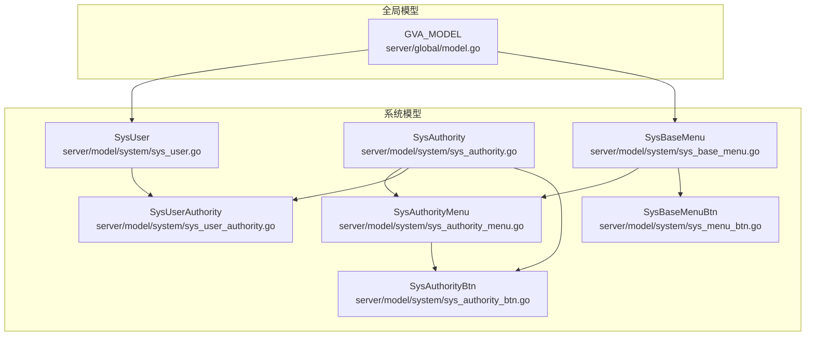
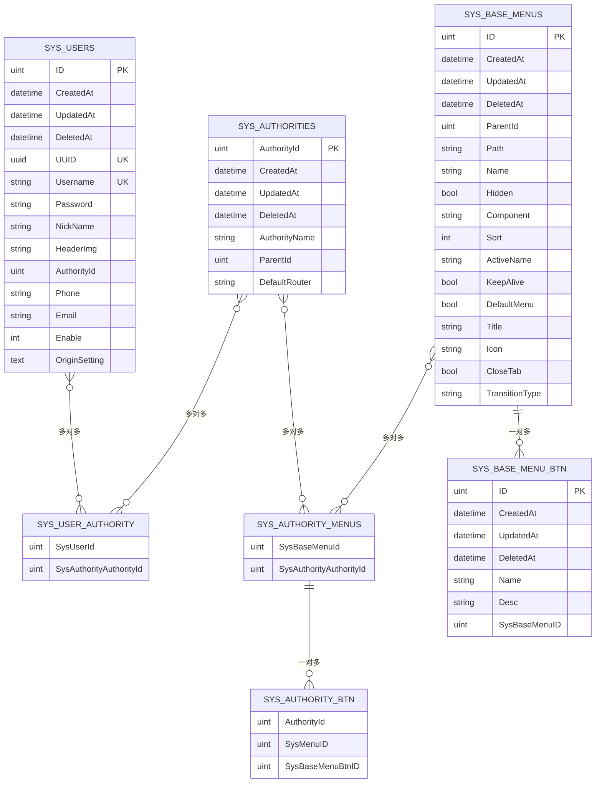
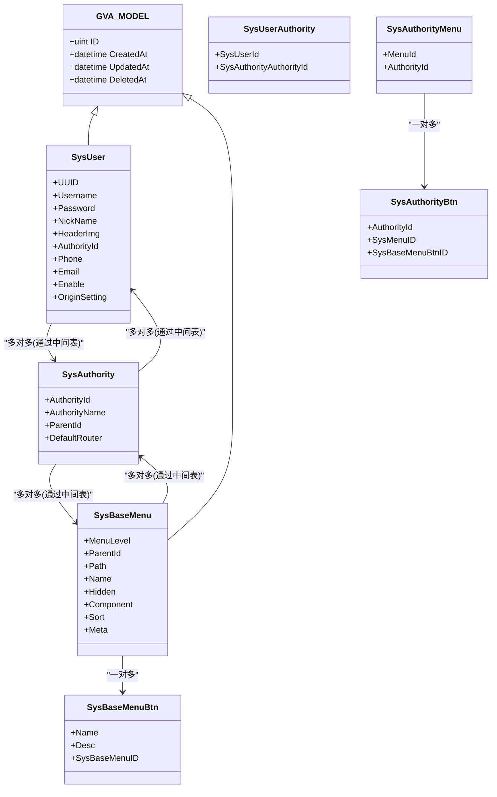
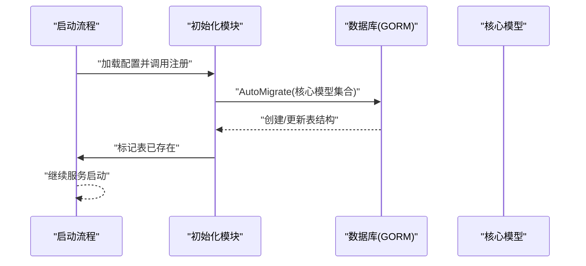

# 核心数据模型

<cite>
**本文引用的文件**
- [server/model/system/sys_user.go](file://server/model/system/sys_user.go)
- [server/model/system/sys_authority.go](file://server/model/system/sys_authority.go)
- [server/model/system/sys_base_menu.go](file://server/model/system/sys_base_menu.go)
- [server/model/system/sys_authority_menu.go](file://server/model/system/sys_authority_menu.go)
- [server/model/system/sys_user_authority.go](file://server/model/system/sys_user_authority.go)
- [server/model/system/sys_menu_btn.go](file://server/model/system/sys_menu_btn.go)
- [server/model/system/sys_authority_btn.go](file://server/model/system/sys_authority_btn.go)
- [server/global/model.go](file://server/global/model.go)
- [server/model/common/basetypes.go](file://server/model/common/basetypes.go)
- [server/initialize/gorm.go](file://server/initialize/gorm.go)
- [server/initialize/ensure_tables.go](file://server/initialize/ensure_tables.go)
</cite>

## 目录
1. [简介](#简介)
2. [项目结构](#项目结构)
3. [核心组件](#核心组件)
4. [架构总览](#架构总览)
5. [详细组件分析](#详细组件分析)
6. [依赖分析](#依赖分析)
7. [性能考量](#性能考量)
8. [故障排查指南](#故障排查指南)
9. [结论](#结论)
10. [附录](#附录)

## 简介
本文件聚焦于测试管理平台的核心数据模型，系统化梳理用户、角色与菜单三大核心实体及其关联关系。内容覆盖表结构设计、字段语义与数据类型选择、索引与约束策略，并通过 ER 图与类图直观呈现实体间的映射关系，帮助开发者与运维人员快速理解并正确使用数据库层。

## 项目结构
围绕核心数据模型的相关文件主要位于 server/model/system 与 server/global 下，配合初始化模块完成表的自动迁移与存在性校验。

图表来源
- [server/global/model.go:9-14](file://server/global/model.go#L9-L14)
- [server/model/system/sys_user.go:20-34](file://server/model/system/sys_user.go#L20-L34)
- [server/model/system/sys_authority.go:7-19](file://server/model/system/sys_authority.go#L7-L19)
- [server/model/system/sys_base_menu.go:7-21](file://server/model/system/sys_base_menu.go#L7-L21)
- [server/model/system/sys_authority_menu.go:3-19](file://server/model/system/sys_authority_menu.go#L3-L19)
- [server/model/system/sys_user_authority.go:4-11](file://server/model/system/sys_user_authority.go#L4-L11)
- [server/model/system/sys_menu_btn.go:5-10](file://server/model/system/sys_menu_btn.go#L5-L10)
- [server/model/system/sys_authority_btn.go:3-8](file://server/model/system/sys_authority_btn.go#L3-L8)

章节来源
- [server/initialize/gorm.go:37-87](file://server/initialize/gorm.go#L37-L87)
- [server/initialize/ensure_tables.go:33-77](file://server/initialize/ensure_tables.go#L33-L77)

## 核心组件
本节从数据模型角度拆解三大核心实体：用户、角色、菜单，并说明其在系统中的职责与典型用途。

- 用户（SysUser）
  - 职责：承载登录凭证、个人资料、角色绑定与状态控制。
  - 关键点：支持单角色与多角色绑定；内置冻结状态；头像与邮箱等扩展信息；UUID 用于跨系统识别。
- 角色（SysAuthority）
  - 职责：定义权限集合与默认入口菜单；支持父子角色层级；维护菜单与数据权限集合。
- 菜单（SysBaseMenu/SysMenu）
  - 职责：描述前端路由结构、渲染元信息与按钮级权限；支持参数化路由与按钮级细粒度控制。

章节来源
- [server/model/system/sys_user.go:20-34](file://server/model/system/sys_user.go#L20-L34)
- [server/model/system/sys_authority.go:7-19](file://server/model/system/sys_authority.go#L7-L19)
- [server/model/system/sys_base_menu.go:7-21](file://server/model/system/sys_base_menu.go#L7-L21)

## 架构总览
下图展示核心实体与关联表的 ER 关系，体现一对一、一对多与多对多映射。

图表来源
- [server/model/system/sys_user.go:20-34](file://server/model/system/sys_user.go#L20-L34)
- [server/model/system/sys_authority.go:7-19](file://server/model/system/sys_authority.go#L7-L19)
- [server/model/system/sys_base_menu.go:7-21](file://server/model/system/sys_base_menu.go#L7-L21)
- [server/model/system/sys_user_authority.go:4-11](file://server/model/system/sys_user_authority.go#L4-L11)
- [server/model/system/sys_authority_menu.go:12-19](file://server/model/system/sys_authority_menu.go#L12-L19)
- [server/model/system/sys_menu_btn.go:5-10](file://server/model/system/sys_menu_btn.go#L5-L10)
- [server/model/system/sys_authority_btn.go:3-8](file://server/model/system/sys_authority_btn.go#L3-L8)

## 详细组件分析

### 用户表（sys_users）
- 表名与主键
  - 表名：sys_users
  - 主键：ID（自增）
  - 软删除：DeletedAt（索引）
- 关键字段与语义
  - UUID：全局唯一标识，便于跨系统识别与审计
  - Username：登录名，唯一
  - Password：登录密码（不返回给前端）
  - NickName：昵称，默认“系统用户”
  - HeaderImg：头像地址，默认值
  - AuthorityId：默认角色ID（单角色绑定）
  - Authorities：多角色绑定（多对多）
  - Phone/Email：联系方式
  - Enable：启用状态（1 正常，2 冻结）
  - OriginSetting：JSON 配置，采用 JSONMap 类型
- 索引与约束
  - Username 唯一索引（通过 GORM 注解）
  - UUID 唯一索引（通过 GORM 注解）
  - DeletedAt 普通索引（软删除）
- 设计要点
  - 使用 GVA_MODEL 统一时间戳与软删除字段
  - 多角色通过中间表 sys_user_authority 实现
  - OriginSetting 使用 JSON 存储灵活配置

章节来源
- [server/model/system/sys_user.go:20-34](file://server/model/system/sys_user.go#L20-L34)
- [server/global/model.go:9-14](file://server/global/model.go#L9-L14)
- [server/model/common/basetypes.go:9-36](file://server/model/common/basetypes.go#L9-L36)

### 角色表（sys_authorities）
- 表名与主键
  - 表名：sys_authorities
  - 主键：AuthorityId（无符号整型）
- 关键字段与语义
  - AuthorityName：角色名称
  - ParentId：父角色 ID（支持层级）
  - DefaultRouter：默认入口菜单（默认 dashboard）
- 关联关系
  - 与用户：多对多（通过 sys_user_authority）
  - 与菜单：多对多（通过 sys_authority_menus）
  - 数据权限：多对多（通过 sys_data_authority_id，模型中声明但未在本文列出具体表）
- 约束与索引
  - AuthorityId 主键且唯一
  - DeletedAt 索引（软删除）

章节来源
- [server/model/system/sys_authority.go:7-19](file://server/model/system/sys_authority.go#L7-L19)
- [server/model/system/sys_user_authority.go:4-11](file://server/model/system/sys_user_authority.go#L4-L11)
- [server/model/system/sys_authority_menu.go:12-19](file://server/model/system/sys_authority_menu.go#L12-L19)

### 菜单表（sys_base_menus）与菜单-角色关联（sys_authority_menus）
- 表名与主键
  - 表名：sys_base_menus
  - 主键：ID（自增）
- 关键字段与语义
  - ParentId：父菜单 ID（树形结构）
  - Path/Name：路由路径与名称
  - Hidden：是否隐藏
  - Component：前端组件路径
  - Sort：排序
  - Meta：渲染与行为元信息（标题、图标、缓存、动画等）
- 关联关系
  - 与角色：多对多（sys_authority_menus）
  - 与按钮：一对多（SysBaseMenuBtn）
- 设计要点
  - Meta 嵌入结构体，便于统一管理前端渲染属性
  - 支持参数化路由（SysBaseMenuParameter，模型中声明但未在本文列出具体表）

章节来源
- [server/model/system/sys_base_menu.go:7-21](file://server/model/system/sys_base_menu.go#L7-L21)
- [server/model/system/sys_authority_menu.go:3-19](file://server/model/system/sys_authority_menu.go#L3-L19)

### 用户-角色中间表（sys_user_authority）
- 表名与主键
  - 表名：sys_user_authority
- 字段
  - SysUserId：用户 ID
  - SysAuthorityAuthorityId：角色 ID
- 作用
  - 实现用户与角色的多对多关系

章节来源
- [server/model/system/sys_user_authority.go:4-11](file://server/model/system/sys_user_authority.go#L4-L11)

### 菜单按钮与角色按钮关联
- 菜单按钮（SysBaseMenuBtn）
  - 字段：Name/Desc/所属菜单 ID
  - 作用：定义菜单级按钮的关键字与描述
- 角色按钮（SysAuthorityBtn）
  - 字段：角色 ID、菜单 ID、按钮 ID
  - 作用：将角色与具体菜单按钮进行授权绑定

章节来源
- [server/model/system/sys_menu_btn.go:5-10](file://server/model/system/sys_menu_btn.go#L5-L10)
- [server/model/system/sys_authority_btn.go:3-8](file://server/model/system/sys_authority_btn.go#L3-L8)

### 类图（对象-关系）

图表来源
- [server/global/model.go:9-14](file://server/global/model.go#L9-L14)
- [server/model/system/sys_user.go:20-34](file://server/model/system/sys_user.go#L20-L34)
- [server/model/system/sys_authority.go:7-19](file://server/model/system/sys_authority.go#L7-L19)
- [server/model/system/sys_base_menu.go:7-21](file://server/model/system/sys_base_menu.go#L7-L21)
- [server/model/system/sys_user_authority.go:4-11](file://server/model/system/sys_user_authority.go#L4-L11)
- [server/model/system/sys_authority_menu.go:12-19](file://server/model/system/sys_authority_menu.go#L12-L19)
- [server/model/system/sys_menu_btn.go:5-10](file://server/model/system/sys_menu_btn.go#L5-L10)
- [server/model/system/sys_authority_btn.go:3-8](file://server/model/system/sys_authority_btn.go#L3-L8)

## 依赖分析
- 初始化注册
  - 通过初始化模块将核心模型纳入 AutoMigrate，确保表结构与约束按模型定义生成
  - ensure_tables.go 在启动阶段检查表是否存在，避免重复创建导致的冲突
- 运行时约束
  - GVA_MODEL 提供统一的主键、时间戳与软删除字段，减少重复定义
  - JSONMap 类型用于 OriginSetting 字段，保证 JSON 存取一致性

图表来源
- [server/initialize/gorm.go:37-87](file://server/initialize/gorm.go#L37-L87)
- [server/initialize/ensure_tables.go:33-77](file://server/initialize/ensure_tables.go#L33-L77)

章节来源
- [server/initialize/gorm.go:37-87](file://server/initialize/gorm.go#L37-L87)
- [server/initialize/ensure_tables.go:33-77](file://server/initialize/ensure_tables.go#L33-L77)

## 性能考量
- 索引策略
  - 用户名与 UUID 唯一索引：保障登录与跨系统识别效率
  - DeletedAt 索引：软删除场景下的过滤性能
  - 建议：根据查询模式对 ParentId、AuthorityId、SysBaseMenuID 等常用过滤字段评估是否添加复合索引
- JSON 字段
  - OriginSetting 使用 JSON 存储，适合灵活配置；如需频繁条件查询，建议拆分或增加计算列
- 中间表
  - sys_user_authority 与 sys_authority_menus 作为多对多桥接，避免冗余与数据不一致
- 软删除
  - 使用 DeletedAt 统一处理逻辑删除，查询时注意过滤与索引利用

## 故障排查指南
- 表不存在或迁移失败
  - 确认初始化模块已执行 AutoMigrate 并成功注册核心模型
  - 检查数据库连接与权限
- 唯一约束冲突
  - Username 或 UUID 冲突时，需修正数据或清理重复项
- 查询性能问题
  - 检查是否缺少必要索引；针对高频过滤字段评估复合索引
- JSON 字段解析异常
  - 确保 JSONMap 扫描与序列化逻辑正确；避免空值与非法格式

章节来源
- [server/initialize/gorm.go:37-87](file://server/initialize/gorm.go#L37-L87)
- [server/initialize/ensure_tables.go:33-77](file://server/initialize/ensure_tables.go#L33-L77)
- [server/model/common/basetypes.go:9-36](file://server/model/common/basetypes.go#L9-L36)

## 结论
本核心数据模型以用户、角色、菜单为核心，辅以中间表与嵌入元信息，形成清晰的权限与界面控制体系。通过统一的 GVA_MODEL、明确的索引与约束策略，以及初始化模块的自动化迁移，系统在可维护性与扩展性上具备良好基础。后续可在查询热点字段上进一步优化索引，并对 JSON 配置类字段进行必要的结构化演进。

## 附录
- 表清单与用途概览
  - sys_users：用户基本信息与角色绑定
  - sys_authorities：角色定义与默认入口
  - sys_base_menus：菜单结构与渲染元信息
  - sys_user_authority：用户-角色多对多
  - sys_authority_menus：角色-菜单多对多
  - sys_base_menu_btn：菜单按钮定义
  - sys_authority_btn：角色-菜单按钮授权