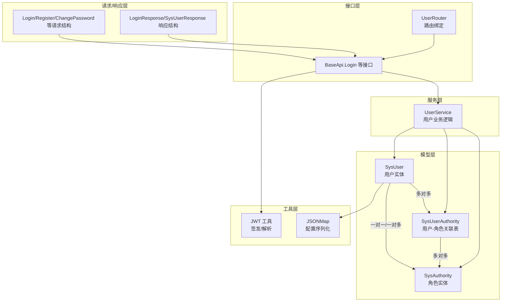
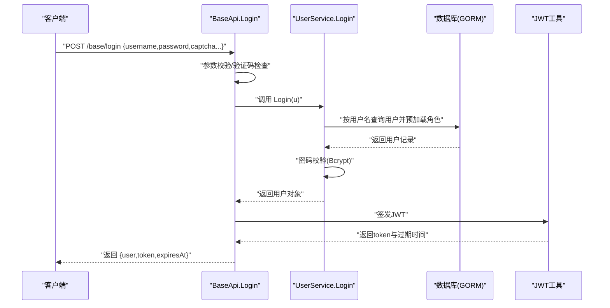
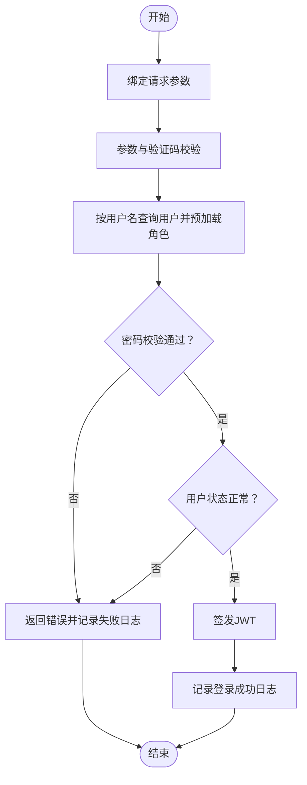
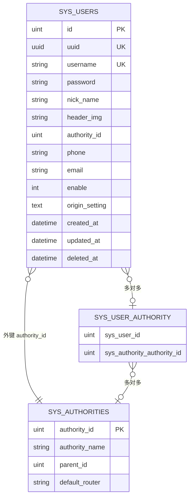
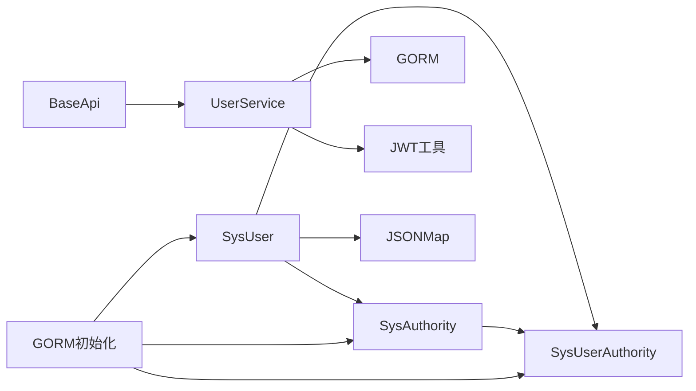

# 用户管理模型

<cite>
**本文引用的文件**
- [server/model/system/sys_user.go](file://server/model/system/sys_user.go)
- [server/model/system/sys_user_authority.go](file://server/model/system/sys_user_authority.go)
- [server/model/system/sys_authority.go](file://server/model/system/sys_authority.go)
- [server/api\v1\system\sys_user.go](file://server/api\v1\system\sys_user.go)
- [server/service\system\sys_user.go](file://server/service\system\sys_user.go)
- [server/router\system\sys_user.go](file://server/router\system\sys_user.go)
- [server/model\system\request\sys_user.go](file://server/model\system\request\sys_user.go)
- [server/model\system\response\sys_user.go](file://server/model\system\response\sys_user.go)
- [server/utils\jwt.go](file://server/utils\jwt.go)
- [server/global\model.go](file://server/global\model.go)
- [server/model\common\basetypes.go](file://server/model\common\basetypes.go)
- [server/initialize/gorm.go](file://server/initialize/gorm.go)
</cite>

## 目录
1. [简介](#简介)
2. [项目结构](#项目结构)
3. [核心组件](#核心组件)
4. [架构总览](#架构总览)
5. [详细组件分析](#详细组件分析)
6. [依赖关系分析](#依赖关系分析)
7. [性能考量](#性能考量)
8. [故障排查指南](#故障排查指南)
9. [结论](#结论)
10. [附录](#附录)

## 简介
本文件围绕“用户管理模型”进行系统化说明，重点阐述 SysUser 用户实体的设计理念与字段语义，解析用户与角色的一对一/一对多/多对多关系映射，解释用户状态（启用/冻结）与配置信息（JSONMap）存储机制，并给出用户认证接口（Login）的实现流程与使用场景。同时提供用户表结构图，展示字段定义、数据类型、索引与约束，帮助读者快速理解与落地应用。

## 项目结构
用户管理相关代码分布在以下层次：
- 模型层：定义 SysUser、SysAuthority、SysUserAuthority 等实体及关系映射
- 请求/响应层：定义登录、注册、修改密码等接口的请求/响应结构
- 服务层：封装业务逻辑（登录校验、密码哈希、权限设置、配置写入等）
- 接口层：定义 REST API 路由与控制器方法
- 工具层：JWT 签发与解析、JSONMap 类型转换
- 初始化层：GORM 自动迁移注册用户相关表

图表来源
- [server/model/system/sys_user.go:20-38](file://server/model/system/sys_user.go#L20-L38)
- [server/model/system/sys_authority.go:7-19](file://server/model/system/sys_authority.go#L7-L19)
- [server/model/system/sys_user_authority.go:4-11](file://server/model/system/sys_user_authority.go#L4-L11)
- [server/api\v1\system\sys_user.go:20-99](file://server/api\v1\system\sys_user.go#L20-L99)
- [server/service\system\sys_user.go:24-61](file://server/service\system\sys_user.go#L24-L61)
- [server/utils\jwt.go:13-52](file://server/utils\jwt.go#L13-L52)
- [server/model\common\basetypes.go:9-36](file://server/model\common\basetypes.go#L9-L36)
- [server/router\system\sys_user.go:10-28](file://server/router\system\sys_user.go#L10-L28)

章节来源
- [server/model\system\sys_user.go:1-63](file://server/model/system/sys_user.go#L1-L63)
- [server/model\system\sys_authority.go:1-24](file://server/model/system/sys_authority.go#L1-L24)
- [server/model\system\sys_user_authority.go:1-12](file://server/model/system/sys_user_authority.go#L1-L12)
- [server/api\v1\system\sys_user.go:1-517](file://server/api\v1\system\sys_user.go#L1-L517)
- [server/service\system\sys_user.go:1-337](file://server/service\system\sys_user.go#L1-L337)
- [server/router\system\sys_user.go:1-29](file://server/router\system\sys_user.go#L1-L29)
- [server/model\system\request\sys_user.go:1-78](file://server/model/system/request/sys_user.go#L1-L78)
- [server/model\system\response\sys_user.go:1-16](file://server/model/system/response/sys_user.go#L1-L16)
- [server/utils\jwt.go:1-106](file://server/utils/jwt.go#L1-L106)
- [server/global\model.go:1-15](file://server/global/model.go#L1-L15)
- [server/model\common\basetypes.go:1-44](file://server/model/common/basetypes.go#L1-L44)
- [server/initialize/gorm.go:37-87](file://server/initialize/gorm.go#L37-L87)

## 核心组件
- SysUser 用户实体：包含 UUID、用户名、密码、昵称、头像、主角色ID、多角色集合、手机号、邮箱、启用状态、配置信息等字段；支持通过接口 Login 暴露统一身份信息能力。
- SysAuthority 角色实体：包含角色ID、角色名、父角色ID、默认菜单、菜单集合、数据权限集合等；与用户通过中间表建立多对多关系。
- SysUserAuthority 关联表：记录用户与角色的多对多映射，包含用户ID与角色ID两列。
- UserService 服务：封装登录、注册、修改密码、权限设置、用户信息更新、配置写入等业务逻辑。
- BaseApi 接口：提供登录、注册、修改密码、权限设置、用户信息设置等 HTTP 接口。
- JSONMap 配置：以 JSON 形式存储用户个性化配置，支持数据库序列化/反序列化。
- JWT 工具：负责签发登录令牌与解析验证。

章节来源
- [server/model\system\sys_user.go:9-63](file://server/model/system/sys_user.go#L9-L63)
- [server/model\system\sys_authority.go:7-19](file://server/model/system/sys_authority.go#L7-L19)
- [server/model\system\sys_user_authority.go:4-11](file://server/model/system/sys_user_authority.go#L4-L11)
- [server/service\system\sys_user.go:24-337](file://server/service/system/sys_user.go#L24-L337)
- [server/api\v1\system\sys_user.go:20-517](file://server/api\v1\system\sys_user.go#L20-L517)
- [server/model\common\basetypes.go:9-36](file://server/model/common/basetypes.go#L9-L36)
- [server/utils\jwt.go:13-52](file://server/utils/jwt.go#L13-L52)

## 架构总览
用户管理采用经典的 MVC 分层架构：
- 控制器层（BaseApi）接收请求，参数校验，调用服务层
- 服务层（UserService）执行业务逻辑，访问数据库与外部组件（如 Redis、JWT）
- 模型层（SysUser/SysAuthority/SysUserAuthority）定义数据结构与关系映射
- 工具层（JWT、JSONMap）提供通用能力
- 初始化层（GORM AutoMigrate）确保数据库表结构正确

图表来源
- [server/api\v1\system\sys_user.go:20-99](file://server/api\v1\system\sys_user.go#L20-L99)
- [server/service\system\sys_user.go:47-61](file://server/service/system/sys_user.go#L47-L61)
- [server/utils\jwt.go:48-52](file://server/utils/jwt.go#L48-L52)

## 详细组件分析

### SysUser 用户实体设计
- 字段与语义
  - UUID：全局唯一标识，便于跨系统识别与审计
  - Username：登录名，带索引，用于快速登录匹配
  - Password：登录密码，不对外返回（敏感字段）
  - NickName：用户昵称，默认值为“系统用户”
  - HeaderImg：头像地址，默认值为指定图片链接
  - AuthorityId：主角色ID，默认888，作为默认角色标识
  - Authority：一对一/一对多角色关联（外键指向角色ID）
  - Authorities：多对多角色集合（通过中间表 sys_user_authority）
  - Phone/Email：联系方式
  - Enable：启用状态，1表示正常，2表示冻结
  - OriginSetting：JSONMap 类型配置，存储用户个性化设置
- 关系映射
  - 一对一/一对多：SysUser -> SysAuthority（外键 AuthorityId）
  - 多对多：SysUser <-> SysAuthority（中间表 SysUserAuthority）
- 表名与索引
  - 表名：sys_users
  - 索引：UUID、Username 字段均声明索引
- 统一身份接口
  - 实现 Login 接口，暴露 GetUsername、GetNickname、GetUUID、GetUserId、GetAuthorityId、GetUserInfo 等方法

章节来源
- [server/model\system\sys_user.go:20-38](file://server/model/system/sys_user.go#L20-L38)
- [server/model\system\sys_user.go:9-16](file://server/model/system/sys_user.go#L9-L16)
- [server/global\model.go:9-14](file://server/global/model.go#L9-L14)

### SysAuthority 角色实体设计
- 字段与语义
  - AuthorityId：角色ID，唯一且为主键
  - AuthorityName：角色名称
  - ParentId：父角色ID（可空）
  - DefaultRouter：默认菜单名，默认 dashboard
  - SysBaseMenus：角色拥有的菜单集合（多对多）
  - DataAuthorityId：数据权限集合（多对多）
  - Users：反向关联用户集合（多对多）
- 关系映射
  - 与 SysUser 通过中间表建立多对多
  - 与 SysBaseMenu 通过中间表建立多对多

章节来源
- [server/model\system\sys_authority.go:7-19](file://server/model/system/sys_authority.go#L7-L19)

### SysUserAuthority 关联表设计
- 字段
  - SysUserId：用户ID
  - SysAuthorityAuthorityId：角色ID
- 作用
  - 实现用户与角色的多对多映射
  - 支持单用户多角色场景

章节来源
- [server/model\system\sys_user_authority.go:4-11](file://server/model/system/sys_user_authority.go#L4-L11)

### 用户状态管理（启用/冻结）
- Enable 字段取值
  - 1：正常
  - 2：冻结
- 登录流程中的状态校验
  - 登录接口在成功获取用户后，若 Enable 不为1，则拒绝登录并记录失败日志

章节来源
- [server/model\system\sys_user.go:32](file://server/model/system/sys_user.go#L32)
- [server/api\v1\system\sys_user.go:82-97](file://server/api\v1\system\sys_user.go#L82-L97)

### 配置信息存储（JSONMap）
- 数据类型
  - JSONMap：基于 map[string]interface{} 的自定义类型
  - 实现 sql/driver.Valuer 与 sql.Scanner，支持数据库序列化/反序列化
- 存储位置
  - SysUser.origin_setting 字段（text 类型），默认值为 null
- 使用场景
  - 用户界面配置、偏好设置等动态内容

章节来源
- [server/model\common\basetypes.go:9-36](file://server/model/common/basetypes.go#L9-L36)
- [server/model\system\sys_user.go:33](file://server/model/system/sys_user.go#L33)

### 用户认证接口（Login）实现与使用
- 接口定义
  - 路径：/base/login
  - 方法：POST
  - 请求体：Login 结构（用户名、密码、验证码、验证码ID）
  - 响应体：LoginResponse（用户、token、过期时间）
- 核心流程
  - 参数绑定与校验
  - 验证码校验（可选，受配置控制）
  - 查询用户并预加载角色
  - 密码校验（Bcrypt）
  - 状态校验（Enable=1）
  - 签发 JWT（支持单点或多点登录策略）
  - 记录登录日志
- 安全要点
  - 密码使用 Bcrypt 哈希
  - 登录失败计数与黑名单缓存
  - 登录成功/失败均记录日志

图表来源
- [server/api\v1\system\sys_user.go:20-99](file://server/api\v1\system\sys_user.go#L20-L99)
- [server/service\system\sys_user.go:47-61](file://server/service/system/sys_user.go#L47-L61)
- [server/utils\jwt.go:48-52](file://server/utils/jwt.go#L48-L52)

章节来源
- [server/api\v1\system\sys_user.go:20-99](file://server/api\v1\system\sys_user.go#L20-L99)
- [server/model\system\request\sys_user.go:21-27](file://server/model/system/request/sys_user.go#L21-L27)
- [server/model\system\response\sys_user.go:11-15](file://server/model/system/response/sys_user.go#L11-L15)

### 权限设置与多角色管理
- 单角色切换
  - SetUserAuthority：将用户的主角色切换为指定角色，并校验该角色是否属于用户已有角色集合
- 多角色设置
  - SetUserAuthorities：管理员为用户批量设置多个角色，内部使用事务保证一致性
- 业务要点
  - 设置多角色时，先清空旧关联，再插入新关联
  - 将第一个角色作为用户的主角色（AuthorityId）

章节来源
- [server/api\v1\system\sys_user.go:264-329](file://server/api\v1\system\sys_user.go#L264-L329)
- [server/service\system\sys_user.go:140-222](file://server/service/system/sys_user.go#L140-L222)

### 用户信息与配置更新
- 设置用户信息
  - SetUserInfo/SetSelfInfo：支持管理员或本人更新昵称、头像、手机、邮箱、启用状态等
- 设置用户配置
  - SetSelfSetting：更新 origin_setting 字段（JSONMap）

章节来源
- [server/api\v1\system\sys_user.go:366-473](file://server/api\v1\system\sys_user.go#L366-L473)
- [server/service\system\sys_user.go:248-282](file://server/service/system/sys_user.go#L248-L282)

### 用户表结构图
- 表名：sys_users
- 字段与类型（示意）
  - id：主键（整型）
  - uuid：用户UUID（字符串，带索引）
  - username：登录名（字符串，带索引）
  - password：密码（字符串）
  - nick_name：昵称（字符串，默认值）
  - header_img：头像（字符串，默认值）
  - authority_id：主角色ID（整型，默认值）
  - phone：手机号（字符串）
  - email：邮箱（字符串）
  - enable：启用状态（整型，默认值）
  - origin_setting：配置（text，默认值）
  - created_at/updated_at/deleted_at：时间戳与软删索引
- 约束与索引
  - 主键：id
  - 唯一/索引：uuid、username
  - 软删除：deleted_at 建有索引
- 关系
  - 外键：authority_id 引用 sys_authorities.authority_id
  - 多对多：sys_users 通过 sys_user_authority 与 sys_authorities 关联

图表来源
- [server/model\system\sys_user.go:20-38](file://server/model/system/sys_user.go#L20-L38)
- [server/model\system\sys_authority.go:7-19](file://server/model/system/sys_authority.go#L7-L19)
- [server/model\system\sys_user_authority.go:4-11](file://server/model/system/sys_user_authority.go#L4-L11)

## 依赖关系分析
- 模块耦合
  - SysUser 依赖全局模型 GVA_MODEL（ID、时间戳、软删）
  - SysUser 通过 GORM 标签声明与 SysAuthority 的一对一/一对多关系
  - SysUser 与 SysAuthority 通过 SysUserAuthority 建立多对多
  - BaseApi 依赖 UserService 与 JWT 工具
  - UserService 依赖 GORM、bcrypt 工具与全局数据库实例
- 外部依赖
  - GORM：ORM 映射与查询
  - JWT：令牌签发与解析
  - JSONMap：数据库 JSON 序列化
- 初始化
  - GORM 自动迁移注册 sys_users、sys_authorities、sys_user_authority 等表

图表来源
- [server/model\system\sys_user.go:20-38](file://server/model/system/sys_user.go#L20-L38)
- [server/model\system\sys_authority.go:7-19](file://server/model/system/sys_authority.go#L7-L19)
- [server/model\system\sys_user_authority.go:4-11](file://server/model/system/sys_user_authority.go#L4-L11)
- [server/api\v1\system\sys_user.go:20-99](file://server/api\v1\system\sys_user.go#L20-L99)
- [server/service\system\sys_user.go:24-61](file://server/service/system/sys_user.go#L24-L61)
- [server/utils\jwt.go:13-52](file://server/utils/jwt.go#L13-L52)
- [server/initialize/gorm.go:37-87](file://server/initialize/gorm.go#L37-L87)

章节来源
- [server/initialize/gorm.go:37-87](file://server/initialize/gorm.go#L37-L87)

## 性能考量
- 查询优化
  - 对 UUID 与 username 建有索引，登录与查询效率高
  - 预加载角色（Preload）减少 N+1 查询，但需注意字段选择
- 密码安全
  - 使用 Bcrypt 哈希，降低密码泄露风险
- 事务一致性
  - 批量设置用户角色使用事务，保证原子性
- 缓存与黑名单
  - 登录失败尝试次数与 JWT 黑名单可结合缓存提升安全性与性能

## 故障排查指南
- 登录失败
  - 检查用户名是否存在、密码是否正确、用户是否被冻结
  - 查看验证码配置与缓存计数
- 权限切换失败
  - 确认用户是否拥有目标角色；确认默认路由是否可用
- 配置写入失败
  - 检查 JSONMap 序列化/反序列化是否异常
- 数据库迁移
  - 确认 GORM 自动迁移是否启用，相关表是否成功创建

章节来源
- [server/api\v1\system\sys_user.go:82-97](file://server/api\v1\system\sys_user.go#L82-L97)
- [server/service\system\sys_user.go:140-181](file://server/service/system/sys_user.go#L140-L181)
- [server/model\common\basetypes.go:18-36](file://server/model/common/basetypes.go#L18-L36)
- [server/initialize/gorm.go:37-87](file://server/initialize/gorm.go#L37-L87)

## 结论
本用户管理模型以 SysUser 为核心，通过 GORM 的关系映射清晰表达“用户-角色”的多种关系形态，并结合 JWT、JSONMap、验证码与日志等机制形成完整的认证与配置体系。登录接口遵循严格的参数校验与安全流程，服务层提供幂等、事务性的权限与信息变更能力。整体设计兼顾易用性与安全性，适合在企业级系统中推广使用。

## 附录
- 路由与接口
  - 登录：POST /base/login
  - 注册：POST /user/admin_register
  - 修改密码：POST /user/changePassword
  - 设置用户权限：POST /user/setUserAuthority
  - 设置用户权限组：POST /user/setUserAuthorities
  - 删除用户：DELETE /user/deleteUser
  - 设置用户信息：PUT /user/setUserInfo
  - 设置自身信息：PUT /user/setSelfInfo
  - 重置密码：POST /user/resetPassword
  - 设置自身配置：PUT /user/setSelfSetting
  - 获取用户列表：POST /user/getUserList
  - 获取用户信息：GET /user/getUserInfo

章节来源
- [server/router\system\sys_user.go:10-28](file://server/router/system/sys_user.go#L10-L28)
- [server/api\v1\system\sys_user.go:163-492](file://server/api\v1\system\sys_user.go#L163-L492)