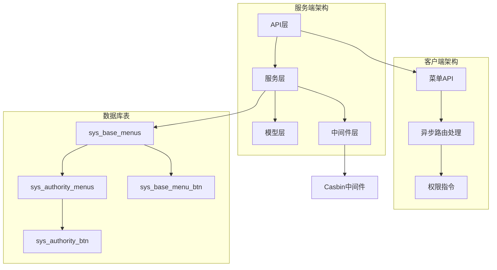
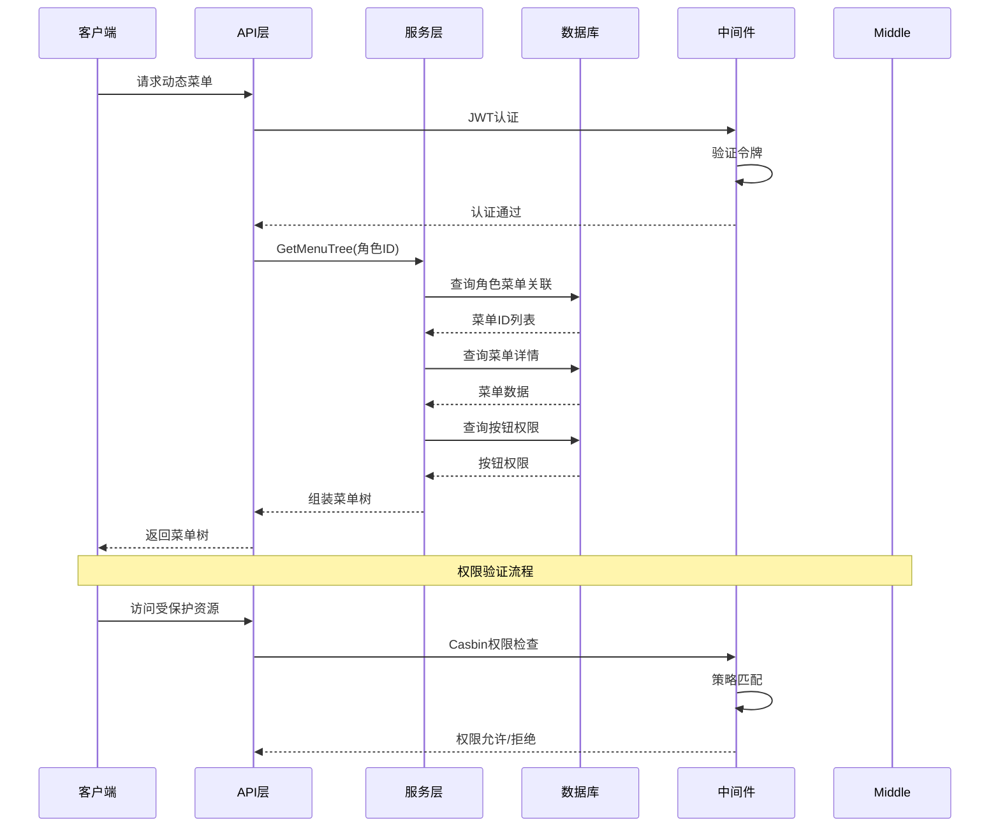
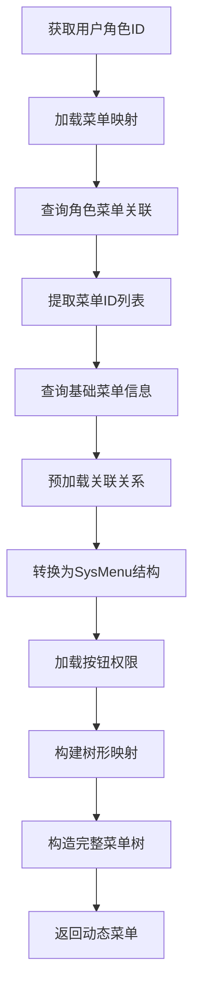
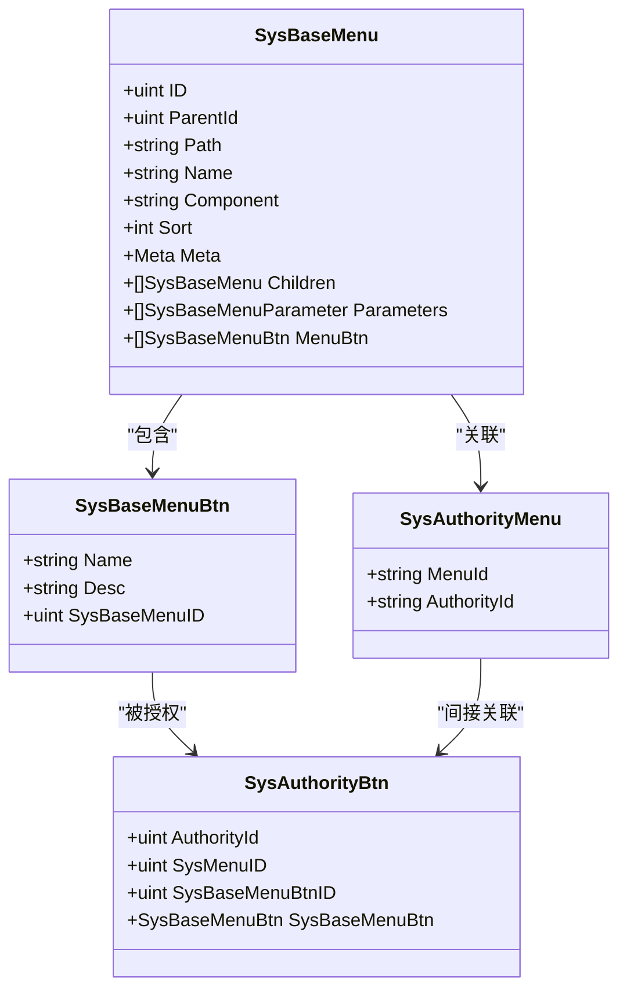
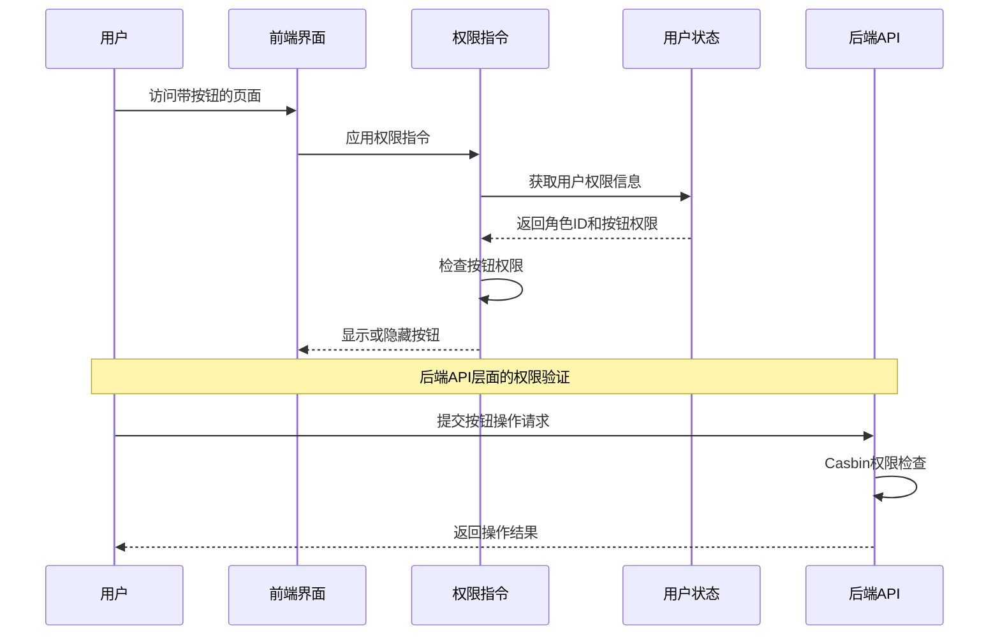
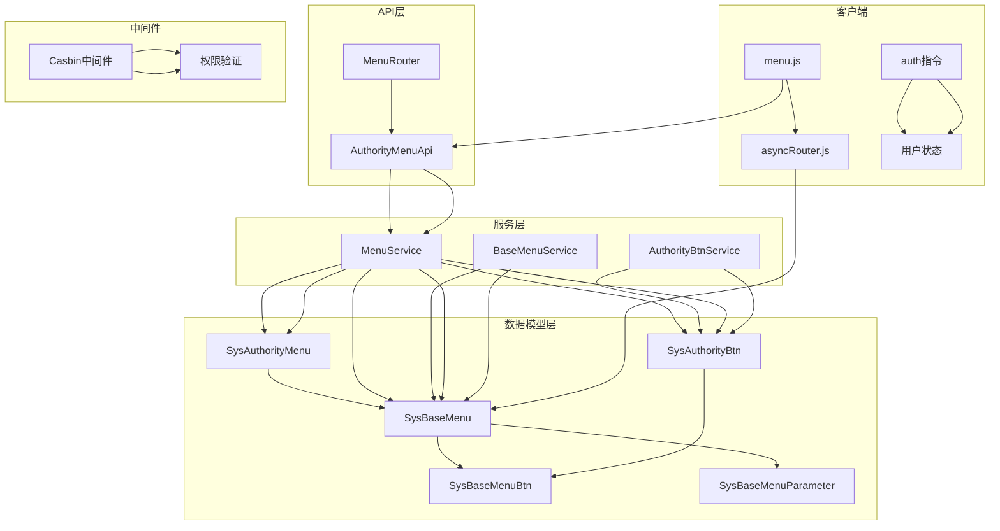
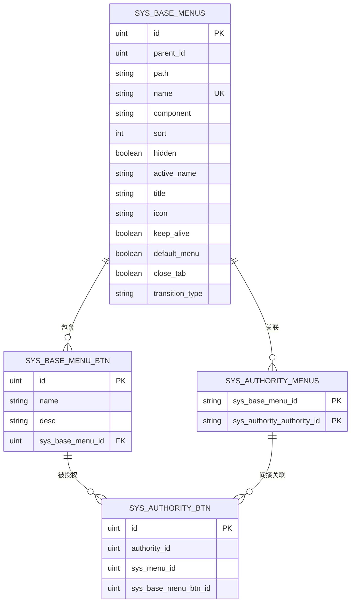

# 菜单系统模型

<cite>
**本文档引用的文件**
- [server/model/system/sys_base_menu.go](file://server/model/system/sys_base_menu.go)
- [server/model/system/sys_menu_btn.go](file://server/model/system/sys_menu_btn.go)
- [server/model/system/sys_authority_menu.go](file://server/model/system/sys_authority_menu.go)
- [server/model/system/sys_authority_btn.go](file://server/model/system/sys_authority_btn.go)
- [server/service/system/sys_base_menu.go](file://server/service/system/sys_base_menu.go)
- [server/service/system/sys_menu.go](file://server/service/system/sys_menu.go)
- [server/service/system/sys_authority_btn.go](file://server/service/system/sys_authority_btn.go)
- [server/router/system/sys_menu.go](file://server/router/system/sys_menu.go)
- [server/api/v1/system/sys_menu.go](file://server/api/v1/system/sys_menu.go)
- [server/middleware/casbin_rbac.go](file://server/middleware/casbin_rbac.go)
- [web/src/api/menu.js](file://web/src/api/menu.js)
- [web/src/utils/asyncRouter.js](file://web/src/utils/asyncRouter.js)
- [web/src/directive/auth.js](file://web/src/directive/auth.js)
</cite>

## 目录
1. [简介](#简介)
2. [项目结构](#项目结构)
3. [核心组件](#核心组件)
4. [架构概览](#架构概览)
5. [详细组件分析](#详细组件分析)
6. [依赖关系分析](#依赖关系分析)
7. [性能考虑](#性能考虑)
8. [故障排除指南](#故障排除指南)
9. [结论](#结论)

## 简介

本文件详细阐述了测试管理平台的菜单系统模型设计与实现。系统采用基于角色的访问控制（RBAC）模型，通过菜单树形结构实现多层级导航，结合动态菜单生成和权限验证机制，确保用户只能访问其授权范围内的功能模块。

菜单系统的核心设计理念包括：
- **层次化菜单结构**：支持无限层级的父子关系
- **动态权限控制**：基于角色的菜单和按钮权限
- **灵活的路由配置**：支持前端组件路径映射
- **安全的权限验证**：集成Casbin进行细粒度权限控制

## 项目结构

菜单系统在项目中的组织结构如下：



**图表来源**
- [server/api/v1/system/sys_menu.go:1-336](file://server/api/v1/system/sys_menu.go#L1-L336)
- [server/service/system/sys_menu.go:1-391](file://server/service/system/sys_menu.go#L1-L391)
- [server/model/system/sys_base_menu.go:1-44](file://server/model/system/sys_base_menu.go#L1-L44)

**章节来源**
- [server/router/system/sys_menu.go:1-30](file://server/router/system/sys_menu.go#L1-L30)
- [server/api/v1/system/sys_menu.go:1-336](file://server/api/v1/system/sys_menu.go#L1-L336)

## 核心组件

### SysBaseMenu 基础菜单实体

SysBaseMenu 是菜单系统的核心数据模型，定义了菜单的基本属性和关系：

| 字段名 | 类型 | 描述 | 约束 |
|--------|------|------|------|
| ID | uint | 菜单唯一标识符 | 主键 |
| MenuLevel | uint | 菜单层级 | 隐藏字段 |
| ParentId | uint | 父菜单ID | 外键约束 |
| Path | string | 路由路径 | 必填 |
| Name | string | 路由名称 | 唯一约束 |
| Hidden | bool | 是否隐藏 | 默认false |
| Component | string | 前端组件路径 | 必填 |
| Sort | int | 排序权重 | 数字越大越靠后 |
| Meta | Meta | 菜单元数据 | 嵌入式结构 |
| Children | []SysBaseMenu | 子菜单集合 | 关系映射 |

**章节来源**
- [server/model/system/sys_base_menu.go:7-21](file://server/model/system/sys_base_menu.go#L7-L21)

### Meta 元数据结构

Meta 结构体包含菜单的显示属性：

| 属性名 | 类型 | 描述 | 默认值 |
|--------|------|------|--------|
| ActiveName | string | 高亮菜单标识 | 空字符串 |
| KeepAlive | bool | 页面缓存开关 | false |
| DefaultMenu | bool | 是否为基础路由 | false |
| Title | string | 菜单标题 | 空字符串 |
| Icon | string | 菜单图标 | 空字符串 |
| CloseTab | bool | 自动关闭标签页 | false |
| TransitionType | string | 路由切换动画类型 | 空字符串 |

**章节来源**
- [server/model/system/sys_base_menu.go:23-31](file://server/model/system/sys_base_menu.go#L23-L31)

### SysBaseMenuParameter 参数模型

用于定义菜单的URL参数配置：

| 字段名 | 类型 | 描述 | 约束 |
|--------|------|------|------|
| Type | string | 参数类型（params/query） | 必填 |
| Key | string | 参数键名 | 必填 |
| Value | string | 参数默认值 | 必填 |

**章节来源**
- [server/model/system/sys_base_menu.go:33-39](file://server/model/system/sys_base_menu.go#L33-L39)

### SysBaseMenuBtn 按钮模型

菜单按钮定义：

| 字段名 | 类型 | 描述 | 约束 |
|--------|------|------|------|
| Name | string | 按钮标识key | 必填 |
| Desc | string | 按钮描述 | 可选 |
| SysBaseMenuID | uint | 所属菜单ID | 外键 |

**章节来源**
- [server/model/system/sys_menu_btn.go:5-10](file://server/model/system/sys_menu_btn.go#L5-L10)

## 架构概览

菜单系统采用分层架构设计，实现了完整的菜单生命周期管理：



**图表来源**
- [server/api/v1/system/sys_menu.go:26-37](file://server/api/v1/system/sys_menu.go#L26-L37)
- [server/service/system/sys_menu.go:78-85](file://server/service/system/sys_menu.go#L78-L85)
- [server/middleware/casbin_rbac.go:12-32](file://server/middleware/casbin_rbac.go#L12-L32)

## 详细组件分析

### 菜单树形结构实现

菜单树形结构通过递归算法实现，支持无限层级的父子关系：

```mermaid
flowchart TD
Start([开始构建菜单树]) --> LoadRoles[加载角色菜单关联]
LoadRoles --> QueryMenus[查询菜单详情]
QueryMenus --> BuildMap[构建父ID映射表]
BuildMap --> FindRoots[查找根节点(父ID=0)]
FindRoots --> RecursiveBuild[递归构建子树]
RecursiveBuild --> CheckChildren{存在子节点?}
CheckChildren --> |是| Recurse[递归处理子节点]
CheckChildren --> |否| Complete[完成节点]
Recurse --> CheckChildren
Complete --> End([返回完整菜单树])
```

**图表来源**
- [server/service/system/sys_menu.go:22-70](file://server/service/system/sys_menu.go#L22-L70)
- [server/service/system/sys_menu.go:93-99](file://server/service/system/sys_menu.go#L93-L99)

#### 菜单层级关系设计

菜单层级通过ParentId字段实现父子关系，系统支持以下特性：

1. **无限层级支持**：理论上支持任意深度的菜单嵌套
2. **循环引用检测**：防止出现父子关系循环
3. **层级计算**：通过递归遍历计算菜单层级
4. **排序机制**：通过Sort字段控制同级菜单顺序

**章节来源**
- [server/service/system/sys_menu.go:190-233](file://server/service/system/sys_menu.go#L190-L233)

### 动态菜单生成机制

动态菜单生成是菜单系统的核心功能，实现步骤如下：



**图表来源**
- [server/service/system/sys_menu.go:22-70](file://server/service/system/sys_menu.go#L22-L70)
- [server/service/system/sys_menu.go:54-69](file://server/service/system/sys_menu.go#L54-L69)

#### 菜单权限控制实现

系统采用双重权限控制机制：

1. **角色菜单权限**：通过sys_authority_menus表控制角色与菜单的关联关系
2. **按钮级权限**：通过sys_authority_btn表控制按钮级别的细粒度权限

**章节来源**
- [server/service/system/sys_menu.go:317-331](file://server/service/system/sys_menu.go#L317-L331)
- [server/service/system/sys_authority_btn.go:30-52](file://server/service/system/sys_authority_btn.go#L30-L52)

### 菜单按钮权限系统

菜单按钮权限系统提供了细粒度的界面元素控制能力：



**图表来源**
- [server/model/system/sys_base_menu.go:7-21](file://server/model/system/sys_base_menu.go#L7-L21)
- [server/model/system/sys_menu_btn.go:5-10](file://server/model/system/sys_menu_btn.go#L5-L10)
- [server/model/system/sys_authority_btn.go:3-8](file://server/model/system/sys_authority_btn.go#L3-L8)

#### 按钮权限验证流程

按钮权限验证通过以下流程实现：



**图表来源**
- [web/src/directive/auth.js:1-26](file://web/src/directive/auth.js#L1-L26)
- [server/middleware/casbin_rbac.go:12-32](file://server/middleware/casbin_rbac.go#L12-L32)

**章节来源**
- [web/src/directive/auth.js:1-26](file://web/src/directive/auth.js#L1-L26)
- [server/middleware/casbin_rbac.go:12-32](file://server/middleware/casbin_rbac.go#L12-L32)

### API接口设计

菜单系统提供完整的RESTful API接口：

| 接口名称 | 方法 | 路径 | 功能描述 |
|----------|------|------|----------|
| GetMenu | POST | /menu/getMenu | 获取用户动态路由 |
| GetBaseMenuTree | POST | /menu/getBaseMenuTree | 获取基础菜单树 |
| AddBaseMenu | POST | /menu/addBaseMenu | 新增菜单 |
| UpdateBaseMenu | POST | /menu/updateBaseMenu | 更新菜单 |
| DeleteBaseMenu | POST | /menu/deleteBaseMenu | 删除菜单 |
| AddMenuAuthority | POST | /menu/addMenuAuthority | 添加菜单权限 |
| GetMenuAuthority | POST | /menu/getMenuAuthority | 获取菜单权限 |
| SetMenuRoles | POST | /menu/setMenuRoles | 设置菜单角色 |

**章节来源**
- [server/router/system/sys_menu.go:10-29](file://server/router/system/sys_menu.go#L10-L29)
- [server/api/v1/system/sys_menu.go:18-336](file://server/api/v1/system/sys_menu.go#L18-L336)

## 依赖关系分析

菜单系统各组件之间的依赖关系如下：



**图表来源**
- [server/model/system/sys_base_menu.go:1-44](file://server/model/system/sys_base_menu.go#L1-L44)
- [server/service/system/sys_menu.go:18-21](file://server/service/system/sys_menu.go#L18-L21)
- [server/service/system/sys_base_menu.go:11-19](file://server/service/system/sys_base_menu.go#L11-L19)

### 数据库关系设计

菜单系统采用规范化的关系设计：



**图表来源**
- [server/model/system/sys_base_menu.go:41-43](file://server/model/system/sys_base_menu.go#L41-L43)
- [server/model/system/sys_authority_menu.go:12-19](file://server/model/system/sys_authority_menu.go#L12-L19)

**章节来源**
- [server/model/system/sys_authority_menu.go:1-20](file://server/model/system/sys_authority_menu.go#L1-L20)

## 性能考虑

### 查询优化策略

1. **预加载机制**：使用Preload函数一次性加载关联数据，避免N+1查询问题
2. **索引优化**：在ParentId、Name、AuthorityId等常用查询字段上建立索引
3. **批量操作**：支持批量插入和更新，减少数据库交互次数
4. **缓存策略**：对于静态菜单数据可考虑Redis缓存

### 内存使用优化

1. **延迟加载**：非必要的关联数据采用延迟加载
2. **分页查询**：大量数据时使用分页机制
3. **对象复用**：复用相同的菜单对象实例

## 故障排除指南

### 常见问题及解决方案

#### 菜单删除失败
**问题描述**：尝试删除菜单时提示存在子菜单不可删除
**解决方法**：先删除所有子菜单，再删除父菜单

#### 菜单权限异常
**问题描述**：用户无法看到某些菜单或按钮
**排查步骤**：
1. 检查sys_authority_menus表中是否存在角色与菜单的关联
2. 验证按钮权限是否正确配置
3. 确认用户的实际角色ID

#### 动态菜单不更新
**问题描述**：修改菜单后前端仍显示旧版本
**解决方法**：
1. 清除浏览器缓存
2. 检查前端路由缓存机制
3. 重新登录系统

**章节来源**
- [server/service/system/sys_base_menu.go:21-63](file://server/service/system/sys_base_menu.go#L21-L63)
- [server/service/system/sys_menu.go:351-374](file://server/service/system/sys_menu.go#L351-L374)

## 结论

测试管理平台的菜单系统模型设计合理，实现了以下核心目标：

1. **完整的菜单生命周期管理**：从创建、更新到删除的全链路支持
2. **灵活的权限控制机制**：支持角色级和按钮级的细粒度权限控制
3. **高效的动态菜单生成**：通过树形结构和预加载机制提升性能
4. **安全的权限验证**：集成Casbin实现强一致性的权限校验

系统采用模块化的架构设计，各组件职责清晰，依赖关系明确，为后续的功能扩展和维护提供了良好的基础。通过合理的数据库设计和查询优化策略，系统能够在保证功能完整性的同时，满足高性能的运行要求。