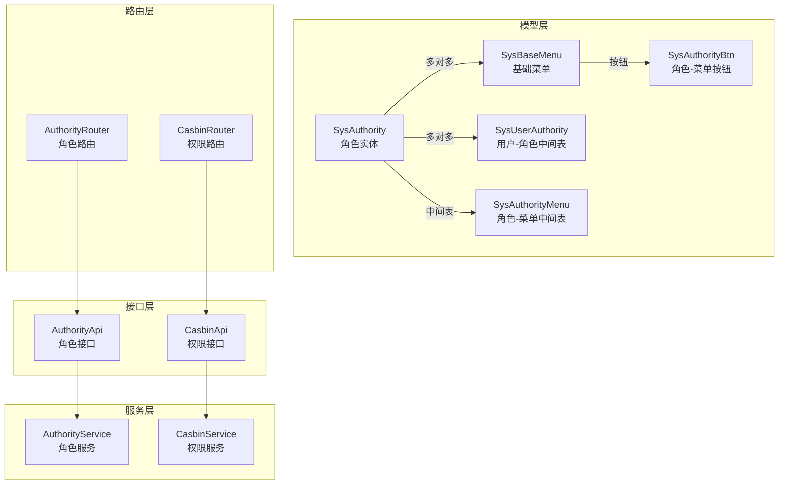
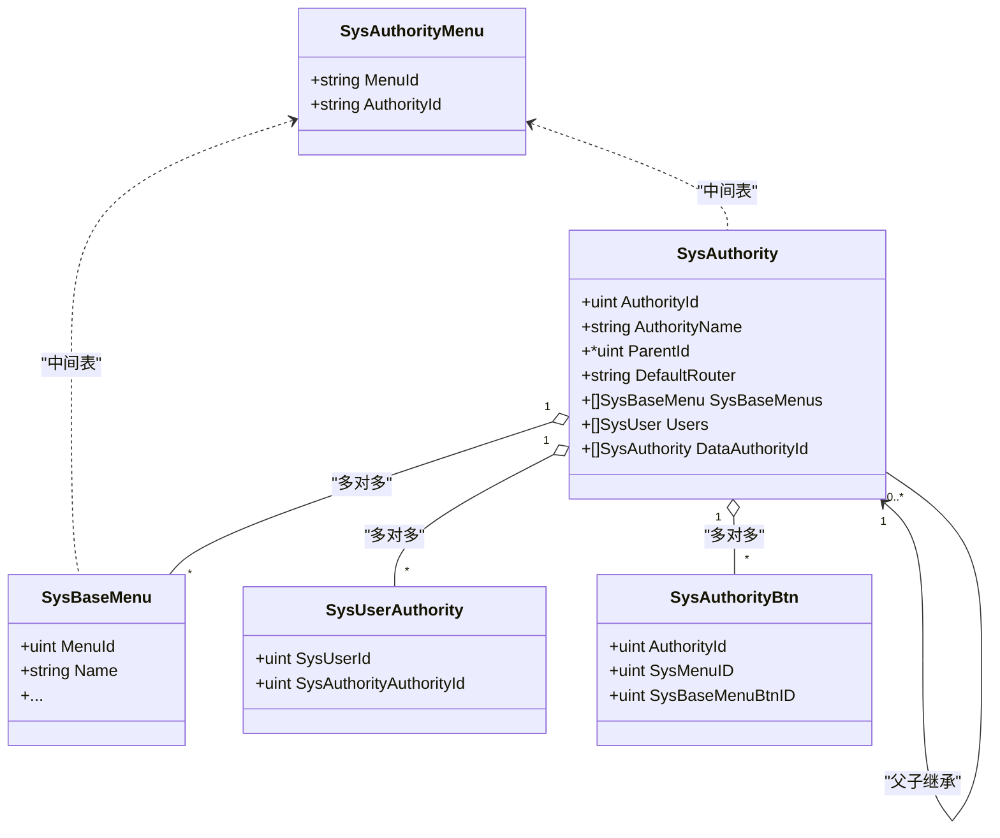
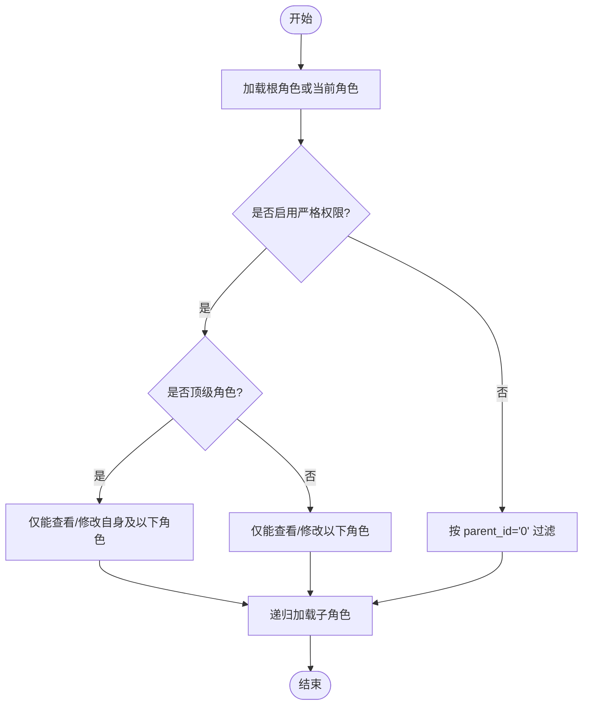
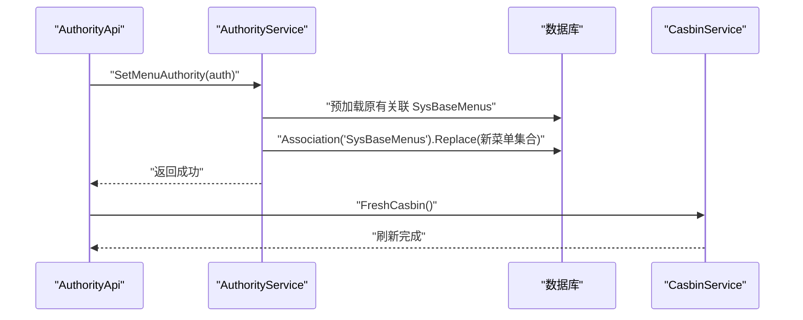
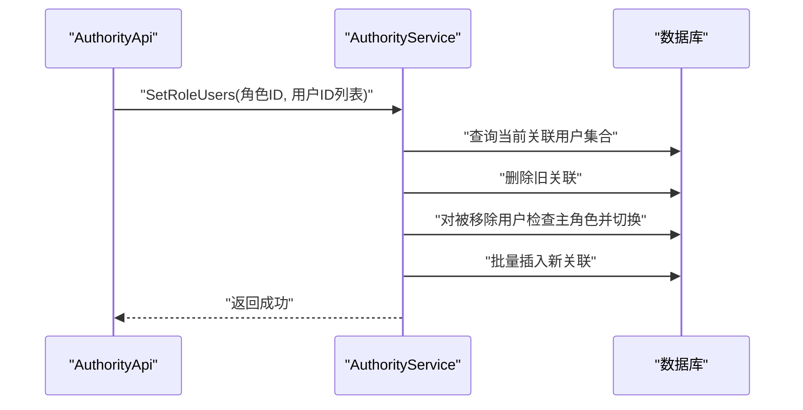
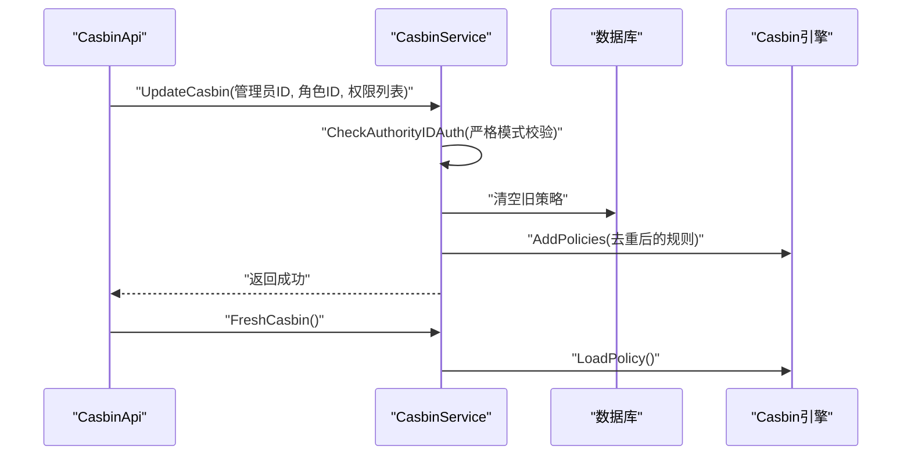
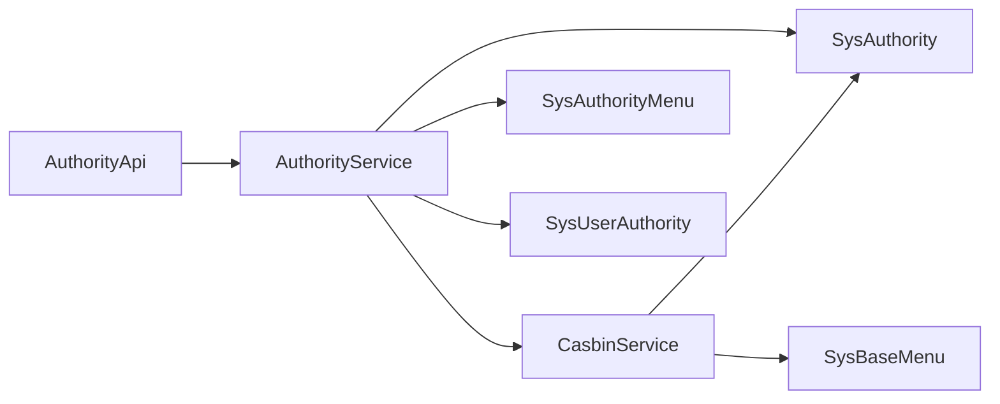

# 角色权限模型

<cite>
**本文引用的文件**
- [server/model/system/sys_authority.go](file://server/model/system/sys_authority.go)
- [server/model/system/sys_authority_menu.go](file://server/model/system/sys_authority_menu.go)
- [server/service/system/sys_authority.go](file://server/service/system/sys_authority.go)
- [server/router/system/sys_authority.go](file://server/router/system/sys_authority.go)
- [server/api/v1/system/sys_authority.go](file://server/api/v1/system/sys_authority.go)
- [server/model/system/sys_user_authority.go](file://server/model/system/sys_user_authority.go)
- [server/model/system/sys_authority_btn.go](file://server/model/system/sys_authority_btn.go)
- [server/service/system/sys_casbin.go](file://server/service/system/sys_casbin.go)
- [server/router/system/sys_casbin.go](file://server/router/system/sys_casbin.go)
- [server/api/v1/system/sys_casbin.go](file://server/api/v1/system/sys_casbin.go)
- [server/model/system/request/sys_casbin.go](file://server/model/system/request/sys_casbin.go)
- [server/model/system/response/sys_authority.go](file://server/model/system/response/sys_authority.go)
</cite>

## 目录
1. [简介](#简介)
2. [项目结构](#项目结构)
3. [核心组件](#核心组件)
4. [架构总览](#架构总览)
5. [详细组件分析](#详细组件分析)
6. [依赖分析](#依赖分析)
7. [性能考虑](#性能考虑)
8. [故障排查指南](#故障排查指南)
9. [结论](#结论)

## 简介
本文件系统性阐述测试管理平台的角色权限模型，围绕 SysAuthority 角色实体展开，详解角色ID、角色名称、角色级别、权限字符串、父角色ID等字段设计；解释角色层级结构与继承关系；说明角色与菜单的多对多关联及中间表 sys_authority_menus 的作用；给出角色权限表结构图、角色树形结构与权限继承机制示意；最后总结角色权限验证的业务逻辑与实现方式。

## 项目结构
角色权限模型涉及服务层、接口层、路由层与数据模型层的协同：
- 模型层定义角色、菜单、用户与权限规则的数据结构与关联关系
- 服务层封装角色创建、复制、更新、删除、授权、树遍历、用户映射等业务逻辑
- 接口层负责参数校验、鉴权与响应封装
- 路由层暴露 REST API
- 权限控制通过 Casbin 动态策略存储与校验

图表来源
- [server/model/system/sys_authority.go:7-19](file://server/model/system/sys_authority.go#L7-L19)
- [server/model/system/sys_authority_menu.go:12-19](file://server/model/system/sys_authority_menu.go#L12-L19)
- [server/model/system/sys_user_authority.go:4-11](file://server/model/system/sys_user_authority.go#L4-L11)
- [server/model/system/sys_authority_btn.go:3-8](file://server/model/system/sys_authority_btn.go#L3-L8)
- [server/service/system/sys_authority.go:24-54](file://server/service/system/sys_authority.go#L24-L54)
- [server/service/system/sys_casbin.go:22-74](file://server/service/system/sys_casbin.go#L22-L74)
- [server/api/v1/system/sys_authority.go:15-56](file://server/api/v1/system/sys_authority.go#L15-L56)
- [server/api/v1/system/sys_casbin.go:15-44](file://server/api/v1/system/sys_casbin.go#L15-L44)
- [server/router/system/sys_authority.go:8-25](file://server/router/system/sys_authority.go#L8-L25)
- [server/router/system/sys_casbin.go:8-19](file://server/router/system/sys_casbin.go#L8-L19)

章节来源
- [server/model/system/sys_authority.go:7-19](file://server/model/system/sys_authority.go#L7-L19)
- [server/model/system/sys_authority_menu.go:12-19](file://server/model/system/sys_authority_menu.go#L12-L19)
- [server/service/system/sys_authority.go:24-54](file://server/service/system/sys_authority.go#L24-L54)
- [server/service/system/sys_casbin.go:22-74](file://server/service/system/sys_casbin.go#L22-L74)
- [server/api/v1/system/sys_authority.go:15-56](file://server/api/v1/system/sys_authority.go#L15-L56)
- [server/api/v1/system/sys_casbin.go:15-44](file://server/api/v1/system/sys_casbin.go#L15-L44)
- [server/router/system/sys_authority.go:8-25](file://server/router/system/sys_authority.go#L8-L25)
- [server/router/system/sys_casbin.go:8-19](file://server/router/system/sys_casbin.go#L8-L19)

## 核心组件
- SysAuthority 角色实体：包含角色ID、角色名称、父角色ID、默认菜单、与菜单/用户/数据权限的多对多关联
- SysAuthorityMenu 中间表：维护角色与菜单的多对多关系
- SysUserAuthority 中间表：维护用户与角色的多对多关系
- SysAuthorityBtn：维护角色对菜单按钮的细粒度权限
- AuthorityService：封装角色生命周期与授权操作
- CasbinService：基于策略的动态权限校验与同步

章节来源
- [server/model/system/sys_authority.go:7-19](file://server/model/system/sys_authority.go#L7-L19)
- [server/model/system/sys_authority_menu.go:12-19](file://server/model/system/sys_authority_menu.go#L12-L19)
- [server/model/system/sys_user_authority.go:4-11](file://server/model/system/sys_user_authority.go#L4-L11)
- [server/model/system/sys_authority_btn.go:3-8](file://server/model/system/sys_authority_btn.go#L3-L8)
- [server/service/system/sys_authority.go:24-54](file://server/service/system/sys_authority.go#L24-L54)
- [server/service/system/sys_casbin.go:22-74](file://server/service/system/sys_casbin.go#L22-L74)

## 架构总览
角色权限模型采用“角色-菜单-按钮”三层结构，结合 Casbin 动态策略实现灵活的权限控制。角色具备层级继承能力，权限可通过菜单与按钮进行细化，并支持严格模式下的权限范围校验。

图表来源
- [server/model/system/sys_authority.go:7-19](file://server/model/system/sys_authority.go#L7-L19)
- [server/model/system/sys_authority_menu.go:12-19](file://server/model/system/sys_authority_menu.go#L12-L19)
- [server/model/system/sys_user_authority.go:4-11](file://server/model/system/sys_user_authority.go#L4-L11)
- [server/model/system/sys_authority_btn.go:3-8](file://server/model/system/sys_authority_btn.go#L3-L8)

## 详细组件分析

### 角色实体与字段设计
- 角色ID（AuthorityId）：唯一标识，非空且唯一
- 角色名称（AuthorityName）：角色显示名
- 父角色ID（ParentId）：支持层级继承，顶级角色父ID为0
- 默认菜单（DefaultRouter）：角色默认入口菜单
- 关联菜单（SysBaseMenus）：多对多，通过中间表 sys_authority_menus 维护
- 关联用户（Users）：多对多，通过中间表 sys_user_authority 维护
- 数据权限集合（DataAuthorityId）：可限定可管理的数据范围

章节来源
- [server/model/system/sys_authority.go:7-19](file://server/model/system/sys_authority.go#L7-L19)

### 角色层级结构与继承关系
- 层级通过 ParentId 实现父子关系
- 严格模式下，仅允许在自身权限范围内增删改子角色
- 提供递归查询子角色的能力，用于构建角色树

图表来源
- [server/service/system/sys_authority.go:186-211](file://server/service/system/sys_authority.go#L186-L211)
- [server/service/system/sys_authority.go:316-324](file://server/service/system/sys_authority.go#L316-L324)

章节来源
- [server/service/system/sys_authority.go:186-211](file://server/service/system/sys_authority.go#L186-L211)
- [server/service/system/sys_authority.go:316-324](file://server/service/system/sys_authority.go#L316-L324)

### 角色与菜单的多对多关联
- 角色与菜单通过中间表 sys_authority_menus 关联
- 创建角色时默认绑定默认菜单集
- 更新角色菜单权限时，先加载原有关联再整体替换

图表来源
- [server/api/v1/system/sys_authority.go:154-172](file://server/api/v1/system/sys_authority.go#L154-L172)
- [server/service/system/sys_authority.go:297-308](file://server/service/system/sys_authority.go#L297-L308)
- [server/service/system/sys_casbin.go:169-173](file://server/service/system/sys_casbin.go#L169-L173)

章节来源
- [server/model/system/sys_authority_menu.go:12-19](file://server/model/system/sys_authority_menu.go#L12-L19)
- [server/service/system/sys_authority.go:297-308](file://server/service/system/sys_authority.go#L297-L308)
- [server/api/v1/system/sys_authority.go:154-172](file://server/api/v1/system/sys_authority.go#L154-L172)

### 角色与用户的多对多关联
- 用户与角色通过中间表 sys_user_authority 关联
- 支持全量覆盖某角色的用户列表，自动处理主角色切换

图表来源
- [server/api/v1/system/sys_authority.go:232-257](file://server/api/v1/system/sys_authority.go#L232-L257)
- [server/service/system/sys_authority.go:348-412](file://server/service/system/sys_authority.go#L348-L412)

章节来源
- [server/model/system/sys_user_authority.go:4-11](file://server/model/system/sys_user_authority.go#L4-L11)
- [server/service/system/sys_authority.go:348-412](file://server/service/system/sys_authority.go#L348-L412)

### 角色与按钮的细粒度权限
- 角色对菜单按钮的权限通过 SysAuthorityBtn 维护
- 复制角色时会同步按钮权限
- 前端根据按钮权限控制界面元素显隐

章节来源
- [server/model/system/sys_authority_btn.go:3-8](file://server/model/system/sys_authority_btn.go#L3-L8)
- [server/service/system/sys_authority.go:62-106](file://server/service/system/sys_authority.go#L62-L106)

### 权限字符串与 Casbin 策略
- 权限以“角色ID-路径-方法”的策略形式存储
- 创建角色时默认注入一组默认 API 权限
- 更新权限时进行去重与严格模式校验
- 支持按角色或按 API 查询权限集合

图表来源
- [server/api/v1/system/sys_casbin.go:15-44](file://server/api/v1/system/sys_casbin.go#L15-L44)
- [server/service/system/sys_casbin.go:26-74](file://server/service/system/sys_casbin.go#L26-L74)
- [server/service/system/sys_casbin.go:169-173](file://server/service/system/sys_casbin.go#L169-L173)
- [server/model/system/request/sys_casbin.go:15-27](file://server/model/system/request/sys_casbin.go#L15-L27)

章节来源
- [server/service/system/sys_casbin.go:26-74](file://server/service/system/sys_casbin.go#L26-L74)
- [server/model/system/request/sys_casbin.go:15-27](file://server/model/system/request/sys_casbin.go#L15-L27)
- [server/api/v1/system/sys_casbin.go:15-44](file://server/api/v1/system/sys_casbin.go#L15-L44)

### 角色权限验证业务逻辑
- 严格模式下，管理员只能对自身权限范围内的角色进行操作
- 创建/更新角色时进行参数校验与重复性检查
- 删除角色前进行安全检查（是否被用户使用、是否存在子角色）
- 权限变更后需刷新 Casbin 策略以即时生效

章节来源
- [server/api/v1/system/sys_authority.go:17-56](file://server/api/v1/system/sys_authority.go#L17-L56)
- [server/service/system/sys_authority.go:28-54](file://server/service/system/sys_authority.go#L28-L54)
- [server/service/system/sys_authority.go:131-178](file://server/service/system/sys_authority.go#L131-L178)

## 依赖分析
- 角色实体与菜单、用户、按钮之间通过 GORM 多对多与中间表建立强关联
- 权限服务依赖角色服务进行权限范围校验
- 接口层依赖服务层与路由层进行参数传递与响应封装

图表来源
- [server/api/v1/system/sys_authority.go:15-56](file://server/api/v1/system/sys_authority.go#L15-L56)
- [server/service/system/sys_authority.go:24-54](file://server/service/system/sys_authority.go#L24-L54)
- [server/service/system/sys_casbin.go:22-74](file://server/service/system/sys_casbin.go#L22-L74)

章节来源
- [server/api/v1/system/sys_authority.go:15-56](file://server/api/v1/system/sys_authority.go#L15-L56)
- [server/service/system/sys_authority.go:24-54](file://server/service/system/sys_authority.go#L24-L54)
- [server/service/system/sys_casbin.go:22-74](file://server/service/system/sys_casbin.go#L22-L74)

## 性能考虑
- 角色树查询建议分页与懒加载，避免一次性加载过深层级
- 权限策略更新采用去重与批量写入，减少重复规则带来的匹配开销
- 刷新 Casbin 策略应尽量合并调用，避免频繁 I/O
- 中间表索引与外键约束确保查询与一致性，但需平衡写入性能

## 故障排查指南
- 创建角色报“存在相同角色ID”：检查角色ID是否重复
- 删除角色失败提示“存在子角色/被用户使用”：先清理子角色与用户关联
- 权限更新失败提示“API 不在权限列表中”：确认 API 是否在管理员权限范围内
- 刷新权限后未生效：确认是否调用了刷新 Casbin 策略

章节来源
- [server/service/system/sys_authority.go:30-32](file://server/service/system/sys_authority.go#L30-L32)
- [server/service/system/sys_authority.go:131-143](file://server/service/system/sys_authority.go#L131-L143)
- [server/service/system/sys_casbin.go:33-51](file://server/service/system/sys_casbin.go#L33-L51)
- [server/api/v1/system/sys_authority.go:49-54](file://server/api/v1/system/sys_authority.go#L49-L54)

## 结论
本角色权限模型通过清晰的实体设计与中间表解耦，实现了角色层级、菜单与按钮的细粒度权限控制，并借助 Casbin 提供了高效的动态权限校验能力。严格模式下的权限范围校验与全量覆盖的用户/权限操作，使得系统在保证安全性的同时具备良好的可维护性与扩展性。