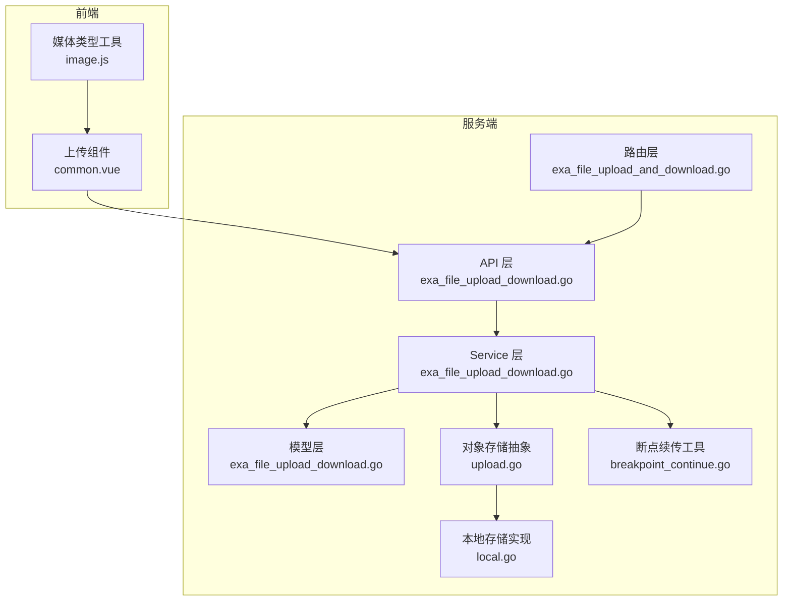
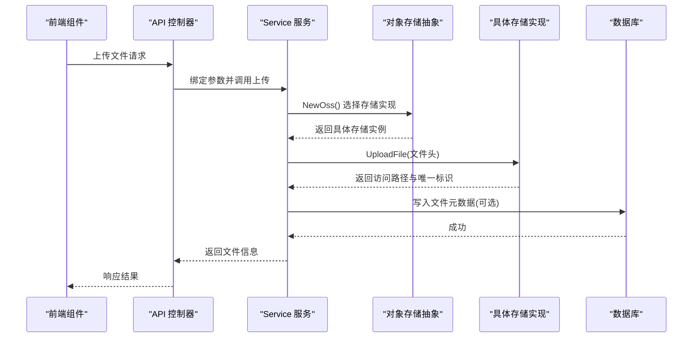
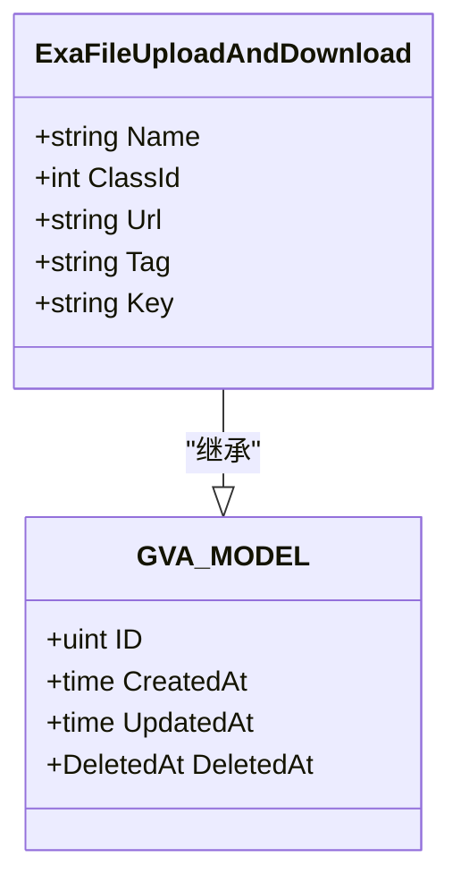
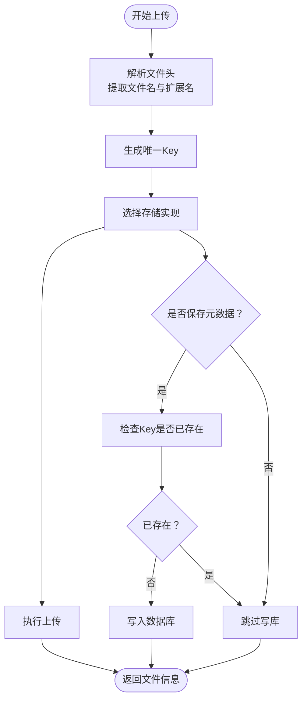
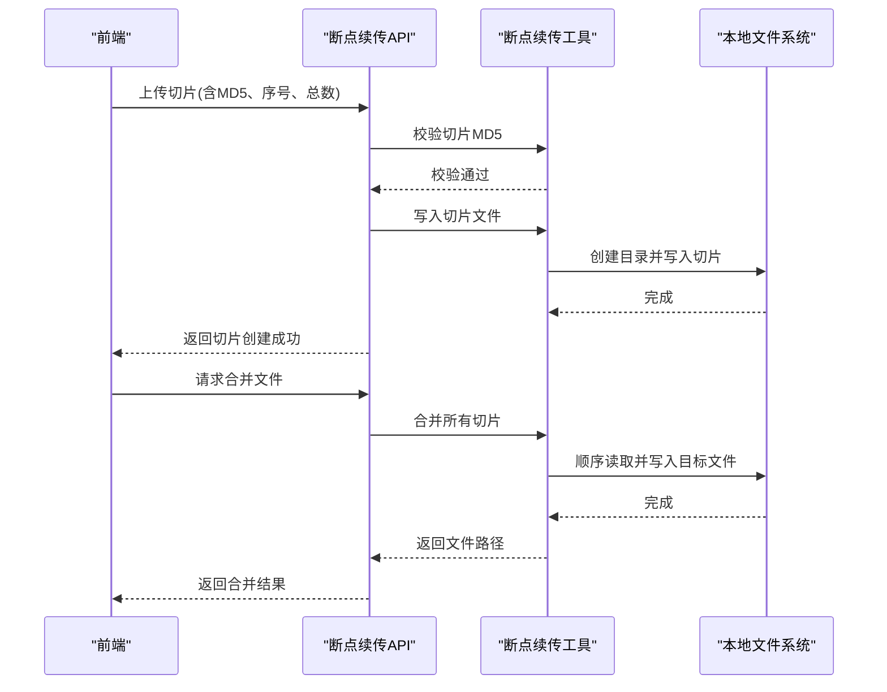
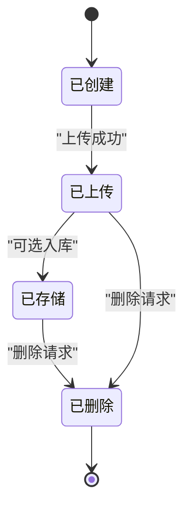
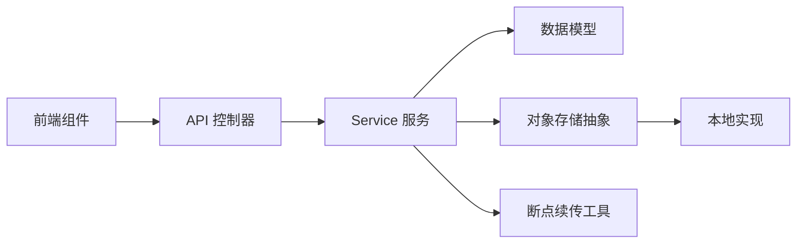

# 文件管理模型

<cite>
**本文引用的文件**
- [server/model/example/exa_file_upload_download.go](file://server/model/example/exa_file_upload_download.go)
- [server/api/v1/example/exa_file_upload_download.go](file://server/api/v1/example/exa_file_upload_download.go)
- [server/service/example/exa_file_upload_download.go](file://server/service/example/exa_file_upload_download.go)
- [server/router/example/exa_file_upload_and_download.go](file://server/router/example/exa_file_upload_and_download.go)
- [server/utils/upload/upload.go](file://server/utils/upload/upload.go)
- [server/utils/upload/local.go](file://server/utils/upload/local.go)
- [server/utils/breakpoint_continue.go](file://server/utils/breakpoint_continue.go)
- [server/api/v1/example/exa_breakpoint_continue.go](file://server/api/v1/example/exa_breakpoint_continue.go)
- [server/model/example/request/exa_file_upload_and_downloads.go](file://server/model/example/request/exa_file_upload_and_downloads.go)
- [server/model/example/response/exa_file_upload_download.go](file://server/model/example/response/exa_file_upload_download.go)
- [server/global/model.go](file://server/global/model.go)
- [server/config/system.go](file://server/config/system.go)
- [server/config/config.go](file://server/config/config.go)
- [server/config/disk.go](file://server/config/disk.go)
- [web/src/components/upload/common.vue](file://web/src/components/upload/common.vue)
- [web/src/utils/image.js](file://web/src/utils/image.js)
</cite>

## 目录
1. [引言](#引言)
2. [项目结构](#项目结构)
3. [核心组件](#核心组件)
4. [架构总览](#架构总览)
5. [详细组件分析](#详细组件分析)
6. [依赖分析](#依赖分析)
7. [性能考虑](#性能考虑)
8. [故障排查指南](#故障排查指南)
9. [结论](#结论)
10. [附录](#附录)

## 引言
本文件面向“文件管理数据模型”的综合文档，围绕 ExaFileUploadAndDownload 模型展开，系统阐述其数据结构、字段含义与约束；解释文件上传与下载流程中的数据流转机制，包括元数据管理、存储策略选择、访问控制与安全检查；给出文件全生命周期（创建、上传、存储、删除）的数据处理过程，并总结文件类型验证、大小限制与安全检查等业务规则的实现要点。

## 项目结构
文件管理功能在服务端采用典型的 MVC 分层：API 层负责请求接入与参数绑定；Service 层封装业务逻辑与存储策略选择；Model 层定义数据结构；Utils 提供通用工具（如断点续传与对象存储抽象）。前端通过组件对上传行为进行前置校验与交互反馈。

图表来源
- [server/api/v1/example/exa_file_upload_download.go:1-136](file://server/api/v1/example/exa_file_upload_download.go#L1-L136)
- [server/service/example/exa_file_upload_download.go:1-131](file://server/service/example/exa_file_upload_download.go#L1-L131)
- [server/model/example/exa_file_upload_download.go:1-19](file://server/model/example/exa_file_upload_download.go#L1-L19)
- [server/utils/upload/upload.go:1-47](file://server/utils/upload/upload.go#L1-L47)
- [server/utils/upload/local.go:1-110](file://server/utils/upload/local.go#L1-L110)
- [server/utils/breakpoint_continue.go:1-122](file://server/utils/breakpoint_continue.go#L1-L122)
- [server/router/example/exa_file_upload_and_download.go:1-23](file://server/router/example/exa_file_upload_and_download.go#L1-L23)
- [web/src/components/upload/common.vue:49-90](file://web/src/components/upload/common.vue#L49-L90)
- [web/src/utils/image.js:109-126](file://web/src/utils/image.js#L109-L126)

章节来源
- [server/api/v1/example/exa_file_upload_download.go:1-136](file://server/api/v1/example/exa_file_upload_download.go#L1-L136)
- [server/service/example/exa_file_upload_download.go:1-131](file://server/service/example/exa_file_upload_download.go#L1-L131)
- [server/model/example/exa_file_upload_download.go:1-19](file://server/model/example/exa_file_upload_download.go#L1-L19)
- [server/utils/upload/upload.go:1-47](file://server/utils/upload/upload.go#L1-L47)
- [server/utils/upload/local.go:1-110](file://server/utils/upload/local.go#L1-L110)
- [server/utils/breakpoint_continue.go:1-122](file://server/utils/breakpoint_continue.go#L1-L122)
- [server/router/example/exa_file_upload_and_download.go:1-23](file://server/router/example/exa_file_upload_and_download.go#L1-L23)
- [web/src/components/upload/common.vue:49-90](file://web/src/components/upload/common.vue#L49-L90)
- [web/src/utils/image.js:109-126](file://web/src/utils/image.js#L109-L126)

## 核心组件
- 数据模型：ExaFileUploadAndDownload 定义文件的基本元数据与索引字段，继承统一模型基类，具备主键、创建/更新/删除时间戳。
- API 控制器：提供上传、编辑名称、删除、分页查询、导入 URL 等接口；断点续传相关接口位于独立控制器。
- Service 服务：封装上传、查询、删除、分页检索、URL 导入；根据配置选择对象存储实现（本地/云存储）。
- 存储抽象：OSS 接口与工厂方法，按系统配置动态选择具体实现。
- 工具函数：断点续传的切片写入、合并与清理；本地存储的安全删除与路径拼接。
- 前端组件：上传前的类型与大小校验，以及媒体预览辅助工具。

章节来源
- [server/model/example/exa_file_upload_download.go:7-18](file://server/model/example/exa_file_upload_download.go#L7-L18)
- [server/global/model.go:9-14](file://server/global/model.go#L9-L14)
- [server/api/v1/example/exa_file_upload_download.go:16-136](file://server/api/v1/example/exa_file_upload_download.go#L16-L136)
- [server/service/example/exa_file_upload_download.go:21-131](file://server/service/example/exa_file_upload_download.go#L21-L131)
- [server/utils/upload/upload.go:9-47](file://server/utils/upload/upload.go#L9-L47)
- [server/utils/breakpoint_continue.go:26-122](file://server/utils/breakpoint_continue.go#L26-L122)
- [web/src/components/upload/common.vue:49-90](file://web/src/components/upload/common.vue#L49-L90)

## 架构总览
文件管理采用“API-Service-Model-Storage”分层架构，配合断点续传与对象存储抽象，实现灵活的文件上传与持久化。

图表来源
- [server/api/v1/example/exa_file_upload_download.go:25-42](file://server/api/v1/example/exa_file_upload_download.go#L25-L42)
- [server/service/example/exa_file_upload_download.go:96-120](file://server/service/example/exa_file_upload_download.go#L96-L120)
- [server/utils/upload/upload.go:20-46](file://server/utils/upload/upload.go#L20-L46)
- [server/utils/upload/local.go:31-69](file://server/utils/upload/local.go#L31-L69)

## 详细组件分析

### 数据模型：ExaFileUploadAndDownload
- 字段设计
  - ID、CreatedAt、UpdatedAt、DeletedAt：继承自统一模型基类，提供标准 CRUD 时间戳与软删除能力。
  - Name：文件名，来源于上传时的原始文件名。
  - ClassId：分类标识，默认整型，便于按类别检索与管理。
  - Url：文件访问路径，指向对象存储或本地静态资源路径。
  - Tag：文件扩展名标签，用于快速识别文件类型。
  - Key：文件唯一标识，用于去重与定位存储对象。
- 表名：exa_file_upload_and_downloads
- 约束与索引：ClassId 可作为查询过滤条件；Tag 便于类型筛选；Key 用于去重与删除定位。

图表来源
- [server/global/model.go:9-14](file://server/global/model.go#L9-L14)
- [server/model/example/exa_file_upload_download.go:7-18](file://server/model/example/exa_file_upload_download.go#L7-L18)

章节来源
- [server/model/example/exa_file_upload_download.go:7-18](file://server/model/example/exa_file_upload_download.go#L7-L18)
- [server/global/model.go:9-14](file://server/global/model.go#L9-L14)

### 上传流程：元数据管理与存储策略
- 元数据生成
  - 从上传文件头提取原始文件名与扩展名，扩展名写入 Tag；生成 Key 作为对象唯一标识。
  - 若开启保存开关，则将元数据写入数据库；若 Key 已存在则避免重复记录。
- 存储策略选择
  - 通过对象存储抽象工厂按系统配置选择实现（本地/七牛/腾讯/COS/阿里/华为/AWS/Cloudflare/Minio）。
  - 本地存储实现负责创建目录、拼接访问路径与物理文件名、拷贝文件内容。
- 安全与健壮性
  - 本地删除接口对 Key 进行路径穿越与非法字符校验，防止误删或越权删除。
  - 上传接口捕获底层错误并返回统一响应。

图表来源
- [server/service/example/exa_file_upload_download.go:96-120](file://server/service/example/exa_file_upload_download.go#L96-L120)
- [server/utils/upload/upload.go:20-46](file://server/utils/upload/upload.go#L20-L46)
- [server/utils/upload/local.go:31-69](file://server/utils/upload/local.go#L31-L69)

章节来源
- [server/service/example/exa_file_upload_download.go:96-120](file://server/service/example/exa_file_upload_download.go#L96-L120)
- [server/utils/upload/upload.go:20-46](file://server/utils/upload/upload.go#L20-L46)
- [server/utils/upload/local.go:31-69](file://server/utils/upload/local.go#L31-L69)

### 下载与访问控制
- 访问路径：Url 字段提供公开访问路径；实际访问权限由对象存储桶策略与网关配置共同决定。
- 前端预览：根据文件扩展名或 MIME 类型选择对应组件进行预览（图片、PDF、Excel、视频等）。
- 安全检查：断点续传删除接口对路径进行穿越拦截，避免跨目录删除风险。

章节来源
- [server/model/example/exa_file_upload_download.go:9-13](file://server/model/example/exa_file_upload_download.go#L9-L13)
- [server/api/v1/example/exa_breakpoint_continue.go:139-143](file://server/api/v1/example/exa_breakpoint_continue.go#L139-L143)
- [web/src/utils/image.js:109-126](file://web/src/utils/image.js#L109-L126)

### 断点续传：切片管理与合并
- 切片写入
  - 校验切片 MD5 与声明值一致性，确保完整性。
  - 将每个切片写入本地临时目录，按文件 MD5 与切片序号命名。
- 文件合并
  - 依据切片集合顺序合并为完整文件，输出最终路径。
- 清理与秒传
  - 支持删除缓存切片目录；当文件 MD5 相同而文件名不同（秒传）时，仅需复制数据库记录，无需再次上传。

图表来源
- [server/api/v1/example/exa_breakpoint_continue.go:29-78](file://server/api/v1/example/exa_breakpoint_continue.go#L29-L78)
- [server/utils/breakpoint_continue.go:26-107](file://server/utils/breakpoint_continue.go#L26-L107)

章节来源
- [server/api/v1/example/exa_breakpoint_continue.go:29-121](file://server/api/v1/example/exa_breakpoint_continue.go#L29-L121)
- [server/utils/breakpoint_continue.go:26-107](file://server/utils/breakpoint_continue.go#L26-L107)

### 文件生命周期：创建、上传、存储、删除
- 创建：前端上传组件进行类型与大小校验；后端接收文件头并生成元数据。
- 上传：根据配置选择存储实现，写入物理存储并返回访问路径与 Key。
- 存储：元数据可选入库，便于检索与管理；对象存储负责长期稳定存储。
- 删除：先删除对象存储中的文件，再从数据库中移除记录（支持软删除字段）。

图表来源
- [server/service/example/exa_file_upload_download.go:43-55](file://server/service/example/exa_file_upload_download.go#L43-L55)
- [server/utils/upload/local.go:81-109](file://server/utils/upload/local.go#L81-L109)

章节来源
- [server/service/example/exa_file_upload_download.go:43-55](file://server/service/example/exa_file_upload_download.go#L43-L55)
- [server/utils/upload/local.go:81-109](file://server/utils/upload/local.go#L81-L109)

### 业务规则与安全检查
- 类型验证：前端组件对图片与视频 MIME 类型进行白名单校验；扩展名辅助识别。
- 大小限制：前端对视频与图片分别设置阈值（例如视频不超过 5MB，图片未压缩不超过 500KB），避免超限上传。
- 安全检查：本地删除接口拦截路径穿越与非法字符；断点续传删除接口同样进行路径校验。
- 存储策略：通过系统配置选择对象存储类型，确保可扩展与合规。

章节来源
- [web/src/components/upload/common.vue:49-74](file://web/src/components/upload/common.vue#L49-L74)
- [web/src/utils/image.js:109-126](file://web/src/utils/image.js#L109-L126)
- [server/utils/upload/local.go:82-90](file://server/utils/upload/local.go#L82-L90)
- [server/api/v1/example/exa_breakpoint_continue.go:139-143](file://server/api/v1/example/exa_breakpoint_continue.go#L139-L143)
- [server/config/system.go:3-5](file://server/config/system.go#L3-L5)
- [server/config/config.go:22-29](file://server/config/config.go#L22-L29)

## 依赖分析
- 组件耦合
  - API 依赖 Service；Service 依赖 Model 与存储抽象；存储抽象依赖具体实现。
  - 断点续传工具与 Service 解耦，便于复用。
- 外部依赖
  - 对象存储 SDK（如 MinIO、AWS S3、七牛等）通过统一接口屏蔽差异。
  - 前端上传组件与工具函数依赖运行时环境变量与 API。

图表来源
- [server/api/v1/example/exa_file_upload_download.go:1-136](file://server/api/v1/example/exa_file_upload_download.go#L1-L136)
- [server/service/example/exa_file_upload_download.go:1-131](file://server/service/example/exa_file_upload_download.go#L1-L131)
- [server/utils/upload/upload.go:1-47](file://server/utils/upload/upload.go#L1-L47)
- [server/utils/upload/local.go:1-110](file://server/utils/upload/local.go#L1-L110)
- [server/utils/breakpoint_continue.go:1-122](file://server/utils/breakpoint_continue.go#L1-L122)
- [web/src/components/upload/common.vue:49-90](file://web/src/components/upload/common.vue#L49-L90)

章节来源
- [server/api/v1/example/exa_file_upload_download.go:1-136](file://server/api/v1/example/exa_file_upload_download.go#L1-L136)
- [server/service/example/exa_file_upload_download.go:1-131](file://server/service/example/exa_file_upload_download.go#L1-L131)
- [server/utils/upload/upload.go:1-47](file://server/utils/upload/upload.go#L1-L47)
- [server/utils/upload/local.go:1-110](file://server/utils/upload/local.go#L1-L110)
- [server/utils/breakpoint_continue.go:1-122](file://server/utils/breakpoint_continue.go#L1-L122)
- [web/src/components/upload/common.vue:49-90](file://web/src/components/upload/common.vue#L49-L90)

## 性能考虑
- 存储策略
  - 云端对象存储具备高可用与横向扩展能力，适合大规模文件管理场景。
  - 本地存储适用于小规模或内网部署，注意磁盘空间与 IO 压力。
- 并发与安全
  - 本地删除操作使用互斥锁，避免并发删除导致的竞态问题。
  - 断点续传目录按文件 MD5 分离，降低目录项过多带来的性能影响。
- 传输优化
  - 断点续传减少网络抖动带来的重复传输成本；前端分片大小与并发度可根据网络状况调整。

## 故障排查指南
- 上传失败
  - 检查对象存储配置与凭证；确认存储桶权限与网络连通性。
  - 查看服务日志中的错误堆栈，定位具体环节（接收文件、写入存储、写库）。
- 删除失败
  - 校验 Key 是否为空或包含非法字符；确认文件是否存在。
  - 若使用本地存储，检查磁盘权限与路径拼接是否正确。
- 断点续传异常
  - 校验切片 MD5 与声明值是否一致；确认切片目录结构与命名规范。
  - 清理残留切片目录后重试；必要时重新发起上传流程。
- 前端上传被拦截
  - 检查 MIME 类型与大小限制；确认运行时环境变量与 API 地址配置正确。

章节来源
- [server/service/example/exa_file_upload_download.go:35-55](file://server/service/example/exa_file_upload_download.go#L35-L55)
- [server/utils/upload/local.go:81-109](file://server/utils/upload/local.go#L81-L109)
- [server/api/v1/example/exa_breakpoint_continue.go:54-58](file://server/api/v1/example/exa_breakpoint_continue.go#L54-L58)
- [web/src/components/upload/common.vue:49-74](file://web/src/components/upload/common.vue#L49-L74)

## 结论
ExaFileUploadAndDownload 模型以简洁的字段设计支撑完整的文件元数据管理；结合对象存储抽象与断点续传工具，实现了可扩展、安全、高效的文件上传与生命周期管理。通过前后端协同的类型与大小校验，进一步提升了用户体验与系统稳定性。建议在生产环境中优先采用云端对象存储，并完善访问控制与审计日志。

## 附录
- 配置项参考
  - 系统存储类型：通过系统配置选择对象存储类型。
  - 本地存储路径：本地存储的挂载点与访问路径由配置决定。
  - 磁盘列表：支持多磁盘挂载点配置，便于扩展存储容量。

章节来源
- [server/config/system.go:3-5](file://server/config/system.go#L3-L5)
- [server/config/disk.go:3-9](file://server/config/disk.go#L3-L9)
- [server/config/config.go:22-29](file://server/config/config.go#L22-L29)