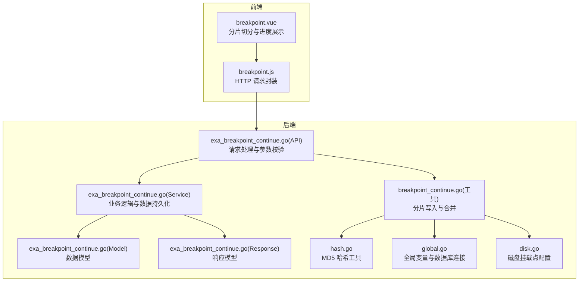
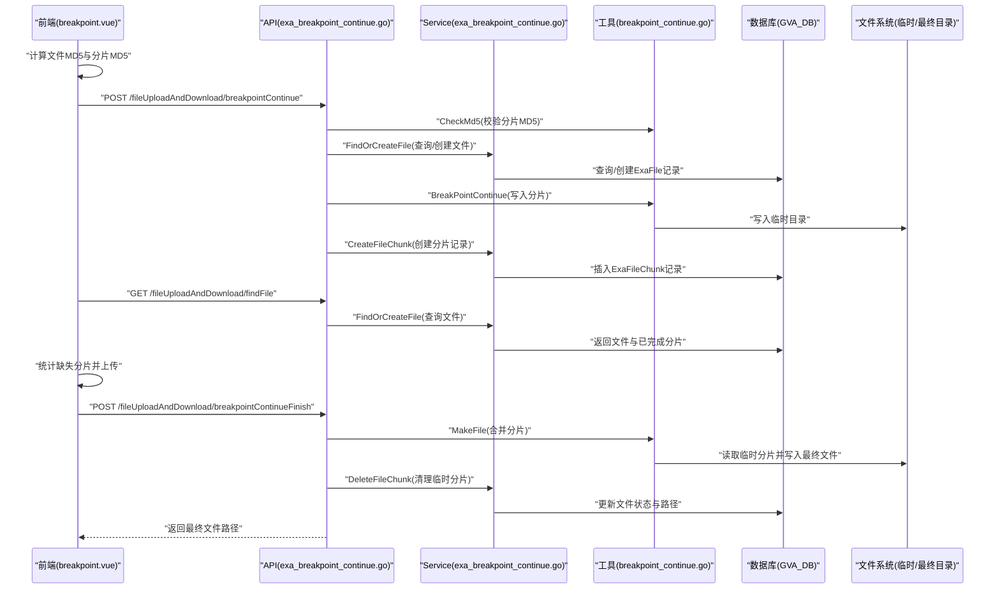
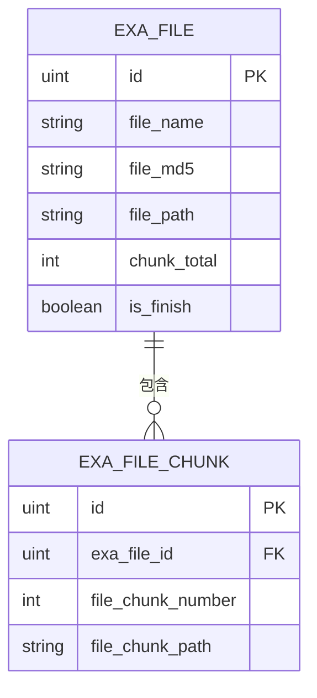
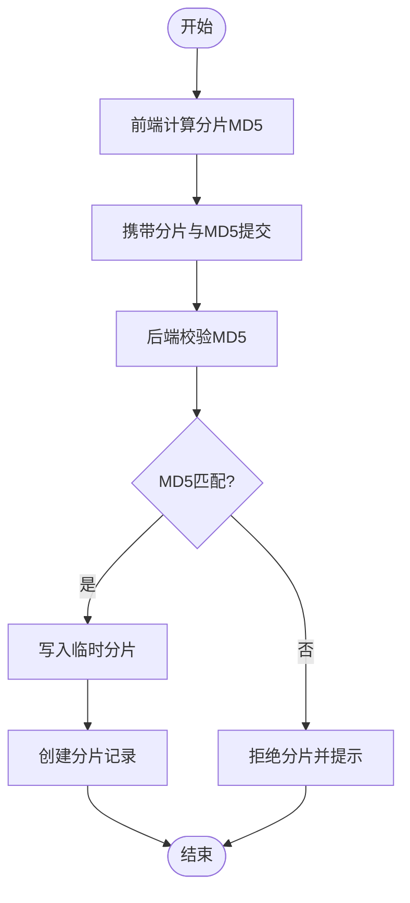
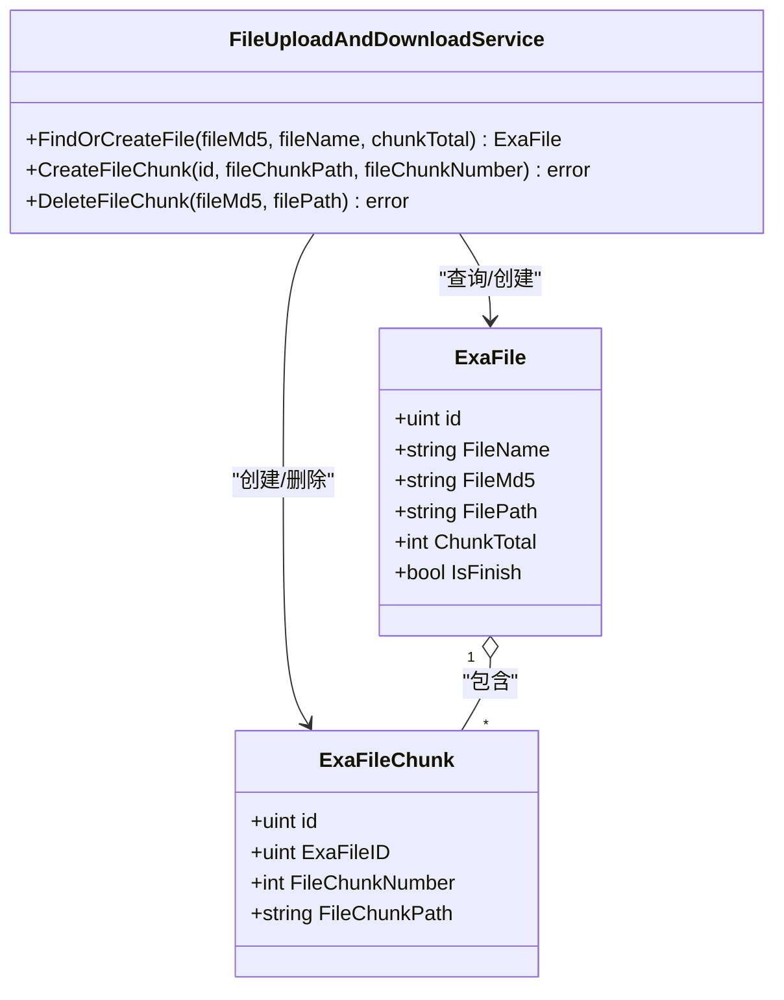
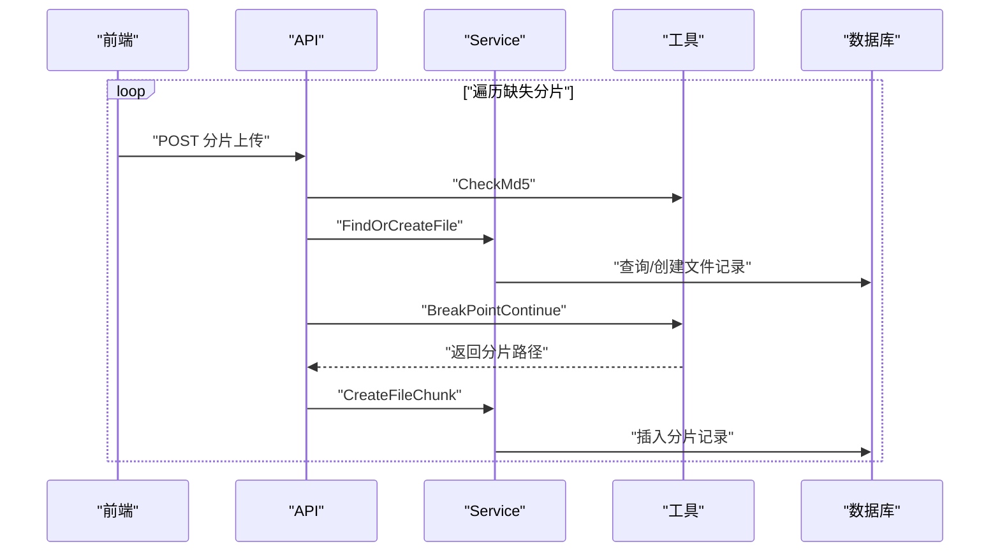
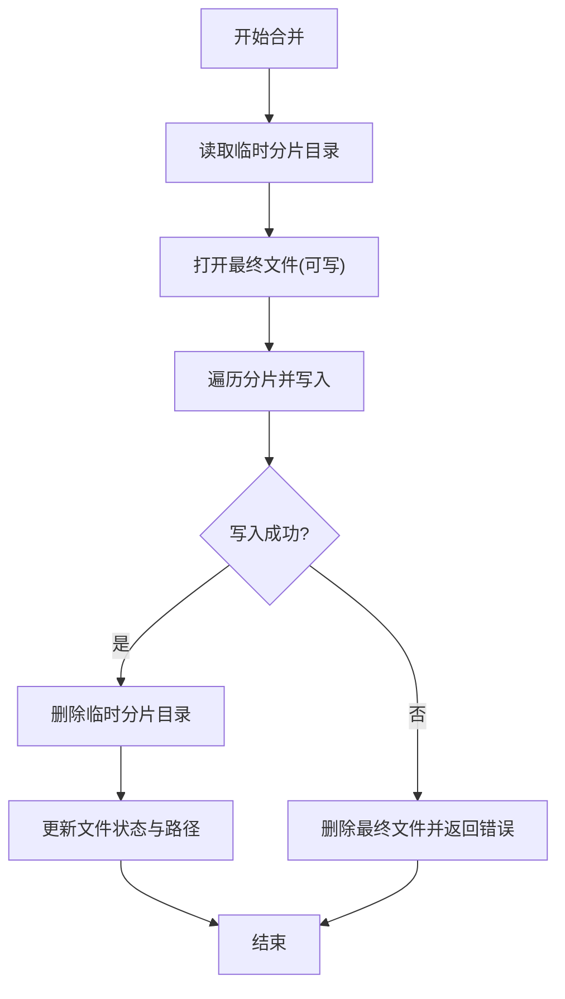
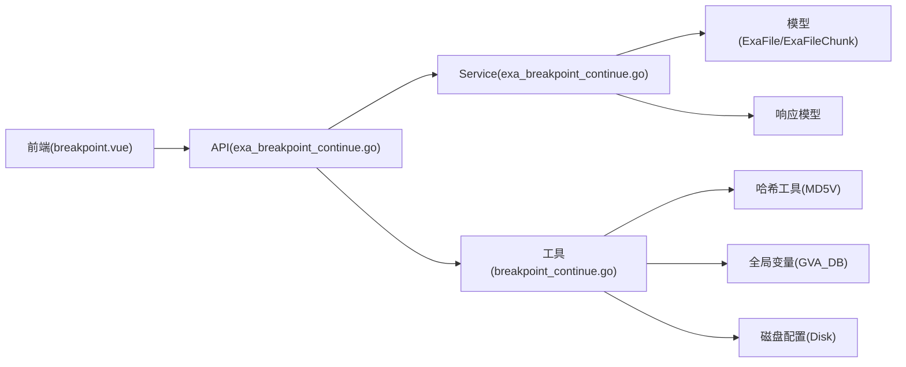

# 断点续传模型

<cite>
**本文引用的文件列表**
- [exa_breakpoint_continue.go（模型）](file://server/model/example/exa_breakpoint_continue.go)
- [exa_breakpoint_continue.go（服务）](file://server/service/example/exa_breakpoint_continue.go)
- [exa_breakpoint_continue.go（API）](file://server/api/v1/example/exa_breakpoint_continue.go)
- [breakpoint_continue.go（工具）](file://server/utils/breakpoint_continue.go)
- [hash.go（哈希工具）](file://server/utils/hash.go)
- [exa_breakpoint_continue.go（响应模型）](file://server/model/example/response/exa_breakpoint_continue.go)
- [breakpoint.vue（前端视图）](file://web/src/view/example/breakpoint/breakpoint.vue)
- [breakpoint.js（前端API）](file://web/src/api/breakpoint.js)
- [global.go（全局变量）](file://server/global/global.go)
- [disk.go（磁盘配置）](file://server/config/disk.go)
</cite>

## 目录
1. [简介](#简介)
2. [项目结构](#项目结构)
3. [核心组件](#核心组件)
4. [架构概览](#架构概览)
5. [详细组件分析](#详细组件分析)
6. [依赖关系分析](#依赖关系分析)
7. [性能考量](#性能考量)
8. [故障排查指南](#故障排查指南)
9. [结论](#结论)

## 简介
本技术文档围绕断点续传数据模型展开，重点解析 ExaBreakpointContinue 模型的分片传输机制设计，包括文件分片信息、进度跟踪、状态管理等核心字段；深入解释断点续传的实现原理，涵盖分片大小计算、哈希校验、并发控制等关键技术点；提供从分片上传、进度记录到最终合并的完整数据流程说明；并包含错误恢复机制、重试策略、数据一致性保证等高级特性实现细节。

## 项目结构
断点续传功能在后端采用三层架构：API 层负责请求处理与参数校验，Service 层负责业务逻辑与数据持久化，Utils 层提供底层工具能力；前端通过 Vue 组件实现分片切分、进度展示与最终合并。

图表来源
- [exa_breakpoint_continue.go（API）:1-157](file://server/api/v1/example/exa_breakpoint_continue.go#L1-L157)
- [exa_breakpoint_continue.go（服务）:1-72](file://server/service/example/exa_breakpoint_continue.go#L1-L72)
- [breakpoint_continue.go（工具）:1-122](file://server/utils/breakpoint_continue.go#L1-L122)
- [hash.go（哈希工具）:1-32](file://server/utils/hash.go#L1-L32)
- [exa_breakpoint_continue.go（模型）:1-25](file://server/model/example/exa_breakpoint_continue.go#L1-L25)
- [exa_breakpoint_continue.go（响应模型）:1-12](file://server/model/example/response/exa_breakpoint_continue.go#L1-L12)
- [global.go（全局变量）:1-69](file://server/global/global.go#L1-L69)
- [disk.go（磁盘配置）:1-10](file://server/config/disk.go#L1-L10)

章节来源
- [exa_breakpoint_continue.go（API）:1-157](file://server/api/v1/example/exa_breakpoint_continue.go#L1-L157)
- [exa_breakpoint_continue.go（服务）:1-72](file://server/service/example/exa_breakpoint_continue.go#L1-L72)
- [breakpoint_continue.go（工具）:1-122](file://server/utils/breakpoint_continue.go#L1-L122)
- [hash.go（哈希工具）:1-32](file://server/utils/hash.go#L1-L32)
- [exa_breakpoint_continue.go（模型）:1-25](file://server/model/example/exa_breakpoint_continue.go#L1-L25)
- [exa_breakpoint_continue.go（响应模型）:1-12](file://server/model/example/response/exa_breakpoint_continue.go#L1-L12)
- [global.go（全局变量）:1-69](file://server/global/global.go#L1-L69)
- [disk.go（磁盘配置）:1-10](file://server/config/disk.go#L1-L10)

## 核心组件
- 数据模型
  - ExaFile：表示一个完整的文件，包含文件名、MD5、路径、分片集合、分片总数、是否完成等字段。
  - ExaFileChunk：表示单个分片，包含所属文件 ID、分片编号、分片路径等字段。
- 服务层
  - FileUploadAndDownloadService：提供文件与分片的查询/创建/删除等操作，负责与数据库交互。
- 工具层
  - BreakPointContinue：将分片写入本地临时目录，按文件 MD5 和分片编号命名。
  - CheckMd5：基于内容计算 MD5 并与前端传入的分片 MD5 校验。
  - MakeFile：遍历临时目录下的所有分片，按顺序合并生成最终文件。
  - RemoveChunk：清理指定文件 MD5 对应的临时分片目录。
- API 层
  - BreakpointContinue：接收分片、校验 MD5、调用服务层创建分片记录。
  - FindFile：查询文件是否存在以及已完成的分片列表。
  - BreakpointContinueFinish：触发文件合并。
  - RemoveChunk：删除临时分片与数据库记录。
- 前端
  - breakpoint.vue：负责文件选择、分片切分、进度计算、分片上传与最终合并。
  - breakpoint.js：封装断点续传相关接口调用。

章节来源
- [exa_breakpoint_continue.go（模型）:1-25](file://server/model/example/exa_breakpoint_continue.go#L1-L25)
- [exa_breakpoint_continue.go（服务）:1-72](file://server/service/example/exa_breakpoint_continue.go#L1-L72)
- [breakpoint_continue.go（工具）:1-122](file://server/utils/breakpoint_continue.go#L1-L122)
- [exa_breakpoint_continue.go（API）:1-157](file://server/api/v1/example/exa_breakpoint_continue.go#L1-L157)
- [breakpoint.vue（前端视图）:1-340](file://web/src/view/example/breakpoint/breakpoint.vue#L1-L340)
- [breakpoint.js（前端API）:1-44](file://web/src/api/breakpoint.js#L1-L44)

## 架构概览
断点续传的整体流程如下：
- 前端计算文件整体 MD5 与分片 MD5，按固定大小切分文件，向后端查询已存在的分片。
- 后端根据文件 MD5 与文件名判断是否已完成，若未完成则创建或更新文件记录，并将分片写入临时目录。
- 前端持续上传缺失分片，后端逐个创建分片记录。
- 所有分片完成后，前端发起合并请求，后端将临时分片按序合并为最终文件并清理临时目录。

图表来源
- [exa_breakpoint_continue.go（API）:29-78](file://server/api/v1/example/exa_breakpoint_continue.go#L29-L78)
- [exa_breakpoint_continue.go（服务）:21-71](file://server/service/example/exa_breakpoint_continue.go#L21-L71)
- [breakpoint_continue.go（工具）:26-107](file://server/utils/breakpoint_continue.go#L26-L107)
- [global.go（全局变量）:25-42](file://server/global/global.go#L25-L42)

## 详细组件分析

### 数据模型与字段设计
- ExaFile 字段
  - FileName：文件名
  - FileMd5：文件整体 MD5
  - FilePath：最终文件路径
  - ExaFileChunk：分片集合（一对多）
  - ChunkTotal：分片总数
  - IsFinish：是否已完成
- ExaFileChunk 字段
  - ExaFileID：所属文件 ID
  - FileChunkNumber：分片编号
  - FileChunkPath：分片在临时目录中的路径

图表来源
- [exa_breakpoint_continue.go（模型）:8-24](file://server/model/example/exa_breakpoint_continue.go#L8-L24)

章节来源
- [exa_breakpoint_continue.go（模型）:1-25](file://server/model/example/exa_breakpoint_continue.go#L1-L25)

### 分片大小计算与哈希校验
- 分片大小
  - 前端在视图组件中定义了固定的分片大小常量，按该大小对文件进行切分。
- 哈希校验
  - 前端使用 SparkMD5 计算每个分片的 MD5，并随分片一并提交。
  - 后端使用工具层的 MD5V 函数计算分片内容的 MD5，与前端传入的 chunkMd5 进行对比，确保分片完整性。

图表来源
- [breakpoint.vue（前端视图）:95-173](file://web/src/view/example/breakpoint/breakpoint.vue#L95-L173)
- [breakpoint_continue.go（工具）:45-52](file://server/utils/breakpoint_continue.go#L45-L52)
- [hash.go（哈希工具）:27-31](file://server/utils/hash.go#L27-L31)

章节来源
- [breakpoint.vue（前端视图）:95-173](file://web/src/view/example/breakpoint/breakpoint.vue#L95-L173)
- [breakpoint_continue.go（工具）:45-52](file://server/utils/breakpoint_continue.go#L45-L52)
- [hash.go（哈希工具）:27-31](file://server/utils/hash.go#L27-L31)

### 并发控制与状态管理
- 并发控制
  - 后端使用单飞模式（singleflight）进行并发控制，避免同一文件的重复处理导致竞争条件。
- 状态管理
  - 文件状态由 IsFinish 字段标识，结合数据库中已存在的分片记录，决定是否需要继续上传或直接“秒传”。

图表来源
- [exa_breakpoint_continue.go（服务）:11-71](file://server/service/example/exa_breakpoint_continue.go#L11-L71)
- [exa_breakpoint_continue.go（模型）:8-24](file://server/model/example/exa_breakpoint_continue.go#L8-L24)
- [global.go（全局变量）:36-36](file://server/global/global.go#L36-L36)

章节来源
- [exa_breakpoint_continue.go（服务）:1-72](file://server/service/example/exa_breakpoint_continue.go#L1-L72)
- [global.go（全局变量）:36-36](file://server/global/global.go#L36-L36)

### 分片上传与进度记录
- 分片上传
  - 前端将缺失分片逐一上传，每次上传附带文件 MD5、分片编号、分片总数与分片 MD5。
  - 后端校验 MD5 后，调用服务层创建分片记录，并将分片写入临时目录。
- 进度记录
  - 前端通过查询接口获取已完成分片列表，计算剩余待上传分片数量，动态更新进度条。

图表来源
- [exa_breakpoint_continue.go（API）:29-78](file://server/api/v1/example/exa_breakpoint_continue.go#L29-L78)
- [exa_breakpoint_continue.go（服务）:21-50](file://server/service/example/exa_breakpoint_continue.go#L21-L50)
- [breakpoint_continue.go（工具）:26-76](file://server/utils/breakpoint_continue.go#L26-L76)

章节来源
- [exa_breakpoint_continue.go（API）:29-78](file://server/api/v1/example/exa_breakpoint_continue.go#L29-L78)
- [exa_breakpoint_continue.go（服务）:21-50](file://server/service/example/exa_breakpoint_continue.go#L21-L50)
- [breakpoint_continue.go（工具）:26-76](file://server/utils/breakpoint_continue.go#L26-L76)

### 最终合并与清理
- 合并流程
  - 前端在所有分片上传完成后，调用合并接口。
  - 后端读取临时目录下对应文件 MD5 的所有分片，按编号顺序合并到最终目录。
- 清理流程
  - 合并成功后，后端删除临时分片目录，并更新文件记录的状态与路径。

图表来源
- [exa_breakpoint_continue.go（API）:111-121](file://server/api/v1/example/exa_breakpoint_continue.go#L111-L121)
- [breakpoint_continue.go（工具）:84-107](file://server/utils/breakpoint_continue.go#L84-L107)
- [exa_breakpoint_continue.go（服务）:58-71](file://server/service/example/exa_breakpoint_continue.go#L58-L71)

章节来源
- [exa_breakpoint_continue.go（API）:111-121](file://server/api/v1/example/exa_breakpoint_continue.go#L111-L121)
- [breakpoint_continue.go（工具）:84-107](file://server/utils/breakpoint_continue.go#L84-L107)
- [exa_breakpoint_continue.go（服务）:58-71](file://server/service/example/exa_breakpoint_continue.go#L58-L71)

### 错误恢复与重试策略
- 错误恢复
  - MD5 校验失败：拒绝分片并提示，前端重新上传该分片。
  - 文件写入失败：合并阶段回滚最终文件并返回错误，前端可重试。
  - 路径穿越防护：工具层对文件名与路径进行安全检查，防止非法路径。
- 重试策略
  - 前端基于已完成分片列表，仅重试缺失分片。
  - 后端通过数据库记录避免重复写入，确保幂等性。

章节来源
- [breakpoint_continue.go（工具）:27-29](file://server/utils/breakpoint_continue.go#L27-L29)
- [breakpoint_continue.go（工具）:85-87](file://server/utils/breakpoint_continue.go#L85-L87)
- [breakpoint_continue.go（工具）:115-121](file://server/utils/breakpoint_continue.go#L115-L121)
- [exa_breakpoint_continue.go（API）:54-58](file://server/api/v1/example/exa_breakpoint_continue.go#L54-L58)
- [exa_breakpoint_continue.go（服务）:58-71](file://server/service/example/exa_breakpoint_continue.go#L58-L71)

## 依赖关系分析
- 组件耦合
  - API 层依赖 Service 层与工具层，同时依赖全局数据库连接。
  - Service 层依赖模型与响应模型，负责与数据库交互。
  - 工具层依赖哈希工具与文件系统，提供分片写入与合并能力。
- 外部依赖
  - 前端使用 SparkMD5 计算 MD5，Element Plus 提供进度条与消息提示。
  - 后端使用 GORM 进行数据库操作，Zap 进行日志记录。

图表来源
- [exa_breakpoint_continue.go（API）:1-157](file://server/api/v1/example/exa_breakpoint_continue.go#L1-L157)
- [exa_breakpoint_continue.go（服务）:1-72](file://server/service/example/exa_breakpoint_continue.go#L1-L72)
- [breakpoint_continue.go（工具）:1-122](file://server/utils/breakpoint_continue.go#L1-L122)
- [hash.go（哈希工具）:1-32](file://server/utils/hash.go#L1-L32)
- [global.go（全局变量）:1-69](file://server/global/global.go#L1-L69)
- [disk.go（磁盘配置）:1-10](file://server/config/disk.go#L1-L10)

章节来源
- [exa_breakpoint_continue.go（API）:1-157](file://server/api/v1/example/exa_breakpoint_continue.go#L1-L157)
- [exa_breakpoint_continue.go（服务）:1-72](file://server/service/example/exa_breakpoint_continue.go#L1-L72)
- [breakpoint_continue.go（工具）:1-122](file://server/utils/breakpoint_continue.go#L1-L122)
- [hash.go（哈希工具）:1-32](file://server/utils/hash.go#L1-L32)
- [global.go（全局变量）:1-69](file://server/global/global.go#L1-L69)
- [disk.go（磁盘配置）:1-10](file://server/config/disk.go#L1-L10)

## 性能考量
- 分片大小
  - 固定分片大小便于统一管理，但需根据网络环境与服务器性能调整以平衡吞吐与稳定性。
- 并发控制
  - 使用单飞模式避免重复处理，减少数据库压力与文件系统竞争。
- I/O 优化
  - 合并阶段按序读取临时分片，减少随机访问开销；建议在高并发场景下考虑异步合并与批量写入。
- 存储策略
  - 临时目录与最终目录分离，便于清理与监控；磁盘挂载点可通过配置进行扩展。

## 故障排查指南
- 常见问题
  - MD5 校验失败：检查前端分片切分是否正确，确认 chunkMd5 与后端计算结果一致。
  - 文件写入失败：检查临时目录权限与磁盘空间，确认最终文件写入成功后再删除临时分片。
  - 路径穿越：确保文件名与路径不包含非法字符，工具层已内置安全检查。
- 排查步骤
  - 查看后端日志定位错误点。
  - 检查数据库中 ExaFile 与 ExaFileChunk 的状态与记录。
  - 确认临时目录与最终目录的文件存在情况。

章节来源
- [exa_breakpoint_continue.go（API）:36-58](file://server/api/v1/example/exa_breakpoint_continue.go#L36-L58)
- [breakpoint_continue.go（工具）:32-36](file://server/utils/breakpoint_continue.go#L32-L36)
- [breakpoint_continue.go（工具）:98-105](file://server/utils/breakpoint_continue.go#L98-L105)

## 结论
本断点续传模型通过清晰的数据模型、严谨的哈希校验与完善的分片管理，实现了稳定可靠的分片上传与合并能力。前后端协同配合，前端负责分片切分与进度展示，后端负责分片写入、状态维护与最终合并。通过并发控制与安全检查，系统在保证数据一致性的同时具备良好的可扩展性与可维护性。