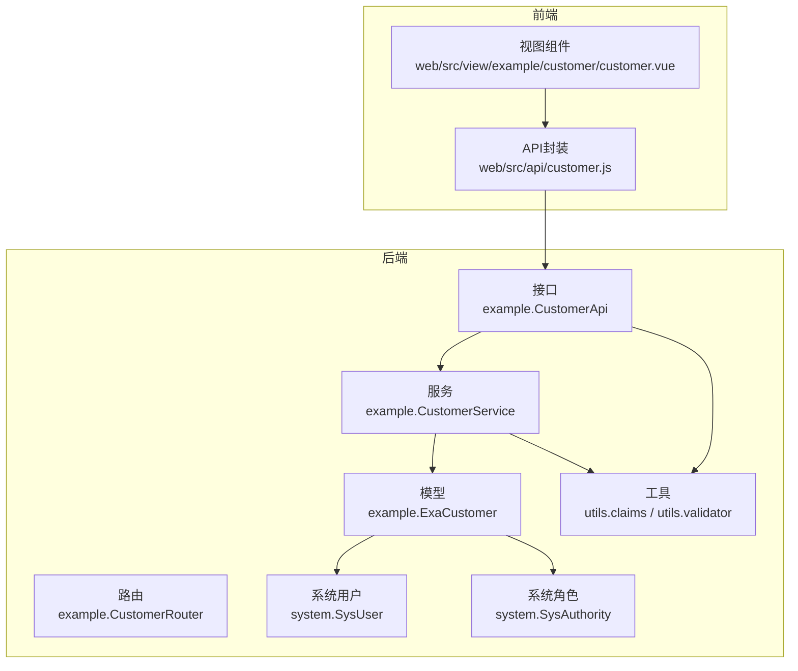
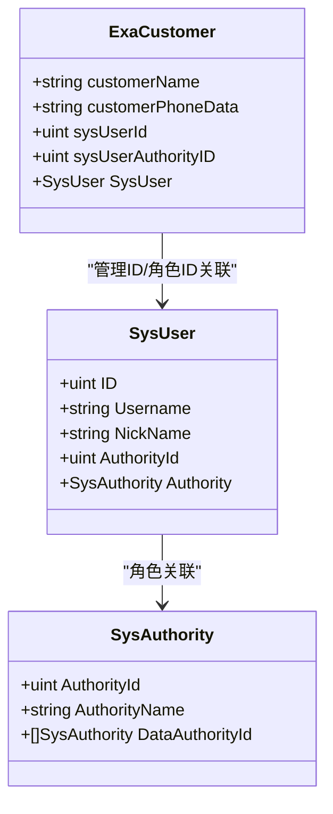
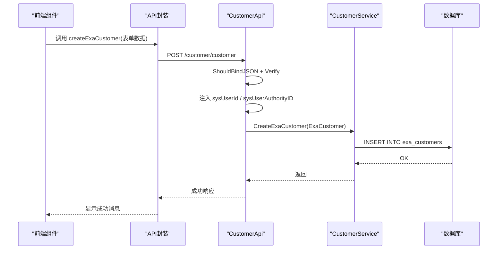
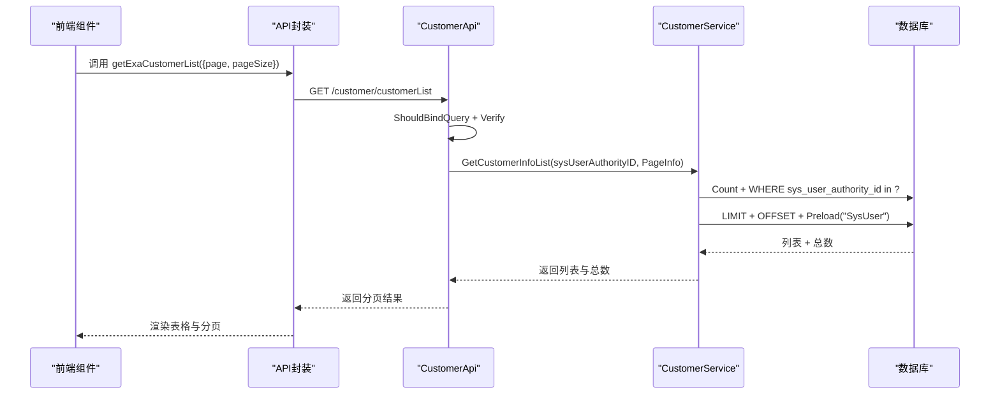
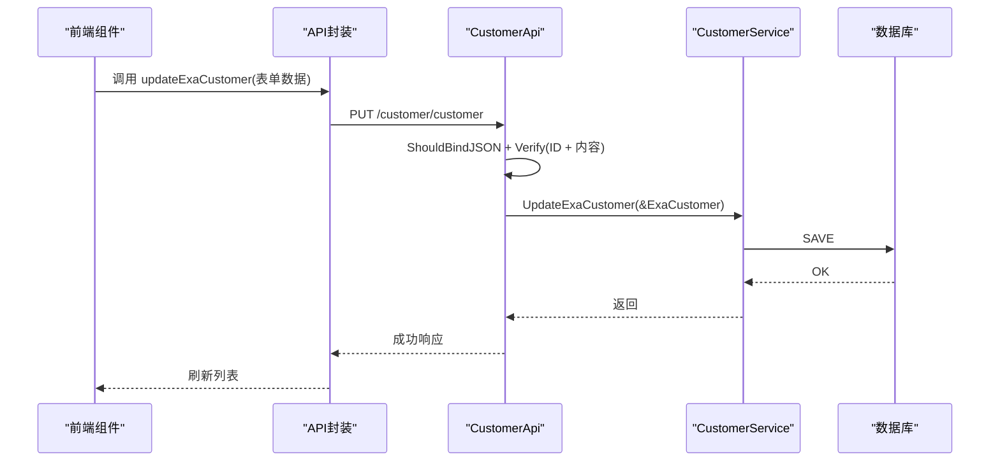
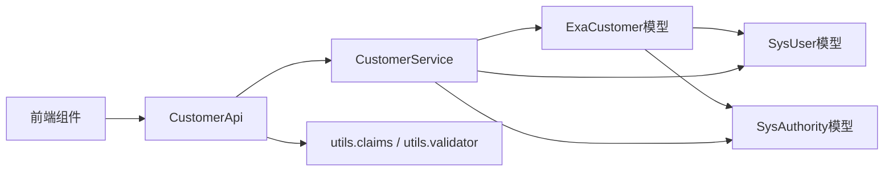

# 测试用例模型

<cite>
**本文引用的文件**
- [exa_customer.go](file://server/model/example/exa_customer.go)
- [exa_customer.go](file://server/api/v1/example/exa_customer.go)
- [exa_customer.go](file://server/service/example/exa_customer.go)
- [exa_customer.go](file://server/router/example/exa_customer.go)
- [customer.js](file://web/src/api/customer.js)
- [customer.vue](file://web/src/view/example/customer/customer.vue)
- [sys_user.go](file://server/model/system/sys_user.go)
- [sys_authority.go](file://server/model/system/sys_authority.go)
- [sys_user_authority.go](file://server/model/system/sys_user_authority.go)
- [claims.go](file://server/utils/claims.go)
- [validator.go](file://server/utils/validator.go)
- [validator.go](file://server/initialize/validator.go)
- [exa_customer.go](file://server/model/example/response/exa_customer.go)
</cite>

## 目录
1. [简介](#简介)
2. [项目结构](#项目结构)
3. [核心组件](#核心组件)
4. [架构总览](#架构总览)
5. [详细组件分析](#详细组件分析)
6. [依赖分析](#依赖分析)
7. [性能考虑](#性能考虑)
8. [故障排查指南](#故障排查指南)
9. [结论](#结论)
10. [附录](#附录)

## 简介
本文件围绕测试用例数据模型ExaCustomer展开，系统性阐述其设计架构、字段含义、与系统用户的关系（管理ID与管理角色ID）、GORM标签与数据库映射、以及完整的测试用例创建、查询、更新的数据流程。同时提供API调用示例与前端数据绑定模式，帮助开发者快速理解与使用该模型。

## 项目结构
ExaCustomer位于示例模块下，配合系统用户与角色模型实现“客户”与“接入人”的关联。前端通过API模块与视图组件完成数据展示与交互。

图表来源
- [exa_customer.go:8-15](file://server/model/example/exa_customer.go#L8-L15)
- [exa_customer.go:21-57](file://server/service/example/exa_customer.go#L21-L57)
- [exa_customer.go:25-46](file://server/api/v1/example/exa_customer.go#L25-L46)
- [exa_customer.go:10-21](file://server/router/example/exa_customer.go#L10-L21)
- [customer.js:10-16](file://web/src/api/customer.js#L10-L16)
- [customer.vue:100-150](file://web/src/view/example/customer/customer.vue#L100-L150)
- [sys_user.go:20-34](file://server/model/system/sys_user.go#L20-L34)
- [sys_authority.go:7-19](file://server/model/system/sys_authority.go#L7-L19)
- [claims.go:95-107](file://server/utils/claims.go#L95-L107)
- [validator.go:118-165](file://server/utils/validator.go#L118-L165)

章节来源
- [exa_customer.go:1-16](file://server/model/example/exa_customer.go#L1-L16)
- [exa_customer.go:1-177](file://server/api/v1/example/exa_customer.go#L1-L177)
- [exa_customer.go:1-88](file://server/service/example/exa_customer.go#L1-L88)
- [exa_customer.go:1-23](file://server/router/example/exa_customer.go#L1-L23)
- [customer.js:1-81](file://web/src/api/customer.js#L1-L81)
- [customer.vue:1-216](file://web/src/view/example/customer/customer.vue#L1-L216)

## 核心组件
- 数据模型：ExaCustomer
  - 关键字段
    - customerName：客户名称
    - customerPhoneData：客户手机号
    - sysUserId：管理ID（接入人ID）
    - sysUserAuthorityID：管理角色ID（接入人角色ID）
    - SysUser：关联的系统用户对象（用于预加载与展示）
  - GORM标签要点
    - comment：为每个字段添加数据库注释，便于维护与文档化
    - SysUser字段：comment标注为“管理详情”，表明该字段用于关联系统用户并进行预加载
  - 数据库映射
    - ExaCustomer对应表为示例模块下的表（具体表名由全局模型与GORM约定生成）
    - sysUserId与sysUserAuthorityID分别指向系统用户与系统角色的主键，形成一对多/多对一关联
- 服务层：CustomerService
  - 提供创建、删除、更新、单条查询、分页列表查询等能力
  - 在分页查询时，结合系统角色的DataAuthorityId进行数据权限过滤，并预加载SysUser以减少N+1查询
- 接口层：CustomerApi
  - 对外暴露REST接口，负责参数绑定、校验、鉴权信息注入、调用服务层并返回结果
  - 创建时自动注入当前登录用户的sysUserId与sysUserAuthorityID
- 前端：API封装与视图组件
  - API封装统一调用/customer/customer与/customer/customerList
  - 视图组件负责表格渲染、分页、抽屉表单、增删改查交互

章节来源
- [exa_customer.go:8-15](file://server/model/example/exa_customer.go#L8-L15)
- [exa_customer.go:21-87](file://server/service/example/exa_customer.go#L21-L87)
- [exa_customer.go:25-176](file://server/api/v1/example/exa_customer.go#L25-L176)
- [customer.js:10-80](file://web/src/api/customer.js#L10-L80)
- [customer.vue:100-213](file://web/src/view/example/customer/customer.vue#L100-L213)

## 架构总览
ExaCustomer围绕“客户”实体构建，通过sysUserId与sysUserAuthorityID与系统用户与角色建立关联，实现“接入人”与“接入人角色”的记录与权限控制。服务层在查询时利用系统角色的数据权限集合进行过滤，确保用户只能看到授权范围内的客户数据。

图表来源
- [exa_customer.go:8-15](file://server/model/example/exa_customer.go#L8-L15)
- [sys_user.go:20-34](file://server/model/system/sys_user.go#L20-L34)
- [sys_authority.go:7-19](file://server/model/system/sys_authority.go#L7-L19)

## 详细组件分析

### 数据模型：ExaCustomer
- 字段设计
  - customerName：客户名称，用于标识客户
  - customerPhoneData：客户手机号，便于联系
  - sysUserId：管理ID，记录接入该客户的系统用户ID
  - sysUserAuthorityID：管理角色ID，记录接入该客户的系统用户角色ID
  - SysUser：关联的系统用户对象，用于展示接入人详情
- GORM标签与注释
  - comment：为每个字段添加数据库注释，提升可读性与可维护性
  - SysUser字段：comment标注为“管理详情”，表示该字段用于关联系统用户并进行预加载
- 数据库映射
  - ExaCustomer与系统用户、系统角色通过外键关联，形成清晰的一对多/多对一关系
  - SysUser字段通过GORM预加载，避免N+1查询问题

章节来源
- [exa_customer.go:8-15](file://server/model/example/exa_customer.go#L8-L15)

### 服务层：CustomerService
- 功能职责
  - CreateExaCustomer：创建客户
  - DeleteExaCustomer：删除客户
  - UpdateExaCustomer：更新客户
  - GetExaCustomer：按ID获取客户
  - GetCustomerInfoList：分页获取客户列表，结合系统角色数据权限过滤，并预加载SysUser
- 权限控制
  - 通过GetAuthorityInfo获取当前用户的角色信息，提取DataAuthorityId集合
  - 查询时使用sys_user_authority_id in ? 过滤客户数据，确保数据隔离
- 性能优化
  - 使用Preload("SysUser")一次性加载关联用户信息
  - 先Count再Limit/Offset分页，避免不必要的全量查询

章节来源
- [exa_customer.go:21-87](file://server/service/example/exa_customer.go#L21-L87)

### 接口层：CustomerApi
- 请求处理流程
  - 参数绑定：JSON绑定或Query绑定
  - 参数校验：使用utils.Verify进行规则校验（如NotEmpty）
  - 鉴权注入：从JWT上下文获取当前用户ID与角色ID，自动填充sysUserId与sysUserAuthorityID
  - 调用服务层执行业务逻辑
  - 返回统一响应格式
- 关键接口
  - 创建客户：POST /customer/customer
  - 更新客户：PUT /customer/customer
  - 删除客户：DELETE /customer/customer
  - 获取单个客户：GET /customer/customer
  - 获取客户列表：GET /customer/customerList

章节来源
- [exa_customer.go:25-176](file://server/api/v1/example/exa_customer.go#L25-L176)
- [claims.go:95-107](file://server/utils/claims.go#L95-L107)
- [validator.go:118-165](file://server/utils/validator.go#L118-L165)

### 前端：API封装与视图组件
- API封装
  - createExaCustomer/updateExaCustomer/deleteExaCustomer/getExaCustomer/getExaCustomerList
  - 统一通过service封装调用后端接口
- 视图组件
  - 表格展示：customerName、customerPhoneData、sysUserId等字段
  - 抽屉表单：支持新增与编辑
  - 分页：page、pageSize、total、pageSize选择
  - 交互：新增、编辑、删除确认与消息提示

章节来源
- [customer.js:10-80](file://web/src/api/customer.js#L10-L80)
- [customer.vue:100-213](file://web/src/view/example/customer/customer.vue#L100-L213)

### 数据流程示例

#### 创建测试用例数据

图表来源
- [exa_customer.go:25-46](file://server/api/v1/example/exa_customer.go#L25-L46)
- [exa_customer.go:21-24](file://server/service/example/exa_customer.go#L21-L24)
- [customer.js:10-16](file://web/src/api/customer.js#L10-L16)
- [customer.vue:190-208](file://web/src/view/example/customer/customer.vue#L190-L208)

#### 查询测试用例数据

图表来源
- [exa_customer.go:152-176](file://server/api/v1/example/exa_customer.go#L152-L176)
- [exa_customer.go:65-87](file://server/service/example/exa_customer.go#L65-L87)
- [customer.js:74-79](file://web/src/api/customer.js#L74-L79)
- [customer.vue:139-150](file://web/src/view/example/customer/customer.vue#L139-L150)

#### 更新测试用例数据

图表来源
- [exa_customer.go:87-111](file://server/api/v1/example/exa_customer.go#L87-L111)
- [exa_customer.go:43-46](file://server/service/example/exa_customer.go#L43-L46)
- [customer.js:26-32](file://web/src/api/customer.js#L26-L32)
- [customer.vue:156-163](file://web/src/view/example/customer/customer.vue#L156-L163)

### 关系与权限机制
- ExaCustomer与SysUser
  - sysUserId作为外键关联SysUser.ID，SysUser通过AuthorityId关联SysAuthority
- 数据权限
  - 服务层根据当前用户角色的DataAuthorityId集合过滤客户数据，确保用户仅能看到授权范围内的客户
- 角色与菜单
  - SysAuthority包含DataAuthorityId多对多关系，用于构建数据权限树

章节来源
- [exa_customer.go:65-87](file://server/service/example/exa_customer.go#L65-L87)
- [sys_user.go:20-34](file://server/model/system/sys_user.go#L20-L34)
- [sys_authority.go:7-19](file://server/model/system/sys_authority.go#L7-L19)
- [sys_user_authority.go:4-11](file://server/model/system/sys_user_authority.go#L4-L11)

## 依赖分析
- 模型层
  - ExaCustomer依赖全局模型与系统用户模型
- 服务层
  - CustomerService依赖全局DB、系统用户角色服务，实现数据权限过滤与预加载
- 接口层
  - CustomerApi依赖utils的鉴权与校验工具，负责参数绑定与响应封装
- 前端
  - API封装与视图组件通过统一接口与后端交互

图表来源
- [exa_customer.go:8-15](file://server/model/example/exa_customer.go#L8-L15)
- [exa_customer.go:65-87](file://server/service/example/exa_customer.go#L65-L87)
- [sys_user.go:20-34](file://server/model/system/sys_user.go#L20-L34)
- [sys_authority.go:7-19](file://server/model/system/sys_authority.go#L7-L19)
- [claims.go:95-107](file://server/utils/claims.go#L95-L107)
- [validator.go:118-165](file://server/utils/validator.go#L118-L165)
- [customer.js:10-80](file://web/src/api/customer.js#L10-L80)
- [customer.vue:100-213](file://web/src/view/example/customer/customer.vue#L100-L213)

## 性能考虑
- 预加载策略
  - 在分页查询时使用Preload("SysUser")，避免N+1查询，提升列表渲染性能
- 权限过滤
  - 通过sys_user_authority_id in ? 进行权限过滤，减少无效数据传输
- 分页计数
  - 先Count再分页查询，避免一次性加载大量数据
- 建议
  - 若SysUser字段使用频率高，可在数据库层面增加索引以加速WHERE过滤
  - 对高频查询字段（如customerName）考虑建立模糊匹配索引或全文检索

## 故障排查指南
- 参数校验失败
  - 现象：接口返回参数校验错误
  - 排查：检查utils.Verify规则（如NotEmpty），确认请求体字段是否为空
- 鉴权注入异常
  - 现象：sysUserId或sysUserAuthorityID未正确注入
  - 排查：确认JWT中间件是否生效，检查utils.claims中的GetUserAuthorityId与GetUserID
- 权限数据为空
  - 现象：查询列表为空或权限不足
  - 排查：确认当前用户角色的DataAuthorityId集合是否为空，检查SysAuthority的DataAuthorityId多对多关系
- 响应结构不一致
  - 现象：前端解析失败
  - 排查：确认接口返回结构与响应封装一致，检查response.ExaCustomerResponse

章节来源
- [validator.go:118-165](file://server/utils/validator.go#L118-L165)
- [validator.go:5-22](file://server/initialize/validator.go#L5-L22)
- [claims.go:95-107](file://server/utils/claims.go#L95-L107)
- [exa_customer.go:65-87](file://server/service/example/exa_customer.go#L65-L87)
- [exa_customer.go:5-7](file://server/model/example/response/exa_customer.go#L5-L7)

## 结论
ExaCustomer模型通过明确的字段设计、GORM标签与数据库映射，以及与系统用户与角色的关联，实现了“客户”实体与其“接入人”的清晰记录。服务层在查询时结合角色数据权限进行过滤，保障了数据安全与隔离。接口层与前端组件协同，提供了完整的增删改查体验。整体架构层次清晰、扩展性强，适合在测试管理平台中进一步拓展与复用。

## 附录

### API调用示例（路径参考）
- 创建客户
  - 方法：POST
  - 路径：/customer/customer
  - 请求体：ExaCustomer（customerName、customerPhoneData）
  - 响应：通用响应封装
  - 参考路径：[exa_customer.go:25-46](file://server/api/v1/example/exa_customer.go#L25-L46)，[customer.js:10-16](file://web/src/api/customer.js#L10-L16)
- 更新客户
  - 方法：PUT
  - 路径：/customer/customer
  - 请求体：ExaCustomer（含ID）
  - 响应：通用响应封装
  - 参考路径：[exa_customer.go:87-111](file://server/api/v1/example/exa_customer.go#L87-L111)，[customer.js:26-32](file://web/src/api/customer.js#L26-L32)
- 删除客户
  - 方法：DELETE
  - 路径：/customer/customer
  - 请求体：ExaCustomer（含ID）
  - 响应：通用响应封装
  - 参考路径：[exa_customer.go:57-76](file://server/api/v1/example/exa_customer.go#L57-L76)，[customer.js:42-48](file://web/src/api/customer.js#L42-L48)
- 获取单个客户
  - 方法：GET
  - 路径：/customer/customer
  - 查询参数：ID
  - 响应：ExaCustomerResponse
  - 参考路径：[exa_customer.go:122-141](file://server/api/v1/example/exa_customer.go#L122-L141)，[customer.js:58-64](file://web/src/api/customer.js#L58-L64)，[exa_customer.go:5-7](file://server/model/example/response/exa_customer.go#L5-L7)
- 获取客户列表
  - 方法：GET
  - 路径：/customer/customerList
  - 查询参数：page、pageSize
  - 响应：分页结果（List、Total、Page、PageSize）
  - 参考路径：[exa_customer.go:152-176](file://server/api/v1/example/exa_customer.go#L152-L176)，[customer.js:74-79](file://web/src/api/customer.js#L74-L79)

### 前端数据绑定模式（路径参考）
- 表单字段绑定
  - customerName、customerPhoneData
  - 参考路径：[customer.vue:117-120](file://web/src/view/example/customer/customer.vue#L117-L120)
- 表格列绑定
  - customerName、customerPhoneData、sysUserId
  - 参考路径：[customer.vue:28-42](file://web/src/view/example/customer/customer.vue#L28-L42)
- 分页与列表渲染
  - page、pageSize、total、tableData
  - 参考路径：[customer.vue:122-150](file://web/src/view/example/customer/customer.vue#L122-L150)
- 抽屉表单提交
  - enterDrawer -> createExaCustomer / updateExaCustomer
  - 参考路径：[customer.vue:190-208](file://web/src/view/example/customer/customer.vue#L190-L208)