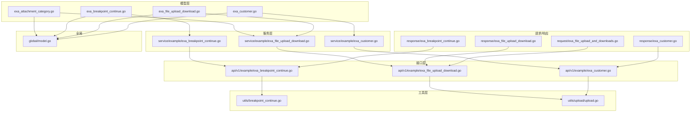
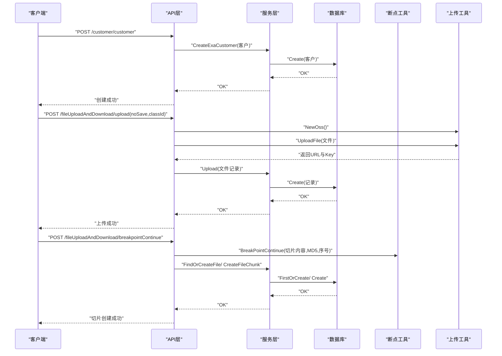
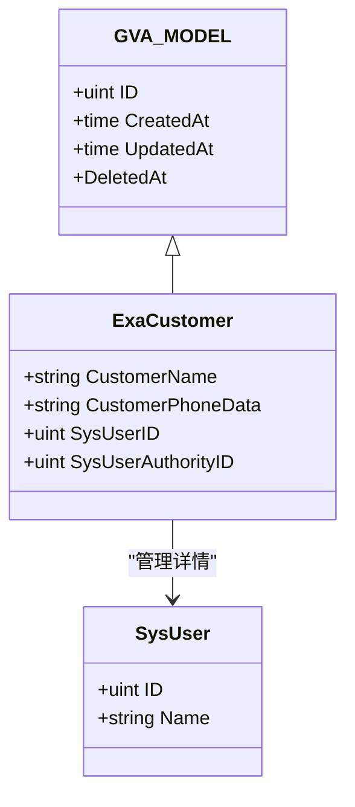
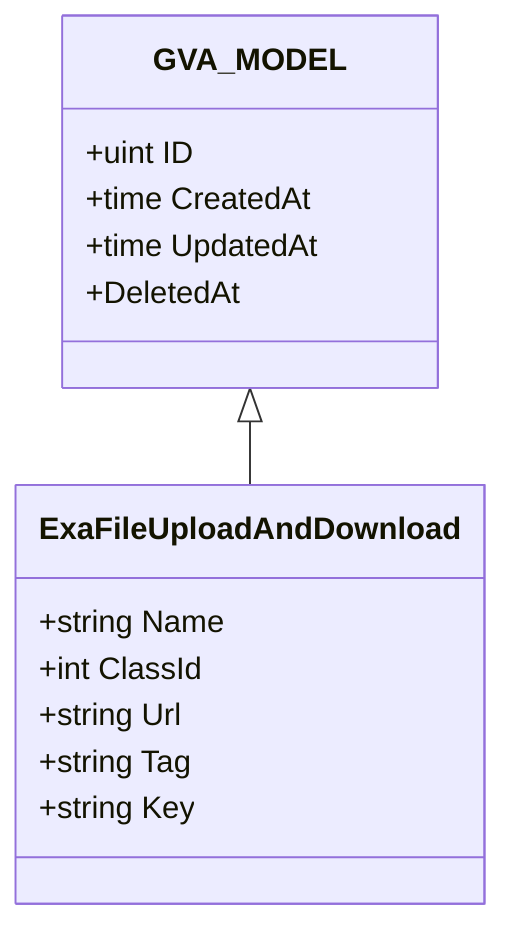
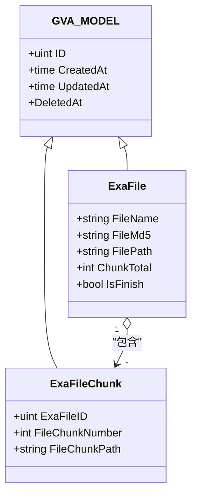
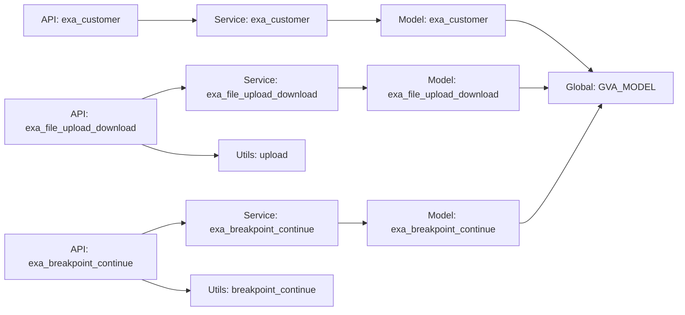
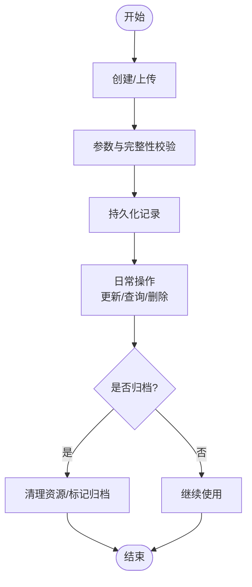

# 测试相关模型

<cite>
**本文引用的文件**
- [exa_customer.go](file://server/model/example/exa_customer.go)
- [exa_file_upload_download.go](file://server/model/example/exa_file_upload_download.go)
- [exa_breakpoint_continue.go](file://server/model/example/exa_breakpoint_continue.go)
- [exa_attachment_category.go](file://server/model/example/exa_attachment_category.go)
- [exa_file_upload_and_downloads.go](file://server/model/example/request/exa_file_upload_and_downloads.go)
- [exa_customer.go（响应）](file://server/model/example/response/exa_customer.go)
- [exa_file_upload_download.go（响应）](file://server/model/example/response/exa_file_upload_download.go)
- [exa_breakpoint_continue.go（响应）](file://server/model/example/response/exa_breakpoint_continue.go)
- [exa_customer.go（服务）](file://server/service/example/exa_customer.go)
- [exa_file_upload_download.go（服务）](file://server/service/example/exa_file_upload_download.go)
- [exa_breakpoint_continue.go（服务）](file://server/service/example/exa_breakpoint_continue.go)
- [exa_customer.go（API）](file://server/api/v1/example/exa_customer.go)
- [exa_file_upload_download.go（API）](file://server/api/v1/example/exa_file_upload_download.go)
- [exa_breakpoint_continue.go（API）](file://server/api/v1/example/exa_breakpoint_continue.go)
- [breakpoint_continue.go（工具）](file://server/utils/breakpoint_continue.go)
- [upload.go（工具）](file://server/utils/upload/upload.go)
- [model.go（全局模型）](file://server/global/model.go)
</cite>

## 目录
1. [引言](#引言)
2. [项目结构](#项目结构)
3. [核心组件](#核心组件)
4. [架构总览](#架构总览)
5. [详细组件分析](#详细组件分析)
6. [依赖分析](#依赖分析)
7. [性能考虑](#性能考虑)
8. [故障排查指南](#故障排查指南)
9. [结论](#结论)
10. [附录](#附录)

## 引言
本文件聚焦于测试管理场景下的三类核心数据模型：测试用例模型（exa_customer）、文件上传下载模型（exa_file_upload_download）、断点续传模型（exa_breakpoint_continue）。文档从数据结构设计、业务规则与完整性约束、模型间关联关系与数据流转过程、生命周期管理策略（创建、更新、归档）等方面进行系统化梳理，并提供可视化图示帮助理解。

## 项目结构
围绕“测试”主题的相关模块主要分布在以下层次：
- 模型层（model/example）：定义实体结构与表映射
- 请求/响应模型（model/example/request、model/example/response）：封装查询条件与返回包装
- 服务层（service/example）：封装业务逻辑与数据库交互
- 接口层（api/v1/example）：暴露REST接口，绑定请求参数与返回格式
- 工具层（utils）：断点续传与对象存储抽象
- 全局模型（global）：统一主键、时间戳与软删除字段

图表来源
- [exa_customer.go:8-15](file://server/model/example/exa_customer.go#L8-L15)
- [exa_file_upload_download.go:7-18](file://server/model/example/exa_file_upload_download.go#L7-L18)
- [exa_breakpoint_continue.go:8-24](file://server/model/example/exa_breakpoint_continue.go#L8-L24)
- [exa_attachment_category.go:7-16](file://server/model/example/exa_attachment_category.go#L7-L16)
- [exa_file_upload_and_downloads.go:7-10](file://server/model/example/request/exa_file_upload_and_downloads.go#L7-L10)
- [exa_customer.go（响应）:5-7](file://server/model/example/response/exa_customer.go#L5-L7)
- [exa_file_upload_download.go（响应）:5-6](file://server/model/example/response/exa_file_upload_download.go#L5-L6)
- [exa_breakpoint_continue.go（响应）:5-11](file://server/model/example/response/exa_breakpoint_continue.go#L5-L11)
- [exa_customer.go（服务）:21-87](file://server/service/example/exa_customer.go#L21-L87)
- [exa_file_upload_download.go（服务）:21-130](file://server/service/example/exa_file_upload_download.go#L21-L130)
- [exa_breakpoint_continue.go（服务）:21-71](file://server/service/example/exa_breakpoint_continue.go#L21-L71)
- [exa_customer.go（API）:25-176](file://server/api/v1/example/exa_customer.go#L25-L176)
- [exa_file_upload_download.go（API）:25-135](file://server/api/v1/example/exa_file_upload_download.go#L25-L135)
- [exa_breakpoint_continue.go（API）:29-156](file://server/api/v1/example/exa_breakpoint_continue.go#L29-L156)
- [breakpoint_continue.go（工具）:26-121](file://server/utils/breakpoint_continue.go#L26-L121)
- [upload.go（工具）:20-46](file://server/utils/upload/upload.go#L20-L46)
- [model.go（全局模型）:9-14](file://server/global/model.go#L9-L14)

章节来源
- [exa_customer.go:1-16](file://server/model/example/exa_customer.go#L1-L16)
- [exa_file_upload_download.go:1-19](file://server/model/example/exa_file_upload_download.go#L1-L19)
- [exa_breakpoint_continue.go:1-25](file://server/model/example/exa_breakpoint_continue.go#L1-L25)
- [exa_attachment_category.go:1-17](file://server/model/example/exa_attachment_category.go#L1-L17)
- [exa_file_upload_and_downloads.go:1-11](file://server/model/example/request/exa_file_upload_and_downloads.go#L1-L11)
- [exa_customer.go（响应）:1-8](file://server/model/example/response/exa_customer.go#L1-L8)
- [exa_file_upload_download.go（响应）:1-8](file://server/model/example/response/exa_file_upload_download.go#L1-L8)
- [exa_breakpoint_continue.go（响应）:1-12](file://server/model/example/response/exa_breakpoint_continue.go#L1-L12)
- [exa_customer.go（服务）:1-88](file://server/service/example/exa_customer.go#L1-L88)
- [exa_file_upload_download.go（服务）:1-131](file://server/service/example/exa_file_upload_download.go#L1-L131)
- [exa_breakpoint_continue.go（服务）:1-72](file://server/service/example/exa_breakpoint_continue.go#L1-L72)
- [exa_customer.go（API）:1-177](file://server/api/v1/example/exa_customer.go#L1-L177)
- [exa_file_upload_download.go（API）:1-136](file://server/api/v1/example/exa_file_upload_download.go#L1-L136)
- [exa_breakpoint_continue.go（API）:1-157](file://server/api/v1/example/exa_breakpoint_continue.go#L1-L157)
- [breakpoint_continue.go（工具）:1-122](file://server/utils/breakpoint_continue.go#L1-L122)
- [upload.go（工具）:1-47](file://server/utils/upload/upload.go#L1-L47)
- [model.go（全局模型）:1-15](file://server/global/model.go#L1-L15)

## 核心组件
本节对三大测试相关模型进行逐项解析，覆盖字段语义、约束与业务规则。

- 测试用例模型（exa_customer）
  - 关键字段：客户名、客户手机号、管理员ID、管理员角色ID、关联管理员详情
  - 关联关系：一对一关联系统用户（SysUser），用于展示管理人信息
  - 业务规则：创建/更新时需通过参数校验；查询支持按角色数据权限过滤
  - 生命周期：支持创建、删除、更新、单条查询、分页列表查询

- 文件上传下载模型（exa_file_upload_download）
  - 关键字段：文件名、分类ID、文件URL、标签、唯一编号（Key）
  - 表映射：自定义表名为“exa_file_upload_and_downloads”
  - 业务规则：上传支持本地/多种云存储；删除时同步调用OSS删除；支持按关键词与分类ID检索
  - 生命周期：创建记录、查询、编辑名称、删除记录（含OSS清理）、分页列表、导入URL

- 断点续传模型（exa_breakpoint_continue）
  - 文件实体（ExaFile）：文件名、MD5、路径、切片集合、总切片数、是否完成
  - 切片实体（ExaFileChunk）：所属文件ID、切片序号、切片路径
  - 业务规则：根据MD5与文件名定位/创建文件记录；按切片序号写入临时目录；合并完成后清理切片并标记完成
  - 生命周期：查找或创建文件、创建切片记录、合并文件、删除切片缓存

章节来源
- [exa_customer.go:8-15](file://server/model/example/exa_customer.go#L8-L15)
- [exa_file_upload_download.go:7-18](file://server/model/example/exa_file_upload_download.go#L7-L18)
- [exa_breakpoint_continue.go:8-24](file://server/model/example/exa_breakpoint_continue.go#L8-L24)
- [exa_file_upload_download.go（服务）:21-130](file://server/service/example/exa_file_upload_download.go#L21-L130)
- [exa_breakpoint_continue.go（服务）:21-71](file://server/service/example/exa_breakpoint_continue.go#L21-L71)

## 架构总览
下图展示测试相关模型在接口层、服务层与工具层之间的交互关系与数据流。

图表来源
- [exa_customer.go（API）:25-46](file://server/api/v1/example/exa_customer.go#L25-L46)
- [exa_file_upload_download.go（API）:25-42](file://server/api/v1/example/exa_file_upload_download.go#L25-L42)
- [exa_breakpoint_continue.go（API）:29-78](file://server/api/v1/example/exa_breakpoint_continue.go#L29-L78)
- [exa_customer.go（服务）:21-24](file://server/service/example/exa_customer.go#L21-L24)
- [exa_file_upload_download.go（服务）:21-23](file://server/service/example/exa_file_upload_download.go#L21-L23)
- [exa_breakpoint_continue.go（服务）:21-50](file://server/service/example/exa_breakpoint_continue.go#L21-L50)
- [upload.go（工具）:20-46](file://server/utils/upload/upload.go#L20-L46)
- [breakpoint_continue.go（工具）:26-76](file://server/utils/breakpoint_continue.go#L26-L76)

## 详细组件分析

### 测试用例模型（exa_customer）
- 数据结构与字段
  - 继承全局模型（ID、创建/更新时间、软删除）
  - 客户名、客户手机号、管理员ID、管理员角色ID
  - 关联管理员详情（SysUser），用于展示管理人信息
- 业务流程
  - 创建：绑定JSON参数，执行参数校验，注入当前用户与角色ID，持久化
  - 删除：参数校验（ID），删除记录
  - 更新：参数校验（ID与业务字段），保存
  - 查询：按ID查询单条，支持预加载管理员详情
  - 列表：按角色数据权限过滤，分页查询
- 关键约束
  - 参数校验：ID与业务字段校验
  - 角色数据权限：仅能访问授权范围内的客户列表
- 复杂度与性能
  - 单条查询与分页查询均为O(n)扫描，建议在角色ID与客户名上建立索引

图表来源
- [exa_customer.go:8-15](file://server/model/example/exa_customer.go#L8-L15)
- [model.go（全局模型）:9-14](file://server/global/model.go#L9-L14)

章节来源
- [exa_customer.go:8-15](file://server/model/example/exa_customer.go#L8-L15)
- [exa_customer.go（API）:25-176](file://server/api/v1/example/exa_customer.go#L25-L176)
- [exa_customer.go（服务）:21-87](file://server/service/example/exa_customer.go#L21-L87)
- [exa_customer.go（响应）:5-7](file://server/model/example/response/exa_customer.go#L5-L7)

### 文件上传下载模型（exa_file_upload_download）
- 数据结构与字段
  - 继承全局模型
  - 名称、分类ID、URL、标签、Key（唯一编号）
  - 自定义表名“exa_file_upload_and_downloads”
- 业务流程
  - 上传：选择OSS类型，上传文件至云端，生成URL与Key，可选保存记录
  - 查询：按关键词模糊匹配与分类ID精确匹配，分页排序
  - 编辑：仅更新名称字段
  - 删除：先从OSS删除文件，再物理删除记录（支持软删除）
  - 导入：批量导入URL记录
- 关键约束
  - Key唯一性：上传时可检测重复Key并避免重复记录
  - OSS类型：通过配置动态切换本地/七牛/腾讯/COS/阿里云/华为/MinIO等
- 复杂度与性能
  - 模糊搜索与分类过滤为O(n)扫描，建议在name与class_id建立索引

图表来源
- [exa_file_upload_download.go:7-18](file://server/model/example/exa_file_upload_download.go#L7-L18)
- [model.go（全局模型）:9-14](file://server/global/model.go#L9-L14)

章节来源
- [exa_file_upload_download.go:7-18](file://server/model/example/exa_file_upload_download.go#L7-L18)
- [exa_file_upload_download.go（API）:25-135](file://server/api/v1/example/exa_file_upload_download.go#L25-L135)
- [exa_file_upload_download.go（服务）:21-130](file://server/service/example/exa_file_upload_download.go#L21-L130)
- [exa_file_upload_and_downloads.go:7-10](file://server/model/example/request/exa_file_upload_and_downloads.go#L7-L10)
- [exa_file_upload_download.go（响应）:5-6](file://server/model/example/response/exa_file_upload_download.go#L5-L6)
- [upload.go（工具）:20-46](file://server/utils/upload/upload.go#L20-L46)

### 断点续传模型（exa_breakpoint_continue）
- 数据结构与字段
  - 文件实体（ExaFile）：文件名、MD5、路径、切片集合、总切片数、是否完成
  - 切片实体（ExaFileChunk）：所属文件ID、切片序号、切片路径
- 业务流程
  - 初始化：根据MD5与文件名查找已完成文件或创建未完成文件
  - 上传切片：校验切片MD5，写入临时目录，创建切片记录
  - 合并文件：读取所有切片，顺序拼接生成最终文件
  - 清理：删除临时切片目录，更新文件完成状态与路径
- 关键约束
  - 切片完整性：前端传递chunkMd5，后端计算MD5比对
  - 路径安全：严格校验文件名与路径，防止路径穿越
  - 并发控制：同一MD5的文件在同一会话内串行处理
- 复杂度与性能
  - 合并阶段为O(n)读写，n为切片数量；建议限制单文件最大切片数与总大小

图表来源
- [exa_breakpoint_continue.go:8-24](file://server/model/example/exa_breakpoint_continue.go#L8-L24)
- [model.go（全局模型）:9-14](file://server/global/model.go#L9-L14)

章节来源
- [exa_breakpoint_continue.go:8-24](file://server/model/example/exa_breakpoint_continue.go#L8-L24)
- [exa_breakpoint_continue.go（API）:29-156](file://server/api/v1/example/exa_breakpoint_continue.go#L29-L156)
- [exa_breakpoint_continue.go（服务）:21-71](file://server/service/example/exa_breakpoint_continue.go#L21-L71)
- [exa_breakpoint_continue.go（响应）:5-11](file://server/model/example/response/exa_breakpoint_continue.go#L5-L11)
- [breakpoint_continue.go（工具）:26-121](file://server/utils/breakpoint_continue.go#L26-L121)

### 文件分类模型（exa_attachment_category）
- 数据结构与字段
  - 继承全局模型
  - 名称、父节点ID、子节点集合（内存树形结构）
  - 自定义表名“exa_attachment_category”
- 业务规则
  - 支持树形分类，用于文件分类检索
  - 与文件上传模型（ClassId）配合使用

章节来源
- [exa_attachment_category.go:7-16](file://server/model/example/exa_attachment_category.go#L7-L16)

## 依赖分析
- 组件耦合
  - API层依赖服务层；服务层依赖模型层与工具层；模型层依赖全局模型
  - 断点续传与文件上传分别依赖各自工具函数与OSS接口
- 外部依赖
  - OSS接口抽象，支持本地与多家云存储
  - GORM数据库ORM框架
- 循环依赖
  - 当前结构未见循环依赖，职责清晰

图表来源
- [exa_customer.go（API）:25-46](file://server/api/v1/example/exa_customer.go#L25-L46)
- [exa_file_upload_download.go（API）:25-42](file://server/api/v1/example/exa_file_upload_download.go#L25-L42)
- [exa_breakpoint_continue.go（API）:29-78](file://server/api/v1/example/exa_breakpoint_continue.go#L29-L78)
- [exa_customer.go（服务）:21-24](file://server/service/example/exa_customer.go#L21-L24)
- [exa_file_upload_download.go（服务）:21-23](file://server/service/example/exa_file_upload_download.go#L21-L23)
- [exa_breakpoint_continue.go（服务）:21-49](file://server/service/example/exa_breakpoint_continue.go#L21-L49)
- [exa_customer.go:8-15](file://server/model/example/exa_customer.go#L8-L15)
- [exa_file_upload_download.go:7-18](file://server/model/example/exa_file_upload_download.go#L7-L18)
- [exa_breakpoint_continue.go:8-24](file://server/model/example/exa_breakpoint_continue.go#L8-L24)
- [model.go（全局模型）:9-14](file://server/global/model.go#L9-L14)
- [upload.go（工具）:20-46](file://server/utils/upload/upload.go#L20-L46)
- [breakpoint_continue.go（工具）:26-76](file://server/utils/breakpoint_continue.go#L26-L76)

章节来源
- [exa_customer.go（API）:25-176](file://server/api/v1/example/exa_customer.go#L25-L176)
- [exa_file_upload_download.go（API）:25-135](file://server/api/v1/example/exa_file_upload_download.go#L25-L135)
- [exa_breakpoint_continue.go（API）:29-156](file://server/api/v1/example/exa_breakpoint_continue.go#L29-L156)
- [exa_customer.go（服务）:21-87](file://server/service/example/exa_customer.go#L21-L87)
- [exa_file_upload_download.go（服务）:21-130](file://server/service/example/exa_file_upload_download.go#L21-L130)
- [exa_breakpoint_continue.go（服务）:21-71](file://server/service/example/exa_breakpoint_continue.go#L21-L71)
- [upload.go（工具）:20-46](file://server/utils/upload/upload.go#L20-L46)
- [breakpoint_continue.go（工具）:26-121](file://server/utils/breakpoint_continue.go#L26-L121)

## 性能考虑
- 索引优化
  - 在文件模型的name与class_id字段建立索引，提升模糊搜索与分类过滤性能
  - 在客户模型的sys_user_authority_id字段建立索引，提升权限过滤查询性能
- IO与并发
  - 断点续传采用本地临时目录存储切片，合并时顺序读写，建议限制单文件最大切片数与总大小
  - OSS上传采用接口抽象，可根据业务量选择合适的云存储供应商
- 分页与预加载
  - 客户列表查询使用预加载管理员详情，注意避免N+1问题；建议在SysUserID上建立索引

## 故障排查指南
- 上传失败
  - 检查OSS类型配置与凭证；确认文件大小与类型限制；查看服务日志
  - 参考：[exa_file_upload_download.go（API）:35-41](file://server/api/v1/example/exa_file_upload_download.go#L35-L41)、[upload.go（工具）:20-46](file://server/utils/upload/upload.go#L20-L46)
- 断点续传异常
  - 校验前端传递的chunkMd5与后端计算结果是否一致；确认临时目录权限与磁盘空间
  - 参考：[exa_breakpoint_continue.go（API）:54-58](file://server/api/v1/example/exa_breakpoint_continue.go#L54-L58)、[breakpoint_continue.go（工具）:45-52](file://server/utils/breakpoint_continue.go#L45-L52)
- 删除文件失败
  - 确认OSS删除返回错误；检查软删除与Unscoped使用是否正确
  - 参考：[exa_file_upload_download.go（服务）:43-54](file://server/service/example/exa_file_upload_download.go#L43-L54)
- 权限过滤异常
  - 检查角色数据权限配置；确认GetAuthorityInfo返回值
  - 参考：[exa_customer.go（服务）:65-86](file://server/service/example/exa_customer.go#L65-L86)

章节来源
- [exa_file_upload_download.go（API）:35-41](file://server/api/v1/example/exa_file_upload_download.go#L35-L41)
- [exa_breakpoint_continue.go（API）:54-58](file://server/api/v1/example/exa_breakpoint_continue.go#L54-L58)
- [exa_file_upload_download.go（服务）:43-54](file://server/service/example/exa_file_upload_download.go#L43-L54)
- [exa_customer.go（服务）:65-86](file://server/service/example/exa_customer.go#L65-L86)
- [upload.go（工具）:20-46](file://server/utils/upload/upload.go#L20-L46)
- [breakpoint_continue.go（工具）:45-52](file://server/utils/breakpoint_continue.go#L45-L52)

## 结论
测试相关数据模型围绕“测试用例、文件管理、断点续传”三大场景构建，具备清晰的分层职责与可扩展的工具层抽象。通过参数校验、权限过滤、OSS接口与本地断点工具的组合，实现了从创建、更新到归档的全生命周期管理。建议在生产环境中进一步完善索引、并发控制与监控告警，确保高可用与高性能。

## 附录
- 数据模型生命周期流程（概念示意）

