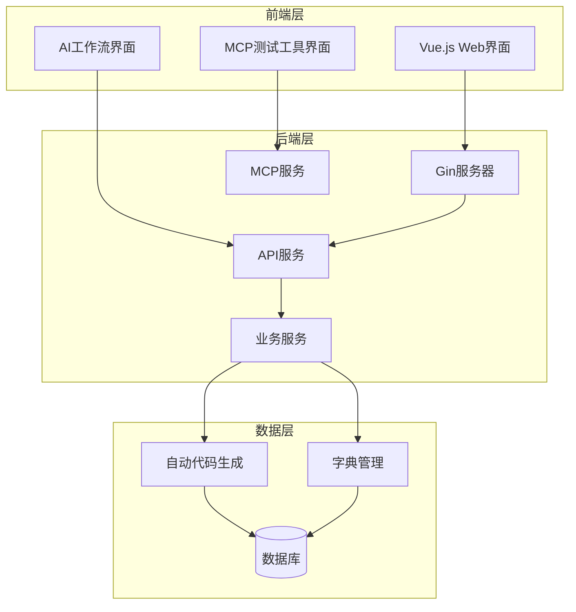
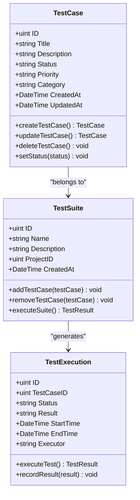
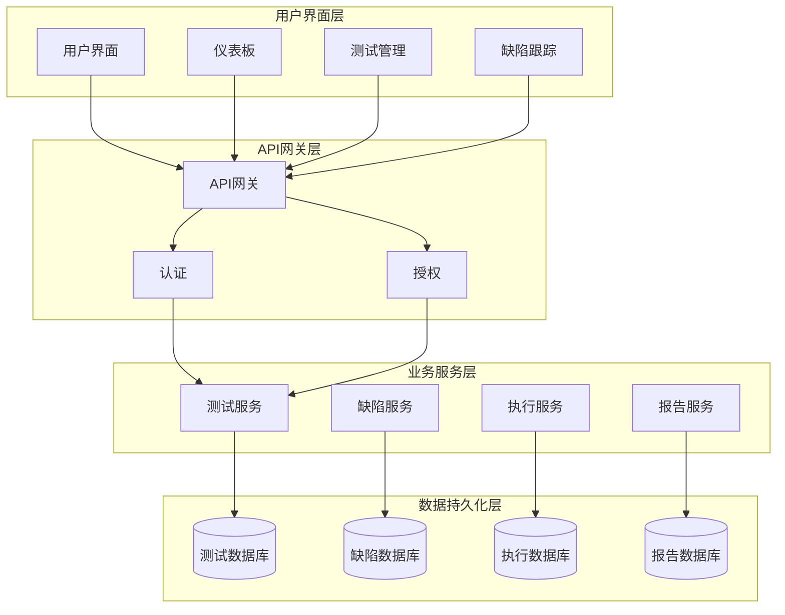
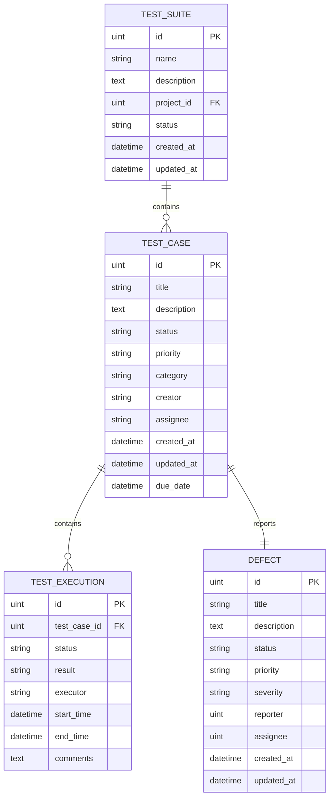
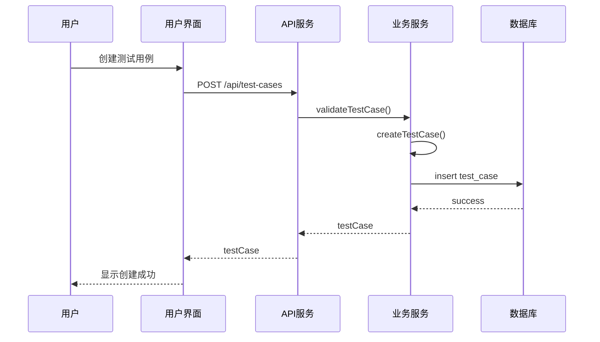
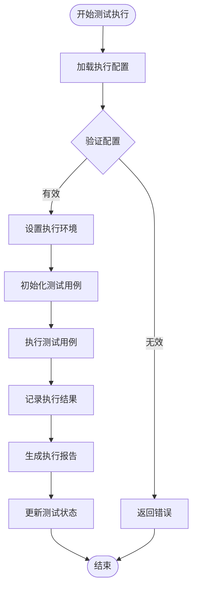
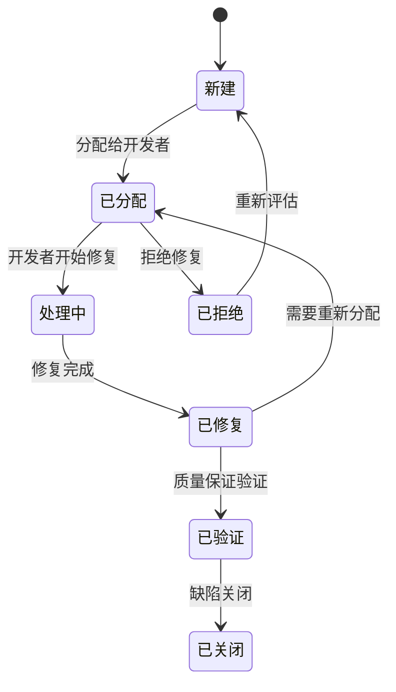
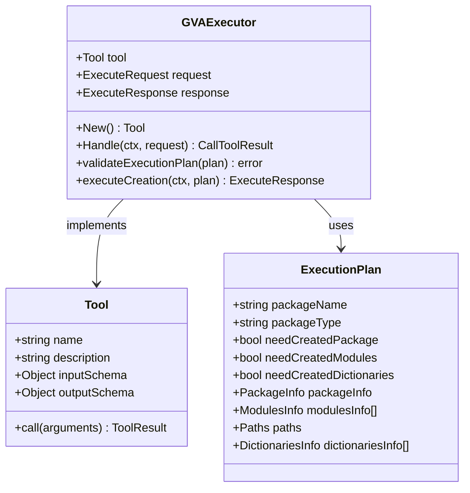
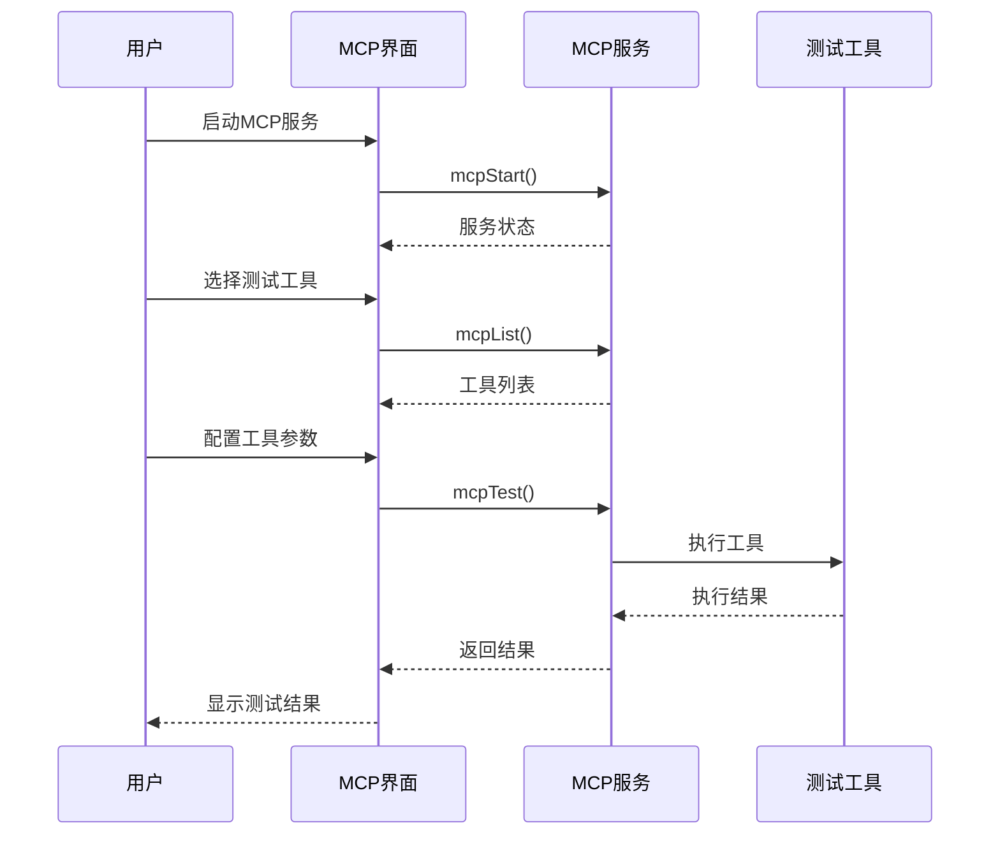
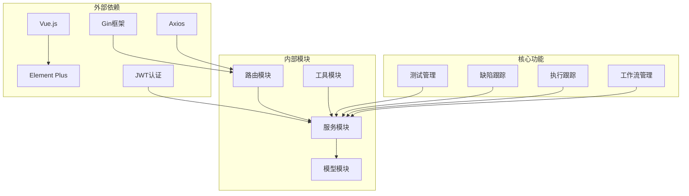

# 测试管理功能

<cite>
**本文档引用的文件**
- [main.go](file://server/main.go)
- [gva_execute.go](file://server/mcp/gva_execute.go)
- [mcpTest.vue](file://web/src/view/systemTools/autoCode/mcpTest.vue)
- [sys_user.go](file://server/model/system/sys_user.go)
- [sys_auto_code_package.go](file://server/model/system/sys_auto_code_package.go)
- [auto_code_package.go](file://server/service/system/auto_code_package.go)
- [enter.go](file://server/router/enter.go)
- [index.vue](file://web/src/view/systemTools/aiWrokflow/index.vue)
- [ai_workflow_markdown.go](file://server/service/system/ai_workflow_markdown.go)
</cite>

## 目录
1. [简介](#简介)
2. [项目结构](#项目结构)
3. [核心组件](#核心组件)
4. [架构概览](#架构概览)
5. [详细组件分析](#详细组件分析)
6. [依赖分析](#依赖分析)
7. [性能考虑](#性能考虑)
8. [故障排除指南](#故障排除指南)
9. [结论](#结论)

## 简介

测试管理功能是基于 Gin-Vue-Admin 开发平台构建的测试管理系统，专注于提供完整的测试生命周期管理能力。该系统集成了测试用例管理、测试执行跟踪、缺陷跟踪系统等核心功能模块，支持手动和自动化测试的统一管理。

系统采用前后端分离架构，后端基于 Go 语言的 Gin 框架，前端使用 Vue.js 技术栈，通过 MCP（Model Context Protocol）协议实现智能测试工具的集成和管理。该平台特别强调测试数据模型设计、业务逻辑实现和用户界面交互的完整性。

## 项目结构

测试管理系统的整体架构遵循分层设计原则，采用模块化的组织方式：

**图表来源**
- [main.go:30-35](file://server/main.go#L30-L35)
- [enter.go:8-13](file://server/router/enter.go#L8-L13)

系统采用模块化设计，主要分为以下几个核心层次：

- **表现层**: Vue.js 前端应用，提供用户交互界面
- **控制层**: Gin 框架路由和控制器
- **服务层**: 业务逻辑处理和数据访问
- **数据层**: 数据库持久化和字典管理

**章节来源**
- [main.go:30-35](file://server/main.go#L30-L35)
- [enter.go:8-13](file://server/router/enter.go#L8-L13)

## 核心组件

测试管理系统包含以下核心组件：

### 1. 测试用例管理组件

测试用例管理组件负责测试用例的创建、编辑、分类和状态管理。系统支持多种测试类型，包括功能测试、性能测试、安全测试等。

**图表来源**
- [gva_execute.go:24-52](file://server/mcp/gva_execute.go#L24-L52)

### 2. 测试执行跟踪组件

测试执行跟踪组件提供实时的测试执行监控和结果记录功能。支持手动测试和自动化测试的统一管理。

### 3. 缺陷跟踪系统

缺陷跟踪系统负责缺陷的创建、分配、跟踪和状态管理。系统支持缺陷生命周期的完整跟踪。

**章节来源**
- [gva_execute.go:24-52](file://server/mcp/gva_execute.go#L24-L52)

## 架构概览

测试管理系统的整体架构采用微服务设计理念，通过清晰的职责分离实现高内聚低耦合：

**图表来源**
- [main.go:30-35](file://server/main.go#L30-L35)

系统架构具有以下特点：

1. **分层清晰**: 每一层都有明确的职责和边界
2. **可扩展性**: 支持水平扩展和垂直扩展
3. **高可用性**: 通过负载均衡和故障转移保证系统稳定性
4. **安全性**: 多层安全防护机制

## 详细组件分析

### 测试用例管理组件

测试用例管理组件是系统的核心功能模块，提供完整的测试用例生命周期管理。

#### 数据模型设计

**图表来源**
- [sys_auto_code_package.go:7-14](file://server/model/system/sys_auto_code_package.go#L7-L14)
- [sys_user.go:20-34](file://server/model/system/sys_user.go#L20-L34)

#### 测试用例创建流程

**图表来源**
- [auto_code_package.go:30-105](file://server/service/system/auto_code_package.go#L30-L105)

#### 测试用例状态管理

系统支持以下测试用例状态：
- 新建 (New)
- 准备 (Ready)
- 执行中 (Running)
- 已完成 (Completed)
- 已暂停 (Paused)
- 已取消 (Cancelled)

**章节来源**
- [auto_code_package.go:30-105](file://server/service/system/auto_code_package.go#L30-L105)

### 测试执行跟踪组件

测试执行跟踪组件提供实时的测试执行监控和结果记录功能。

#### 执行流程管理

**图表来源**
- [gva_execute.go:217-289](file://server/mcp/gva_execute.go#L217-L289)

#### 自动化测试支持

系统支持多种自动化测试框架的集成：

1. **单元测试**: 支持 Go 单元测试框架
2. **集成测试**: 支持数据库集成测试
3. **API 测试**: 支持 RESTful API 自动化测试
4. **UI 测试**: 支持前端界面自动化测试

**章节来源**
- [gva_execute.go:217-289](file://server/mcp/gva_execute.go#L217-L289)

### 缺陷跟踪系统

缺陷跟踪系统负责缺陷的创建、分配、跟踪和状态管理。

#### 缺陷生命周期

**图表来源**
- [sys_user.go:20-34](file://server/model/system/sys_user.go#L20-L34)

#### 缺陷优先级管理

系统支持以下缺陷优先级：
- 紧急 (Critical)
- 高 (High)
- 中 (Medium)
- 低 (Low)

**章节来源**
- [sys_user.go:20-34](file://server/model/system/sys_user.go#L20-L34)

### MCP 测试工具集成

MCP（Model Context Protocol）测试工具集成为系统提供了强大的智能化测试能力。

#### MCP 工具架构

**图表来源**
- [gva_execute.go:21-22](file://server/mcp/gva_execute.go#L21-L22)

#### 前端 MCP 测试界面

前端 MCP 测试界面提供了直观的工具测试和配置功能：

**图表来源**
- [mcpTest.vue:475-510](file://web/src/view/systemTools/autoCode/mcpTest.vue#L475-L510)

**章节来源**
- [mcpTest.vue:475-510](file://web/src/view/systemTools/autoCode/mcpTest.vue#L475-L510)

## 依赖分析

测试管理系统的依赖关系体现了清晰的分层架构设计：

**图表来源**
- [main.go:3-9](file://server/main.go#L3-L9)

系统的主要依赖包括：

1. **框架依赖**: Gin、Vue.js、Element Plus
2. **数据库依赖**: GORM ORM、多种数据库驱动
3. **工具依赖**: JWT 认证、Zap 日志、Swagger 文档
4. **第三方服务**: Redis 缓存、邮件服务、对象存储

**章节来源**
- [main.go:3-9](file://server/main.go#L3-L9)

## 性能考虑

测试管理系统在设计时充分考虑了性能优化和可扩展性：

### 数据库优化策略

1. **索引优化**: 为常用查询字段建立适当索引
2. **查询优化**: 使用预加载和联表查询减少 N+1 查询
3. **缓存策略**: 使用 Redis 缓存热点数据
4. **分页查询**: 大数据量场景使用分页查询

### API 性能优化

1. **并发控制**: 使用 goroutine 和 channel 实现并发处理
2. **连接池**: 数据库连接池和 HTTP 客户端连接池
3. **压缩传输**: 启用 Gzip 压缩减少传输数据量
4. **限流策略**: 实现 API 限流防止系统过载

### 前端性能优化

1. **组件懒加载**: Vue 组件按需加载
2. **虚拟滚动**: 大列表使用虚拟滚动技术
3. **图片优化**: 图片懒加载和压缩
4. **缓存策略**: 本地缓存和浏览器缓存

## 故障排除指南

### 常见问题及解决方案

#### 1. MCP 服务启动失败

**问题症状**:
- MCP 服务无法启动
- 工具列表加载失败
- 参数测试功能不可用

**解决步骤**:
1. 检查 MCP 服务配置
2. 验证网络连接
3. 查看服务日志
4. 重启 MCP 服务

**章节来源**
- [mcpTest.vue:475-510](file://web/src/view/systemTools/autoCode/mcpTest.vue#L475-L510)

#### 2. 测试用例执行异常

**问题症状**:
- 测试用例执行失败
- 执行结果记录异常
- 状态更新不及时

**解决步骤**:
1. 检查测试环境配置
2. 验证数据库连接
3. 查看执行日志
4. 重新执行测试用例

#### 3. 缺陷状态更新问题

**问题症状**:
- 缺陷状态无法更新
- 分配功能异常
- 通知功能失效

**解决步骤**:
1. 检查用户权限
2. 验证缺陷状态流程
3. 查看系统日志
4. 联系系统管理员

### 调试工具和方法

1. **日志分析**: 使用 Zap 日志系统查看详细错误信息
2. **API 测试**: 使用 Postman 或 curl 测试 API 接口
3. **数据库检查**: 直接查询数据库验证数据一致性
4. **浏览器调试**: 使用浏览器开发者工具调试前端问题

## 结论

测试管理功能模块为测试团队提供了完整的测试生命周期管理解决方案。系统通过模块化设计实现了高内聚低耦合的架构，支持手动和自动化测试的统一管理。

### 主要优势

1. **功能完整性**: 覆盖测试管理的所有核心功能
2. **技术先进性**: 采用最新的技术栈和最佳实践
3. **用户体验**: 提供直观易用的用户界面
4. **可扩展性**: 支持功能扩展和性能优化
5. **安全性**: 多层安全防护机制

### 发展方向

1. **AI 集成**: 进一步集成 AI 能力提升测试智能化水平
2. **云原生**: 支持容器化部署和微服务架构
3. **性能优化**: 持续优化系统性能和用户体验
4. **生态建设**: 构建完善的测试工具生态系统

该测试管理系统为现代软件开发团队提供了强有力的测试支撑，有助于提高软件质量和开发效率。