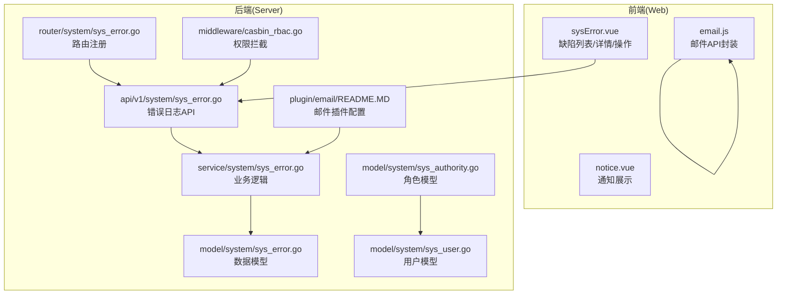
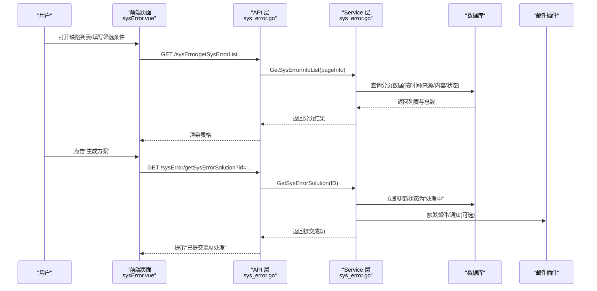
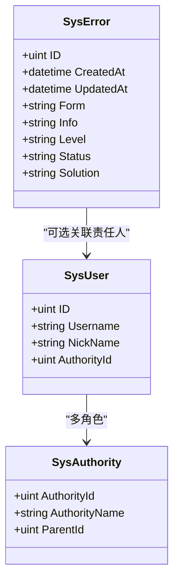
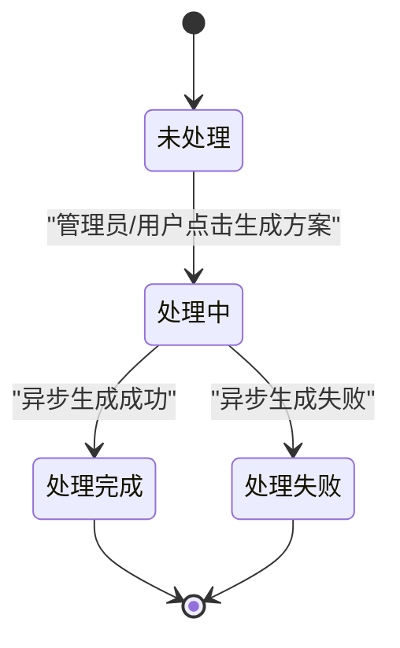
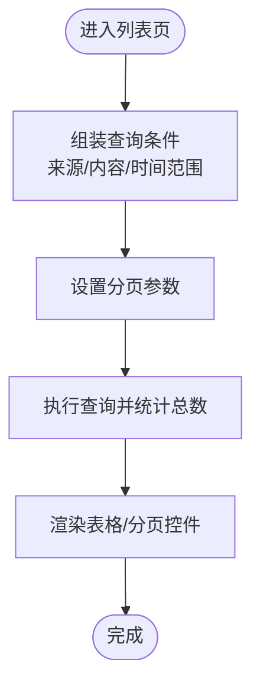
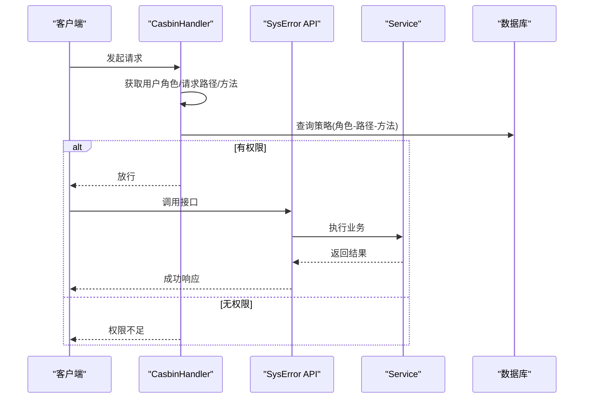
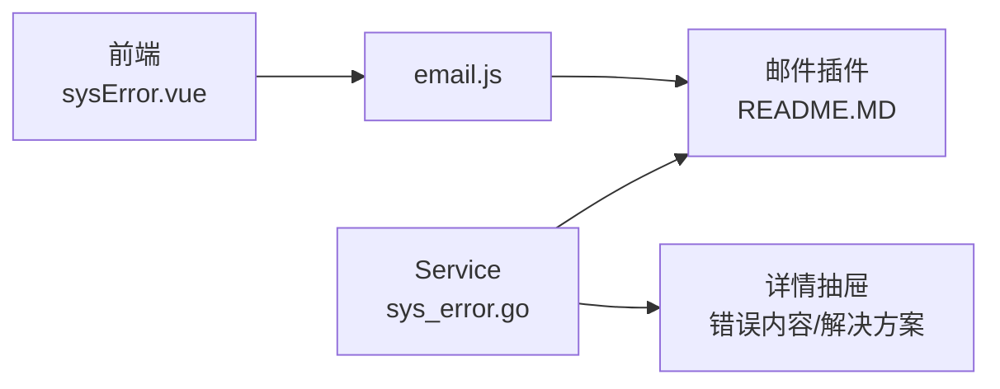
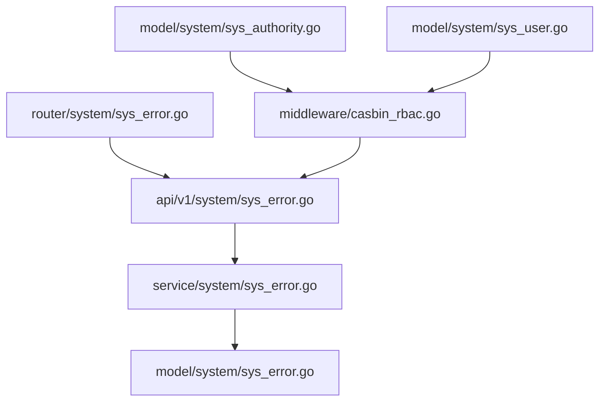

# 缺陷跟踪系统

<cite>
**本文引用的文件**
- [server/model/system/sys_error.go](file://server/model/system/sys_error.go)
- [server/api/v1/system/sys_error.go](file://server/api/v1/system/sys_error.go)
- [server/service/system/sys_error.go](file://server/service/system/sys_error.go)
- [server/router/system/sys_error.go](file://server/router/system/sys_error.go)
- [web/src/view/systemTools/sysError/sysError.vue](file://web/src/view/systemTools/sysError/sysError.vue)
- [server/model/system/sys_api.go](file://server/model/system/sys_api.go)
- [server/model/system/sys_user.go](file://server/model/system/sys_user.go)
- [server/model/system/sys_authority.go](file://server/model/system/sys_authority.go)
- [server/middleware/casbin_rbac.go](file://server/middleware/casbin_rbac.go)
- [server/router/system/sys_casbin.go](file://server/router/system/sys_casbin.go)
- [server/api/v1/system/sys_casbin.go](file://server/api/v1/system/sys_casbin.go)
- [server/plugin/email/README.MD](file://server/plugin/email/README.MD)
- [web/src/plugin/email/api/email.js](file://web/src/plugin/email/api/email.js)
- [web/src/view/dashboard/components/notice.vue](file://web/src/view/dashboard/components/notice.vue)
</cite>

## 目录
1. [简介](#简介)
2. [项目结构](#项目结构)
3. [核心组件](#核心组件)
4. [架构总览](#架构总览)
5. [详细组件分析](#详细组件分析)
6. [依赖关系分析](#依赖关系分析)
7. [性能考虑](#性能考虑)
8. [故障排查指南](#故障排查指南)
9. [结论](#结论)
10. [附录](#附录)

## 简介
本文件面向“缺陷跟踪系统”的完整实现，基于仓库中的错误日志子系统进行扩展与规范，覆盖缺陷的创建、分配、修复与关闭全生命周期；明确缺陷数据模型的关键字段（如级别、优先级、状态、责任人等）；阐述缺陷与测试用例、测试执行的关联关系；提供搜索、过滤与统计分析能力；说明状态转换规则与权限控制机制；并给出缺陷报告生成、通知提醒与历史追踪的技术实现要点。同时，提供API接口文档与前端页面交互说明，帮助开发者快速集成与维护。

## 项目结构
缺陷跟踪系统在现有代码库中以“错误日志”子系统为基础，围绕 SysError 数据模型构建缺陷管理能力。后端采用 Gin 路由 + Service 层 + Model 持久化；前端通过 Vue 页面与 API 交互，提供表格、筛选、详情抽屉等视图能力。

图表来源
- [server/router/system/sys_error.go:1-29](file://server/router/system/sys_error.go#L1-L29)
- [server/api/v1/system/sys_error.go:1-200](file://server/api/v1/system/sys_error.go#L1-L200)
- [server/service/system/sys_error.go:1-127](file://server/service/system/sys_error.go#L1-L127)
- [server/model/system/sys_error.go:1-22](file://server/model/system/sys_error.go#L1-L22)
- [server/middleware/casbin_rbac.go:1-33](file://server/middleware/casbin_rbac.go#L1-L33)
- [server/model/system/sys_authority.go:1-24](file://server/model/system/sys_authority.go#L1-L24)
- [server/model/system/sys_user.go:1-63](file://server/model/system/sys_user.go#L1-L63)
- [server/plugin/email/README.MD:33-56](file://server/plugin/email/README.MD#L33-L56)
- [web/src/view/systemTools/sysError/sysError.vue:131-457](file://web/src/view/systemTools/sysError/sysError.vue#L131-L457)
- [web/src/plugin/email/api/email.js:1-29](file://web/src/plugin/email/api/email.js#L1-L29)
- [web/src/view/dashboard/components/notice.vue:1-35](file://web/src/view/dashboard/components/notice.vue#L1-L35)

章节来源
- [server/router/system/sys_error.go:1-29](file://server/router/system/sys_error.go#L1-L29)
- [server/api/v1/system/sys_error.go:1-200](file://server/api/v1/system/sys_error.go#L1-L200)
- [server/service/system/sys_error.go:1-127](file://server/service/system/sys_error.go#L1-L127)
- [server/model/system/sys_error.go:1-22](file://server/model/system/sys_error.go#L1-L22)
- [web/src/view/systemTools/sysError/sysError.vue:131-457](file://web/src/view/systemTools/sysError/sysError.vue#L131-L457)

## 核心组件
- 数据模型 SysError：承载缺陷/错误的核心属性，包含来源、内容、级别、状态、解决方案等。
- API 层：提供创建、删除、批量删除、更新、查询单条、分页列表、触发处理等接口。
- Service 层：封装数据库操作与异步处理逻辑（如触发AI生成解决方案）。
- 路由层：统一注册错误日志相关路由，区分带鉴权与公开路由。
- 前端页面：缺陷列表、筛选、详情抽屉、批量操作、状态标签映射。
- 权限控制：基于 Casbin 的 RBAC 拦截器，限制接口访问。
- 通知与邮件：邮件插件提供发送测试邮件与邮件发送能力，可用于缺陷通知。

章节来源
- [server/model/system/sys_error.go:8-22](file://server/model/system/sys_error.go#L8-L22)
- [server/api/v1/system/sys_error.go:14-200](file://server/api/v1/system/sys_error.go#L14-L200)
- [server/service/system/sys_error.go:14-127](file://server/service/system/sys_error.go#L14-L127)
- [server/router/system/sys_error.go:10-28](file://server/router/system/sys_error.go#L10-L28)
- [web/src/view/systemTools/sysError/sysError.vue:242-457](file://web/src/view/systemTools/sysError/sysError.vue#L242-L457)
- [server/middleware/casbin_rbac.go:12-32](file://server/middleware/casbin_rbac.go#L12-L32)
- [server/plugin/email/README.MD:33-56](file://server/plugin/email/README.MD#L33-L56)

## 架构总览
缺陷跟踪系统遵循典型的三层架构：前端负责视图与交互，后端负责业务与数据持久化，中间通过 RESTful 接口通信。权限控制通过中间件拦截实现，邮件插件提供通知能力。

图表来源
- [server/api/v1/system/sys_error.go:138-200](file://server/api/v1/system/sys_error.go#L138-L200)
- [server/service/system/sys_error.go:84-127](file://server/service/system/sys_error.go#L84-L127)
- [server/plugin/email/README.MD:33-56](file://server/plugin/email/README.MD#L33-L56)
- [web/src/view/systemTools/sysError/sysError.vue:279-295](file://web/src/view/systemTools/sysError/sysError.vue#L279-L295)

## 详细组件分析

### 数据模型设计（缺陷字段）
缺陷数据模型围绕 SysError 进行扩展，建议的关键字段如下：
- 基础标识：ID、创建时间、更新时间
- 来源与描述：form（错误来源）、info（错误内容）
- 级别与状态：level（日志级别/缺陷级别）、status（处理状态）
- 解决方案：solution（解决方案）
- 关联信息：可扩展关联测试用例/测试执行/责任人等外键字段

图表来源
- [server/model/system/sys_error.go:9-21](file://server/model/system/sys_error.go#L9-L21)
- [server/model/system/sys_user.go:20-34](file://server/model/system/sys_user.go#L20-L34)
- [server/model/system/sys_authority.go:7-19](file://server/model/system/sys_authority.go#L7-L19)

章节来源
- [server/model/system/sys_error.go:8-22](file://server/model/system/sys_error.go#L8-L22)
- [server/model/system/sys_user.go:1-63](file://server/model/system/sys_user.go#L1-L63)
- [server/model/system/sys_authority.go:1-24](file://server/model/system/sys_authority.go#L1-L24)

### 生命周期管理（创建→分配→修复→关闭）
- 创建：前端提交缺陷信息，后端创建记录并入库。
- 分配：通过用户/角色模型与权限控制，将缺陷指派给责任人。
- 修复：支持手动更新状态与解决方案，或触发异步处理（如AI生成方案）。
- 关闭：当状态为“处理完成/处理失败”时，视为关闭。

图表来源
- [server/service/system/sys_error.go:84-127](file://server/service/system/sys_error.go#L84-L127)
- [server/model/system/sys_error.go:13-16](file://server/model/system/sys_error.go#L13-L16)

章节来源
- [server/api/v1/system/sys_error.go:14-200](file://server/api/v1/system/sys_error.go#L14-L200)
- [server/service/system/sys_error.go:14-127](file://server/service/system/sys_error.go#L14-L127)
- [server/model/system/sys_error.go:8-22](file://server/model/system/sys_error.go#L8-L22)

### 搜索、过滤与统计分析
- 搜索与过滤：支持按创建时间范围、来源、内容关键字等条件筛选。
- 分页：后端按页大小与页码返回列表与总数。
- 统计：可基于状态、级别等维度进行聚合统计（建议在 Service 层扩展统计接口）。

图表来源
- [server/service/system/sys_error.go:52-82](file://server/service/system/sys_error.go#L52-L82)
- [server/api/v1/system/sys_error.go:138-169](file://server/api/v1/system/sys_error.go#L138-L169)

章节来源
- [server/service/system/sys_error.go:52-82](file://server/service/system/sys_error.go#L52-L82)
- [server/api/v1/system/sys_error.go:138-169](file://server/api/v1/system/sys_error.go#L138-L169)

### 权限控制机制（RBAC + API 权限）
- 角色与用户：SysAuthority 与 SysUser 定义角色与用户关系。
- 接口权限：CasbinHandler 中间件根据用户角色、请求路径与方法进行权限校验。
- API 权限管理：提供更新角色API权限与获取权限列表接口。

图表来源
- [server/middleware/casbin_rbac.go:12-32](file://server/middleware/casbin_rbac.go#L12-L32)
- [server/router/system/sys_casbin.go:10-19](file://server/router/system/sys_casbin.go#L10-L19)
- [server/api/v1/system/sys_casbin.go:15-69](file://server/api/v1/system/sys_casbin.go#L15-L69)
- [server/model/system/sys_authority.go:7-19](file://server/model/system/sys_authority.go#L7-L19)
- [server/model/system/sys_user.go:20-34](file://server/model/system/sys_user.go#L20-L34)

章节来源
- [server/middleware/casbin_rbac.go:12-32](file://server/middleware/casbin_rbac.go#L12-L32)
- [server/router/system/sys_casbin.go:10-19](file://server/router/system/sys_casbin.go#L10-L19)
- [server/api/v1/system/sys_casbin.go:15-69](file://server/api/v1/system/sys_casbin.go#L15-L69)
- [server/model/system/sys_authority.go:1-24](file://server/model/system/sys_authority.go#L1-L24)
- [server/model/system/sys_user.go:1-63](file://server/model/system/sys_user.go#L1-L63)

### 缺陷与测试用例/测试执行的关联
- 当前模型 SysError 未直接包含测试用例/测试执行外键字段。建议在缺陷模型中新增关联字段（如 test_case_id、test_execution_id），并在 Service 层扩展查询与统计。
- 前端可在缺陷详情中展示关联的测试用例/执行信息，便于追溯问题根因。

章节来源
- [server/model/system/sys_error.go:8-22](file://server/model/system/sys_error.go#L8-L22)

### 报告生成、通知提醒与历史追踪
- 报告生成：可基于筛选条件导出 Excel 或生成 PDF 报告（建议在 Service 层扩展导出接口）。
- 通知提醒：邮件插件提供发送测试邮件与发送邮件能力，可用于缺陷状态变更通知。
- 历史追踪：前端提供详情抽屉展示错误内容与解决方案，便于回溯。

图表来源
- [server/service/system/sys_error.go:84-127](file://server/service/system/sys_error.go#L84-L127)
- [server/plugin/email/README.MD:33-56](file://server/plugin/email/README.MD#L33-L56)
- [web/src/view/systemTools/sysError/sysError.vue:408-432](file://web/src/view/systemTools/sysError/sysError.vue#L408-L432)
- [web/src/plugin/email/api/email.js:1-29](file://web/src/plugin/email/api/email.js#L1-L29)

章节来源
- [server/service/system/sys_error.go:84-127](file://server/service/system/sys_error.go#L84-L127)
- [server/plugin/email/README.MD:33-56](file://server/plugin/email/README.MD#L33-L56)
- [web/src/view/systemTools/sysError/sysError.vue:408-432](file://web/src/view/systemTools/sysError/sysError.vue#L408-L432)
- [web/src/plugin/email/api/email.js:1-29](file://web/src/plugin/email/api/email.js#L1-L29)

### 前端页面交互说明
- 列表页：支持重置、提交、分页、状态标签展示、详情抽屉。
- 筛选：按来源、内容关键字、时间范围等条件查询。
- 操作：单条删除、批量删除、生成方案（触发异步处理）。
- 详情：展示错误内容与解决方案，便于历史追踪。

章节来源
- [web/src/view/systemTools/sysError/sysError.vue:242-457](file://web/src/view/systemTools/sysError/sysError.vue#L242-L457)

## 依赖关系分析
- 路由到 API：SysErrorRouter 将不同动作映射到对应 API 方法。
- API 到 Service：API 层负责参数绑定与响应封装，调用 Service 执行业务。
- Service 到 Model：Service 使用 GORM 对 SysError 进行增删改查。
- 权限到模型：CasbinHandler 依据用户角色与请求路径进行权限校验。

图表来源
- [server/router/system/sys_error.go:10-28](file://server/router/system/sys_error.go#L10-L28)
- [server/api/v1/system/sys_error.go:14-200](file://server/api/v1/system/sys_error.go#L14-L200)
- [server/service/system/sys_error.go:14-127](file://server/service/system/sys_error.go#L14-L127)
- [server/model/system/sys_error.go:8-22](file://server/model/system/sys_error.go#L8-L22)
- [server/middleware/casbin_rbac.go:12-32](file://server/middleware/casbin_rbac.go#L12-L32)
- [server/model/system/sys_authority.go:7-19](file://server/model/system/sys_authority.go#L7-L19)
- [server/model/system/sys_user.go:20-34](file://server/model/system/sys_user.go#L20-L34)

章节来源
- [server/router/system/sys_error.go:10-28](file://server/router/system/sys_error.go#L10-L28)
- [server/api/v1/system/sys_error.go:14-200](file://server/api/v1/system/sys_error.go#L14-L200)
- [server/service/system/sys_error.go:14-127](file://server/service/system/sys_error.go#L14-L127)
- [server/model/system/sys_error.go:8-22](file://server/model/system/sys_error.go#L8-L22)
- [server/middleware/casbin_rbac.go:12-32](file://server/middleware/casbin_rbac.go#L12-L32)
- [server/model/system/sys_authority.go:1-24](file://server/model/system/sys_authority.go#L1-L24)
- [server/model/system/sys_user.go:1-63](file://server/model/system/sys_user.go#L1-L63)

## 性能考虑
- 分页查询：合理设置页大小与偏移，避免一次性加载大量数据。
- 索引优化：对常用筛选字段（如创建时间、来源、状态）建立索引。
- 异步处理：AI 方案生成采用 goroutine 异步执行，避免阻塞主流程。
- 缓存：对高频查询结果可引入 Redis 缓存（建议在 Service 层扩展）。

## 故障排查指南
- 权限不足：检查用户角色与接口权限策略是否匹配，确认 Casbin 策略已正确加载。
- 接口异常：查看 API 层参数绑定与 Service 层错误日志，定位具体失败点。
- 邮件发送失败：检查邮件插件配置（SMTP 地址、端口、SSL、认证方式等）。
- 前端无数据：确认分页参数与筛选条件是否正确，检查网络请求与响应状态。

章节来源
- [server/middleware/casbin_rbac.go:12-32](file://server/middleware/casbin_rbac.go#L12-L32)
- [server/api/v1/system/sys_error.go:14-200](file://server/api/v1/system/sys_error.go#L14-L200)
- [server/plugin/email/README.MD:33-56](file://server/plugin/email/README.MD#L33-L56)
- [web/src/view/systemTools/sysError/sysError.vue:317-332](file://web/src/view/systemTools/sysError/sysError.vue#L317-L332)

## 结论
缺陷跟踪系统以 SysError 模型为核心，结合 API、Service、路由与前端页面，实现了缺陷的全生命周期管理。通过 RBAC 权限控制保障接口安全，通过邮件插件与前端详情抽屉实现通知与历史追踪。建议后续扩展缺陷与测试用例/执行的关联、统计分析与报告导出能力，进一步提升系统的实用性与可维护性。

## 附录

### API 接口文档
- 创建错误日志
  - 方法：POST
  - 路径：/sysError/createSysError
  - 权限：ApiKeyAuth
  - 请求体：SysError
  - 响应：通用响应（成功/失败）

- 删除错误日志
  - 方法：DELETE
  - 路径：/sysError/deleteSysError
  - 权限：ApiKeyAuth
  - 查询参数：ID
  - 响应：通用响应

- 批量删除错误日志
  - 方法：DELETE
  - 路径：/sysError/deleteSysErrorByIds
  - 权限：ApiKeyAuth
  - 查询参数：IDs[]
  - 响应：通用响应

- 更新错误日志
  - 方法：PUT
  - 路径：/sysError/updateSysError
  - 权限：ApiKeyAuth
  - 请求体：SysError
  - 响应：通用响应

- 查询单条错误日志
  - 方法：GET
  - 路径：/sysError/findSysError
  - 权限：ApiKeyAuth
  - 查询参数：ID
  - 响应：SysError + 通用响应

- 分页获取错误日志列表
  - 方法：GET
  - 路径：/sysError/getSysErrorList
  - 权限：ApiKeyAuth
  - 查询参数：SysErrorSearch（含分页与筛选）
  - 响应：PageResult（列表、总数、页码、页大小）

- 触发错误日志处理（异步生成方案）
  - 方法：GET
  - 路径：/sysError/getSysErrorSolution
  - 权限：ApiKeyAuth
  - 查询参数：id
  - 响应：通用响应（已提交至AI处理）

章节来源
- [server/api/v1/system/sys_error.go:14-200](file://server/api/v1/system/sys_error.go#L14-L200)

### 权限控制接口
- 更新角色API权限
  - 方法：POST
  - 路径：/casbin/updateCasbin
  - 权限：ApiKeyAuth
  - 请求体：CasbinInReceive
  - 响应：通用响应

- 获取权限列表
  - 方法：POST
  - 路径：/casbin/getPolicyPathByAuthorityId
  - 权限：ApiKeyAuth
  - 请求体：CasbinInReceive
  - 响应：PolicyPathResponse + 通用响应

章节来源
- [server/api/v1/system/sys_casbin.go:15-69](file://server/api/v1/system/sys_casbin.go#L15-L69)
- [server/router/system/sys_casbin.go:10-19](file://server/router/system/sys_casbin.go#L10-L19)

### 邮件插件配置要点
- 全局配置结构体包含：收件人、发件人、SMTP服务器、密钥、昵称、端口、SSL、登录认证等。
- 入参结构体包含：收件人、主题、正文。

章节来源
- [server/plugin/email/README.MD:33-56](file://server/plugin/email/README.MD#L33-L56)