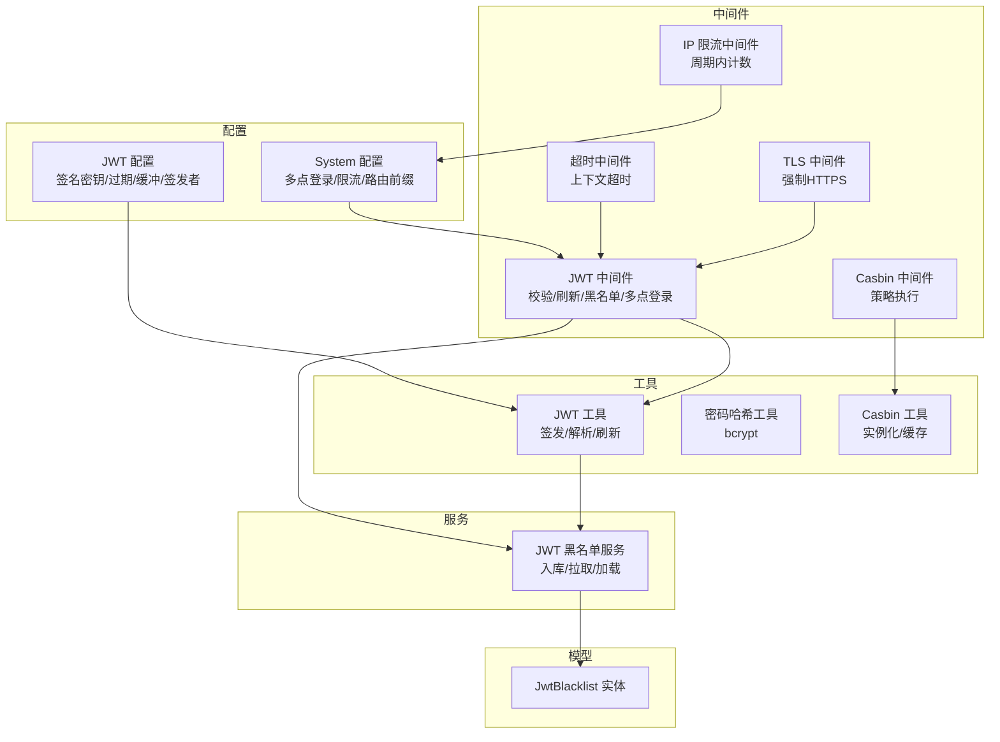
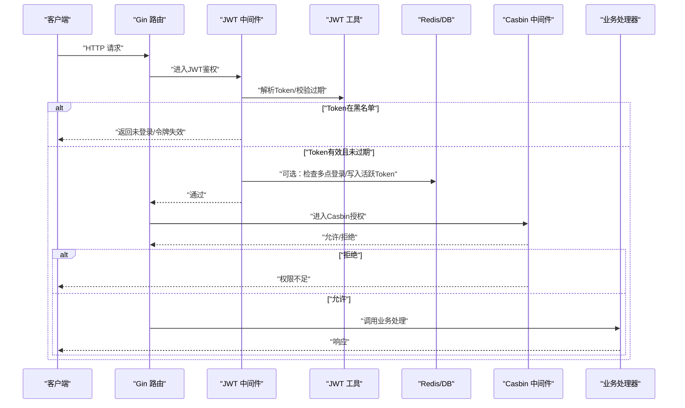
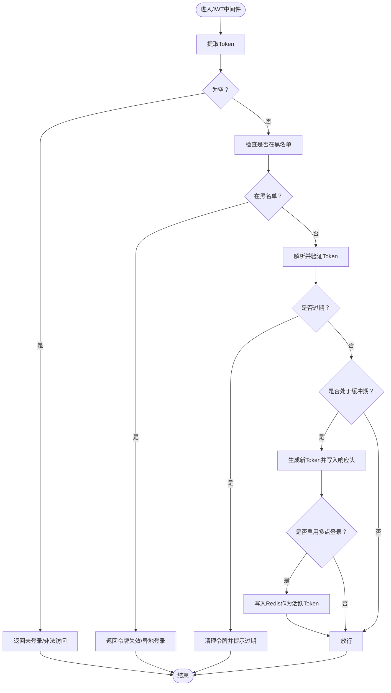
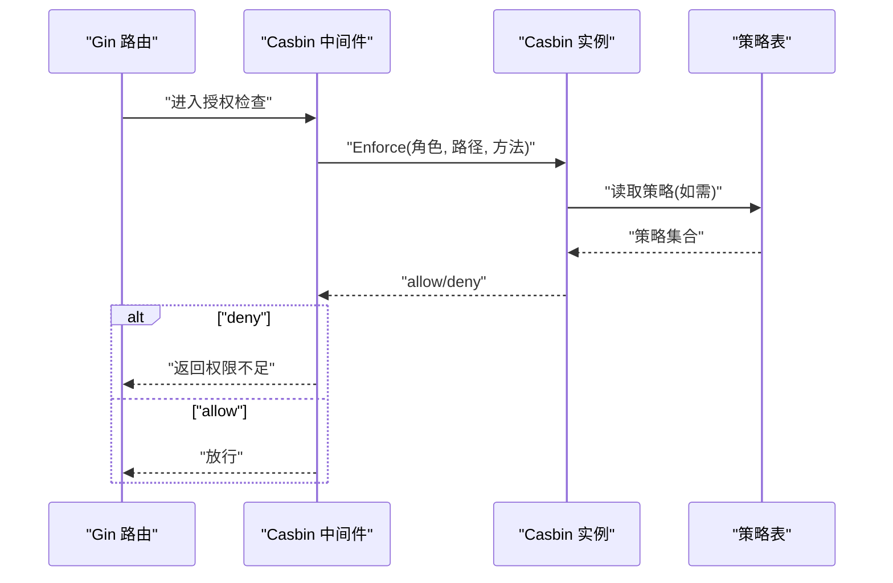
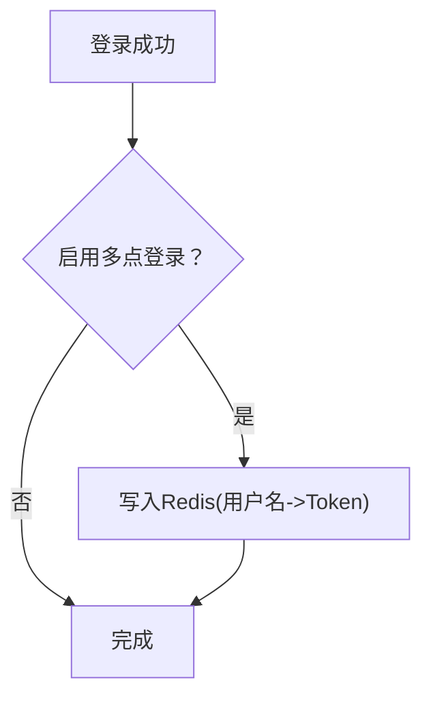
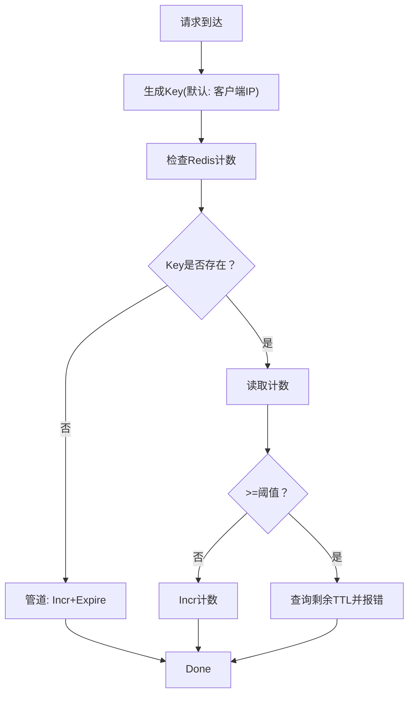
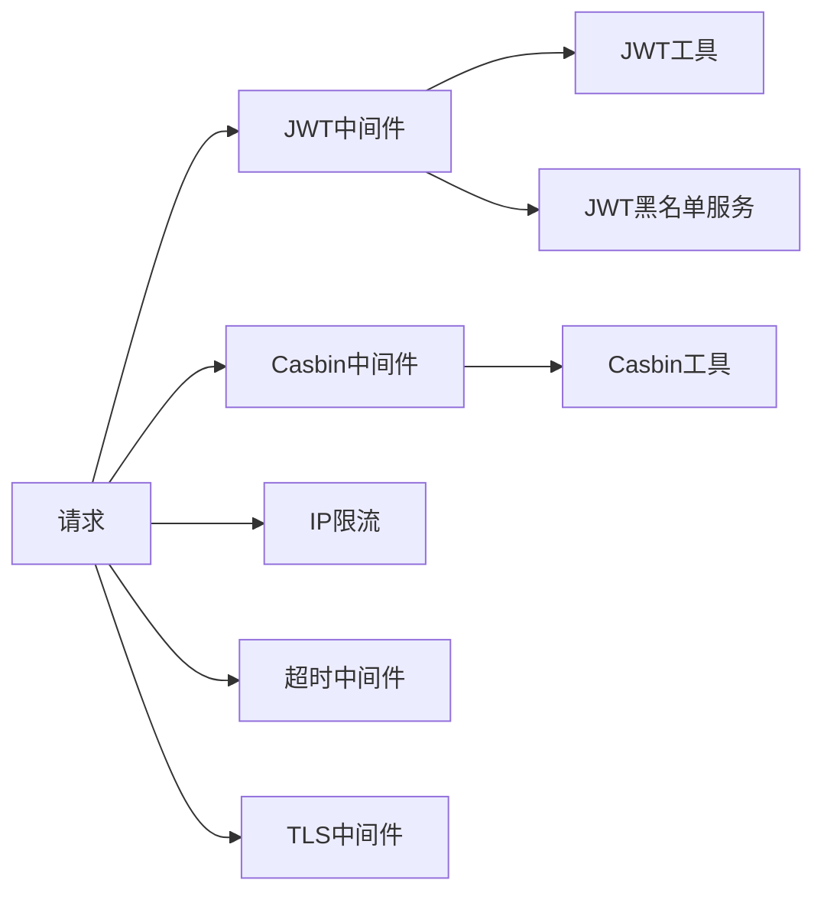

# 安全设计考虑

<cite>
**本文引用的文件**
- [server/config/jwt.go](file://server/config/jwt.go)
- [server/config/system.go](file://server/config/system.go)
- [server/config/config.go](file://server/config/config.go)
- [server/middleware/jwt.go](file://server/middleware/jwt.go)
- [server/middleware/casbin_rbac.go](file://server/middleware/casbin_rbac.go)
- [server/middleware/limit_ip.go](file://server/middleware/limit_ip.go)
- [server/middleware/timeout.go](file://server/middleware/timeout.go)
- [server/middleware/loadtls.go](file://server/middleware/loadtls.go)
- [server/utils/jwt.go](file://server/utils/jwt.go)
- [server/utils/hash.go](file://server/utils/hash.go)
- [server/utils/casbin_util.go](file://server/utils/casbin_util.go)
- [server/service/system/jwt_black_list.go](file://server/service/system/jwt_black_list.go)
- [server/model/system/sys_jwt_blacklist.go](file://server/model/system/sys_jwt_blacklist.go)
- [server/model/system/request/jwt.go](file://server/model/system/request/jwt.go)
</cite>

## 目录
1. [引言](#引言)
2. [项目结构](#项目结构)
3. [核心组件](#核心组件)
4. [架构总览](#架构总览)
5. [详细组件分析](#详细组件分析)
6. [依赖分析](#依赖分析)
7. [性能考量](#性能考量)
8. [故障排查指南](#故障排查指南)
9. [结论](#结论)
10. [附录](#附录)

## 引言
本文件面向测试管理平台的安全设计与实现，聚焦以下关键主题：
- JWT认证机制：签发、解析、刷新、黑名单与多点登录控制
- RBAC权限控制：基于Casbin的策略执行与匹配
- 安全策略：IP频率限制、超时处理、强制HTTPS
- 技术措施：密码加密、SQL注入防护（ORM层）、数据传输安全
- 安全配置项：作用说明与最佳实践
- 漏洞防范与应急响应：常见风险与处置流程

## 项目结构
围绕安全相关的核心目录与文件如下：
- 配置层：JWT参数、系统行为开关、限流阈值
- 中间件层：JWT鉴权、Casbin授权、IP限制、超时、TLS强制
- 工具层：JWT工具、密码哈希、Casbin实例化
- 服务层：JWT黑名单持久化与缓存加载
- 模型层：JWT黑名单实体

图表来源
- [server/config/system.go:1-16](file://server/config/system.go#L1-L16)
- [server/config/jwt.go:1-9](file://server/config/jwt.go#L1-L9)
- [server/middleware/jwt.go:1-90](file://server/middleware/jwt.go#L1-L90)
- [server/middleware/casbin_rbac.go:1-33](file://server/middleware/casbin_rbac.go#L1-L33)
- [server/middleware/limit_ip.go:1-93](file://server/middleware/limit_ip.go#L1-L93)
- [server/middleware/timeout.go:1-56](file://server/middleware/timeout.go#L1-L56)
- [server/middleware/loadtls.go:1-28](file://server/middleware/loadtls.go#L1-L28)
- [server/utils/jwt.go:1-106](file://server/utils/jwt.go#L1-L106)
- [server/utils/hash.go:1-32](file://server/utils/hash.go#L1-L32)
- [server/utils/casbin_util.go:1-53](file://server/utils/casbin_util.go#L1-L53)
- [server/service/system/jwt_black_list.go:1-53](file://server/service/system/jwt_black_list.go#L1-L53)
- [server/model/system/sys_jwt_blacklist.go:1-11](file://server/model/system/sys_jwt_blacklist.go#L1-L11)

章节来源
- [server/config/config.go:1-41](file://server/config/config.go#L1-L41)
- [server/config/system.go:1-16](file://server/config/system.go#L1-L16)
- [server/config/jwt.go:1-9](file://server/config/jwt.go#L1-L9)

## 核心组件
- JWT认证与刷新：签发自定义声明、解析与过期判断、缓冲期内自动刷新、多点登录记录
- RBAC授权：基于Casbin的策略匹配，支持对象路径与HTTP方法的组合
- IP频率限制：基于Redis的周期计数，超过阈值拒绝并提示剩余冷却时间
- 超时保护：统一超时上下文，防止慢请求导致资源耗尽
- TLS强制：将HTTP重定向至HTTPS，提升传输层安全性
- 密码加密：bcrypt用于用户密码存储；MD5工具保留但不应用于密码
- 黑名单机制：JWT黑名单持久化与内存缓存同步，支持异地登录拦截

章节来源
- [server/middleware/jwt.go:16-77](file://server/middleware/jwt.go#L16-L77)
- [server/utils/jwt.go:26-88](file://server/utils/jwt.go#L26-L88)
- [server/middleware/casbin_rbac.go:13-31](file://server/middleware/casbin_rbac.go#L13-L31)
- [server/utils/casbin_util.go:18-52](file://server/utils/casbin_util.go#L18-L52)
- [server/middleware/limit_ip.go:27-62](file://server/middleware/limit_ip.go#L27-L62)
- [server/middleware/timeout.go:13-55](file://server/middleware/timeout.go#L13-L55)
- [server/middleware/loadtls.go:12-27](file://server/middleware/loadtls.go#L12-L27)
- [server/utils/hash.go:9-19](file://server/utils/hash.go#L9-L19)
- [server/service/system/jwt_black_list.go:22-29](file://server/service/system/jwt_black_list.go#L22-L29)

## 架构总览
下图展示从请求进入至鉴权与授权的关键路径，以及各安全组件的协作方式。

图表来源
- [server/middleware/jwt.go:16-77](file://server/middleware/jwt.go#L16-L77)
- [server/utils/jwt.go:63-88](file://server/utils/jwt.go#L63-L88)
- [server/middleware/casbin_rbac.go:13-31](file://server/middleware/casbin_rbac.go#L13-L31)
- [server/service/system/jwt_black_list.go:37-40](file://server/service/system/jwt_black_list.go#L37-L40)

## 详细组件分析

### JWT认证机制
- 签名与声明
  - 使用对称签名算法，密钥来自配置；声明包含受众、生效时间、过期时间与签发者
  - 自定义声明包含用户基础信息与缓冲时间，用于提前刷新
- 解析与过期处理
  - 解析阶段区分过期、格式错误、签名无效等异常；过期时清理令牌并提示重新登录
- 刷新策略
  - 在缓冲期内自动延长过期时间并下发新令牌头，前端可更新本地存储
- 多点登录
  - 当启用多点登录时，将最新活跃Token写入Redis，实现异地登录拦截与单点登出

图表来源
- [server/middleware/jwt.go:16-77](file://server/middleware/jwt.go#L16-L77)
- [server/utils/jwt.go:48-60](file://server/utils/jwt.go#L48-L60)
- [server/utils/jwt.go:96-105](file://server/utils/jwt.go#L96-L105)

章节来源
- [server/config/jwt.go:3-8](file://server/config/jwt.go#L3-L8)
- [server/utils/jwt.go:13-46](file://server/utils/jwt.go#L13-L46)
- [server/model/system/request/jwt.go:8-22](file://server/model/system/request/jwt.go#L8-L22)
- [server/middleware/jwt.go:56-68](file://server/middleware/jwt.go#L56-L68)

### RBAC权限控制与Casbin授权
- 策略匹配
  - 子（角色）与对象（去除路由前缀后的路径）与动作（HTTP方法）三元组匹配
  - 使用路径匹配规则，确保细粒度控制
- 实例化与缓存
  - 基于GORM适配器连接数据库策略表，启动时加载策略并设置缓存过期
- 中间件集成
  - 在路由上挂载Casbin中间件，未授权直接返回权限不足并终止后续处理

图表来源
- [server/middleware/casbin_rbac.go:13-31](file://server/middleware/casbin_rbac.go#L13-L31)
- [server/utils/casbin_util.go:18-52](file://server/utils/casbin_util.go#L18-L52)

章节来源
- [server/middleware/casbin_rbac.go:12-32](file://server/middleware/casbin_rbac.go#L12-L32)
- [server/utils/casbin_util.go:18-52](file://server/utils/casbin_util.go#L18-L52)

### 多点登录限制与JWT黑名单
- 黑名单持久化
  - 将失效Token写入数据库，并同步到内存缓存，快速判定
- Redis活跃Token
  - 多点登录启用时，将最新Token写入Redis，实现异地登录拦截
- 登录流程
  - 成功登录后，若启用多点登录，则将当前Token作为该用户名的活跃Token

图表来源
- [server/middleware/jwt.go:64-67](file://server/middleware/jwt.go#L64-L67)
- [server/utils/jwt.go:96-105](file://server/utils/jwt.go#L96-L105)
- [server/service/system/jwt_black_list.go:22-29](file://server/service/system/jwt_black_list.go#L22-L29)

章节来源
- [server/service/system/jwt_black_list.go:22-29](file://server/service/system/jwt_black_list.go#L22-L29)
- [server/model/system/sys_jwt_blacklist.go:7-10](file://server/model/system/sys_jwt_blacklist.go#L7-L10)
- [server/middleware/jwt.go:25-30](file://server/middleware/jwt.go#L25-L30)

### IP限制与超时处理
- IP限流
  - 基于Redis的周期计数，首次设置过期时间；超过阈值返回剩余冷却时间
  - 默认键规则使用客户端IP前缀，可按业务自定义生成Key与检查逻辑
- 超时中间件
  - 为特定路由设置超时上下文，避免长时间阻塞；超时返回网关超时并关闭连接

图表来源
- [server/middleware/limit_ip.go:44-92](file://server/middleware/limit_ip.go#L44-L92)

章节来源
- [server/middleware/limit_ip.go:27-62](file://server/middleware/limit_ip.go#L27-L62)
- [server/middleware/timeout.go:13-55](file://server/middleware/timeout.go#L13-L55)

### 数据传输安全与TLS
- 强制HTTPS
  - 中间件将HTTP请求重定向至HTTPS，降低中间人攻击与明文传输风险
- 生产部署建议
  - 结合反向代理与证书管理，确保端到端加密

章节来源
- [server/middleware/loadtls.go:12-27](file://server/middleware/loadtls.go#L12-L27)

### 密码加密与SQL注入防护
- 密码加密
  - 使用bcrypt对密码进行加盐哈希存储；MD5工具仅用于非敏感场景
- SQL注入防护
  - ORM层默认参数化查询，避免原生SQL拼接；建议保持使用ORM并严格输入校验

章节来源
- [server/utils/hash.go:9-19](file://server/utils/hash.go#L9-L19)
- [server/utils/hash.go:27-31](file://server/utils/hash.go#L27-L31)

## 依赖分析
- 组件耦合
  - JWT中间件依赖JWT工具与黑名单服务；Casbin中间件依赖Casbin工具
  - IP限流依赖Redis；超时中间件独立于其他模块
- 关键依赖链
  - 请求 → JWT中间件 → JWT工具/黑名单服务 → 业务处理器
  - 请求 → Casbin中间件 → Casbin工具 → 业务处理器
- 风险点
  - Redis不可用时，多点登录与限流功能受影响
  - Casbin策略缺失或模型配置错误会导致误判

图表来源
- [server/middleware/jwt.go:16-77](file://server/middleware/jwt.go#L16-L77)
- [server/middleware/casbin_rbac.go:13-31](file://server/middleware/casbin_rbac.go#L13-L31)
- [server/middleware/limit_ip.go:27-62](file://server/middleware/limit_ip.go#L27-L62)
- [server/middleware/timeout.go:13-55](file://server/middleware/timeout.go#L13-L55)
- [server/middleware/loadtls.go:12-27](file://server/middleware/loadtls.go#L12-L27)

## 性能考量
- JWT刷新
  - 缓冲期内刷新会增加并发签发压力，建议使用并发控制避免风暴
- Casbin缓存
  - 启用缓存并合理设置过期时间，减少数据库查询
- Redis热点
  - 限流与多点登录均依赖Redis，建议监控热点Key与过期策略
- 超时设置
  - 为耗时操作设置合理超时，避免线程池耗尽

## 故障排查指南
- JWT相关
  - 现象：提示“未登录/非法访问”或“令牌失效/异地登录”
  - 排查：确认Token是否在黑名单；检查签名密钥一致性；核对过期与缓冲配置
- Casbin授权
  - 现象：权限不足
  - 排查：确认策略表是否正确加载；核对对象路径与方法；检查角色映射
- IP限流
  - 现象：频繁请求被拒
  - 排查：确认阈值与周期配置；检查Redis可用性；查看剩余TTL
- 超时
  - 现象：请求超时
  - 排查：调整超时阈值；检查下游依赖性能
- TLS
  - 现象：HTTP无法跳转HTTPS
  - 排查：确认中间件挂载位置与证书配置

章节来源
- [server/middleware/jwt.go:18-44](file://server/middleware/jwt.go#L18-L44)
- [server/middleware/casbin_rbac.go:24-29](file://server/middleware/casbin_rbac.go#L24-L29)
- [server/middleware/limit_ip.go:78-87](file://server/middleware/limit_ip.go#L78-L87)
- [server/middleware/timeout.go:45-52](file://server/middleware/timeout.go#L45-L52)
- [server/middleware/loadtls.go:14-26](file://server/middleware/loadtls.go#L14-L26)

## 结论
本平台采用“JWT + Casbin + 多点登录 + 限流 + 超时 + TLS”的综合安全体系，既满足认证与授权需求，又具备良好的可运维性。建议在生产环境中：
- 严格管理JWT密钥与过期策略
- 完善Casbin策略与角色映射
- 合理设置限流阈值与Redis容量
- 开启TLS并完善证书轮换
- 持续监控与演练应急响应

## 附录

### 安全配置项说明与最佳实践
- JWT配置
  - 签名密钥：高强度随机字符串，定期轮换
  - 过期时间：根据业务设定，建议短期令牌配合刷新
  - 缓冲时间：提前刷新窗口，平衡用户体验与安全
  - 签发者：固定标识，便于审计与跨系统识别
- 系统行为
  - 多点登录：建议开启，结合Redis实现异地拦截
  - 限流：按接口维度配置阈值与周期，避免误伤正常用户
  - 严格权限：启用树形角色分配模式，减少权限蔓延
- 部署建议
  - Redis/TLS/数据库置于内网或受控网络
  - 定期审计日志与策略变更

章节来源
- [server/config/jwt.go:3-8](file://server/config/jwt.go#L3-L8)
- [server/config/system.go:3-15](file://server/config/system.go#L3-L15)
- [server/config/config.go:3-40](file://server/config/config.go#L3-L40)