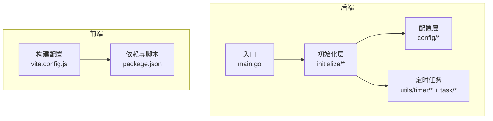
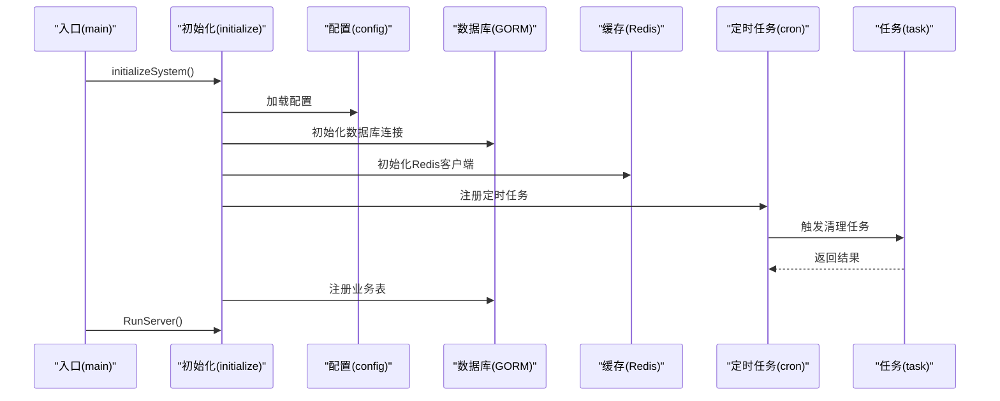
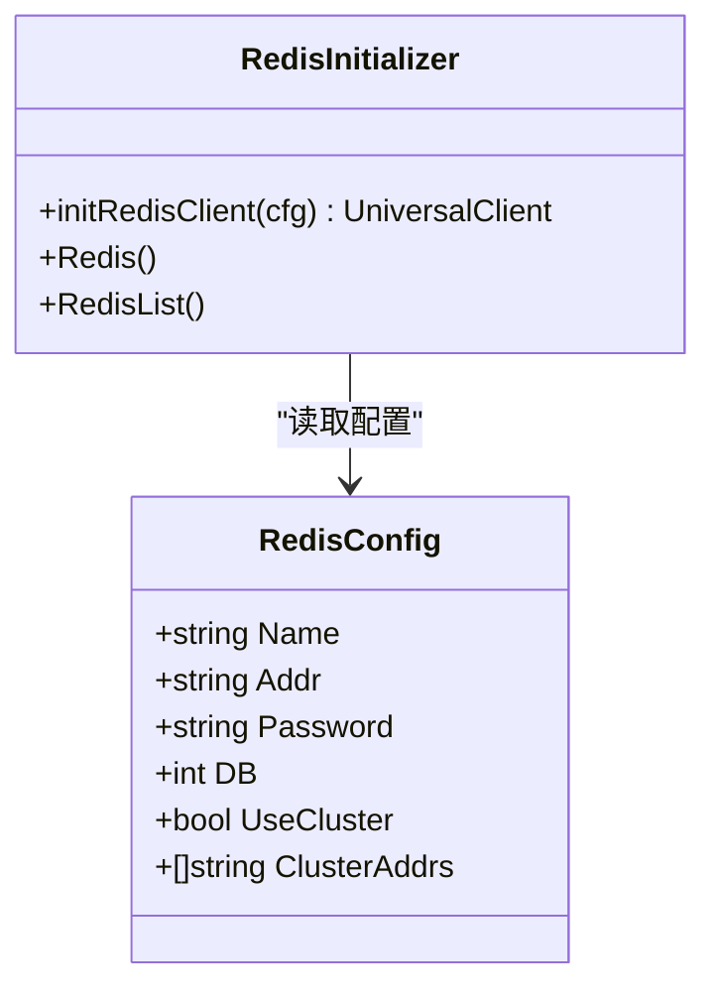
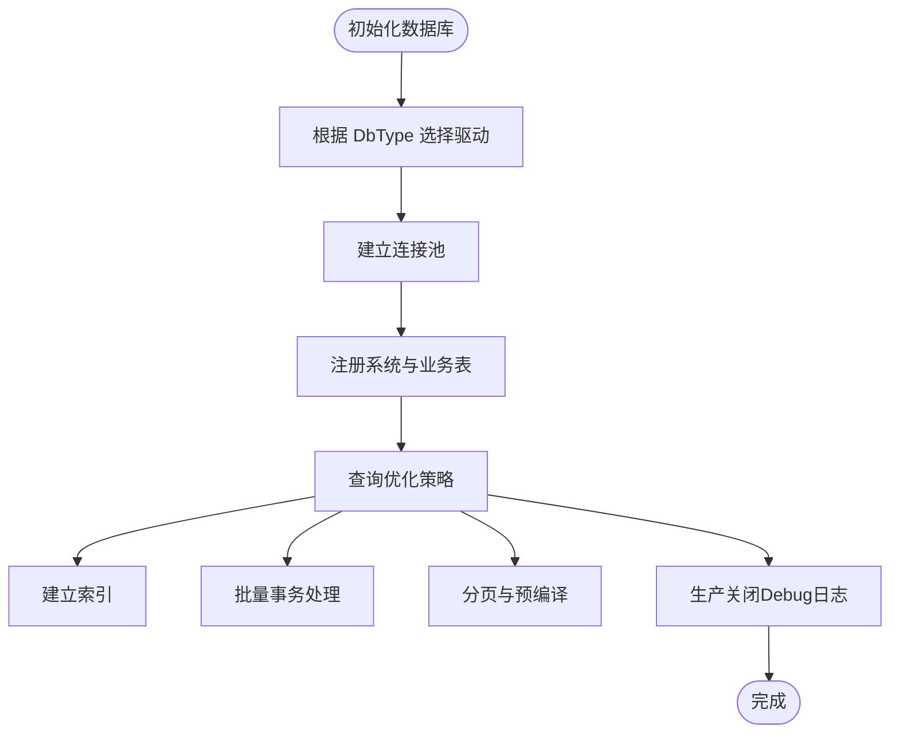
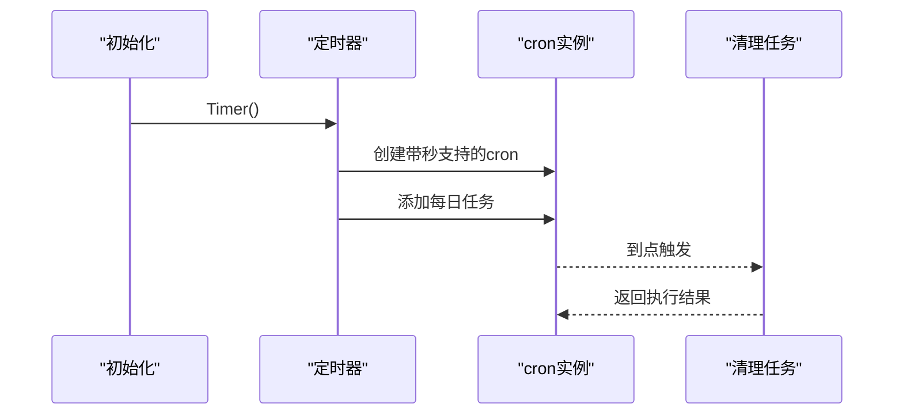
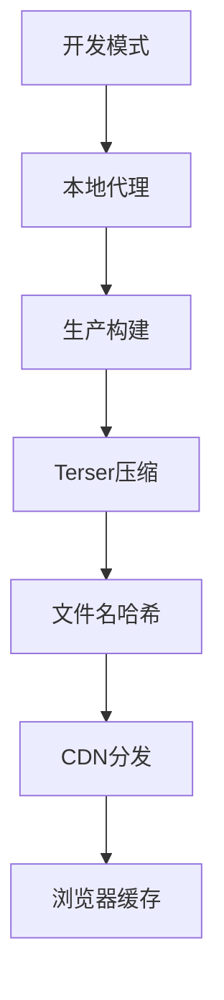
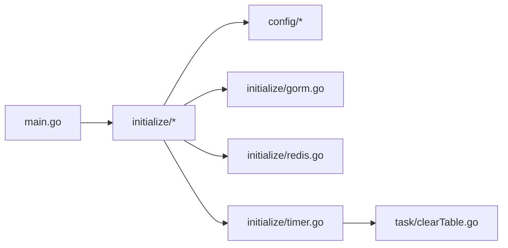

# 性能优化策略

<cite>
**本文引用的文件**
- [server/main.go](file://server/main.go)
- [server/config/config.go](file://server/config/config.go)
- [server/config/system.go](file://server/config/system.go)
- [server/config/redis.go](file://server/config/redis.go)
- [server/config/gorm_mysql.go](file://server/config/gorm_mysql.go)
- [server/config/gorm_pgsql.go](file://server/config/gorm_pgsql.go)
- [server/config/gorm_mssql.go](file://server/config/gorm_mssql.go)
- [server/config/gorm_sqlite.go](file://server/config/gorm_sqlite.go)
- [server/config/gorm_oracle.go](file://server/config/gorm_oracle.go)
- [server/initialize/redis.go](file://server/initialize/redis.go)
- [server/initialize/gorm.go](file://server/initialize/gorm.go)
- [server/initialize/timer.go](file://server/initialize/timer.go)
- [server/utils/timer/timed_task.go](file://server/utils/timer/timed_task.go)
- [server/task/clearTable.go](file://server/task/clearTable.go)
- [web/vite.config.js](file://web/vite.config.js)
- [web/package.json](file://web/package.json)
</cite>

## 目录
1. [引言](#引言)
2. [项目结构](#项目结构)
3. [核心组件](#核心组件)
4. [架构总览](#架构总览)
5. [详细组件分析](#详细组件分析)
6. [依赖分析](#依赖分析)
7. [性能考虑](#性能考虑)
8. [故障排查指南](#故障排查指南)
9. [结论](#结论)
10. [附录](#附录)

## 引言
本文件面向测试管理平台的性能优化，围绕后端（Go/GORM/Redis/Cron）与前端（Vite 打包）两大侧重点，系统性给出优化策略与落地建议。内容涵盖：
- Redis 缓存策略与连接配置
- 数据库查询优化与连接池配置要点
- 定时任务实现与调度机制
- 前端资源压缩、懒加载与代码分割
- 静态资源缓存策略
- 性能监控指标与调优建议

## 项目结构
后端采用模块化分层：配置层、初始化层、服务层、工具层；前端采用 Vite 构建管线。整体结构清晰，便于按模块进行性能优化。

图示来源
- [server/main.go:30-52](file://server/main.go#L30-L52)
- [server/config/config.go:1-41](file://server/config/config.go#L1-L41)
- [server/initialize/timer.go:12-38](file://server/initialize/timer.go#L12-L38)
- [web/vite.config.js:15-119](file://web/vite.config.js#L15-L119)
- [web/package.json:1-88](file://web/package.json#L1-L88)

章节来源
- [server/main.go:30-52](file://server/main.go#L30-L52)
- [web/vite.config.js:15-119](file://web/vite.config.js#L15-L119)

## 核心组件
- 后端配置与初始化
  - 配置聚合：统一承载数据库、Redis、系统参数等配置项
  - 初始化：数据库连接、Redis 客户端、定时任务注册、表结构初始化
- 定时任务
  - 基于 cron 的任务管理器，支持按名称与表达式调度
  - 示例：每日清理日志与黑名单
- 前端构建
  - Vite 配置包含压缩、产物命名、代理、插件等
  - 生产构建开启压缩并移除调试语句

章节来源
- [server/config/config.go:1-41](file://server/config/config.go#L1-L41)
- [server/initialize/gorm.go:14-35](file://server/initialize/gorm.go#L14-L35)
- [server/initialize/redis.go:13-45](file://server/initialize/redis.go#L13-L45)
- [server/initialize/timer.go:12-38](file://server/initialize/timer.go#L12-L38)
- [server/utils/timer/timed_task.go:54-73](file://server/utils/timer/timed_task.go#L54-L73)
- [web/vite.config.js:80-95](file://web/vite.config.js#L80-L95)

## 架构总览
后端启动流程串联配置、初始化、定时任务与表注册；前端通过 Vite 构建产物供 Nginx/CDN 缓存与分发。

图示来源
- [server/main.go:30-52](file://server/main.go#L30-L52)
- [server/initialize/gorm.go:14-35](file://server/initialize/gorm.go#L14-L35)
- [server/initialize/redis.go:13-45](file://server/initialize/redis.go#L13-L45)
- [server/initialize/timer.go:12-38](file://server/initialize/timer.go#L12-L38)
- [server/task/clearTable.go:18-51](file://server/task/clearTable.go#L18-L51)

## 详细组件分析

### Redis 缓存策略与连接配置
- 配置模型
  - 支持单机与集群两种模式，可配置密码、DB 库、集群节点列表
- 初始化流程
  - 根据配置选择单机或集群客户端，Ping 校验连通性，记录日志
- 优化建议
  - 连接池大小：根据并发请求量设置连接池上限，避免过多空闲连接
  - 命中率：热点键设置合理过期时间，结合 LRU 淘汰策略
  - 分片：多 DB 实例分片存储不同业务域数据
  - 客户端复用：全局单例客户端，避免频繁创建销毁
  - 网络：内网部署、长连接、超时与重试策略

图示来源
- [server/config/redis.go:3-10](file://server/config/redis.go#L3-L10)
- [server/initialize/redis.go:13-45](file://server/initialize/redis.go#L13-L45)

章节来源
- [server/config/redis.go:3-10](file://server/config/redis.go#L3-L10)
- [server/initialize/redis.go:13-45](file://server/initialize/redis.go#L13-L45)

### 数据库连接与查询优化
- 配置与 DSN
  - MySQL/PgSQL/MSSQL/SQLite/Oracle 均提供 DSN 生成逻辑，确保连接字符串正确
- 初始化与表注册
  - 根据 DbType 动态选择数据库驱动，注册系统与示例表
- 查询优化要点
  - 索引：对高频查询字段建立合适索引，避免全表扫描
  - 分页：使用 LIMIT/OFFSET 或基于游标的分页，避免深分页
  - 预编译：使用 GORM 原生 SQL 或预编译语句，减少解析开销
  - 连接池：设置最大打开连接数、最大空闲连接数、连接生命周期
  - 事务：批量写入合并为事务，减少往返
  - 日志：生产关闭 Debug，仅在定位问题时临时开启
- 定时清理
  - 每日清理操作日志与黑名单，控制表膨胀

图示来源
- [server/initialize/gorm.go:14-35](file://server/initialize/gorm.go#L14-L35)
- [server/config/gorm_mysql.go:7-9](file://server/config/gorm_mysql.go#L7-L9)
- [server/config/gorm_pgsql.go:9-11](file://server/config/gorm_pgsql.go#L9-L11)
- [server/config/gorm_mssql.go:8-10](file://server/config/gorm_mssql.go#L8-L10)
- [server/config/gorm_sqlite.go:11-13](file://server/config/gorm_sqlite.go#L11-L13)
- [server/config/gorm_oracle.go:13-18](file://server/config/gorm_oracle.go#L13-L18)
- [server/task/clearTable.go:18-51](file://server/task/clearTable.go#L18-L51)

章节来源
- [server/initialize/gorm.go:14-35](file://server/initialize/gorm.go#L14-L35)
- [server/config/gorm_mysql.go:7-9](file://server/config/gorm_mysql.go#L7-L9)
- [server/config/gorm_pgsql.go:9-11](file://server/config/gorm_pgsql.go#L9-L11)
- [server/config/gorm_mssql.go:8-10](file://server/config/gorm_mssql.go#L8-L10)
- [server/config/gorm_sqlite.go:11-13](file://server/config/gorm_sqlite.go#L11-L13)
- [server/config/gorm_oracle.go:13-18](file://server/config/gorm_oracle.go#L13-L18)
- [server/task/clearTable.go:18-51](file://server/task/clearTable.go#L18-L51)

### 定时任务实现与调度机制
- 任务管理器
  - 支持按名称创建独立 cron 实例，提供增删查改与启停能力
  - 支持秒级精度与带秒表达式
- 调度与注册
  - 在初始化阶段注册每日清理任务
  - 可扩展新增任务，遵循相同接口风格
- 优化建议
  - 任务幂等：保证重复执行不产生副作用
  - 错误隔离：捕获异常并记录，不影响其他任务
  - 资源回收：关闭时停止所有 cron

图示来源
- [server/initialize/timer.go:12-38](file://server/initialize/timer.go#L12-L38)
- [server/utils/timer/timed_task.go:54-73](file://server/utils/timer/timed_task.go#L54-L73)
- [server/task/clearTable.go:18-51](file://server/task/clearTable.go#L18-L51)

章节来源
- [server/initialize/timer.go:12-38](file://server/initialize/timer.go#L12-L38)
- [server/utils/timer/timed_task.go:54-73](file://server/utils/timer/timed_task.go#L54-L73)
- [server/task/clearTable.go:18-51](file://server/task/clearTable.go#L18-L51)

### 前端资源压缩与构建优化
- 构建配置
  - 生产构建启用 Terser 压缩，移除 console 与 debugger
  - 产物文件名包含哈希，便于浏览器缓存与失效
  - 代理配置，开发环境提升联调效率
- 优化策略
  - 代码分割：路由级懒加载、动态 import
  - 组件按需加载：Element Plus、图标等
  - Tree-shaking：保持 ESModule，移除未使用代码
  - 静态资源 CDN：将 dist 静态资源托管至 CDN，设置强缓存
  - 预加载：关键首屏资源预加载，非关键资源延迟加载
  - 图片优化：矢量图标、WebP、响应式图片
  - Source Map：生产关闭，保障安全与体积

图示来源
- [web/vite.config.js:80-95](file://web/vite.config.js#L80-L95)
- [web/vite.config.js:31-37](file://web/vite.config.js#L31-L37)
- [web/vite.config.js:57-79](file://web/vite.config.js#L57-L79)
- [web/package.json:5-12](file://web/package.json#L5-L12)

章节来源
- [web/vite.config.js:80-95](file://web/vite.config.js#L80-L95)
- [web/vite.config.js:31-37](file://web/vite.config.js#L31-L37)
- [web/vite.config.js:57-79](file://web/vite.config.js#L57-L79)
- [web/package.json:5-12](file://web/package.json#L5-L12)

### 静态资源缓存策略
- 文件名哈希：构建产物文件名含哈希，版本变更自动失效
- CDN 缓存：静态资源设置长期缓存（如一年），通过文件名变化实现更新
- 浏览器缓存：合理设置 Cache-Control/ETag，减少带宽与请求
- 压缩传输：开启 gzip/br，降低传输体积

章节来源
- [web/vite.config.js:31-37](file://web/vite.config.js#L31-L37)

## 依赖分析
后端启动顺序与关键依赖如下：

图示来源
- [server/main.go:30-52](file://server/main.go#L30-L52)
- [server/initialize/gorm.go:14-35](file://server/initialize/gorm.go#L14-L35)
- [server/initialize/redis.go:13-45](file://server/initialize/redis.go#L13-L45)
- [server/initialize/timer.go:12-38](file://server/initialize/timer.go#L12-L38)
- [server/task/clearTable.go:18-51](file://server/task/clearTable.go#L18-L51)

章节来源
- [server/main.go:30-52](file://server/main.go#L30-L52)
- [server/initialize/gorm.go:14-35](file://server/initialize/gorm.go#L14-L35)
- [server/initialize/redis.go:13-45](file://server/initialize/redis.go#L13-L45)
- [server/initialize/timer.go:12-38](file://server/initialize/timer.go#L12-L38)
- [server/task/clearTable.go:18-51](file://server/task/clearTable.go#L18-L51)

## 性能考虑
- Redis
  - 连接池与超时：避免阻塞与堆积
  - 命令批量化：使用 pipeline 减少 RTT
  - 内存优化：合理设置过期与淘汰策略
- 数据库
  - 连接池：maxOpenConns、maxIdleConns、connMaxLifetime
  - 查询：EXPLAIN 分析慢查询，建立必要索引
  - 写入：批量插入、事务合并
- 定时任务
  - 幂等与隔离：失败不影响后续执行
  - 调度粒度：避免过于频繁的任务
- 前端
  - 体积：Tree-shaking、按需加载、第三方精简
  - 传输：压缩、CDN、缓存
  - 首屏：关键资源优先、骨架屏/占位符

## 故障排查指南
- Redis 连接失败
  - 检查地址、密码、DB 选择与集群节点配置
  - 查看 Ping 结果与日志
- 数据库连接异常
  - 校验 DSN 与网络连通性
  - 检查连接池参数与慢查询
- 定时任务未执行
  - 确认 cron 表达式与秒级支持
  - 查看任务是否被移除或停止
- 前端构建失败
  - 关注 Terser 压缩报错与依赖缺失
  - 检查代理与端口占用

章节来源
- [server/initialize/redis.go:29-36](file://server/initialize/redis.go#L29-L36)
- [server/initialize/timer.go:17-22](file://server/initialize/timer.go#L17-L22)
- [web/vite.config.js:80-95](file://web/vite.config.js#L80-L95)

## 结论
通过合理的 Redis 连接与缓存策略、数据库连接池与查询优化、定时任务的幂等与隔离、以及前端构建与缓存策略，测试管理平台可在功能完备的基础上显著提升性能与稳定性。建议在生产环境逐步落地上述优化，并配合监控指标持续迭代。

## 附录
- 配置项概览（节选）
  - 系统参数：数据库类型、端口、是否使用 Redis/Mongo、是否自动迁移等
  - Redis：地址、密码、DB、集群开关与节点列表
  - 数据库：各数据库 DSN 生成方式
- 建议的监控指标
  - Redis：命中率、连接数、慢命令、内存使用
  - 数据库：QPS、慢查询、连接池使用率、锁等待
  - 定时任务：执行耗时、失败次数、抖动
  - 前端：首屏时间、TTFB、资源体积、缓存命中率

章节来源
- [server/config/system.go:3-16](file://server/config/system.go#L3-L16)
- [server/config/redis.go:3-10](file://server/config/redis.go#L3-L10)
- [server/config/gorm_mysql.go:7-9](file://server/config/gorm_mysql.go#L7-L9)
- [server/config/gorm_pgsql.go:9-11](file://server/config/gorm_pgsql.go#L9-L11)
- [server/config/gorm_mssql.go:8-10](file://server/config/gorm_mssql.go#L8-L10)
- [server/config/gorm_sqlite.go:11-13](file://server/config/gorm_sqlite.go#L11-L13)
- [server/config/gorm_oracle.go:13-18](file://server/config/gorm_oracle.go#L13-L18)