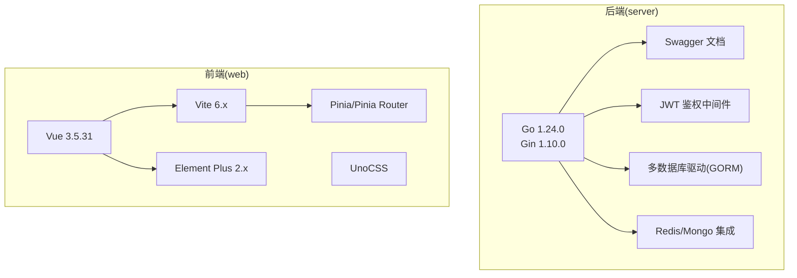
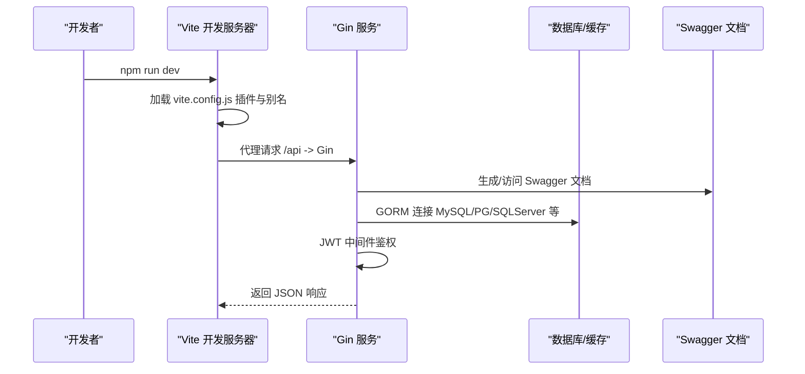
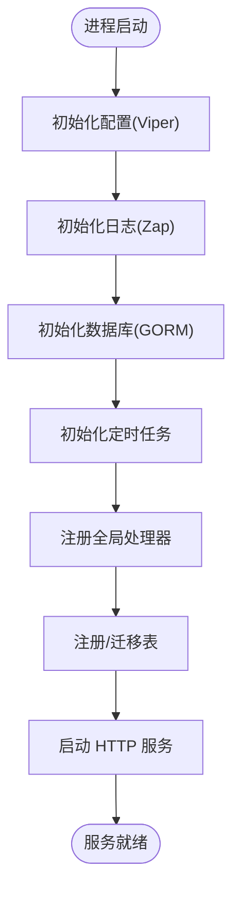
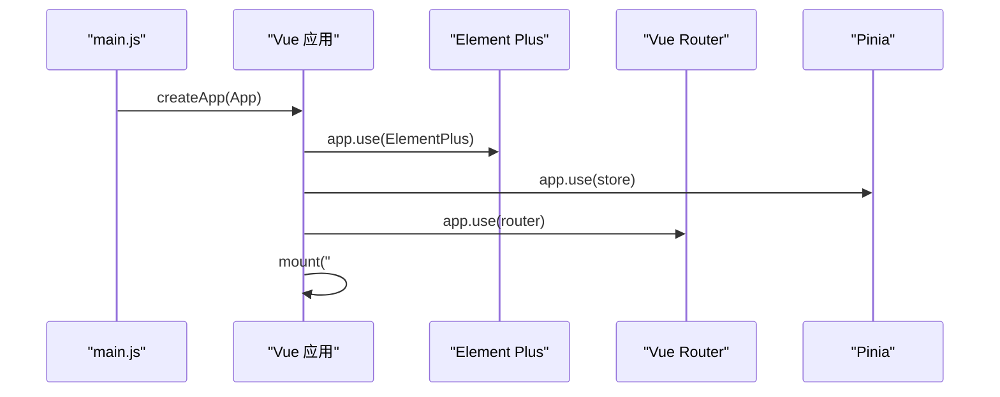
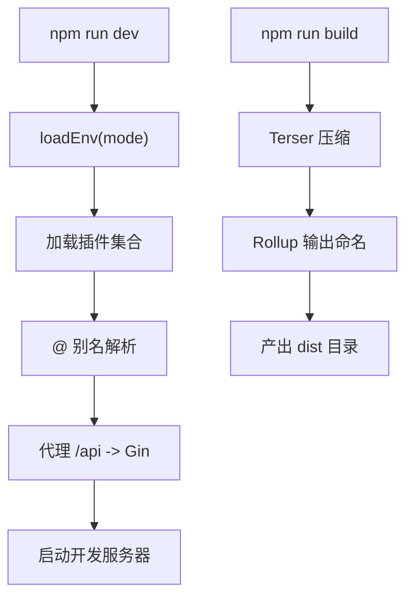
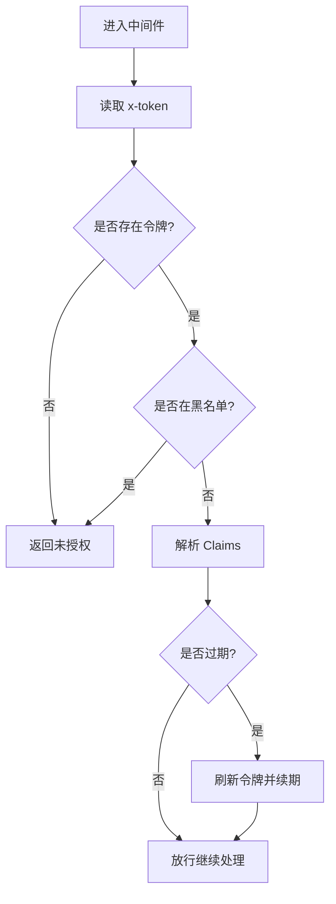
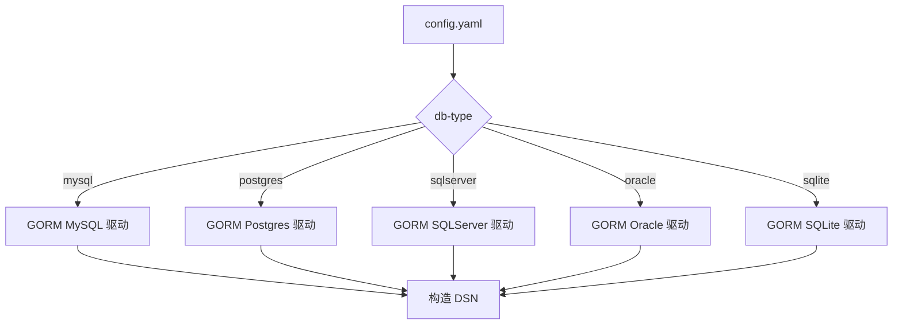
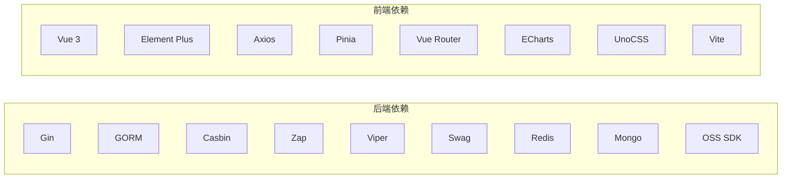

# 技术栈说明

<cite>
**本文引用的文件列表**
- [go.mod](file://server/go.mod)
- [main.go](file://server/main.go)
- [server.go](file://server/core/server.go)
- [config.yaml](file://server/config.yaml)
- [gorm_mysql.go](file://server/config/gorm_mysql.go)
- [jwt.go](file://server/middleware/jwt.go)
- [package.json](file://web/package.json)
- [vite.config.js](file://web/vite.config.js)
- [main.js](file://web/src/main.js)
- [version.go](file://server/global/version.go)
</cite>

## 目录
1. [引言](#引言)
2. [项目结构](#项目结构)
3. [核心组件](#核心组件)
4. [架构总览](#架构总览)
5. [详细组件分析](#详细组件分析)
6. [依赖分析](#依赖分析)
7. [性能考量](#性能考量)
8. [故障排查指南](#故障排查指南)
9. [结论](#结论)
10. [附录](#附录)

## 引言
本技术栈说明面向测试管理平台的开发者与运维人员，系统性阐述后端基于 Go 1.24.0 的 Gin 框架、前端基于 Vue 3 与 Element Plus 的技术选型与实现方式，并结合 Vite 构建工具与 Go Modules 依赖管理的实际配置，给出版本兼容性与升级注意事项，辅以技术栈对比分析，帮助读者理解技术选择的合理性与落地细节。

## 项目结构
项目采用前后端分离架构：
- 后端：Go 语言模块化工程，使用 Gin 作为 Web 框架，集成 Swagger 文档、JWT 鉴权、多数据库驱动、Redis/Mongo 等中间件能力。
- 前端：Vue 3 单页应用，使用 Element Plus 组件库、Pinia 状态管理、Vue Router 路由、UnoCSS 样式方案，Vite 作为构建与开发服务器。

图表来源
- [go.mod:3-61](file://server/go.mod#L3-L61)
- [main.go:30-35](file://server/main.go#L30-L35)
- [server.go:14-48](file://server/core/server.go#L14-L48)
- [package.json:14-57](file://web/package.json#L14-L57)
- [vite.config.js:15-119](file://web/vite.config.js#L15-L119)

章节来源
- [go.mod:3-61](file://server/go.mod#L3-L61)
- [main.go:30-35](file://server/main.go#L30-L35)
- [server.go:14-48](file://server/core/server.go#L14-L48)
- [package.json:14-57](file://web/package.json#L14-L57)
- [vite.config.js:15-119](file://web/vite.config.js#L15-L119)

## 核心组件
- 后端核心
  - Go 1.24.0：稳定且高性能的并发模型，配合 go.mod 的模块化依赖管理，确保可复现构建与依赖隔离。
  - Gin 1.10.0：轻量、高性能的 Web 框架，提供路由、中间件、错误处理等能力，适合快速搭建 REST API。
  - Swagger/Gin-Swagger：自动生成接口文档，便于前后端协作与联调。
  - JWT 中间件：统一鉴权入口，支持令牌刷新与黑名单校验。
  - GORM 多数据库驱动：MySQL、PostgreSQL、SQL Server、Oracle、SQLite 等，满足不同部署场景。
  - Redis/Mongo：缓存与文档型数据存储，支撑会话、限流、扩展业务数据。
- 前端核心
  - Vue 3.5.31：组合式 API、响应式系统与更好的 Tree-shaking，提升开发体验与产物体积。
  - Element Plus 2.x：完善的桌面端组件库，配套暗色主题与按需加载生态。
  - Vite 6.2.3：基于 esbuild 的快速开发与构建工具，热更新、插件生态完善。
  - UnoCSS：原子化 CSS 方案，兼顾灵活性与体积控制。
  - Pinia/Vue Router：状态管理与路由管理，配合权限指令与拦截器实现细粒度控制。

章节来源
- [go.mod:3-61](file://server/go.mod#L3-L61)
- [main.go:30-35](file://server/main.go#L30-L35)
- [server.go:14-48](file://server/core/server.go#L14-L48)
- [jwt.go:16-77](file://server/middleware/jwt.go#L16-L77)
- [package.json:14-57](file://web/package.json#L14-L57)
- [vite.config.js:15-119](file://web/vite.config.js#L15-L119)
- [main.js:4-36](file://web/src/main.js#L4-L36)

## 架构总览
下图展示后端启动流程与核心组件交互，以及前端开发与构建链路。

图表来源
- [vite.config.js:57-78](file://web/vite.config.js#L57-L78)
- [main.go:30-35](file://server/main.go#L30-L35)
- [server.go:32-47](file://server/core/server.go#L32-L47)
- [config.yaml:74-91](file://server/config.yaml#L74-L91)

章节来源
- [vite.config.js:57-78](file://web/vite.config.js#L57-L78)
- [main.go:30-35](file://server/main.go#L30-L35)
- [server.go:32-47](file://server/core/server.go#L32-L47)
- [config.yaml:74-91](file://server/config.yaml#L74-L91)

## 详细组件分析

### 后端：Go 1.24.0 与 Gin 1.10.0
- 版本与工具链
  - go 1.24.0；toolchain go1.24.2；确保编译器与运行时一致。
- 依赖管理
  - 使用 go.mod 管理依赖，集中声明第三方库，便于 CI/CD 与镜像构建复现。
- 启动流程
  - main 初始化配置、日志、数据库、定时任务、全局处理器与表注册，随后启动 HTTP 服务。
- 关键特性
  - Swagger 文档自动生成，便于接口联调。
  - Gin 路由与中间件体系完善，支持 CORS、JWT、限流、操作日志等。

图表来源
- [main.go:39-51](file://server/main.go#L39-L51)
- [server.go:14-48](file://server/core/server.go#L14-L48)

章节来源
- [go.mod:3-61](file://server/go.mod#L3-L61)
- [main.go:30-51](file://server/main.go#L30-L51)
- [server.go:14-48](file://server/core/server.go#L14-L48)

### 前端：Vue 3 与 Element Plus
- 核心依赖
  - Vue 3.5.31：组合式 API、更好的性能与更小的包体。
  - Element Plus 2.x：组件丰富、样式现代化，支持暗色主题与国际化。
- 应用入口
  - main.js 创建应用实例，挂载路由、状态、指令与 Element Plus。
- 构建与开发
  - Vite 6.2.3 提供快速热更新与按需构建；插件包括 Vue、SVG 自动引入、UnoCSS、Banner、DevTools 等。

图表来源
- [main.js:4-36](file://web/src/main.js#L4-L36)
- [package.json:14-57](file://web/package.json#L14-L57)
- [vite.config.js:15-119](file://web/vite.config.js#L15-L119)

章节来源
- [main.js:4-36](file://web/src/main.js#L4-L36)
- [package.json:14-57](file://web/package.json#L14-L57)
- [vite.config.js:15-119](file://web/vite.config.js#L15-L119)

### Vite 构建工具配置与使用
- 开发服务器
  - 代理配置将 /api 请求转发至后端 Gin 服务，支持跨域与路径重写。
  - 端口与主机通过环境变量控制，便于容器化与多环境切换。
- 构建优化
  - Terser 压缩、移除 console/debugger、Rollup 输出命名策略，降低产物体积。
- 插件生态
  - Vue、Legacy 兼容、SVG 自动引入、UnoCSS、Banner、DevTools、路径信息注入等。
- 资源与别名
  - 路径别名 @ 指向 src，确保导入一致性；publicDir 指向静态资源目录。

图表来源
- [vite.config.js:15-119](file://web/vite.config.js#L15-L119)

章节来源
- [vite.config.js:15-119](file://web/vite.config.js#L15-L119)

### 后端：JWT 鉴权中间件
- 功能要点
  - 从请求头读取令牌，校验黑名单，解析 Claims 并设置缓冲过期刷新机制。
  - 支持多点登录场景下的 Redis 记录与令牌续签。
- 错误处理
  - 未登录、过期、非法访问等场景返回统一响应并中断后续处理。

图表来源
- [jwt.go:16-77](file://server/middleware/jwt.go#L16-L77)

章节来源
- [jwt.go:16-77](file://server/middleware/jwt.go#L16-L77)

### 后端：数据库与配置
- 数据库配置
  - 支持 MySQL、PostgreSQL、SQL Server、Oracle、SQLite 等，通过 YAML 配置文件集中管理。
  - DSN 构造遵循各驱动规范，便于切换与扩展。
- 运行时配置
  - system.env、addr、db-type、oss-type、use-redis/use-mongo、跨域模式等通过配置文件与环境变量控制。

图表来源
- [config.yaml:74-160](file://server/config.yaml#L74-L160)
- [gorm_mysql.go:7-9](file://server/config/gorm_mysql.go#L7-L9)

章节来源
- [config.yaml:74-160](file://server/config.yaml#L74-L160)
- [gorm_mysql.go:7-9](file://server/config/gorm_mysql.go#L7-L9)

## 依赖分析
- 后端依赖
  - Gin、GORM、Casbin、Zap、Viper、Swag、Redis、Mongo、AWS SDK、Excelize 等，覆盖 Web 框架、ORM、鉴权、日志、配置、对象存储、文档处理等能力。
- 前端依赖
  - Vue 3、Element Plus、Axios、Pinia、Vue Router、ECharts、UnoCSS、Vite 插件等，覆盖视图层、状态、路由、可视化、构建与样式方案。

图表来源
- [go.mod:7-61](file://server/go.mod#L7-L61)
- [package.json:14-57](file://web/package.json#L14-L57)

章节来源
- [go.mod:7-61](file://server/go.mod#L7-L61)
- [package.json:14-57](file://web/package.json#L14-L57)

## 性能考量
- 后端
  - Gin 的中间件链与路由分发具备较低开销；GORM 的连接池参数可通过配置文件调整，避免高并发下的连接争用。
  - Redis/Mongo 作为缓存与文档存储，建议结合业务热点数据进行预热与淘汰策略。
- 前端
  - Vite 的 esbuild 压缩与按需构建显著缩短打包时间；UnoCSS 的原子化特性减少冗余样式。
  - 生产构建启用 Terser 压缩与移除调试语句，有助于减小包体与提升首屏性能。

## 故障排查指南
- 后端
  - 日志级别与输出位置可在配置文件中调整，便于定位问题。
  - 跨域问题可通过配置文件中的 CORS 模式与白名单进行验证。
  - 数据库连接失败通常与 DSN 参数、网络连通性与驱动版本有关，建议核对配置与环境变量。
- 前端
  - 开发代理未生效时检查 vite.config.js 的 proxy 配置与环境变量。
  - 构建报错可先清理 node_modules 并重新安装依赖，确认 Vite 与插件版本兼容。

章节来源
- [config.yaml:10-19](file://server/config.yaml#L10-L19)
- [config.yaml:264-278](file://server/config.yaml#L264-L278)
- [vite.config.js:57-78](file://web/vite.config.js#L57-L78)

## 结论
本项目在后端采用 Go 1.24.0 与 Gin 1.10.0，具备良好的并发性能与生态；在前端采用 Vue 3 与 Element Plus，结合 Vite 与 UnoCSS，形成现代化、可维护的开发与构建体系。通过统一的配置中心与模块化依赖管理，项目在可扩展性、可移植性与团队协作效率方面均具备良好基础。

## 附录

### 版本兼容性与升级注意事项
- Go 与工具链
  - 当前使用 go 1.24.0 与 toolchain go1.24.2；升级时需同步更新 CI/CD 与容器镜像基础镜像。
- Gin 与中间件
  - Gin 1.10.0 与相关中间件（如 CORS、Swagger）需保持版本兼容；升级前建议在测试环境验证。
- Vue 与 Vite
  - Vue 3.5.31 与 Vite 6.2.3 在生态上较为成熟；升级时优先验证插件与构建产物。
- 数据库驱动
  - GORM 多驱动版本需与目标数据库版本匹配，升级前进行回归测试。
- 安全与鉴权
  - JWT 与 Casbin 版本升级需关注 API 变更与策略兼容性。

章节来源
- [go.mod:3-61](file://server/go.mod#L3-L61)
- [package.json:14-57](file://web/package.json#L14-L57)
- [version.go:6-7](file://server/global/version.go#L6-L7)

### 技术栈对比分析
- 后端对比
  - 与 Spring Boot/Java 相比，Go 在并发与部署体积上更具优势；Gin 相比 Express 更贴近企业级 API 设计。
- 前端对比
  - 与 React 生态相比，Vue 3 在组合式 API 与模板语法上更易上手；Element Plus 在桌面端组件覆盖度更高。
- 构建工具对比
  - 与 Webpack 相比，Vite 的冷启动与热更新速度更快，适合现代前端开发工作流。