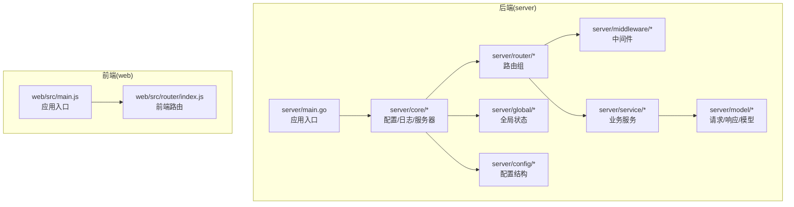
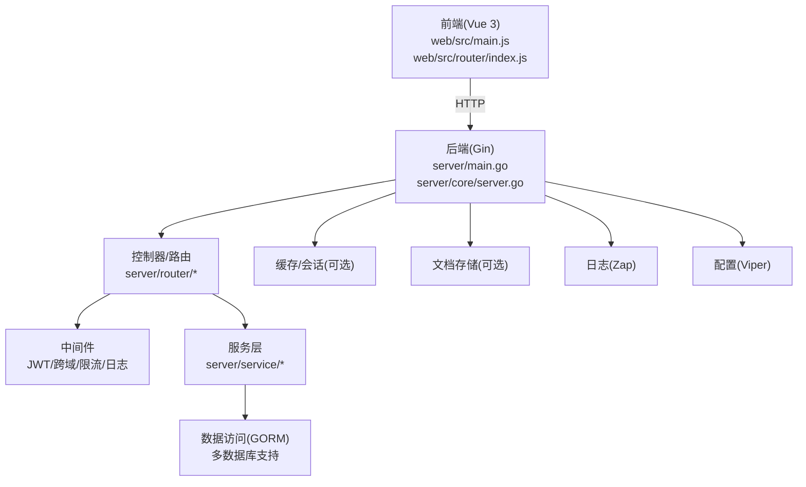
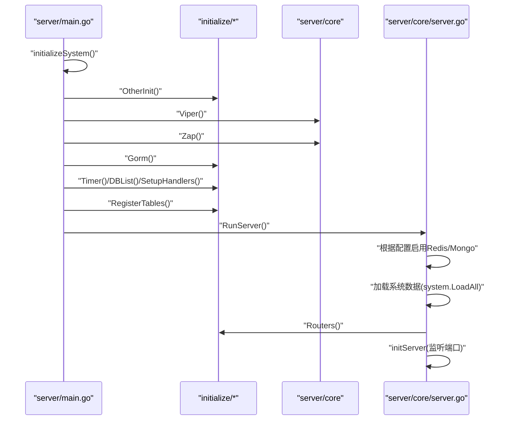
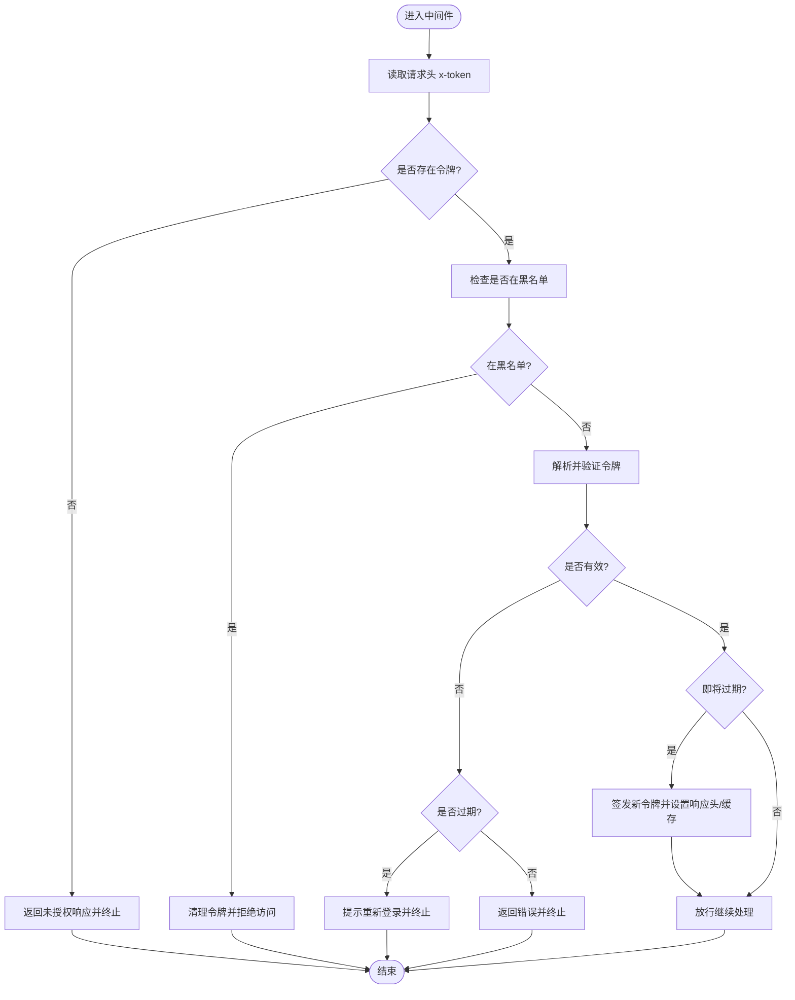
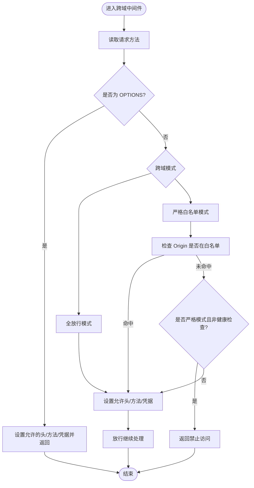
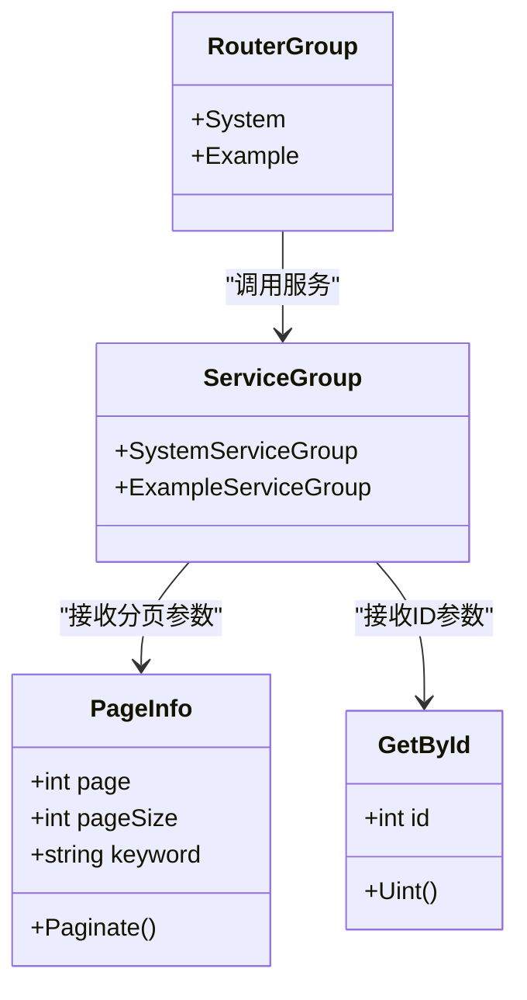
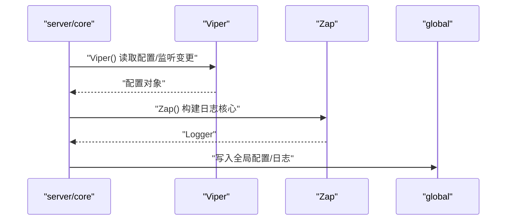
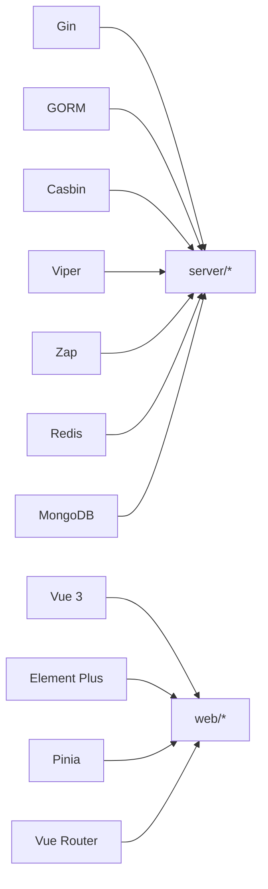

# 系统架构

<cite>
**本文引用的文件**
- [server/main.go](file://server/main.go)
- [server/core/server.go](file://server/core/server.go)
- [server/core/viper.go](file://server/core/viper.go)
- [server/core/zap.go](file://server/core/zap.go)
- [server/global/global.go](file://server/global/global.go)
- [server/config/config.go](file://server/config/config.go)
- [server/router/enter.go](file://server/router/enter.go)
- [server/middleware/jwt.go](file://server/middleware/jwt.go)
- [server/middleware/cors.go](file://server/middleware/cors.go)
- [server/service/enter.go](file://server/service/enter.go)
- [server/model/common/request/common.go](file://server/model/common/request/common.go)
- [web/src/main.js](file://web/src/main.js)
- [web/src/router/index.js](file://web/src/router/index.js)
- [server/go.mod](file://server/go.mod)
- [web/package.json](file://web/package.json)
</cite>

## 目录
1. [引言](#引言)
2. [项目结构](#项目结构)
3. [核心组件](#核心组件)
4. [架构总览](#架构总览)
5. [详细组件分析](#详细组件分析)
6. [依赖分析](#依赖分析)
7. [性能考虑](#性能考虑)
8. [故障排查指南](#故障排查指南)
9. [结论](#结论)
10. [附录](#附录)

## 引言
本系统是一个前后端分离的测试管理平台，采用 Gin（Go）作为后端 Web 框架与 MVC 分层架构，Vue 3 + Element Plus 作为前端框架与组件库，结合 GORM 实现数据持久化与多数据库支持，配合中间件体系实现认证、跨域、限流、日志与操作审计等横切能力。系统通过配置中心（Viper）、日志中心（Zap）、定时任务与插件化机制实现可扩展与可维护的工程化架构。

## 项目结构
- 后端（server）
  - 入口与启动：main.go 负责初始化系统并启动服务
  - 核心模块：core 提供配置加载、日志初始化、服务器启动
  - 路由与中间件：router 定义路由组；middleware 提供 JWT、跨域、限流等中间件
  - 业务层：service 提供系统与示例业务服务
  - 数据模型与请求响应：model 定义通用请求/响应结构
  - 全局状态：global 统一持有数据库、Redis、Mongo、配置、日志等全局对象
  - 配置：config 定义各类组件配置结构体
- 前端（web）
  - 入口：main.js 创建 Vue 应用并挂载
  - 路由：router/index.js 定义前端路由
  - 依赖：package.json 管理前端依赖与脚本

**图表来源**
- [server/main.go:30-52](file://server/main.go#L30-L52)
- [server/core/server.go:14-48](file://server/core/server.go#L14-L48)
- [server/router/enter.go:8-14](file://server/router/enter.go#L8-L14)
- [server/middleware/jwt.go:16-77](file://server/middleware/jwt.go#L16-L77)
- [server/service/enter.go:8-14](file://server/service/enter.go#L8-L14)
- [server/model/common/request/common.go:7-28](file://server/model/common/request/common.go#L7-L28)
- [server/global/global.go:25-42](file://server/global/global.go#L25-L42)
- [server/config/config.go:3-40](file://server/config/config.go#L3-L40)
- [web/src/main.js:21-38](file://web/src/main.js#L21-L38)
- [web/src/router/index.js:36-42](file://web/src/router/index.js#L36-L42)

**章节来源**
- [server/main.go:30-52](file://server/main.go#L30-L52)
- [web/src/main.js:21-38](file://web/src/main.js#L21-L38)

## 核心组件
- 应用入口与初始化
  - 后端入口负责初始化配置、日志、数据库、定时任务、表结构注册与全局处理器，随后启动 HTTP 服务器
  - 前端入口负责创建应用实例、安装 Element Plus、Pinia、路由、指令与权限守卫，并挂载
- 配置中心（Viper）
  - 动态加载 YAML 配置，支持命令行参数、环境变量与多模式文件切换，变更时自动热更新
- 日志中心（Zap）
  - 多级别核心聚合输出，支持行号、堆栈追踪与目录创建
- 路由与中间件
  - 路由按功能分组（系统/示例），中间件提供 JWT 鉴权、跨域、限流、超时、操作审计等
- 业务服务与数据模型
  - 服务层解耦控制器与数据访问；通用请求模型支持分页、批量 ID 查询等
- 全局状态与多数据源
  - 全局持有数据库、Redis/Multi-Redis、Mongo、配置、日志、定时器等；支持多数据库与命名 Redis 实例

**章节来源**
- [server/main.go:38-52](file://server/main.go#L38-L52)
- [server/core/viper.go:17-42](file://server/core/viper.go#L17-L42)
- [server/core/zap.go:15-36](file://server/core/zap.go#L15-L36)
- [server/router/enter.go:8-14](file://server/router/enter.go#L8-L14)
- [server/middleware/jwt.go:16-77](file://server/middleware/jwt.go#L16-L77)
- [server/middleware/cors.go:11-28](file://server/middleware/cors.go#L11-L28)
- [server/service/enter.go:8-14](file://server/service/enter.go#L8-L14)
- [server/model/common/request/common.go:7-28](file://server/model/common/request/common.go#L7-L28)
- [server/global/global.go:25-42](file://server/global/global.go#L25-L42)

## 架构总览
系统采用前后端分离的 MVC 架构：
- 前端：Vue 3 单页应用，基于路由与状态管理（Pinia）组织页面与交互
- 后端：Gin Web 框架，MVC 分层（路由/控制器、服务、数据访问），中间件统一处理横切关注点
- 数据层：GORM 支持 MySQL、PostgreSQL、SQL Server、Oracle、SQLite 等；可选 MongoDB；Redis 缓存与分布式会话
- 配置与日志：Viper 动态配置；Zap 结构化日志
- 安全：JWT 鉴权、Casbin RBAC（中间件）、跨域策略、IP 限制、超时控制
- 扩展：插件化机制与 MCP（独立服务）支持

**图表来源**
- [server/main.go:30-52](file://server/main.go#L30-L52)
- [server/core/server.go:14-48](file://server/core/server.go#L14-L48)
- [server/middleware/jwt.go:16-77](file://server/middleware/jwt.go#L16-L77)
- [server/middleware/cors.go:11-28](file://server/middleware/cors.go#L11-L28)
- [server/service/enter.go:8-14](file://server/service/enter.go#L8-L14)
- [server/global/global.go:25-42](file://server/global/global.go#L25-L42)
- [web/src/main.js:21-38](file://web/src/main.js#L21-L38)
- [web/src/router/index.js:36-42](file://web/src/router/index.js#L36-L42)

## 详细组件分析

### 后端启动流程与控制流
- 入口初始化顺序：读取配置 → 初始化日志 → 连接数据库 → 注册定时任务/表结构 → 注册全局处理器 → 启动服务器
- 服务器启动：根据配置决定是否启用 Redis/Mongo；打印欢迎信息与文档/MCP 地址；启动 HTTP 服务

**图表来源**
- [server/main.go:38-52](file://server/main.go#L38-L52)
- [server/core/server.go:14-48](file://server/core/server.go#L14-L48)

**章节来源**
- [server/main.go:38-52](file://server/main.go#L38-L52)
- [server/core/server.go:14-48](file://server/core/server.go#L14-L48)

### JWT 鉴权中间件流程
- 校验请求头中的令牌；若缺失或在黑名单中则拒绝
- 解析令牌并校验有效期；临近过期则签发新令牌并写入响应头与 Cookie
- 支持多端登录场景下的 Redis 记录

**图表来源**
- [server/middleware/jwt.go:16-77](file://server/middleware/jwt.go#L16-L77)

**章节来源**
- [server/middleware/jwt.go:16-77](file://server/middleware/jwt.go#L16-L77)

### 跨域中间件策略
- 全放行模式：对所有 Origin/Headers/Methods 放行，OPTIONS 直接返回
- 白名单模式：仅对命中规则的 Origin 生效，严格模式下未命中直接拒绝，否则 OPTIONS 放行

**图表来源**
- [server/middleware/cors.go:11-63](file://server/middleware/cors.go#L11-L63)

**章节来源**
- [server/middleware/cors.go:11-63](file://server/middleware/cors.go#L11-L63)

### MVC 分层与组件交互
- 控制器/路由：按功能分组（系统/示例），统一由路由入口聚合
- 服务层：封装业务逻辑，解耦控制器与数据访问
- 数据模型：通用请求结构（分页、批量 ID、角色 ID 等）

**图表来源**
- [server/router/enter.go:8-14](file://server/router/enter.go#L8-L14)
- [server/service/enter.go:8-14](file://server/service/enter.go#L8-L14)
- [server/model/common/request/common.go:7-28](file://server/model/common/request/common.go#L7-L28)

**章节来源**
- [server/router/enter.go:8-14](file://server/router/enter.go#L8-L14)
- [server/service/enter.go:8-14](file://server/service/enter.go#L8-L14)
- [server/model/common/request/common.go:7-28](file://server/model/common/request/common.go#L7-L28)

### 配置与日志初始化
- 配置加载：优先命令行参数，其次环境变量，最后按 Gin 模式选择文件，支持热更新
- 日志初始化：创建日志目录，构建多核聚合，启用行号与堆栈追踪

**图表来源**
- [server/core/viper.go:17-42](file://server/core/viper.go#L17-L42)
- [server/core/zap.go:15-36](file://server/core/zap.go#L15-L36)
- [server/global/global.go:25-42](file://server/global/global.go#L25-L42)

**章节来源**
- [server/core/viper.go:17-42](file://server/core/viper.go#L17-L42)
- [server/core/zap.go:15-36](file://server/core/zap.go#L15-L36)
- [server/global/global.go:25-42](file://server/global/global.go#L25-L42)

### 技术栈与组件作用
- 后端技术栈
  - Gin：高性能 HTTP 框架，提供路由与中间件生态
  - GORM：多数据库 ORM，支持 MySQL/PG/SQLServer/Oracle/SQLite
  - Casbin：RBAC 授权中间件（集成在中间件层）
  - Viper：配置中心，支持热更新
  - Zap：结构化日志
  - Redis：缓存与会话（可选）
  - MongoDB：文档存储（可选）
- 前端技术栈
  - Vue 3：渐进式框架，组合式 API
  - Element Plus：桌面端组件库
  - Pinia：状态管理
  - Vue Router：前端路由

**章节来源**
- [server/go.mod:7-61](file://server/go.mod#L7-L61)
- [web/package.json:14-57](file://web/package.json#L14-L57)

### 设计模式应用
- 中间件模式：JWT、跨域、限流、超时、日志、操作审计等以中间件形式串联
- 插件化架构：通过插件注册与初始化机制扩展业务能力
- 依赖注入：通过全局对象（数据库、Redis、Mongo、配置、日志）集中管理，避免硬编码
- 分层架构：控制器/服务/数据访问清晰分离，便于测试与维护

**章节来源**
- [server/middleware/jwt.go:16-77](file://server/middleware/jwt.go#L16-L77)
- [server/middleware/cors.go:11-63](file://server/middleware/cors.go#L11-L63)
- [server/global/global.go:25-42](file://server/global/global.go#L25-L42)

### 高可用性设计
- 多数据库与多 Redis 支持，便于横向扩展与灾备
- 定时任务与系统数据加载，保障服务启动一致性
- 跨域白名单与严格模式，降低外部攻击面
- JWT 过期续签与黑名单机制，提升会话安全性与可用性

**章节来源**
- [server/core/server.go:14-48](file://server/core/server.go#L14-L48)
- [server/middleware/jwt.go:56-68](file://server/middleware/jwt.go#L56-L68)
- [server/middleware/cors.go:30-63](file://server/middleware/cors.go#L30-L63)

### 安全考虑
- 认证：JWT 鉴权与 Redis 会话记录（多端登录）
- 授权：Casbin RBAC（中间件集成）
- 传输：HTTPS（部署层面建议）
- 输入：参数校验与分页上限（防止滥用）
- 审计：操作日志中间件

**章节来源**
- [server/middleware/jwt.go:16-77](file://server/middleware/jwt.go#L16-L77)
- [server/middleware/cors.go:11-63](file://server/middleware/cors.go#L11-L63)
- [server/model/common/request/common.go:14-27](file://server/model/common/request/common.go#L14-L27)

### 性能优化策略
- 分页上限与偏移计算，避免大偏移查询
- Redis 缓存热点数据与会话
- 多数据库连接池与只读分离（配置层面支持）
- 中间件链路精简与短路返回（如 OPTIONS 预检）
- 前端按需加载与路由懒加载

**章节来源**
- [server/model/common/request/common.go:14-27](file://server/model/common/request/common.go#L14-L27)
- [server/middleware/cors.go:21-24](file://server/middleware/cors.go#L21-L24)
- [web/src/router/index.js:36-42](file://web/src/router/index.js#L36-L42)

## 依赖分析
- 后端依赖
  - Gin：Web 框架与路由
  - GORM：ORM 与多驱动
  - Casbin：RBAC 授权
  - Viper：配置
  - Zap：日志
  - Redis/Mongo：缓存与文档存储
- 前端依赖
  - Vue 3、Element Plus、Pinia、Vue Router

**图表来源**
- [server/go.mod:7-61](file://server/go.mod#L7-L61)
- [web/package.json:14-57](file://web/package.json#L14-L57)

**章节来源**
- [server/go.mod:7-61](file://server/go.mod#L7-L61)
- [web/package.json:14-57](file://web/package.json#L14-L57)

## 性能考虑
- 后端
  - 合理设置分页大小与上限，避免一次性加载过多数据
  - 使用 Redis 缓存高频读取数据与会话
  - 选择合适的数据库驱动与连接池参数
- 前端
  - 路由懒加载与组件按需引入
  - 图片与静态资源 CDN 化
  - 减少不必要的全局状态更新

## 故障排查指南
- 配置问题
  - 检查配置文件路径与权限；确认命令行参数与环境变量生效
- 日志定位
  - 查看日志目录与级别配置；关注错误堆栈
- 路由与中间件
  - 确认中间件顺序与白名单配置；检查 OPTIONS 预检是否被正确放行
- 会话与认证
  - 检查 JWT 是否过期或在黑名单；确认 Redis 会话是否正常

**章节来源**
- [server/core/viper.go:44-76](file://server/core/viper.go#L44-L76)
- [server/core/zap.go:15-36](file://server/core/zap.go#L15-L36)
- [server/middleware/cors.go:30-63](file://server/middleware/cors.go#L30-L63)
- [server/middleware/jwt.go:25-44](file://server/middleware/jwt.go#L25-L44)

## 结论
该测试管理平台通过前后端分离与 MVC 分层设计，结合 Gin 的高性能与 Vue 3 的现代化开发体验，构建了可扩展、可维护、具备高可用与安全性的工程化系统。借助中间件模式、插件化机制与集中式配置/日志，系统在复杂业务场景下仍能保持清晰的职责边界与良好的演进空间。

## 附录
- 配置结构参考：Server 结构体包含 JWT、Zap、Redis、Mongo、Email、System、Captcha、Autocode、多数据库、OSS、Excel、磁盘列表、跨域、MCP 等字段
- 前端入口与路由：应用初始化与路由定义位于 web/src/main.js 与 web/src/router/index.js

**章节来源**
- [server/config/config.go:3-40](file://server/config/config.go#L3-L40)
- [web/src/main.js:21-38](file://web/src/main.js#L21-L38)
- [web/src/router/index.js:36-42](file://web/src/router/index.js#L36-L42)