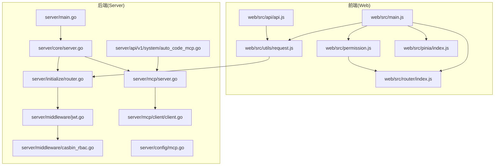
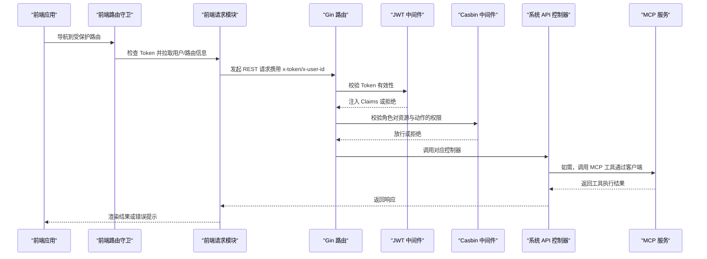
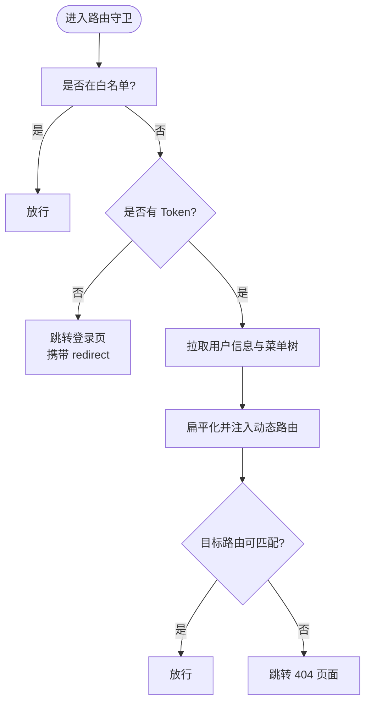
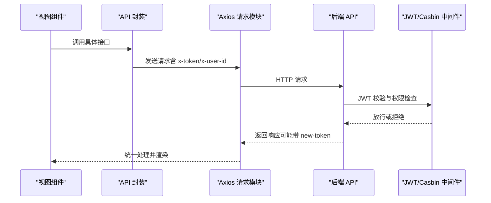
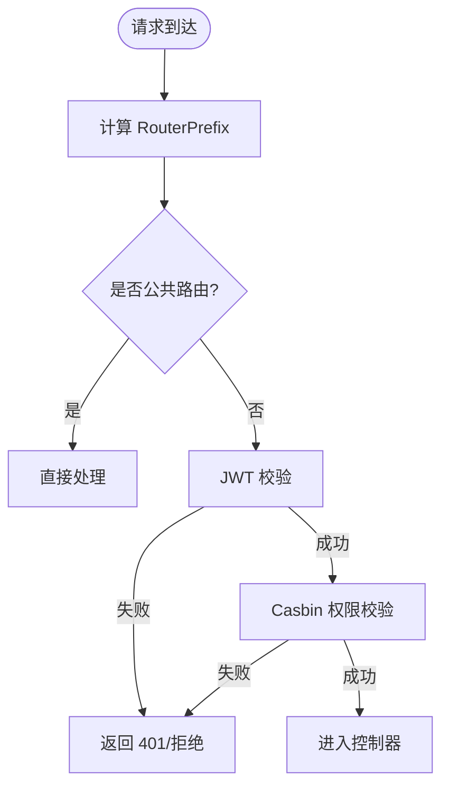
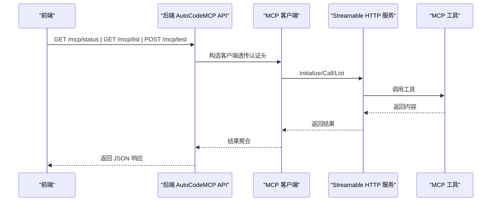
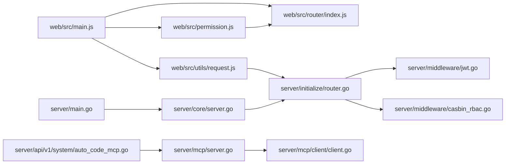

# 组件交互关系

<cite>
**本文引用的文件**
- [server/main.go](file://server/main.go)
- [server/core/server.go](file://server/core/server.go)
- [server/initialize/router.go](file://server/initialize/router.go)
- [server/middleware/jwt.go](file://server/middleware/jwt.go)
- [server/middleware/casbin_rbac.go](file://server/middleware/casbin_rbac.go)
- [server/api/v1/system/auto_code_mcp.go](file://server/api/v1/system/auto_code_mcp.go)
- [server/mcp/server.go](file://server/mcp/server.go)
- [server/mcp/client/client.go](file://server/mcp/client/client.go)
- [server/config/mcp.go](file://server/config/mcp.go)
- [web/src/main.js](file://web/src/main.js)
- [web/src/router/index.js](file://web/src/router/index.js)
- [web/src/permission.js](file://web/src/permission.js)
- [web/src/utils/request.js](file://web/src/utils/request.js)
- [web/src/pinia/index.js](file://web/src/pinia/index.js)
- [web/src/api/api.js](file://web/src/api/api.js)
</cite>

## 目录
1. [简介](#简介)
2. [项目结构](#项目结构)
3. [核心组件](#核心组件)
4. [架构总览](#架构总览)
5. [详细组件分析](#详细组件分析)
6. [依赖分析](#依赖分析)
7. [性能考虑](#性能考虑)
8. [故障排查指南](#故障排查指南)
9. [结论](#结论)
10. [附录](#附录)

## 简介
本文件面向测试管理平台的前端与后端组件交互，系统性梳理前后端通信机制（RESTful API、权限控制、路由与状态管理）、MCP 插件工具与主系统的交互模式，并提供时序图与交互图，帮助开发者快速理解复杂的数据流与组件关系。

## 项目结构
- 后端采用 Gin 框架，通过初始化流程装配路由、中间件、定时任务、数据库与插件系统；MCP 独立服务通过内置 HTTP 流式服务暴露工具能力。
- 前端基于 Vue3 + Pinia + Vue Router，通过 Axios 封装的请求模块与后端交互，配合路由守卫与权限指令实现登录态与权限控制。

图表来源
- [server/main.go:30-52](file://server/main.go#L30-L52)
- [server/core/server.go:14-49](file://server/core/server.go#L14-L49)
- [server/initialize/router.go:36-118](file://server/initialize/router.go#L36-L118)
- [server/middleware/jwt.go:16-78](file://server/middleware/jwt.go#L16-L78)
- [server/middleware/casbin_rbac.go:12-32](file://server/middleware/casbin_rbac.go#L12-L32)
- [server/mcp/server.go:11-53](file://server/mcp/server.go#L11-L53)
- [server/mcp/client/client.go:12-45](file://server/mcp/client/client.go#L12-L45)
- [server/config/mcp.go:1-19](file://server/config/mcp.go#L1-L19)
- [web/src/main.js:1-38](file://web/src/main.js#L1-L38)
- [web/src/router/index.js:1-42](file://web/src/router/index.js#L1-L42)
- [web/src/permission.js:155-209](file://web/src/permission.js#L155-L209)
- [web/src/utils/request.js:10-232](file://web/src/utils/request.js#L10-L232)
- [web/src/pinia/index.js:1-9](file://web/src/pinia/index.js#L1-L9)
- [web/src/api/api.js:1-207](file://web/src/api/api.js#L1-L207)

章节来源
- [server/main.go:30-52](file://server/main.go#L30-L52)
- [server/core/server.go:14-49](file://server/core/server.go#L14-L49)
- [server/initialize/router.go:36-118](file://server/initialize/router.go#L36-L118)
- [web/src/main.js:1-38](file://web/src/main.js#L1-L38)

## 核心组件
- 前端应用
  - 应用入口：初始化路由、权限守卫、Pinia、Element Plus、指令与错误处理。
  - 路由系统：基于 Hash 模式的动态路由，支持白名单、异步路由注入与 keep-alive。
  - 状态管理：Pinia Store 管理应用、用户、字典等状态。
  - 请求模块：Axios 封装，自动注入 Token、用户 ID、超时与加载提示，统一响应处理与 401 跳转。
  - API 封装：按模块导出 REST 接口，供视图层调用。
- 后端服务
  - 初始化流程：读取配置、连接数据库、注册全局处理器、初始化表结构、加载系统数据。
  - 路由与中间件：公开/私有路由组，JWT 鉴权与 Casbin RBAC 权限校验。
  - MCP 服务：内置 Streamable HTTP 服务，暴露工具注册、健康检查与工具调用能力。
  - API 层：提供 MCP 工具创建、状态查询、启动/停止、工具列表与调用测试等接口。

章节来源
- [web/src/main.js:1-38](file://web/src/main.js#L1-L38)
- [web/src/router/index.js:1-42](file://web/src/router/index.js#L1-L42)
- [web/src/permission.js:155-209](file://web/src/permission.js#L155-L209)
- [web/src/pinia/index.js:1-9](file://web/src/pinia/index.js#L1-L9)
- [web/src/utils/request.js:10-232](file://web/src/utils/request.js#L10-L232)
- [web/src/api/api.js:1-207](file://web/src/api/api.js#L1-L207)
- [server/core/server.go:14-49](file://server/core/server.go#L14-L49)
- [server/initialize/router.go:36-118](file://server/initialize/router.go#L36-L118)
- [server/middleware/jwt.go:16-78](file://server/middleware/jwt.go#L16-L78)
- [server/middleware/casbin_rbac.go:12-32](file://server/middleware/casbin_rbac.go#L12-L32)
- [server/mcp/server.go:11-53](file://server/mcp/server.go#L11-L53)
- [server/api/v1/system/auto_code_mcp.go:15-174](file://server/api/v1/system/auto_code_mcp.go#L15-L174)

## 架构总览
- 前端通过 Axios 与后端 REST API 通信，请求头携带 Token 与用户 ID；后端 JWT 中间件解析并校验 Token，Casbin 中间件按角色校验资源与动作。
- 路由守卫在进入受保护路由前检查 Token 与异步路由构建状态，必要时拉取用户信息与菜单树并注入动态路由。
- MCP 工具通过后端内置的 Streamable HTTP 服务暴露，前端可查询工具列表、测试调用，后端 API 层负责与 MCP 服务交互并返回结果。

图表来源
- [web/src/permission.js:155-209](file://web/src/permission.js#L155-L209)
- [web/src/utils/request.js:10-232](file://web/src/utils/request.js#L10-L232)
- [server/initialize/router.go:36-118](file://server/initialize/router.go#L36-L118)
- [server/middleware/jwt.go:16-78](file://server/middleware/jwt.go#L16-L78)
- [server/middleware/casbin_rbac.go:12-32](file://server/middleware/casbin_rbac.go#L12-L32)
- [server/api/v1/system/auto_code_mcp.go:15-174](file://server/api/v1/system/auto_code_mcp.go#L15-L174)
- [server/mcp/server.go:11-53](file://server/mcp/server.go#L11-L53)

## 详细组件分析

### 前端路由与权限控制
- 路由守卫职责
  - 白名单放行（登录、初始化）。
  - 未登录强制跳转登录页，携带 redirect 参数。
  - 已登录时异步拉取用户信息与菜单树，扁平化生成二级路由并注入到 layout 下。
  - 支持客户端直连页面标记，直接放行。
- 动态路由注入策略
  - 顶层 layout 仅承载，不参与路径拼接；defaultMenu 标记的路由作为顶级路由，其子节点作为该顶级的二级页面。
  - 子路由使用相对路径，避免重复前缀。

图表来源
- [web/src/permission.js:155-209](file://web/src/permission.js#L155-L209)
- [web/src/router/index.js:1-42](file://web/src/router/index.js#L1-L42)

章节来源
- [web/src/permission.js:155-209](file://web/src/permission.js#L155-L209)
- [web/src/router/index.js:1-42](file://web/src/router/index.js#L1-L42)

### 前端请求模块与后端 API 交互
- 请求拦截器
  - 自动设置 baseURL（来自环境变量）、超时、加载遮罩。
  - 注入 x-token 与 x-user-id。
- 响应拦截器
  - 自动关闭加载遮罩。
  - 处理新 Token 头部并更新本地存储。
  - 统一错误提示与 401 跳转。
- API 封装
  - 按模块导出接口，如获取 API 列表、创建/更新/删除 API、刷新 Casbin 缓存等。

图表来源
- [web/src/api/api.js:1-207](file://web/src/api/api.js#L1-L207)
- [web/src/utils/request.js:10-232](file://web/src/utils/request.js#L10-L232)
- [server/initialize/router.go:36-118](file://server/initialize/router.go#L36-L118)
- [server/middleware/jwt.go:16-78](file://server/middleware/jwt.go#L16-L78)
- [server/middleware/casbin_rbac.go:12-32](file://server/middleware/casbin_rbac.go#L12-L32)

章节来源
- [web/src/utils/request.js:10-232](file://web/src/utils/request.js#L10-L232)
- [web/src/api/api.js:1-207](file://web/src/api/api.js#L1-L207)

### 后端路由与中间件
- 路由组织
  - 公共路由组与私有路由组分离；私有路由组启用 JWT 与 Casbin 中间件。
  - Swagger 文档路径与 RouterPrefix 配置联动。
- 中间件
  - JWTAuth：从请求头提取 Token，解析并注入 Claims；过期或黑名单时拒绝。
  - CasbinHandler：按角色、资源路径、HTTP 方法进行权限判断。

图表来源
- [server/initialize/router.go:36-118](file://server/initialize/router.go#L36-L118)
- [server/middleware/jwt.go:16-78](file://server/middleware/jwt.go#L16-L78)
- [server/middleware/casbin_rbac.go:12-32](file://server/middleware/casbin_rbac.go#L12-L32)

章节来源
- [server/initialize/router.go:36-118](file://server/initialize/router.go#L36-L118)
- [server/middleware/jwt.go:16-78](file://server/middleware/jwt.go#L16-L78)
- [server/middleware/casbin_rbac.go:12-32](file://server/middleware/casbin_rbac.go#L12-L32)

### MCP 工具与主系统的交互
- MCP 服务
  - 内置 Streamable HTTP 服务，默认路径“/mcp”，提供健康检查与工具注册。
  - 支持通过配置项设置服务名、版本、监听地址与上游 BaseURL。
- 前端对接
  - 通过后端 API 查询 MCP 状态、列出工具、测试调用；API 层使用 MCP 客户端发起请求并透传响应。
- 后端 API
  - 提供创建 MCP 工具、查询状态、启动/停止独立服务、列举工具、测试调用等接口。
  - 在调用 MCP 时，从当前请求头中透传认证头，确保工具侧鉴权一致。

图表来源
- [server/api/v1/system/auto_code_mcp.go:15-174](file://server/api/v1/system/auto_code_mcp.go#L15-L174)
- [server/mcp/client/client.go:12-45](file://server/mcp/client/client.go#L12-L45)
- [server/mcp/server.go:11-53](file://server/mcp/server.go#L11-L53)
- [server/config/mcp.go:1-19](file://server/config/mcp.go#L1-L19)

章节来源
- [server/api/v1/system/auto_code_mcp.go:15-174](file://server/api/v1/system/auto_code_mcp.go#L15-L174)
- [server/mcp/client/client.go:12-45](file://server/mcp/client/client.go#L12-L45)
- [server/mcp/server.go:11-53](file://server/mcp/server.go#L11-L53)
- [server/config/mcp.go:1-19](file://server/config/mcp.go#L1-L19)

### WebSocket 与 SSE（概念性说明）
- 当前仓库未发现显式的 WebSocket 实现；MCP 服务为 Streamable HTTP，非传统 WebSocket。
- 若未来需要实时事件推送，建议在后端引入 SSE 或 WebSocket，并在前端通过 EventSource 或 Socket.IO 订阅。

（本节为概念性说明，不直接分析具体文件）

## 依赖分析
- 前端依赖
  - main.js 作为应用入口，串联路由、权限、Pinia、Element Plus 与错误处理。
  - permission.js 依赖路由与用户 Store，负责动态路由注入与守卫。
  - request.js 依赖用户 Store 与 Element Plus，负责统一请求与响应处理。
- 后端依赖
  - main.go 调用 core.RunServer，后者初始化 Redis/Mongo、加载系统数据并启动路由。
  - initialize.Routers 组织路由与中间件，注册系统与插件路由。
  - mcp/server.go 提供 MCP 服务与 HTTP 路由挂载。
  - api/v1/system/auto_code_mcp.go 依赖 mcp/server 与 mcp/client，实现 MCP 工具生命周期与调用。

图表来源
- [web/src/main.js:1-38](file://web/src/main.js#L1-L38)
- [web/src/permission.js:155-209](file://web/src/permission.js#L155-L209)
- [web/src/utils/request.js:10-232](file://web/src/utils/request.js#L10-L232)
- [server/initialize/router.go:36-118](file://server/initialize/router.go#L36-L118)
- [server/middleware/jwt.go:16-78](file://server/middleware/jwt.go#L16-L78)
- [server/middleware/casbin_rbac.go:12-32](file://server/middleware/casbin_rbac.go#L12-L32)
- [server/api/v1/system/auto_code_mcp.go:15-174](file://server/api/v1/system/auto_code_mcp.go#L15-L174)
- [server/mcp/server.go:11-53](file://server/mcp/server.go#L11-L53)
- [server/mcp/client/client.go:12-45](file://server/mcp/client/client.go#L12-L45)
- [server/main.go:30-52](file://server/main.go#L30-L52)
- [server/core/server.go:14-49](file://server/core/server.go#L14-L49)

章节来源
- [web/src/main.js:1-38](file://web/src/main.js#L1-L38)
- [server/initialize/router.go:36-118](file://server/initialize/router.go#L36-L118)
- [server/mcp/server.go:11-53](file://server/mcp/server.go#L11-L53)

## 性能考虑
- 前端
  - 加载遮罩与超时控制：避免长时间无反馈；合理设置持久化加载计数，防止遮罩泄漏。
  - 路由懒加载：组件按需加载，减少首屏体积。
  - 状态集中管理：Pinia Store 避免重复请求与冗余渲染。
- 后端
  - JWT 缓存与黑名单：避免频繁数据库查询；Redis 可选启用多端登录场景。
  - 路由与中间件顺序：将快速失败的中间件前置，减少无效处理。
  - MCP 客户端复用：在高并发场景下复用连接与上下文，降低握手开销。

（本节为通用指导，不直接分析具体文件）

## 故障排查指南
- 前端
  - 401 错误：检查 x-token 是否存在且未过期；关注响应头 new-token 是否更新本地 Token。
  - 路由无法访问：确认路由守卫是否完成异步路由注入；检查菜单树中是否存在目标路由。
  - 加载遮罩不消失：检查 donNotShowLoading 与 persistLoading 使用是否正确。
- 后端
  - JWT 校验失败：确认请求头 x-token 是否正确传递；检查黑名单与过期策略。
  - 权限不足：确认角色 ID 与资源路径、HTTP 方法是否匹配；必要时刷新 Casbin 策略。
  - MCP 无法连接：检查 MCP 服务地址、认证头与路径配置；确认 Streamable HTTP 服务已启动。

章节来源
- [web/src/utils/request.js:159-223](file://web/src/utils/request.js#L159-L223)
- [web/src/permission.js:155-209](file://web/src/permission.js#L155-L209)
- [server/middleware/jwt.go:16-78](file://server/middleware/jwt.go#L16-L78)
- [server/middleware/casbin_rbac.go:12-32](file://server/middleware/casbin_rbac.go#L12-L32)
- [server/api/v1/system/auto_code_mcp.go:70-96](file://server/api/v1/system/auto_code_mcp.go#L70-L96)

## 结论
本平台通过清晰的前后端边界与中间件体系，实现了可靠的鉴权与权限控制；MCP 服务以 Streamable HTTP 形式无缝集成，满足插件化扩展需求。前端路由守卫与状态管理保证了用户体验与性能；后端路由与中间件确保了安全与可维护性。建议在后续迭代中持续优化加载体验与 MCP 客户端连接池策略，并在需要时引入 SSE/WS 以增强实时能力。

## 附录
- 关键配置项
  - MCP 服务名、版本、监听路径、认证头、上游 BaseURL、请求超时等。
- 常用接口
  - 前端 API 封装示例：获取 API 列表、创建/更新/删除 API、刷新 Casbin 缓存等。
- 启动与部署
  - 后端入口 main.go 调用初始化与启动流程；MCP 独立服务可通过命令行启动并配合配置文件。

章节来源
- [server/config/mcp.go:1-19](file://server/config/mcp.go#L1-L19)
- [web/src/api/api.js:1-207](file://web/src/api/api.js#L1-L207)
- [server/main.go:30-52](file://server/main.go#L30-L52)
- [server/core/server.go:14-49](file://server/core/server.go#L14-L49)