# 中间件链模式

<cite>
**本文引用的文件**
- [server/main.go](file://server/main.go)
- [server/core/server.go](file://server/core/server.go)
- [server/initialize/router.go](file://server/initialize/router.go)
- [server/middleware/jwt.go](file://server/middleware/jwt.go)
- [server/middleware/cors.go](file://server/middleware/cors.go)
- [server/middleware/logger.go](file://server/middleware/logger.go)
- [server/middleware/error.go](file://server/middleware/error.go)
- [server/middleware/timeout.go](file://server/middleware/timeout.go)
- [server/middleware/casbin_rbac.go](file://server/middleware/casbin_rbac.go)
- [server/middleware/limit_ip.go](file://server/middleware/limit_ip.go)
- [server/middleware/operation.go](file://server/middleware/operation.go)
- [server/middleware/email.go](file://server/middleware/email.go)
- [server/middleware/loadtls.go](file://server/middleware/loadtls.go)
- [server/config/cors.go](file://server/config/cors.go)
- [server/config/jwt.go](file://server/config/jwt.go)
- [server/router/system/sys_user.go](file://server/router/system/sys_user.go)
</cite>

## 目录
1. [引言](#引言)
2. [项目结构](#项目结构)
3. [核心组件](#核心组件)
4. [架构总览](#架构总览)
5. [详细组件分析](#详细组件分析)
6. [依赖分析](#依赖分析)
7. [性能考虑](#性能考虑)
8. [故障排查指南](#故障排查指南)
9. [结论](#结论)
10. [附录](#附录)

## 引言
本文件围绕测试管理平台的中间件链模式展开，系统性阐述基于 Gin 的中间件执行机制与责任链模式的应用。重点覆盖以下方面：
- 中间件的职责与执行顺序：JWT 认证、CORS 跨域、日志记录、异常恢复、超时控制、RBAC 权限校验、IP 限流、操作审计、错误邮件通知、HTTPS 强制等。
- 中间件的注册与调用流程：全局中间件、路由组中间件、单路由中间件的组合与嵌套。
- 中间件编写规范与最佳实践：参数化、可配置、可插拔、最小侵入、性能与安全兼顾。
- 调试方法与性能优化技巧：日志布局、错误捕获、上下文超时、响应体缓冲池、限流策略。

## 项目结构
中间件位于 server/middleware 目录，按功能分层组织；路由初始化在 server/initialize/router.go 中完成全局与分组中间件的注册；核心入口在 server/main.go 与 server/core/server.go 中完成系统初始化与服务启动。

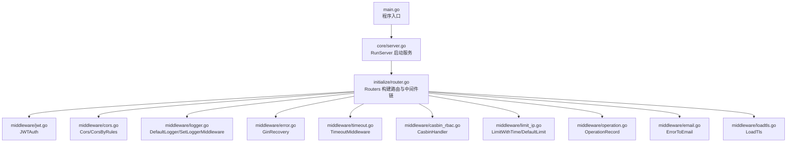

图表来源
- [server/main.go:30-35](file://server/main.go#L30-L35)
- [server/core/server.go:32-47](file://server/core/server.go#L32-L47)
- [server/initialize/router.go:36-117](file://server/initialize/router.go#L36-L117)

章节来源
- [server/main.go:30-35](file://server/main.go#L30-L35)
- [server/core/server.go:32-47](file://server/core/server.go#L32-L47)
- [server/initialize/router.go:36-117](file://server/initialize/router.go#L36-L117)

## 核心组件
- 全局中间件
  - 异常恢复：GinRecovery，捕获 panic 并记录日志与错误入库。
  - 开发日志：gin.Logger（Debug 模式下）。
- 路由组中间件
  - 公共组 PublicGroup：开放路由，通常不加鉴权。
  - 私有组 PrivateGroup：使用 JWTAuth 与 CasbinHandler，实现“鉴权 + RBAC”双保险。
- 单路由中间件
  - OperationRecord：对特定路由组进行操作审计。
  - TimeoutMiddleware：为个别路由设置超时保护。
  - LimitWithTime/DefaultLimit：IP 限流。
  - ErrorToEmail：错误发生时发送邮件通知。
  - LoadTls：强制 HTTPS（可选）。
  - Cors/CorsByRules：跨域处理（可选）。

章节来源
- [server/initialize/router.go:36-117](file://server/initialize/router.go#L36-L117)
- [server/middleware/error.go:21-79](file://server/middleware/error.go#L21-L79)
- [server/middleware/jwt.go:16-77](file://server/middleware/jwt.go#L16-L77)
- [server/middleware/casbin_rbac.go:13-32](file://server/middleware/casbin_rbac.go#L13-L32)
- [server/middleware/operation.go:31-119](file://server/middleware/operation.go#L31-L119)
- [server/middleware/timeout.go:13-55](file://server/middleware/timeout.go#L13-L55)
- [server/middleware/limit_ip.go:27-62](file://server/middleware/limit_ip.go#L27-L62)
- [server/middleware/email.go:18-58](file://server/middleware/email.go#L18-L58)
- [server/middleware/loadtls.go:12-27](file://server/middleware/loadtls.go#L12-L27)
- [server/middleware/cors.go:11-28](file://server/middleware/cors.go#L11-L28)

## 架构总览
下图展示了典型请求在中间件链上的流转过程，包括鉴权、跨域、日志、审计、权限校验、超时、异常恢复等环节。

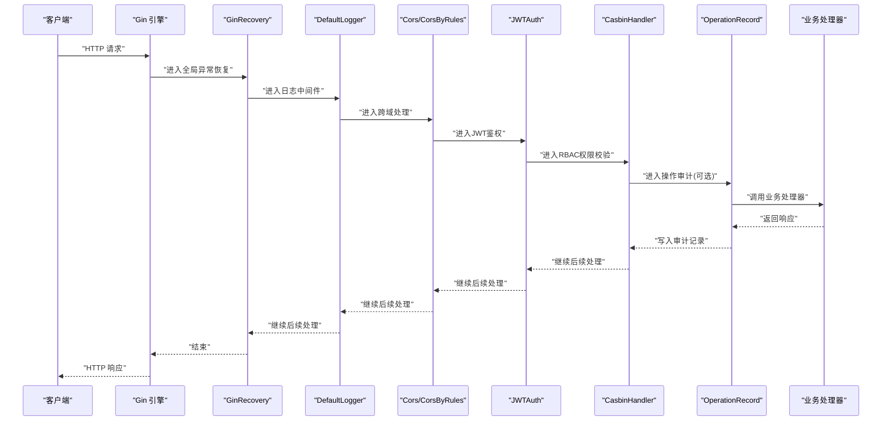

图表来源
- [server/initialize/router.go:36-117](file://server/initialize/router.go#L36-L117)
- [server/middleware/error.go:21-79](file://server/middleware/error.go#L21-L79)
- [server/middleware/logger.go:41-78](file://server/middleware/logger.go#L41-L78)
- [server/middleware/cors.go:11-28](file://server/middleware/cors.go#L11-L28)
- [server/middleware/jwt.go:16-77](file://server/middleware/jwt.go#L16-L77)
- [server/middleware/casbin_rbac.go:13-32](file://server/middleware/casbin_rbac.go#L13-L32)
- [server/middleware/operation.go:31-119](file://server/middleware/operation.go#L31-L119)

## 详细组件分析

### JWT 认证中间件
- 职责：校验请求头中的令牌，解析用户声明，处理过期与刷新，支持多端登录与黑名单校验。
- 执行要点：
  - 从请求中提取令牌，若缺失则终止并返回未授权。
  - 检查黑名单，若命中则清除令牌并终止。
  - 解析令牌，区分过期与无效错误，分别处理。
  - 在即将过期时自动刷新令牌并回写响应头与 Cookie。
  - 将用户声明注入上下文供后续中间件与处理器使用。
- 性能与安全：
  - 黑名单检查与 Redis 交互需关注延迟。
  - 刷新令牌时注意幂等与并发安全。
- 最佳实践：
  - 将 JWT 配置参数化，支持过期时间与缓冲时间。
  - 仅在私有路由组启用，避免泄露敏感信息。

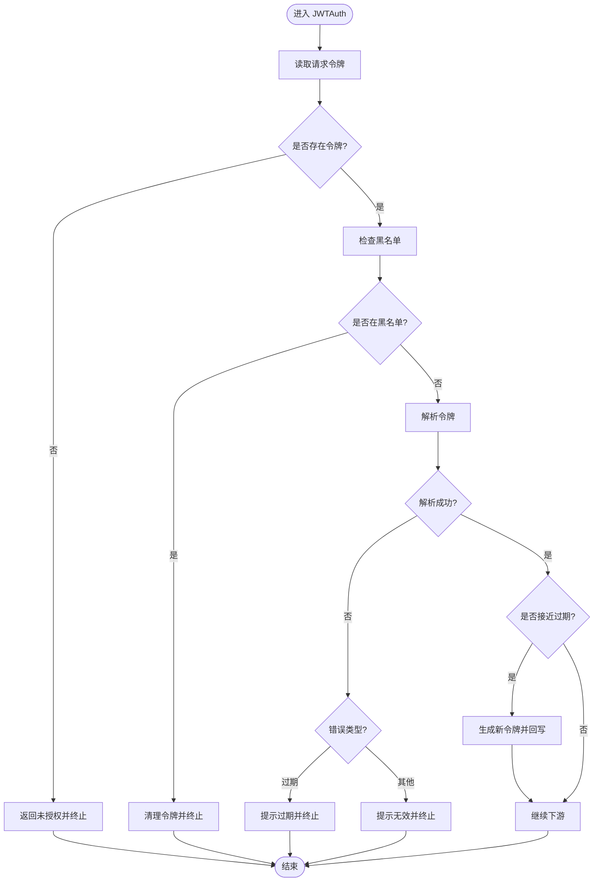

图表来源
- [server/middleware/jwt.go:16-77](file://server/middleware/jwt.go#L16-L77)

章节来源
- [server/middleware/jwt.go:16-77](file://server/middleware/jwt.go#L16-L77)
- [server/config/jwt.go:3-9](file://server/config/jwt.go#L3-L9)

### CORS 跨域中间件
- 职责：处理跨域请求头与预检请求，支持“放行全部”和“按规则白名单”两种模式。
- 执行要点：
  - 放行全部：直接设置允许的 Origin、Headers、Methods、Credentials 等。
  - 白名单模式：根据配置的 AllowOrigin 匹配，严格模式下未通过检查直接拒绝。
  - 对 OPTIONS 预检请求快速返回。
- 最佳实践：
  - 生产环境建议使用白名单模式，避免安全风险。
  - 预检缓存与暴露头需与实际业务一致。

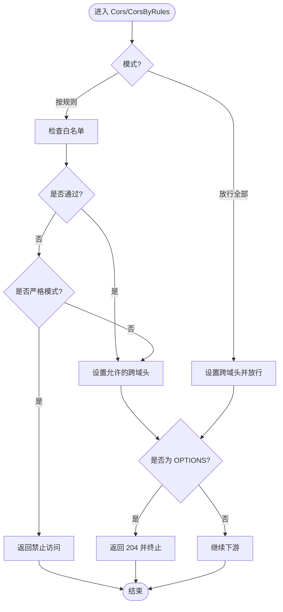

图表来源
- [server/middleware/cors.go:11-28](file://server/middleware/cors.go#L11-L28)
- [server/middleware/cors.go:31-62](file://server/middleware/cors.go#L31-L62)
- [server/config/cors.go:3-14](file://server/config/cors.go#L3-L14)

章节来源
- [server/middleware/cors.go:11-28](file://server/middleware/cors.go#L11-L28)
- [server/middleware/cors.go:31-62](file://server/middleware/cors.go#L31-L62)
- [server/config/cors.go:3-14](file://server/config/cors.go#L3-L14)

### 日志记录中间件
- 职责：统一采集请求路径、查询参数、请求体、客户端 IP、UA、耗时、错误、来源等，支持过滤、脱敏与自定义输出。
- 执行要点：
  - 在进入下游前记录开始时间与请求元数据。
  - 在下游返回后计算耗时并组装日志结构体。
  - 支持自定义过滤器、关键字过滤、鉴权处理回调与打印输出。
- 最佳实践：
  - 对敏感字段进行脱敏处理。
  - 控制请求体大小，避免日志膨胀。
  - 输出到标准输出便于容器日志收集。

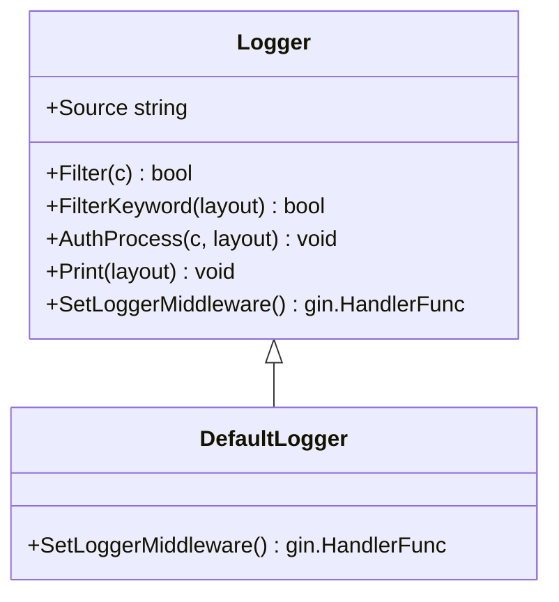

图表来源
- [server/middleware/logger.go:28-78](file://server/middleware/logger.go#L28-L78)

章节来源
- [server/middleware/logger.go:28-78](file://server/middleware/logger.go#L28-L78)

### 异常恢复中间件
- 职责：捕获 panic，区分“断开连接”与一般异常，记录请求与堆栈，必要时入库保存错误信息。
- 执行要点：
  - 识别网络断开类错误，避免向已断开连接写入状态。
  - 可选择是否记录堆栈。
  - 返回统一的内部错误状态码。
- 最佳实践：
  - 生产环境建议开启堆栈记录以便定位问题。
  - 与日志系统配合，确保错误可追溯。

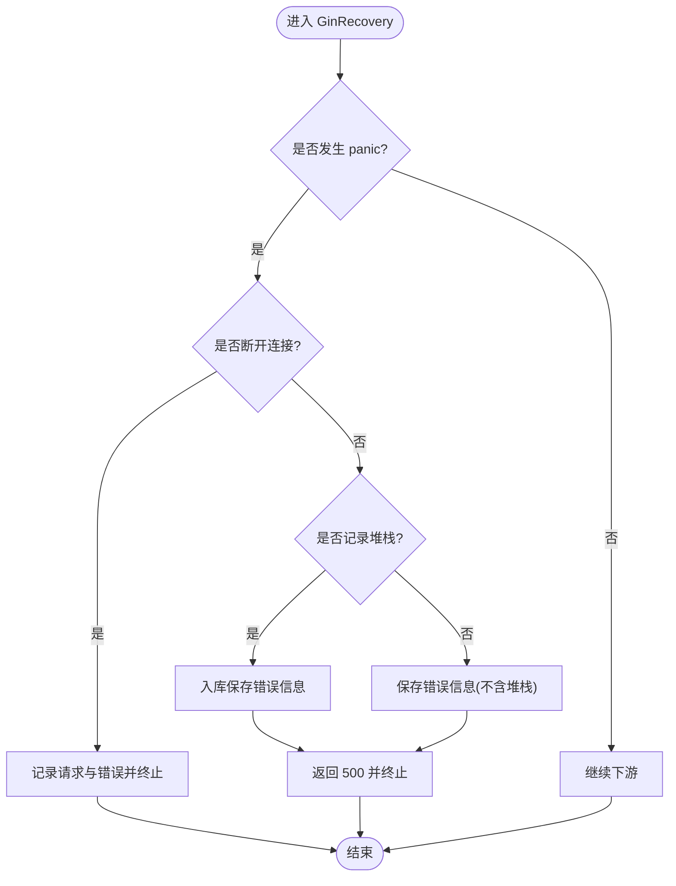

图表来源
- [server/middleware/error.go:21-79](file://server/middleware/error.go#L21-L79)

章节来源
- [server/middleware/error.go:21-79](file://server/middleware/error.go#L21-L79)

### 超时中间件
- 职责：为单路由设置超时，防止慢请求阻塞资源。
- 执行要点：
  - 使用带缓冲的 channel 避免 goroutine 泄漏。
  - 在超时发生时设置连接关闭头并返回网关超时。
- 最佳实践：
  - 为易慢的路由（如导出、批量任务）单独设置超时。
  - 与上游负载均衡器超时配置协同。

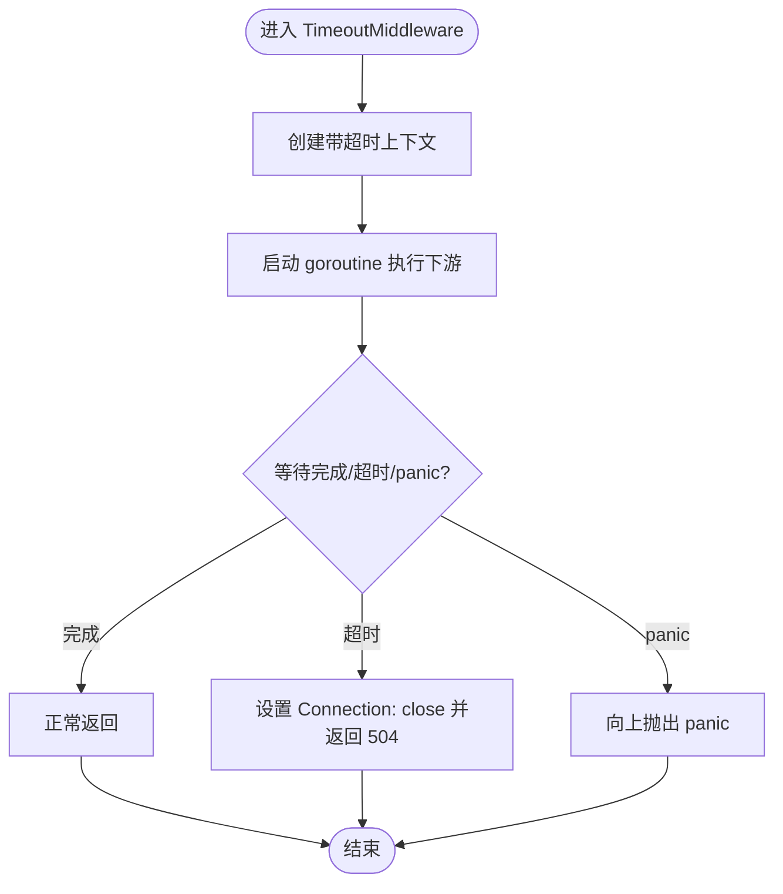

图表来源
- [server/middleware/timeout.go:13-55](file://server/middleware/timeout.go#L13-L55)

章节来源
- [server/middleware/timeout.go:13-55](file://server/middleware/timeout.go#L13-L55)

### RBAC 权限中间件
- 职责：基于 Casbin 策略引擎进行权限校验，依据用户角色、请求路径与方法判定。
- 执行要点：
  - 从上下文中获取用户角色 ID。
  - 去除路由前缀后构造对象资源。
  - 调用 Enforce 判断，失败则返回权限不足并终止。
- 最佳实践：
  - 在私有路由组统一启用。
  - 策略模型与权限表需与业务保持一致。

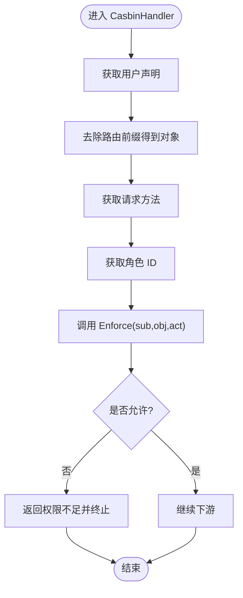

图表来源
- [server/middleware/casbin_rbac.go:13-32](file://server/middleware/casbin_rbac.go#L13-L32)

章节来源
- [server/middleware/casbin_rbac.go:13-32](file://server/middleware/casbin_rbac.go#L13-L32)

### IP 限流中间件
- 职责：基于 Redis 对客户端 IP 进行周期性限流。
- 执行要点：
  - 默认键生成规则为“GVA_Limit + 客户端 IP”。
  - 使用管道保证计数与过期原子性。
  - 达到阈值时返回友好提示。
- 最佳实践：
  - 结合业务场景调整周期与阈值。
  - Redis 不可用时应降级处理。

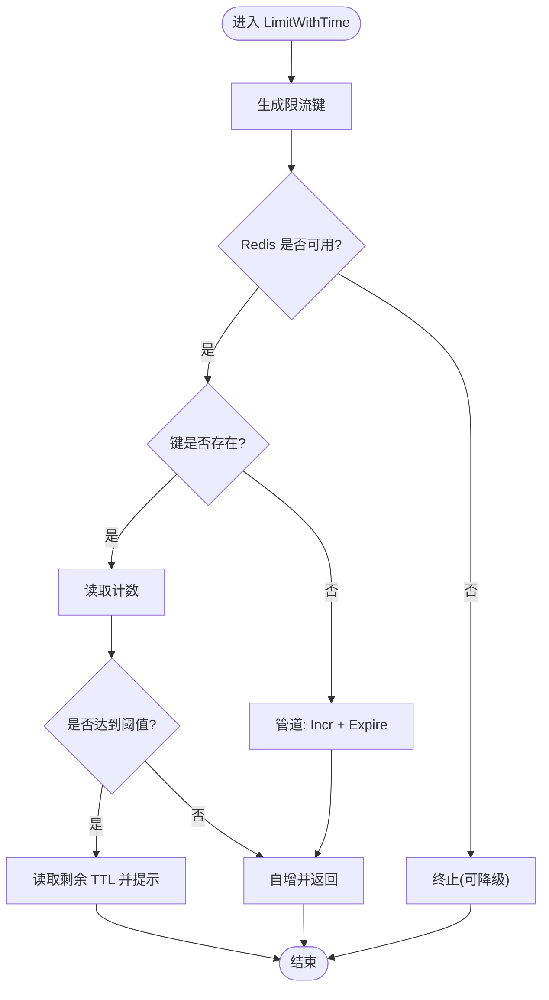

图表来源
- [server/middleware/limit_ip.go:27-62](file://server/middleware/limit_ip.go#L27-L62)
- [server/middleware/limit_ip.go:65-92](file://server/middleware/limit_ip.go#L65-L92)

章节来源
- [server/middleware/limit_ip.go:27-62](file://server/middleware/limit_ip.go#L27-L62)
- [server/middleware/limit_ip.go:65-92](file://server/middleware/limit_ip.go#L65-L92)

### 操作审计中间件
- 职责：记录请求与响应关键信息，支持大响应体裁剪与附件场景特殊处理。
- 执行要点：
  - 包装 ResponseWriter 捕获响应体。
  - 对 GET 查询串与非 GET 请求体进行序列化。
  - 对附件类型与超长响应进行裁剪，避免日志膨胀。
- 最佳实践：
  - 仅对关键路由启用，避免审计风暴。
  - 注意内存占用，必要时落库异步处理。

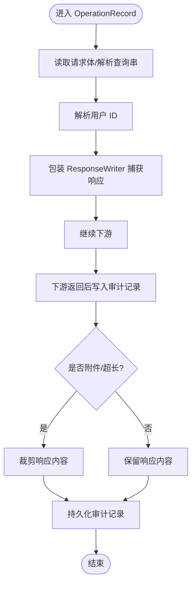

图表来源
- [server/middleware/operation.go:31-119](file://server/middleware/operation.go#L31-L119)

章节来源
- [server/middleware/operation.go:31-119](file://server/middleware/operation.go#L31-L119)

### 错误邮件通知中间件
- 职责：在非 200 响应时，将请求与错误信息整理并通过邮件发送给指定用户。
- 执行要点：
  - 从上下文或请求头解析用户名。
  - 读取请求体并回写，保证下游可正常消费。
  - 统计耗时与错误消息，拼装邮件主题与正文。
- 最佳实践：
  - 仅对关键业务启用，避免邮件风暴。
  - 邮件服务异常不应影响主流程。

章节来源
- [server/middleware/email.go:18-58](file://server/middleware/email.go#L18-L58)

### HTTPS 强制中间件
- 职责：通过 secure 库强制跳转 HTTPS 或设置安全头。
- 执行要点：
  - 处理过程中如遇错误直接终止。
  - 可选启用，部署时结合证书配置。
- 最佳实践：
  - 仅在生产环境启用，避免本地开发困扰。

章节来源
- [server/middleware/loadtls.go:12-27](file://server/middleware/loadtls.go#L12-L27)

## 依赖分析
- 中间件之间的耦合度低，主要通过 Gin 的 Next/Abort 控制流串联。
- 路由组中间件与单路由中间件形成“外层全局 -> 内层分组 -> 内层单路由”的责任链。
- 外部依赖：
  - JWT 解析依赖 golang-jwt。
  - Redis 限流依赖 go-redis。
  - 日志依赖 zap。
  - 安全中间件依赖 unrolled/secure。
  - Swagger 文档依赖 gin-swagger。

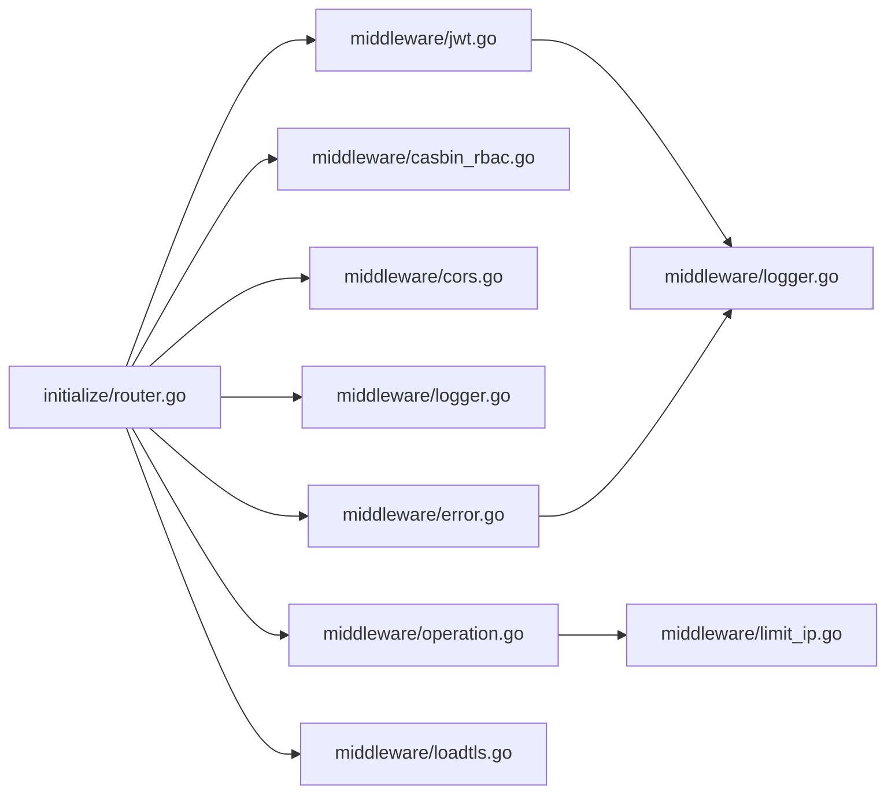

图表来源
- [server/initialize/router.go:36-117](file://server/initialize/router.go#L36-L117)
- [server/middleware/jwt.go:16-77](file://server/middleware/jwt.go#L16-L77)
- [server/middleware/casbin_rbac.go:13-32](file://server/middleware/casbin_rbac.go#L13-L32)
- [server/middleware/cors.go:11-28](file://server/middleware/cors.go#L11-L28)
- [server/middleware/logger.go:41-78](file://server/middleware/logger.go#L41-L78)
- [server/middleware/error.go:21-79](file://server/middleware/error.go#L21-L79)
- [server/middleware/operation.go:31-119](file://server/middleware/operation.go#L31-L119)
- [server/middleware/loadtls.go:12-27](file://server/middleware/loadtls.go#L12-L27)
- [server/middleware/limit_ip.go:27-62](file://server/middleware/limit_ip.go#L27-L62)

章节来源
- [server/initialize/router.go:36-117](file://server/initialize/router.go#L36-L117)

## 性能考虑
- 中间件顺序优化
  - 将短路判断靠前：CORS 预检、限流、鉴权尽早失败。
  - 将昂贵操作靠后：日志与审计可按需启用。
- 资源复用
  - 日志中间件使用 JSON 序列化，避免重复分配。
  - 操作审计使用 sync.Pool 缓冲响应体，降低 GC 压力。
- 异步与降级
  - 审计与错误邮件建议异步落库或队列，避免阻塞主流程。
  - Redis 不可用时，限流可降级为内存计数或直接放行。
- 超时与熔断
  - 对外部依赖（如邮件、审计存储）设置合理超时。
  - 对热点路由启用独立超时策略。

## 故障排查指南
- 无法登录或频繁掉线
  - 检查 JWT 过期与缓冲时间配置。
  - 核对黑名单是否误判，确认多端登录策略。
- 跨域失败或预检失败
  - 确认 CORS 模式与白名单配置。
  - 检查 OPTIONS 预检是否被提前终止。
- 接口超时
  - 为对应路由增加 TimeoutMiddleware。
  - 检查上游负载均衡器与网关超时配置。
- 权限不足
  - 核对 Casbin 策略与用户角色映射。
  - 确认路由前缀与对象资源是否正确。
- 审计日志缺失
  - 确认路由组是否挂载了 OperationRecord。
  - 检查响应体过大被裁剪的情况。
- 错误邮件未发送
  - 检查邮件服务配置与网络连通性。
  - 确认非 200 响应才会触发。

章节来源
- [server/middleware/jwt.go:16-77](file://server/middleware/jwt.go#L16-L77)
- [server/middleware/cors.go:31-62](file://server/middleware/cors.go#L31-L62)
- [server/middleware/timeout.go:13-55](file://server/middleware/timeout.go#L13-L55)
- [server/middleware/casbin_rbac.go:13-32](file://server/middleware/casbin_rbac.go#L13-L32)
- [server/middleware/operation.go:31-119](file://server/middleware/operation.go#L31-L119)
- [server/middleware/email.go:18-58](file://server/middleware/email.go#L18-L58)

## 结论
本项目的中间件链遵循“全局 -> 分组 -> 单路由”的责任链设计，通过 Gin 的 Next/Abort 机制实现清晰的执行顺序与可组合性。JWT、CORS、日志、异常恢复、超时、RBAC、限流、审计与安全中间件各司其职，既满足安全与可观测性需求，又兼顾性能与可维护性。建议在生产环境中按需启用并参数化配置，持续监控与优化关键路径。

## 附录

### 中间件注册与调用流程
- 全局中间件：在构建引擎时注册，作用于所有路由。
- 分组中间件：在 PrivateGroup 上注册 JWT 与 RBAC，确保私有接口的安全性。
- 单路由中间件：在特定路由组上挂载 OperationRecord 等，实现精细化控制。

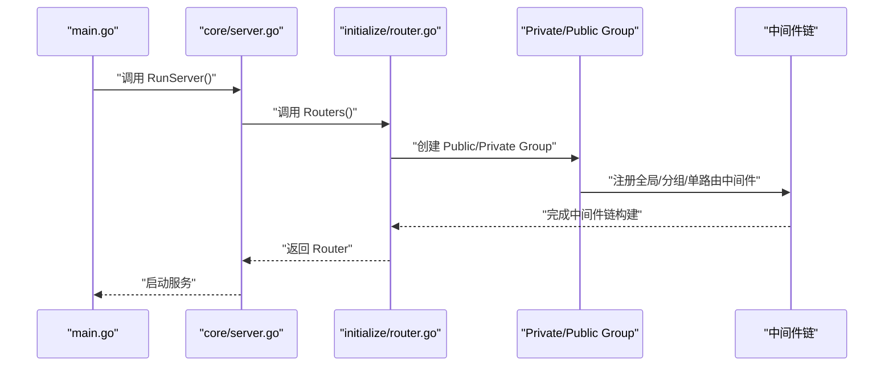

图表来源
- [server/main.go:30-35](file://server/main.go#L30-L35)
- [server/core/server.go:32-47](file://server/core/server.go#L32-L47)
- [server/initialize/router.go:36-117](file://server/initialize/router.go#L36-L117)

章节来源
- [server/initialize/router.go:36-117](file://server/initialize/router.go#L36-L117)
- [server/router/system/sys_user.go:10-28](file://server/router/system/sys_user.go#L10-L28)