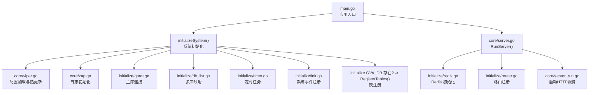
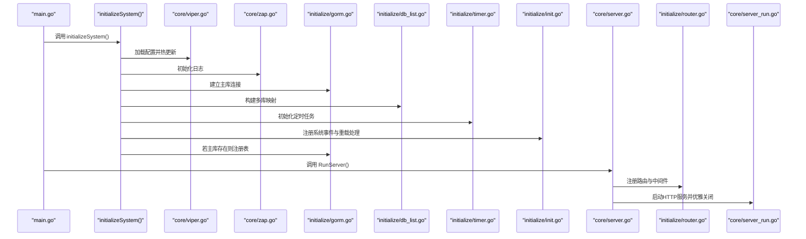
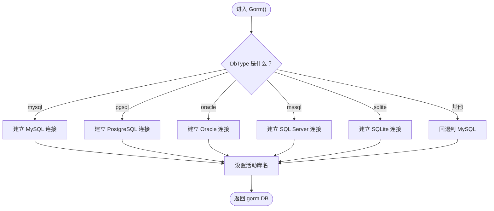
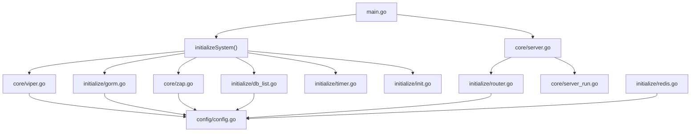

# 依赖注入模式

<cite>
**本文引用的文件**
- [main.go](file://server/main.go)
- [global.go](file://server/global/global.go)
- [viper.go](file://server/core/viper.go)
- [zap.go](file://server/core/zap.go)
- [server_run.go](file://server/core/server_run.go)
- [server.go](file://server/core/server.go)
- [gorm.go](file://server/initialize/gorm.go)
- [db_list.go](file://server/initialize/db_list.go)
- [router.go](file://server/initialize/router.go)
- [config.go](file://server/config/config.go)
- [timer.go](file://server/initialize/timer.go)
- [redis.go](file://server/initialize/redis.go)
- [init.go](file://server/initialize/init.go)
- [register_init.go](file://server/initialize/register_init.go)
</cite>

## 目录
1. [引言](#引言)
2. [项目结构](#项目结构)
3. [核心组件](#核心组件)
4. [架构总览](#架构总览)
5. [详细组件分析](#详细组件分析)
6. [依赖关系分析](#依赖关系分析)
7. [性能考量](#性能考量)
8. [故障排查指南](#故障排查指南)
9. [结论](#结论)

## 引言
本文件聚焦“测试管理平台”的依赖注入与全局状态管理模式，系统阐述以下要点：
- 全局变量的集中管理与作用域边界
- RunServer 函数中的依赖初始化流程：从配置加载、日志初始化、数据库连接、定时任务、路由注册到服务器启动
- initialize 包内各模块的初始化顺序与依赖关系
- 全局变量 global.GVA_CONFIG 与 global.GVA_DB 的职责与管理方式
- 如何正确进行依赖注入与模块初始化，帮助开发者快速理解并扩展系统

## 项目结构
围绕依赖注入与初始化的关键目录与文件如下：
- server/main.go：应用入口，负责调用 initializeSystem 完成系统初始化，并启动服务器
- server/global/global.go：全局变量集中声明处，包含数据库、Redis、Mongo、日志、配置、定时器等
- server/core/viper.go：配置加载与热更新，将 YAML 解析到 global.GVA_CONFIG
- server/core/zap.go：基于配置构建日志系统，并替换全局 zap 日志
- server/initialize/gorm.go：根据配置选择数据库类型并建立连接，支持主库与多库映射
- server/initialize/db_list.go：遍历配置中的 DBList，构建多数据库连接映射
- server/initialize/router.go：注册路由与中间件，生成全局路由信息
- server/core/server.go：RunServer 统一调度 Redis/Mongo/系统数据加载/路由/服务器启动
- server/core/server_run.go：封装 HTTP 服务器启动与优雅关闭
- server/initialize/timer.go：定时任务初始化与调度
- server/initialize/redis.go：Redis 单实例与多实例连接初始化
- server/config/config.go：配置结构体定义，承载各类外部依赖配置
- server/initialize/init.go：系统事件与重载处理注册
- server/initialize/register_init.go：触发模块初始化注册（通过导入）

图表来源
- [main.go:30-52](file://server/main.go#L30-L52)
- [viper.go:16-42](file://server/core/viper.go#L16-L42)
- [zap.go:13-36](file://server/core/zap.go#L13-L36)
- [gorm.go:14-35](file://server/initialize/gorm.go#L14-L35)
- [db_list.go:11-36](file://server/initialize/db_list.go#L11-L36)
- [timer.go:12-37](file://server/initialize/timer.go#L12-L37)
- [init.go:9-15](file://server/initialize/init.go#L9-L15)
- [server.go:14-48](file://server/core/server.go#L14-L48)
- [router.go:36-117](file://server/initialize/router.go#L36-L117)
- [server_run.go:21-60](file://server/core/server_run.go#L21-L60)

章节来源
- [main.go:30-52](file://server/main.go#L30-L52)
- [server.go:14-48](file://server/core/server.go#L14-L48)

## 核心组件
- 全局变量容器：位于 global/global.go，集中存放数据库、Redis、Mongo、日志、配置、定时器、路由信息等
- 配置加载器：core/viper.go，负责读取 YAML 配置、监听变更并反序列化到 global.GVA_CONFIG
- 日志系统：core/zap.go，依据配置构建多级别核心并合并为全局 Logger
- 数据库连接：initialize/gorm.go 与 initialize/db_list.go，按配置选择数据库类型并建立主库与多库映射
- Redis 连接：initialize/redis.go，支持单实例与集群模式，可同时初始化多实例映射
- 路由与中间件：initialize/router.go，注册系统与业务路由、Swagger、中间件链
- 服务器生命周期：core/server.go 与 core/server_run.go，统一调度依赖并启动 HTTP 服务
- 定时任务：initialize/timer.go，初始化定时清理任务
- 系统事件：initialize/init.go，注册系统重载处理

章节来源
- [global.go:25-42](file://server/global/global.go#L25-L42)
- [viper.go:16-42](file://server/core/viper.go#L16-L42)
- [zap.go:13-36](file://server/core/zap.go#L13-L36)
- [gorm.go:14-35](file://server/initialize/gorm.go#L14-L35)
- [db_list.go:11-36](file://server/initialize/db_list.go#L11-L36)
- [redis.go:39-59](file://server/initialize/redis.go#L39-L59)
- [router.go:36-117](file://server/initialize/router.go#L36-L117)
- [server.go:14-48](file://server/core/server.go#L14-L48)
- [server_run.go:21-60](file://server/core/server_run.go#L21-L60)
- [timer.go:12-37](file://server/initialize/timer.go#L12-L37)
- [init.go:9-15](file://server/initialize/init.go#L9-L15)

## 架构总览
下图展示了从应用入口到服务器启动的完整依赖注入与初始化流程，以及各模块之间的耦合关系。

图表来源
- [main.go:30-52](file://server/main.go#L30-L52)
- [viper.go:16-42](file://server/core/viper.go#L16-L42)
- [zap.go:13-36](file://server/core/zap.go#L13-L36)
- [gorm.go:14-35](file://server/initialize/gorm.go#L14-L35)
- [db_list.go:11-36](file://server/initialize/db_list.go#L11-L36)
- [timer.go:12-37](file://server/initialize/timer.go#L12-L37)
- [init.go:9-15](file://server/initialize/init.go#L9-L15)
- [server.go:14-48](file://server/core/server.go#L14-L48)
- [router.go:36-117](file://server/initialize/router.go#L36-L117)
- [server_run.go:21-60](file://server/core/server_run.go#L21-L60)

## 详细组件分析

### 全局变量与配置管理
- global.GVA_CONFIG：承载系统运行所需的全部配置项，包括数据库、Redis、Mongo、日志、系统参数、跨域、MCP 等
- global.GVA_DB / global.GVA_DBList：主库连接与多库映射，用于不同业务或租户场景
- global.GVA_REDIS / global.GVA_REDISList：单实例与多实例 Redis 客户端
- global.GVA_LOG：全局日志记录器，由 core/zap.go 基于配置构建
- global.GVA_Timer：定时任务调度器，用于周期性任务
- global.GVA_ROUTERS：全局路由信息快照，便于监控与诊断

章节来源
- [global.go:25-42](file://server/global/global.go#L25-L42)
- [config.go:3-40](file://server/config/config.go#L3-L40)

### 配置加载与热更新（Viper）
- 优先级：命令行参数 > 环境变量 > 按运行模式选择的配置文件 > 默认配置文件
- 监听配置变更并反序列化到 global.GVA_CONFIG
- 为后续日志、数据库、Redis、Mongo 等模块提供配置输入

章节来源
- [viper.go:16-42](file://server/core/viper.go#L16-L42)
- [viper.go:44-76](file://server/core/viper.go#L44-L76)

### 日志初始化（Zap）
- 根据配置创建多个日志核心并合并为全局 Logger
- 可选开启行号与堆栈追踪
- 替换全局 zap 日志，确保全系统一致的日志行为

章节来源
- [zap.go:13-36](file://server/core/zap.go#L13-L36)

### 数据库连接与表注册
- Gorm() 根据 DbType 选择具体数据库驱动并建立连接，设置当前活动库名
- RegisterTables() 在未禁用自动迁移的情况下，对系统与业务模型进行迁移
- DBList() 遍历配置中的 DBList，构建多库映射；若存在别名为 system 的库，则作为主库

图表来源
- [gorm.go:14-35](file://server/initialize/gorm.go#L14-L35)

章节来源
- [gorm.go:14-35](file://server/initialize/gorm.go#L14-L35)
- [gorm.go:37-87](file://server/initialize/gorm.go#L37-L87)
- [db_list.go:11-36](file://server/initialize/db_list.go#L11-L36)

### Redis 初始化
- 支持单实例与集群两种模式，均通过 Ping 校验连通性
- Redis() 初始化单实例；RedisList() 支持多实例映射
- 连接成功后写入 global.GVA_REDIS 或 global.GVA_REDISList

章节来源
- [redis.go:13-37](file://server/initialize/redis.go#L13-L37)
- [redis.go:39-59](file://server/initialize/redis.go#L39-L59)

### 路由与中间件注册
- 初始化 Gin 路由器，注册系统与业务路由组
- 应用中间件链：日志、JWT、RBAC 等
- 注册 Swagger 文档与静态资源
- 生成全局路由快照，便于监控与诊断

章节来源
- [router.go:36-117](file://server/initialize/router.go#L36-L117)

### 服务器启动与优雅关闭
- RunServer() 统一调度：Redis/Mongo 初始化、系统数据加载、路由注册
- initServer() 启动 HTTP 服务器并在收到中断信号后优雅关闭
- 读写超时与最大头部限制配置

章节来源
- [server.go:14-48](file://server/core/server.go#L14-L48)
- [server_run.go:21-60](file://server/core/server_run.go#L21-L60)

### 定时任务
- 初始化定时任务调度器，注册每日清理数据库的任务
- 可扩展新增定时任务，遵循现有模式

章节来源
- [timer.go:12-37](file://server/initialize/timer.go#L12-L37)

### 系统事件与重载处理
- 注册系统重载处理函数，触发 Reload() 流程
- 通过 register_init.go 导入模块以触发其初始化注册

章节来源
- [init.go:9-15](file://server/initialize/init.go#L9-L15)
- [register_init.go:8-10](file://server/initialize/register_init.go#L8-L10)

## 依赖关系分析
- 入口依赖：main.go 依赖 core/server.go 与 initialize 包完成初始化与运行
- 配置依赖：core/viper.go 为全局配置源，被 core/zap.go、initialize/gorm.go、initialize/redis.go 等消费
- 数据库依赖：initialize/gorm.go 与 initialize/db_list.go 依赖 global.GVA_CONFIG.System.DbType 与 DBList
- 日志依赖：core/zap.go 依赖 global.GVA_CONFIG.Zap
- Redis 依赖：initialize/redis.go 依赖 global.GVA_CONFIG.Redis 与 global.GVA_CONFIG.RedisList
- 路由依赖：initialize/router.go 依赖 global.GVA_CONFIG.System.RouterPrefix 与 Local.StorePath
- 服务器依赖：core/server.go 依赖 initialize/router.go 与 core/server_run.go

图表来源
- [main.go:30-52](file://server/main.go#L30-L52)
- [server.go:14-48](file://server/core/server.go#L14-L48)
- [viper.go:16-42](file://server/core/viper.go#L16-L42)
- [zap.go:13-36](file://server/core/zap.go#L13-L36)
- [gorm.go:14-35](file://server/initialize/gorm.go#L14-L35)
- [db_list.go:11-36](file://server/initialize/db_list.go#L11-L36)
- [timer.go:12-37](file://server/initialize/timer.go#L12-L37)
- [init.go:9-15](file://server/initialize/init.go#L9-L15)
- [router.go:36-117](file://server/initialize/router.go#L36-L117)
- [server_run.go:21-60](file://server/core/server_run.go#L21-L60)
- [config.go:3-40](file://server/config/config.go#L3-L40)
- [redis.go:39-59](file://server/initialize/redis.go#L39-L59)

## 性能考量
- 配置热更新：Viper 监控配置文件变更并反序列化到全局配置，建议避免频繁变更导致的重建成本
- 日志核心合并：Zap 多核心合并可能带来额外开销，建议按需启用级别与字段
- 数据库连接池：GORM 默认连接池参数可在配置中调整，避免过度连接造成资源争用
- Redis 连接：集群模式与单实例模式在 Ping 校验与连接数上差异较大，建议结合业务规模评估
- 路由注册：路由数量与中间件层数直接影响请求处理延迟，建议按需裁剪中间件链

## 故障排查指南
- 配置加载失败：检查命令行参数、环境变量与配置文件路径是否正确
- 数据库连接失败：确认 DbType 与连接参数，查看 RegisterTables() 是否抛错
- Redis 连接失败：检查 Addr/ClusterAddrs、密码与 DB 索引，观察 Ping 结果
- 日志不可写：确认日志目录存在且具备写权限
- 服务器启动异常：关注 initServer() 的错误输出与优雅关闭日志

章节来源
- [viper.go:16-42](file://server/core/viper.go#L16-L42)
- [gorm.go:37-87](file://server/initialize/gorm.go#L37-L87)
- [redis.go:29-36](file://server/initialize/redis.go#L29-L36)
- [server_run.go:32-39](file://server/core/server_run.go#L32-L39)

## 结论
本项目采用“全局变量容器 + 模块化初始化”的依赖注入模式：
- 通过 global 包集中管理数据库、Redis、Mongo、日志、配置、定时器等全局依赖
- initializeSystem() 串联配置加载、日志、数据库、定时任务、系统事件等初始化步骤
- RunServer() 统一调度 Redis/Mongo/路由注册与服务器启动，形成清晰的控制流
- 依赖关系以配置为中心，模块间通过全局变量解耦，便于扩展与维护