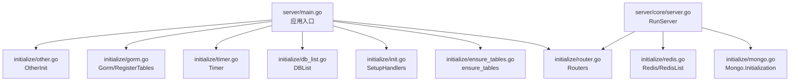
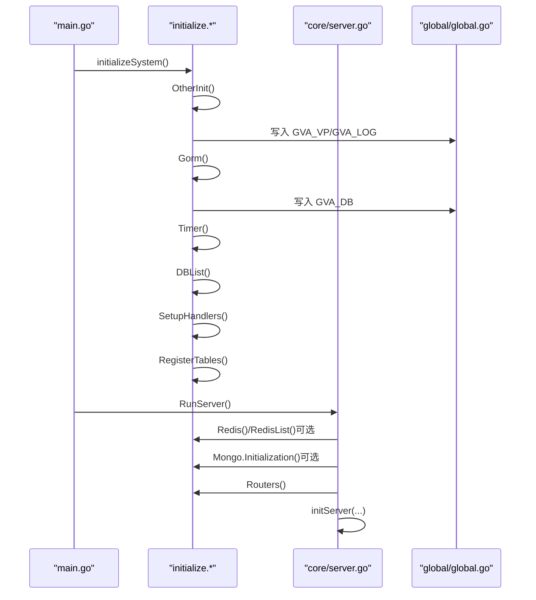
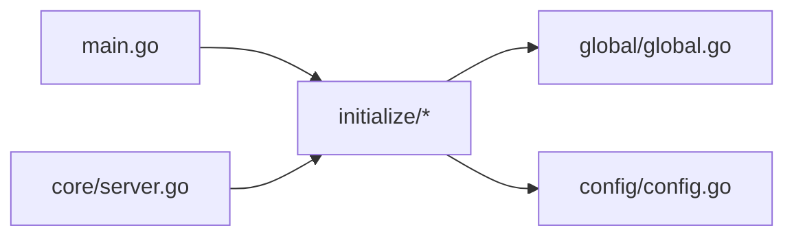
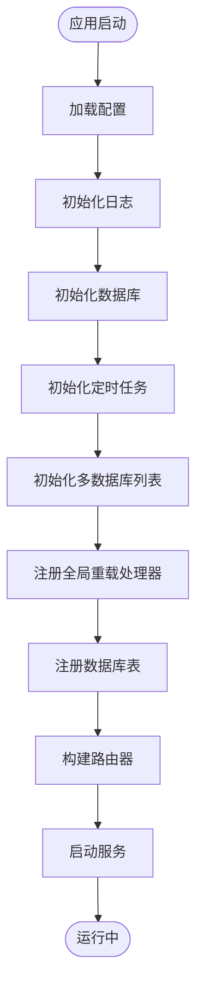
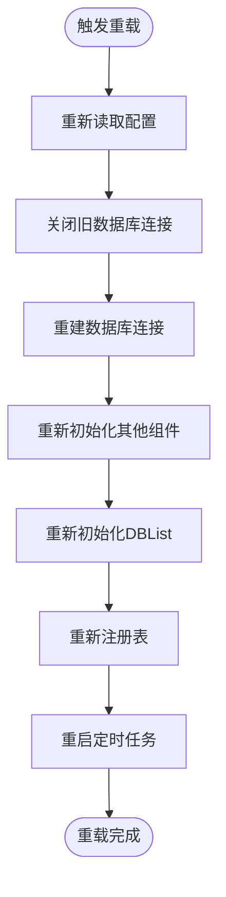

# 初始化模式

<cite>
**本文引用的文件**
- [main.go](file://server/main.go)
- [init.go](file://server/initialize/init.go)
- [register_init.go](file://server/initialize/register_init.go)
- [other.go](file://server/initialize/other.go)
- [gorm.go](file://server/initialize/gorm.go)
- [router.go](file://server/initialize/router.go)
- [redis.go](file://server/initialize/redis.go)
- [mongo.go](file://server/initialize/mongo.go)
- [timer.go](file://server/initialize/timer.go)
- [reload.go](file://server/initialize/reload.go)
- [db_list.go](file://server/initialize/db_list.go)
- [ensure_tables.go](file://server/initialize/ensure_tables.go)
- [global.go](file://server/global/global.go)
- [server.go](file://server/core/server.go)
- [config.go](file://server/config/config.go)
</cite>

## 目录
1. [简介](#简介)
2. [项目结构](#项目结构)
3. [核心组件](#核心组件)
4. [架构总览](#架构总览)
5. [详细组件分析](#详细组件分析)
6. [依赖分析](#依赖分析)
7. [性能考量](#性能考量)
8. [故障排查指南](#故障排查指南)
9. [结论](#结论)
10. [附录](#附录)

## 简介
本文件面向“测试管理平台”的初始化模式，系统性阐述系统的启动与初始化流程、初始化协调机制、模块化初始化策略以及错误处理与回滚思路。重点围绕以下方面展开：
- 初始化入口与控制流：main.go 如何组织系统初始化与服务启动
- 初始化协调中枢：initialize 包内各模块初始化的职责划分与调用顺序
- 关键子系统初始化：路由器、Redis、数据库、Mongo、定时任务等
- 重载与回滚：系统重载流程与回退策略
- 最佳实践与常见陷阱：如何避免启动失败、提升可维护性与可观测性

## 项目结构
初始化相关代码主要集中在 server/initialize 与 server/main.go、server/core/server.go、server/global/global.go、server/config/config.go 等位置。整体采用“入口集中、模块解耦、顺序可控”的设计。

图表来源
- [main.go:37-52](file://server/main.go#L37-L52)
- [other.go:13-33](file://server/initialize/other.go#L13-L33)
- [gorm.go:14-88](file://server/initialize/gorm.go#L14-L88)
- [timer.go:12-38](file://server/initialize/timer.go#L12-L38)
- [db_list.go:11-37](file://server/initialize/db_list.go#L11-L37)
- [init.go:10-16](file://server/initialize/init.go#L10-L16)
- [ensure_tables.go:18-21](file://server/initialize/ensure_tables.go#L18-L21)
- [router.go:36-118](file://server/initialize/router.go#L36-L118)
- [server.go:14-49](file://server/core/server.go#L14-L49)
- [redis.go:39-60](file://server/initialize/redis.go#L39-L60)
- [mongo.go:42-75](file://server/initialize/mongo.go#L42-L75)

章节来源
- [main.go:37-52](file://server/main.go#L37-L52)
- [server.go:14-49](file://server/core/server.go#L14-L49)

## 核心组件
- 初始化入口与控制流
  - 应用入口通过 initializeSystem 函数集中编排初始化步骤，随后启动服务。
  - 关键步骤包括：加载配置、初始化日志、数据库连接、定时任务、数据库表注册、全局事件处理器注册、多数据库列表初始化等。
- 初始化协调中枢
  - initialize 包内各模块提供独立初始化函数，彼此通过全局变量或配置驱动进行协作。
  - 通过 register_init.go 的包导入触发模块注册，确保后续初始化阶段能被系统识别。
- 关键子系统初始化
  - 路由器：构建 Gin 路由器，注册系统与业务路由组，支持 Swagger 文档。
  - Redis：支持单机与集群两种模式，初始化主 Redis 与多实例列表。
  - 数据库：根据配置选择 MySQL/PgSQL/Oracle/MSSQL/SQLite，统一入口 Gorm 并按需注册表。
  - MongoDB：基于 qmgo 初始化客户端，支持索引创建与可选日志增强。
  - 定时任务：基于 cron 启动后台任务，如每日清理日志等。
- 重载与回滚
  - Reload 实现系统配置热重载：重新读取配置、关闭旧数据库连接、重建连接、重新初始化其他组件、重新注册表、重启定时任务。
  - 回滚策略：以“关闭旧连接 -> 重建新连接”为核心，失败时返回错误并记录日志，避免半初始化状态。

章节来源
- [main.go:37-52](file://server/main.go#L37-L52)
- [init.go:10-16](file://server/initialize/init.go#L10-L16)
- [reload.go:8-46](file://server/initialize/reload.go#L8-L46)
- [gorm.go:14-88](file://server/initialize/gorm.go#L14-L88)
- [router.go:36-118](file://server/initialize/router.go#L36-L118)
- [redis.go:39-60](file://server/initialize/redis.go#L39-L60)
- [mongo.go:42-75](file://server/initialize/mongo.go#L42-L75)
- [timer.go:12-38](file://server/initialize/timer.go#L12-L38)
- [db_list.go:11-37](file://server/initialize/db_list.go#L11-L37)

## 架构总览
下图展示了启动阶段的高层交互：main.go 作为入口，协调 initialize 子系统；core/server.go 在运行阶段根据配置决定是否启用 Redis/Mongo，并最终启动 HTTP 服务。

图表来源
- [main.go:37-52](file://server/main.go#L37-L52)
- [server.go:14-49](file://server/core/server.go#L14-L49)
- [global.go:25-42](file://server/global/global.go#L25-L42)

## 详细组件分析

### 初始化入口与控制流（main.go）
- initializeSystem 将初始化拆分为若干步骤，便于重载与扩展：
  - 加载配置、初始化日志、数据库连接、定时任务、多数据库列表、全局事件处理器、表注册。
- 该函数被重载路径复用，保证一致性。

章节来源
- [main.go:37-52](file://server/main.go#L37-L52)

### 初始化协调中枢（initialize/init.go）
- SetupHandlers 将系统重载事件与 Reload 绑定，实现配置热重载。
- 通过全局事件系统注册回调，简化外部触发。

章节来源
- [init.go:10-16](file://server/initialize/init.go#L10-L16)

### 其他初始化（initialize/other.go）
- 解析 JWT 过期时间与缓冲时间，构造本地缓存 BlackCache。
- 若未设置模块名，则从 go.mod 推断模块名，避免硬编码。

章节来源
- [other.go:13-33](file://server/initialize/other.go#L13-L33)

### 数据库初始化（initialize/gorm.go）
- Gorm 根据配置选择数据库类型并返回连接；同时设置当前活动数据库名。
- RegisterTables 在未禁用自动迁移的情况下，对系统与示例模型进行迁移；若失败则记录错误并退出进程。
- bizModel 用于业务模型迁移（在文件内部定义），失败同样终止进程。

章节来源
- [gorm.go:14-88](file://server/initialize/gorm.go#L14-L88)

### 多数据库列表（initialize/db_list.go）
- 支持多数据库实例，按别名映射到全局 GVA_DBList。
- 若包含 system 别名，将其作为主 GVA_DB，兼容多库场景下的主库选择。

章节来源
- [db_list.go:11-37](file://server/initialize/db_list.go#L11-L37)

### 表注册保障（initialize/ensure_tables.go）
- 通过系统初始化注册机制，在系统启动早期确保关键表已存在。
- 提供 MigrateTable 与 TableCreated 两阶段能力，确保幂等与可见性。

章节来源
- [ensure_tables.go:18-21](file://server/initialize/ensure_tables.go#L18-L21)
- [ensure_tables.go:33-77](file://server/initialize/ensure_tables.go#L33-L77)
- [ensure_tables.go]:79-119](file://server/initialize/ensure_tables.go#L79-L119)

### 路由器初始化（initialize/router.go）
- 构建 Gin 引擎，注入日志与恢复中间件。
- 注册公共与私有路由组，挂载系统与示例路由。
- 支持 Swagger 文档与静态资源托管。
- 记录已注册路由信息，便于调试与监控。

章节来源
- [router.go:36-118](file://server/initialize/router.go#L36-L118)

### Redis 初始化（initialize/redis.go）
- 支持单机与集群两种模式，统一通过 initRedisClient 建连并 Ping 校验。
- 成功后写入全局 GVA_REDIS 或 GVA_REDISList，失败直接 panic，确保启动即发现配置问题。

章节来源
- [redis.go:13-37](file://server/initialize/redis.go#L13-L37)
- [redis.go:39-60](file://server/initialize/redis.go#L39-L60)

### MongoDB 初始化（initialize/mongo.go）
- 基于 qmgo 打开客户端，支持认证、连接池参数与可选日志增强。
- 初始化完成后尝试创建索引，失败返回错误，避免静默失败。

章节来源
- [mongo.go:42-75](file://server/initialize/mongo.go#L42-L75)
- [mongo.go:77-156](file://server/initialize/mongo.go#L77-L156)

### 定时任务（initialize/timer.go）
- 后台启动 cron 任务，示例任务为每日清理日志。
- 通过全局计时器注册任务，便于统一管理与扩展。

章节来源
- [timer.go:12-38](file://server/initialize/timer.go#L12-L38)

### 系统重载（initialize/reload.go）
- 重新读取配置文件，关闭旧数据库连接，重建连接，重新初始化 Other、DBList、RegisterTables、Timer。
- 记录重载开始与结束日志，失败返回错误，便于上层感知。

章节来源
- [reload.go:8-46](file://server/initialize/reload.go#L8-L46)

### 全局状态（server/global/global.go）
- 统一存放全局资源：数据库、Redis、Mongo、配置、日志、定时器、路由信息等。
- 提供安全访问接口（读锁）与缺失时 panic 的断言工具，避免空指针与并发竞争。

章节来源
- [global.go:25-42](file://server/global/global.go#L25-L42)
- [global.go:44-69](file://server/global/global.go#L44-L69)

### 运行阶段（server/core/server.go）
- 根据配置决定是否启用 Redis（含多点登录）、Mongo。
- 加载系统数据、构建路由、打印启动信息、启动 HTTP 服务。
- 与 initialize 路由器配合，形成“初始化—运行”的完整闭环。

章节来源
- [server.go:14-49](file://server/core/server.go#L14-L49)

### 配置模型（server/config/config.go）
- Server 结构体聚合各类配置项（JWT、Zap、Redis、Mongo、数据库、跨域、MCP 等），为初始化提供输入。

章节来源
- [config.go:3-41](file://server/config/config.go#L3-L41)

## 依赖分析
- 模块内聚与耦合
  - initialize 包内各模块职责清晰：数据库、Redis、Mongo、路由、定时任务、重载等，彼此通过 global 全局变量耦合。
  - main.go 与 core/server.go 分别承担“启动编排”和“运行时决策”，边界明确。
- 外部依赖
  - 数据库：gorm.io/gorm 及多种方言
  - 缓存：redis/go-redis/v9
  - 文档：swaggo/gin-swagger
  - 定时：robfig/cron/v3
  - 日志：go.uber.org/zap
- 循环依赖
  - 通过全局变量与分层（入口/运行/初始化）避免循环导入；register_init.go 仅负责触发注册，不直接依赖其他模块。

图表来源
- [main.go:37-52](file://server/main.go#L37-L52)
- [server.go:14-49](file://server/core/server.go#L14-L49)
- [global.go:25-42](file://server/global/global.go#L25-L42)
- [config.go:3-41](file://server/config/config.go#L3-L41)

## 性能考量
- 启动阶段尽量减少阻塞操作，将耗时任务放入后台（如定时任务）。
- Redis/Mongo 初始化建议使用连接池与合理的超时配置，避免启动卡顿。
- 数据库迁移在生产环境谨慎开启自动迁移，优先通过迁移脚本管理。
- 日志与监控在初始化阶段开启，有助于快速定位启动问题。

## 故障排查指南
- 启动失败
  - 数据库：检查 DbType 与连接参数，确认 RegisterTables 是否报错；必要时临时禁用自动迁移定位问题。
  - Redis：确认 Addr/Password/DB，查看 Ping 结果；集群模式检查 ClusterAddrs。
  - Mongo：核对 Uri、用户名密码、认证源；关注索引创建失败原因。
- 重载失败
  - Reload 返回错误时，检查配置文件变更与数据库连接状态；确认旧连接已关闭、新连接已建立。
- 路由异常
  - 查看 Routers 输出的已注册路由信息，确认路由前缀与中间件是否生效。

章节来源
- [gorm.go:75-87](file://server/initialize/gorm.go#L75-L87)
- [redis.go:29-36](file://server/initialize/redis.go#L29-L36)
- [mongo.go:64-75](file://server/initialize/mongo.go#L64-L75)
- [reload.go:13-26](file://server/initialize/reload.go#L13-L26)
- [router.go:113-116](file://server/initialize/router.go#L113-L116)

## 结论
本初始化模式以“入口集中、模块解耦、顺序可控”为核心思想，通过 initialize 包内的独立初始化函数与全局状态协同，实现了数据库、缓存、存储、路由与定时任务的有序装配。配合重载机制与可观测的日志输出，能够有效支撑系统的稳定启动与动态演进。建议在生产环境中：
- 明确各模块初始化顺序与依赖关系
- 严格区分启动期与运行期行为
- 对关键资源（DB/Redis/Mongo）增加健康检查与告警
- 将自动迁移策略从启动期迁移到离线迁移流程

## 附录

### 初始化流程图（启动阶段）

图表来源
- [main.go:37-52](file://server/main.go#L37-L52)
- [gorm.go:37-87](file://server/initialize/gorm.go#L37-L87)
- [timer.go:12-38](file://server/initialize/timer.go#L12-L38)
- [db_list.go:11-37](file://server/initialize/db_list.go#L11-L37)
- [init.go:10-16](file://server/initialize/init.go#L10-L16)
- [router.go:36-118](file://server/initialize/router.go#L36-L118)
- [server.go:14-49](file://server/core/server.go#L14-L49)

### 初始化流程图（重载阶段）

图表来源
- [reload.go:8-46](file://server/initialize/reload.go#L8-L46)