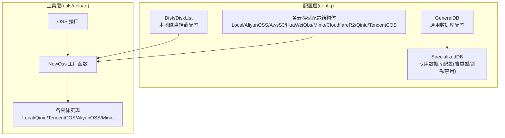
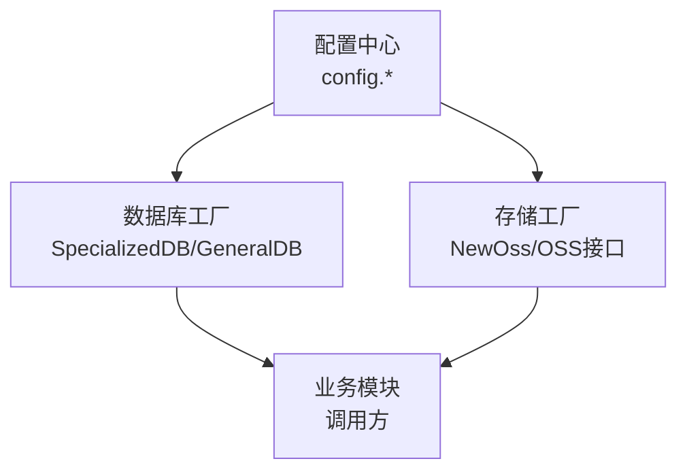
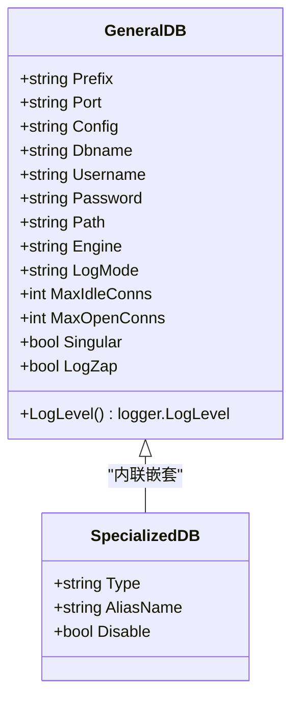
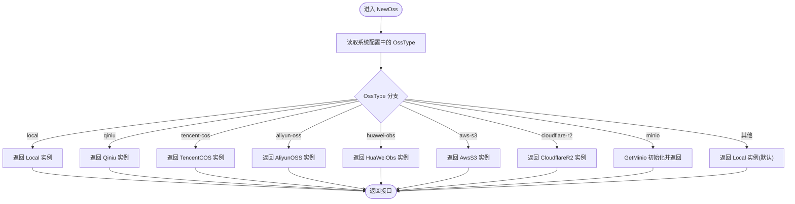
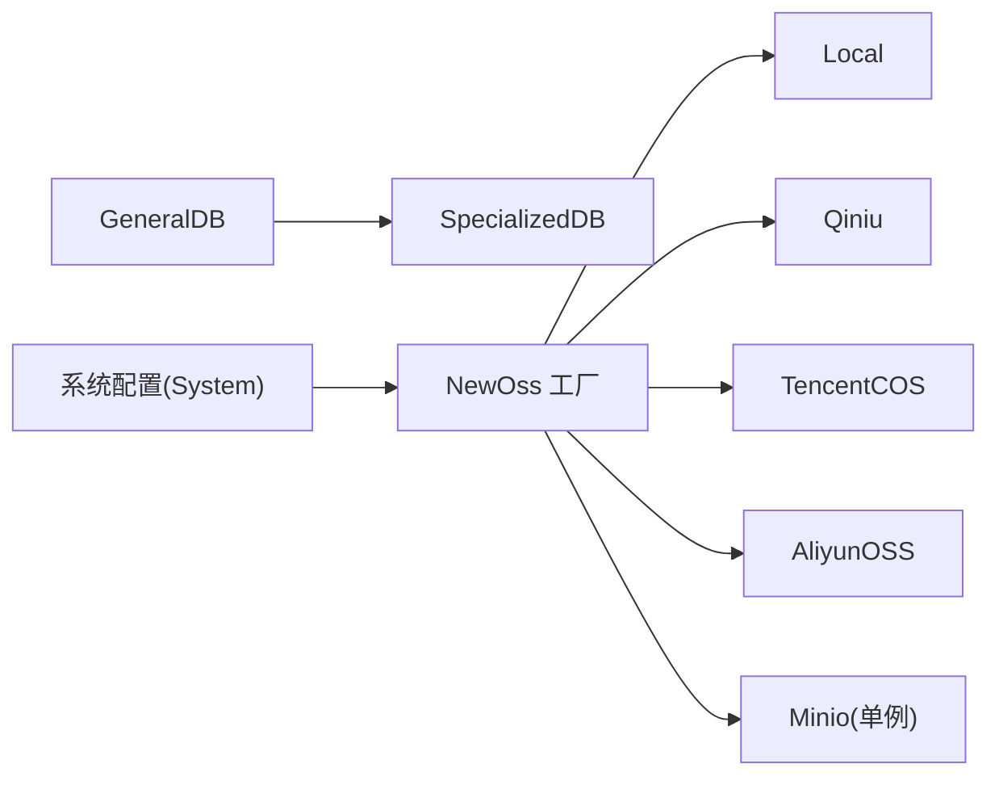

# 工厂模式应用

<cite>
**本文引用的文件**
- [db_list.go](file://server/config/db_list.go)
- [disk.go](file://server/config/disk.go)
- [oss_local.go](file://server/config/oss_local.go)
- [oss_aliyun.go](file://server/config/oss_aliyun.go)
- [oss_aws.go](file://server/config/oss_aws.go)
- [oss_huawei.go](file://server/config/oss_huawei.go)
- [oss_minio.go](file://server/config/oss_minio.go)
- [oss_cloudflare.go](file://server/config/oss_cloudflare.go)
- [oss_qiniu.go](file://server/config/oss_qiniu.go)
- [oss_tencent.go](file://server/config/oss_tencent.go)
- [upload.go](file://server/utils/upload/upload.go)
- [local.go](file://server/utils/upload/local.go)
- [qiniu.go](file://server/utils/upload/qiniu.go)
- [tencent_cos.go](file://server/utils/upload/tencent_cos.go)
- [aliyun_oss.go](file://server/utils/upload/aliyun_oss.go)
- [minio_oss.go](file://server/utils/upload/minio_oss.go)
</cite>

## 目录
1. [引言](#引言)
2. [项目结构](#项目结构)
3. [核心组件](#核心组件)
4. [架构总览](#架构总览)
5. [详细组件分析](#详细组件分析)
6. [依赖分析](#依赖分析)
7. [性能考虑](#性能考虑)
8. [故障排查指南](#故障排查指南)
9. [结论](#结论)
10. [附录](#附录)

## 引言
本文件系统性梳理测试管理平台中工厂模式的应用实践，重点覆盖两类工厂：数据库连接工厂与对象存储服务工厂。前者通过统一配置结构与类型标识，动态构建不同数据库的连接；后者通过统一接口与运行时配置，按需选择本地或多家云厂商的对象存储实现。文档将结合具体源码路径，解释工厂方法的定义与使用方式，并总结工厂模式的优势与适用场景。

## 项目结构
围绕工厂模式的关键目录与文件如下：
- 配置层（config）：集中定义各类数据库与对象存储的配置结构体，以及通用配置基类。
- 工具层（utils/upload）：定义统一的存储接口与工厂函数，依据运行时配置动态创建具体存储实现。

图表来源
- [db_list.go:17-53](file://server/config/db_list.go#L17-L53)
- [disk.go:3-9](file://server/config/disk.go#L3-L9)
- [upload.go:9-46](file://server/utils/upload/upload.go#L9-L46)

章节来源
- [db_list.go:1-54](file://server/config/db_list.go#L1-L54)
- [disk.go:1-10](file://server/config/disk.go#L1-L10)
- [upload.go:1-47](file://server/utils/upload/upload.go#L1-L47)

## 核心组件
- 数据库工厂相关配置
  - 通用数据库配置基类：用于承载数据库连接所需的通用字段（如主机、端口、用户名、密码、高级配置、日志级别、连接池参数等），便于多数据库类型共享。
  - 专用数据库配置：在通用配置基础上增加类型标识、别名、禁用开关等，支持多实例、差异化配置。
- 存储工厂接口与实现
  - 统一接口：定义上传与删除文件的标准方法，屏蔽底层差异。
  - 工厂函数：根据系统配置选择具体实现（本地、七牛云、腾讯云COS、阿里云OSS、华为OBS、AWS S3、Cloudflare R2、MinIO）。

章节来源
- [db_list.go:17-53](file://server/config/db_list.go#L17-L53)
- [oss_local.go:3-6](file://server/config/oss_local.go#L3-L6)
- [oss_aliyun.go:3-10](file://server/config/oss_aliyun.go#L3-L10)
- [oss_aws.go:3-13](file://server/config/oss_aws.go#L3-L13)
- [oss_huawei.go:3-9](file://server/config/oss_huawei.go#L3-L9)
- [oss_minio.go:3-11](file://server/config/oss_minio.go#L3-L11)
- [oss_cloudflare.go:3-10](file://server/config/oss_cloudflare.go#L3-L10)
- [oss_qiniu.go:3-11](file://server/config/oss_qiniu.go#L3-L11)
- [oss_tencent.go:3-10](file://server/config/oss_tencent.go#L3-L10)
- [upload.go:9-46](file://server/utils/upload/upload.go#L9-L46)

## 架构总览
下图展示了“配置驱动 + 工厂方法”的整体架构：配置层提供结构化的参数，工厂层依据配置动态创建对应实例，调用方仅面向统一接口编程，降低耦合度。

图表来源
- [db_list.go:17-53](file://server/config/db_list.go#L17-L53)
- [upload.go:9-46](file://server/utils/upload/upload.go#L9-L46)

## 详细组件分析

### 数据库工厂实现（db_list.go）
- 设计要点
  - 通用配置基类：封装数据库连接所需的基础字段与日志级别转换逻辑，便于多数据库类型复用。
  - 专用配置结构：在通用配置之上增加类型、别名、禁用标记等，支持多实例与差异化启用策略。
  - 日志级别映射：根据配置字符串映射到ORM日志级别，确保运行时可配置。
- 工厂方法
  - 在初始化阶段，读取配置并根据类型标识与禁用标记，决定是否创建该数据库实例。
  - 通过内联嵌套的方式保持配置文件结构清晰，避免重复字段与层级过深。
- 优势
  - 配置即代码：通过配置即可控制数据库实例数量与类型，无需修改代码。
  - 可扩展性强：新增数据库类型只需在初始化流程中加入对应分支。
  - 运行时可控：禁用标记可用于灰度或降级场景。

图表来源
- [db_list.go:17-53](file://server/config/db_list.go#L17-L53)

章节来源
- [db_list.go:1-54](file://server/config/db_list.go#L1-L54)

### 存储工厂实现（utils/upload）
- 接口与工厂
  - 统一接口：定义上传与删除文件的标准方法，屏蔽底层差异。
  - 工厂函数：根据系统配置选择具体实现，若配置无效则回退到本地实现。
- 具体实现
  - 本地存储：直接写入本地文件系统，具备基础的安全校验与并发保护。
  - 云存储：封装对应SDK，按配置生成客户端并执行上传/删除操作。
  - MinIO：支持延迟初始化与单例缓存，提升性能但不支持动态配置变更。
- 流程图（NewOss 工厂）

图表来源
- [upload.go:20-46](file://server/utils/upload/upload.go#L20-L46)

章节来源
- [upload.go:1-47](file://server/utils/upload/upload.go#L1-L47)
- [local.go:31-69](file://server/utils/upload/local.go#L31-L69)
- [qiniu.go:27-49](file://server/utils/upload/qiniu.go#L27-L49)
- [tencent_cos.go:21-35](file://server/utils/upload/tencent_cos.go#L21-L35)
- [aliyun_oss.go:15-40](file://server/utils/upload/aliyun_oss.go#L15-L40)
- [minio_oss.go:55-96](file://server/utils/upload/minio_oss.go#L55-L96)

### 存储实现对比与适用场景
- 本地存储
  - 适合开发环境或对数据持久化要求不高的场景。
  - 特点：简单直接、部署成本低。
- 七牛云
  - 适合图片/静态资源加速与CDN分发。
  - 特点：配置灵活、支持多种区域与CDN选项。
- 腾讯云COS
  - 适合国内合规与高可用需求。
  - 特点：按地域与密钥鉴权，支持路径前缀。
- 阿里云OSS
  - 适合企业级稳定存储与大文件处理。
  - 特点：Bucket与Endpoint配置清晰，支持自定义BasePath。
- 华为OBS
  - 适合与华为云生态集成。
  - 特点：Endpoint与密钥配置明确。
- AWS S3
  - 适合国际化与弹性扩展。
  - 特点：支持自定义Endpoint与路径风格。
- Cloudflare R2
  - 适合边缘网络与低成本对象存储。
  - 特点：AccountID与密钥组合鉴权。
- MinIO
  - 适合私有化或兼容S3协议的对象存储。
  - 特点：延迟初始化、单例缓存、支持自动建桶。

章节来源
- [oss_qiniu.go:3-11](file://server/config/oss_qiniu.go#L3-L11)
- [oss_tencent.go:3-10](file://server/config/oss_tencent.go#L3-L10)
- [oss_aliyun.go:3-10](file://server/config/oss_aliyun.go#L3-L10)
- [oss_huawei.go:3-9](file://server/config/oss_huawei.go#L3-L9)
- [oss_aws.go:3-13](file://server/config/oss_aws.go#L3-L13)
- [oss_cloudflare.go:3-10](file://server/config/oss_cloudflare.go#L3-L10)
- [oss_minio.go:3-11](file://server/config/oss_minio.go#L3-L11)

## 依赖分析
- 配置层依赖
  - 数据库工厂依赖通用配置结构体，通过内联嵌套减少重复字段。
  - 存储工厂依赖系统配置中的OssType字段，作为选择器。
- 实现层依赖
  - 各云存储实现依赖对应SDK与配置项，工厂负责实例化与初始化。
  - MinIO实现存在单例缓存，避免重复初始化带来的性能损耗。

图表来源
- [db_list.go:17-53](file://server/config/db_list.go#L17-L53)
- [upload.go:20-46](file://server/utils/upload/upload.go#L20-L46)

章节来源
- [db_list.go:1-54](file://server/config/db_list.go#L1-L54)
- [upload.go:1-47](file://server/utils/upload/upload.go#L1-L47)

## 性能考虑
- MinIO单例缓存
  - 工厂在首次初始化后缓存客户端实例，避免重复建立连接与鉴权，显著降低初始化开销。
  - 注意：当前实现不支持动态配置变更，若需热更新，建议引入更细粒度的生命周期管理。
- 并发与安全
  - 本地存储在删除操作中使用互斥锁，避免并发删除导致的数据竞争。
- 日志与可观测性
  - 数据库工厂提供日志级别映射，便于在不同环境下调整ORM日志输出。
  - 各存储实现均记录关键错误信息，便于定位问题。

章节来源
- [minio_oss.go:21-53](file://server/utils/upload/minio_oss.go#L21-L53)
- [local.go:18-109](file://server/utils/upload/local.go#L18-L109)
- [db_list.go:33-46](file://server/config/db_list.go#L33-L46)

## 故障排查指南
- 存储工厂初始化失败
  - 现象：配置了MinIO但初始化失败，触发告警并panic。
  - 处理：检查MinIO端点、凭证、桶名与SSL配置，确认网络连通性。
  - 参考路径：[upload.go:37-42](file://server/utils/upload/upload.go#L37-L42)
- 本地存储删除失败
  - 现象：删除文件时报错，可能因key为空、包含非法字符或文件不存在。
  - 处理：校验传入key合法性，确认文件确实在存储路径下。
  - 参考路径：[local.go:82-108](file://server/utils/upload/local.go#L82-L108)
- MinIO上传超时
  - 现象：上传大文件时超时。
  - 处理：适当延长上下文超时时间，检查网络带宽与桶权限。
  - 参考路径：[minio_oss.go:87-96](file://server/utils/upload/minio_oss.go#L87-L96)

章节来源
- [upload.go:37-42](file://server/utils/upload/upload.go#L37-L42)
- [local.go:82-108](file://server/utils/upload/local.go#L82-L108)
- [minio_oss.go:87-96](file://server/utils/upload/minio_oss.go#L87-L96)

## 结论
本项目通过“配置驱动 + 工厂方法”的设计，实现了数据库与对象存储的解耦与可插拔扩展。数据库工厂以通用配置为基础，配合专用配置实现多实例与差异化启用；存储工厂以统一接口屏蔽底层差异，依据运行时配置动态选择具体实现。该模式提升了系统的灵活性与可维护性，适用于需要在多环境、多供应商之间快速切换的测试管理平台。

## 附录
- 工厂方法定义与使用路径参考
  - 数据库工厂：[db_list.go:17-53](file://server/config/db_list.go#L17-L53)
  - 存储工厂：[upload.go:20-46](file://server/utils/upload/upload.go#L20-L46)
  - 本地实现：[local.go:31-69](file://server/utils/upload/local.go#L31-L69)
  - 七牛云实现：[qiniu.go:27-49](file://server/utils/upload/qiniu.go#L27-L49)
  - 腾讯云COS实现：[tencent_cos.go:21-35](file://server/utils/upload/tencent_cos.go#L21-L35)
  - 阿里云OSS实现：[aliyun_oss.go:15-40](file://server/utils/upload/aliyun_oss.go#L15-L40)
  - MinIO实现：[minio_oss.go:55-96](file://server/utils/upload/minio_oss.go#L55-L96)