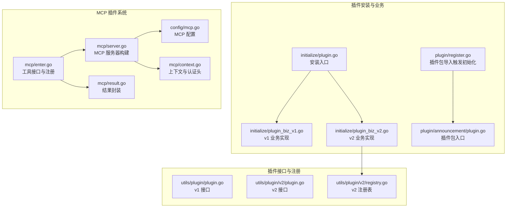
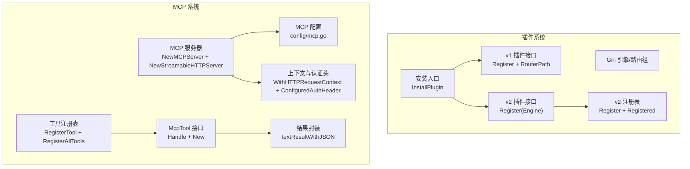
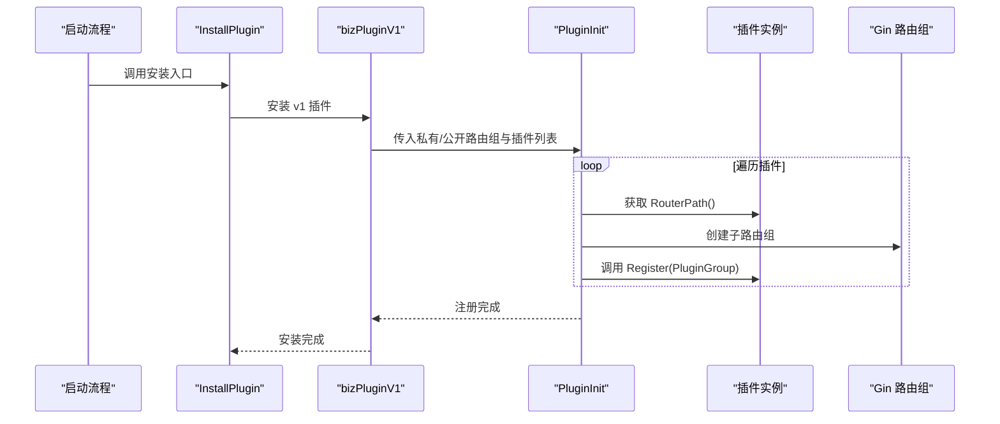
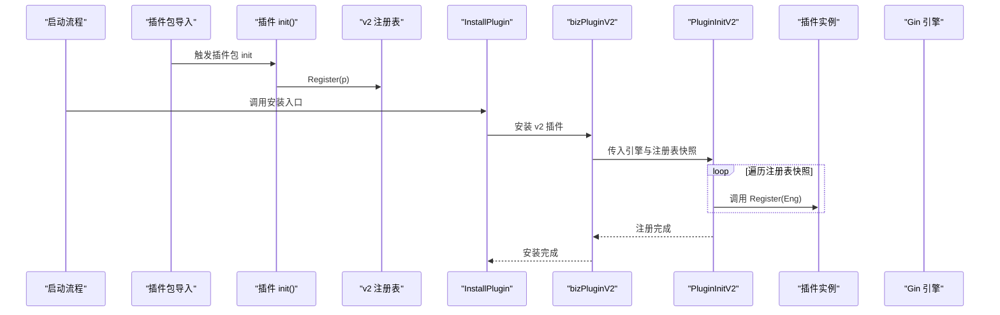
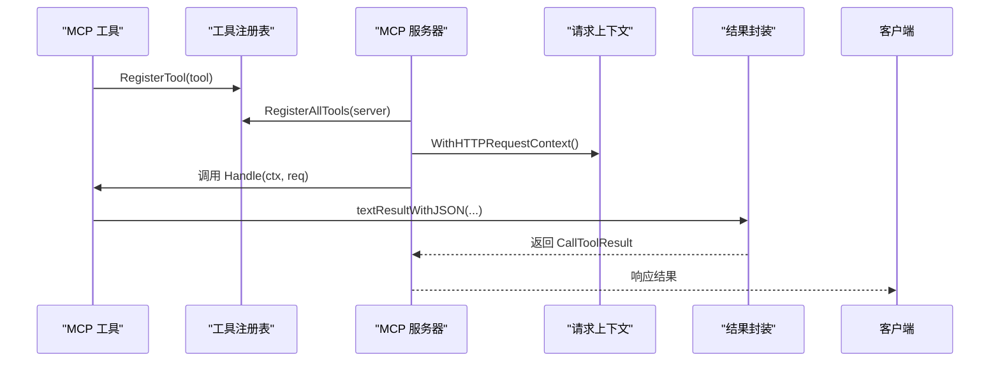
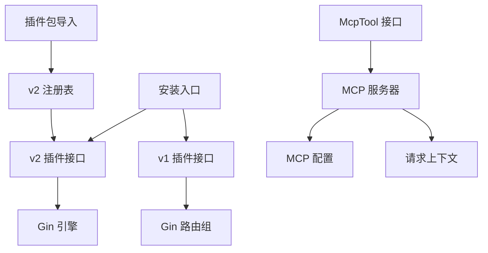

# 插件注册模式

<cite>
**本文引用的文件**
- [register.go](file://server/plugin/register.go)
- [plugin.go（v1 接口）](file://server/utils/plugin/plugin.go)
- [plugin.go（v2 接口）](file://server/utils/plugin/v2/plugin.go)
- [registry.go（v2 注册表）](file://server/utils/plugin/v2/registry.go)
- [plugin.go（业务插件 v1 实现）](file://server/initialize/plugin_biz_v1.go)
- [plugin.go（业务插件 v2 实现）](file://server/initialize/plugin_biz_v2.go)
- [plugin.go（插件安装入口）](file://server/initialize/plugin.go)
- [plugin.go（插件包入口）](file://server/plugin/announcement/plugin.go)
- [mcp.go（MCP 配置结构）](file://server/config/mcp.go)
- [enter.go（MCP 工具接口与注册）](file://server/mcp/enter.go)
- [server.go（MCP 服务器构建）](file://server/mcp/server.go)
- [context.go（MCP 上下文与认证头）](file://server/mcp/context.go)
- [result.go（MCP 结果封装）](file://server/mcp/result.go)
</cite>

## 目录
1. [简介](#简介)
2. [项目结构](#项目结构)
3. [核心组件](#核心组件)
4. [架构总览](#架构总览)
5. [详细组件分析](#详细组件分析)
6. [依赖分析](#依赖分析)
7. [性能考虑](#性能考虑)
8. [故障排查指南](#故障排查指南)
9. [结论](#结论)
10. [附录：插件开发示例与最佳实践](#附录插件开发示例与最佳实践)

## 简介
本文件系统性阐述测试管理平台的插件注册模式与生命周期管理，重点覆盖两套插件体系：
- 基于 Gin 路由组的传统插件（v1），通过接口化插件在私有/公共路由组中注册。
- 基于全局注册表的 v2 插件，通过统一注册与批量初始化实现动态加载。
同时，文档还解释 MCP（Model Context Protocol）插件系统的工具注册、上下文传递与安全认证机制，并给出可直接落地的插件开发示例与最佳实践。

## 项目结构
围绕插件注册与生命周期，代码主要分布在以下模块：
- 插件接口与注册表：utils/plugin（v1 接口）、utils/plugin/v2（v2 接口与注册表）
- 插件安装入口与业务插件：initialize（安装入口与 v1/v2 业务实现）
- 插件包样例：plugin/announcement（演示插件包结构）
- MCP 插件系统：mcp（工具接口、注册、服务器、上下文、结果封装）
- MCP 配置：config/mcp（MCP 服务配置项）

图表来源
- [plugin.go（v1 接口）:1-19](file://server/utils/plugin/plugin.go#L1-L19)
- [plugin.go（v2 接口）:1-12](file://server/utils/plugin/v2/plugin.go#L1-L12)
- [registry.go（v2 注册表）:1-28](file://server/utils/plugin/v2/registry.go#L1-L28)
- [plugin.go（插件安装入口）:1-16](file://server/initialize/plugin.go#L1-L16)
- [plugin.go（业务插件 v1 实现）:1-37](file://server/initialize/plugin_biz_v1.go#L1-L37)
- [plugin.go（业务插件 v2 实现）:1-17](file://server/initialize/plugin_biz_v2.go#L1-L17)
- [register.go（插件包导入）:1-6](file://server/plugin/register.go#L1-L6)
- [plugin.go（插件包入口）:1-6](file://server/plugin/announcement/plugin.go#L1-L6)
- [mcp.go（MCP 配置结构）:1-19](file://server/config/mcp.go#L1-L19)
- [enter.go（MCP 工具接口与注册）:1-32](file://server/mcp/enter.go#L1-L32)
- [server.go（MCP 服务器构建）:1-53](file://server/mcp/server.go#L1-L53)
- [context.go（MCP 上下文与认证头）:1-67](file://server/mcp/context.go#L1-L67)
- [result.go（MCP 结果封装）:1-30](file://server/mcp/result.go#L1-L30)

章节来源
- [plugin.go（v1 接口）:1-19](file://server/utils/plugin/plugin.go#L1-L19)
- [plugin.go（v2 接口）:1-12](file://server/utils/plugin/v2/plugin.go#L1-L12)
- [registry.go（v2 注册表）:1-28](file://server/utils/plugin/v2/registry.go#L1-L28)
- [plugin.go（插件安装入口）:1-16](file://server/initialize/plugin.go#L1-L16)
- [plugin.go（业务插件 v1 实现）:1-37](file://server/initialize/plugin_biz_v1.go#L1-L37)
- [plugin.go（业务插件 v2 实现）:1-17](file://server/initialize/plugin_biz_v2.go#L1-L17)
- [register.go（插件包导入）:1-6](file://server/plugin/register.go#L1-L6)
- [plugin.go（插件包入口）:1-6](file://server/plugin/announcement/plugin.go#L1-L6)
- [mcp.go（MCP 配置结构）:1-19](file://server/config/mcp.go#L1-L19)
- [enter.go（MCP 工具接口与注册）:1-32](file://server/mcp/enter.go#L1-L32)
- [server.go（MCP 服务器构建）:1-53](file://server/mcp/server.go#L1-L53)
- [context.go（MCP 上下文与认证头）:1-67](file://server/mcp/context.go#L1-L67)
- [result.go（MCP 结果封装）:1-30](file://server/mcp/result.go#L1-L30)

## 核心组件
- v1 插件接口：定义 Register（注册路由）与 RouterPath（返回路由前缀）两个方法，用于在 Gin 路由组中挂载插件功能。
- v2 插件接口：简化为 Register（直接向 Engine 注册），配合全局注册表进行集中管理。
- v2 注册表：提供 Register（记录插件）与 Registered（返回快照）两个函数，使用读写锁保证并发安全。
- 插件安装入口：InstallPlugin 统一调度 v1 与 v2 插件安装；当数据库未初始化时提示延迟安装。
- MCP 工具接口：McpTool 定义 Handle（处理工具调用）与 New（返回工具元信息），并提供全局注册表与批量注册能力。
- MCP 服务器：根据配置创建 MCP 服务实例，绑定 HTTP 路径并注入请求上下文，提供健康检查端点。
- MCP 认证与上下文：从请求头提取令牌，支持多种候选头名，注入到 context 中供工具调用使用。
- MCP 结果封装：将任意负载序列化为 JSON 文本，包装为 MCP 结果返回。

章节来源
- [plugin.go（v1 接口）:1-19](file://server/utils/plugin/plugin.go#L1-L19)
- [plugin.go（v2 接口）:1-12](file://server/utils/plugin/v2/plugin.go#L1-L12)
- [registry.go（v2 注册表）:1-28](file://server/utils/plugin/v2/registry.go#L1-L28)
- [plugin.go（插件安装入口）:1-16](file://server/initialize/plugin.go#L1-L16)
- [enter.go（MCP 工具接口与注册）:1-32](file://server/mcp/enter.go#L1-L32)
- [server.go（MCP 服务器构建）:1-53](file://server/mcp/server.go#L1-L53)
- [context.go（MCP 上下文与认证头）:1-67](file://server/mcp/context.go#L1-L67)
- [result.go（MCP 结果封装）:1-30](file://server/mcp/result.go#L1-L30)

## 架构总览
下图展示了插件系统与 MCP 系统的整体交互：插件通过 v1/v2 接口注册到 Gin 引擎或路由组；MCP 工具通过全局注册表集中注册到 MCP 服务，由 MCP 服务器对外提供 HTTP/SSE 接口。

图表来源
- [plugin.go（v1 接口）:1-19](file://server/utils/plugin/plugin.go#L1-L19)
- [plugin.go（v2 接口）:1-12](file://server/utils/plugin/v2/plugin.go#L1-L12)
- [registry.go（v2 注册表）:1-28](file://server/utils/plugin/v2/registry.go#L1-L28)
- [plugin.go（插件安装入口）:1-16](file://server/initialize/plugin.go#L1-L16)
- [mcp.go（MCP 配置结构）:1-19](file://server/config/mcp.go#L1-L19)
- [enter.go（MCP 工具接口与注册）:1-32](file://server/mcp/enter.go#L1-L32)
- [server.go（MCP 服务器构建）:1-53](file://server/mcp/server.go#L1-L53)
- [context.go（MCP 上下文与认证头）:1-67](file://server/mcp/context.go#L1-L67)
- [result.go（MCP 结果封装）:1-30](file://server/mcp/result.go#L1-L30)

## 详细组件分析

### v1 插件注册流程（基于路由组）
- 发现与加载：业务插件在初始化阶段被显式导入并创建实例，随后通过 PluginInit 在指定路由组中注册。
- 初始化顺序：先安装私有路由插件，再安装公开路由插件；安装前会检查数据库是否已初始化。
- 注册细节：为每个插件创建独立的子路由组（前缀由 RouterPath 提供），然后调用 Register 完成挂载。

图表来源
- [plugin.go（插件安装入口）:1-16](file://server/initialize/plugin.go#L1-L16)
- [plugin.go（业务插件 v1 实现）:1-37](file://server/initialize/plugin_biz_v1.go#L1-L37)
- [plugin.go（v1 接口）:1-19](file://server/utils/plugin/plugin.go#L1-L19)

章节来源
- [plugin.go（插件安装入口）:1-16](file://server/initialize/plugin.go#L1-L16)
- [plugin.go（业务插件 v1 实现）:1-37](file://server/initialize/plugin_biz_v1.go#L1-L37)
- [plugin.go（v1 接口）:1-19](file://server/utils/plugin/plugin.go#L1-L19)

### v2 插件注册流程（基于全局注册表）
- 发现与加载：通过插件包导入触发初始化（如 plugin/register.go 导入具体插件包），插件在 init 阶段调用 Register 进行登记。
- 初始化顺序：InstallPlugin 调用 bizPluginV2，后者从注册表取出快照并逐个调用 Register(Engine)。
- 生命周期：v2 注册表采用读写锁保护，Registered 返回快照避免并发修改导致的问题。

图表来源
- [register.go（插件包导入）:1-6](file://server/plugin/register.go#L1-L6)
- [plugin.go（插件包入口）:1-6](file://server/plugin/announcement/plugin.go#L1-L6)
- [registry.go（v2 注册表）:1-28](file://server/utils/plugin/v2/registry.go#L1-L28)
- [plugin.go（业务插件 v2 实现）:1-17](file://server/initialize/plugin_biz_v2.go#L1-L17)
- [plugin.go（v2 接口）:1-12](file://server/utils/plugin/v2/plugin.go#L1-L12)

章节来源
- [register.go（插件包导入）:1-6](file://server/plugin/register.go#L1-L6)
- [plugin.go（插件包入口）:1-6](file://server/plugin/announcement/plugin.go#L1-L6)
- [registry.go（v2 注册表）:1-28](file://server/utils/plugin/v2/registry.go#L1-L28)
- [plugin.go（业务插件 v2 实现）:1-17](file://server/initialize/plugin_biz_v2.go#L1-L17)
- [plugin.go（v2 接口）:1-12](file://server/utils/plugin/v2/plugin.go#L1-L12)

### MCP 工具注册与生命周期
- 工具发现：每个 MCP 工具在 init 阶段调用 RegisterTool，将自身工具元信息与处理器注册到全局注册表。
- 工具加载：InstallPlugin 后，调用 RegisterAllTools 将所有已注册工具注册到 MCP 服务器。
- 工具执行：MCP 服务器接收请求后，根据工具名分发到对应 Handle 函数，工具可在 context 中读取认证令牌。
- 结果封装：工具返回的结果通过 textResultWithJSON 序列化为文本内容，便于 MCP 客户端消费。

图表来源
- [enter.go（MCP 工具接口与注册）:1-32](file://server/mcp/enter.go#L1-L32)
- [server.go（MCP 服务器构建）:1-53](file://server/mcp/server.go#L1-L53)
- [context.go（MCP 上下文与认证头）:1-67](file://server/mcp/context.go#L1-L67)
- [result.go（MCP 结果封装）:1-30](file://server/mcp/result.go#L1-L30)

章节来源
- [enter.go（MCP 工具接口与注册）:1-32](file://server/mcp/enter.go#L1-L32)
- [server.go（MCP 服务器构建）:1-53](file://server/mcp/server.go#L1-L53)
- [context.go（MCP 上下文与认证头）:1-67](file://server/mcp/context.go#L1-L67)
- [result.go（MCP 结果封装）:1-30](file://server/mcp/result.go#L1-L30)

### 插件与主系统的交互与通信协议
- 插件与主系统交互：
  - v1：通过 RouterPath 指定路由前缀，Register 在路由组中挂载 API。
  - v2：通过 Register 直接向 Gin 引擎注册，无需额外路由组。
- MCP 与外部系统交互：
  - 服务器路径：默认为 /mcp，可通过配置调整；提供 /health 健康检查。
  - 认证头：支持多种候选头名（优先使用配置项），Authorization 头自动去除 Bearer 前缀。
  - 结果格式：统一为 JSON 文本内容，便于前端或 MCP 客户端解析。

章节来源
- [plugin.go（v1 接口）:1-19](file://server/utils/plugin/plugin.go#L1-L19)
- [plugin.go（v2 接口）:1-12](file://server/utils/plugin/v2/plugin.go#L1-L12)
- [server.go（MCP 服务器构建）:1-53](file://server/mcp/server.go#L1-L53)
- [context.go（MCP 上下文与认证头）:1-67](file://server/mcp/context.go#L1-L67)
- [result.go（MCP 结果封装）:1-30](file://server/mcp/result.go#L1-L30)

## 依赖分析
- v1 插件依赖 Gin 路由组，安装时需确保数据库已初始化，否则延迟安装。
- v2 插件依赖全局注册表，通过包导入触发 init，避免手动维护插件清单。
- MCP 工具依赖全局注册表与 MCP Go SDK，服务器依赖全局配置与请求上下文。
- 插件包样例（如 announcement）通过导入触发初始化，形成“约定优于配置”的发现机制。

图表来源
- [plugin.go（v1 接口）:1-19](file://server/utils/plugin/plugin.go#L1-L19)
- [plugin.go（v2 接口）:1-12](file://server/utils/plugin/v2/plugin.go#L1-L12)
- [registry.go（v2 注册表）:1-28](file://server/utils/plugin/v2/registry.go#L1-L28)
- [plugin.go（插件安装入口）:1-16](file://server/initialize/plugin.go#L1-L16)
- [register.go（插件包导入）:1-6](file://server/plugin/register.go#L1-L6)
- [enter.go（MCP 工具接口与注册）:1-32](file://server/mcp/enter.go#L1-L32)
- [server.go（MCP 服务器构建）:1-53](file://server/mcp/server.go#L1-L53)
- [context.go（MCP 上下文与认证头）:1-67](file://server/mcp/context.go#L1-L67)

章节来源
- [plugin.go（v1 接口）:1-19](file://server/utils/plugin/plugin.go#L1-L19)
- [plugin.go（v2 接口）:1-12](file://server/utils/plugin/v2/plugin.go#L1-L12)
- [registry.go（v2 注册表）:1-28](file://server/utils/plugin/v2/registry.go#L1-L28)
- [plugin.go（插件安装入口）:1-16](file://server/initialize/plugin.go#L1-L16)
- [register.go（插件包导入）:1-6](file://server/plugin/register.go#L1-L6)
- [enter.go（MCP 工具接口与注册）:1-32](file://server/mcp/enter.go#L1-L32)
- [server.go（MCP 服务器构建）:1-53](file://server/mcp/server.go#L1-L53)
- [context.go（MCP 上下文与认证头）:1-67](file://server/mcp/context.go#L1-L67)

## 性能考虑
- v2 注册表使用读写锁，Registered 返回快照避免遍历时的锁竞争，适合高并发场景。
- MCP 服务器采用单例模式创建，避免重复初始化带来的资源浪费。
- 插件注册在启动阶段完成，运行期仅做查询与调用，开销极低。
- 建议：插件内部避免阻塞操作，必要时使用异步任务或限流策略。

## 故障排查指南
- 插件未生效
  - 检查是否正确导入插件包（v2）或在业务层创建并传入（v1）。
  - 确认数据库已初始化后再尝试安装插件。
- 路由冲突
  - 检查插件 RouterPath 是否与其他模块重复。
- MCP 无法访问
  - 确认 MCP 服务器路径与健康检查端点可用。
  - 检查认证头配置与客户端发送的头部是否一致。
- 工具调用失败
  - 查看工具 Handle 的错误日志与返回值。
  - 使用 textResultWithJSON 包装结果，确保 JSON 序列化成功。

章节来源
- [plugin.go（插件安装入口）:1-16](file://server/initialize/plugin.go#L1-L16)
- [server.go（MCP 服务器构建）:1-53](file://server/mcp/server.go#L1-L53)
- [context.go（MCP 上下文与认证头）:1-67](file://server/mcp/context.go#L1-L67)
- [result.go（MCP 结果封装）:1-30](file://server/mcp/result.go#L1-L30)

## 结论
该插件系统通过 v1 与 v2 两条路径实现了灵活的插件注册与生命周期管理：v1 适用于传统路由组场景，v2 则通过全局注册表实现“约定优于配置”的自动发现与初始化。MCP 插件系统进一步提供了工具注册、上下文传递与安全认证机制，满足复杂工作流与外部集成需求。整体设计具备良好的扩展性与可维护性，适合在测试管理平台中持续演进。

## 附录：插件开发示例与最佳实践
- 开发步骤（v2 插件）
  - 定义插件类型并实现 v2 接口的 Register 方法。
  - 在 init 中调用 Register 注册到全局注册表。
  - 在业务层通过 InstallPlugin 安装，或在插件包入口导入触发初始化。
- 开发步骤（MCP 工具）
  - 实现 McpTool 接口的 Handle 与 New 方法。
  - 在 init 中调用 RegisterTool 完成注册。
  - 在工具中从 context 读取认证令牌，使用 textResultWithJSON 返回结果。
- 最佳实践
  - 明确插件职责边界，避免跨插件强耦合。
  - 对外暴露稳定的 RouterPath 或工具名称，避免频繁变更。
  - 在 Handle 中做好错误处理与超时控制，确保 MCP 服务稳定性。
  - 使用配置中心管理 MCP 服务地址、认证头等参数，便于多环境部署。

章节来源
- [plugin.go（v2 接口）:1-12](file://server/utils/plugin/v2/plugin.go#L1-L12)
- [registry.go（v2 注册表）:1-28](file://server/utils/plugin/v2/registry.go#L1-L28)
- [enter.go（MCP 工具接口与注册）:1-32](file://server/mcp/enter.go#L1-L32)
- [result.go（MCP 结果封装）:1-30](file://server/mcp/result.go#L1-L30)