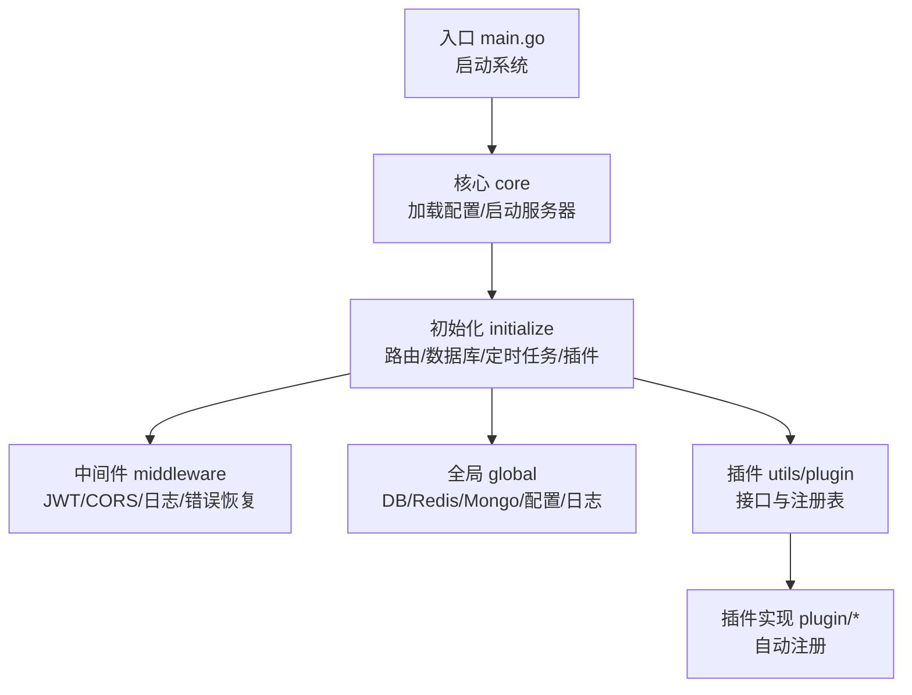
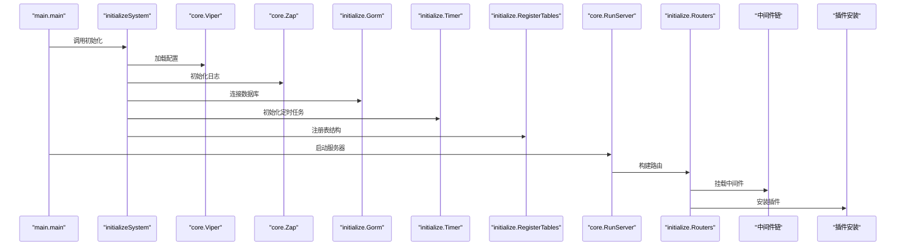
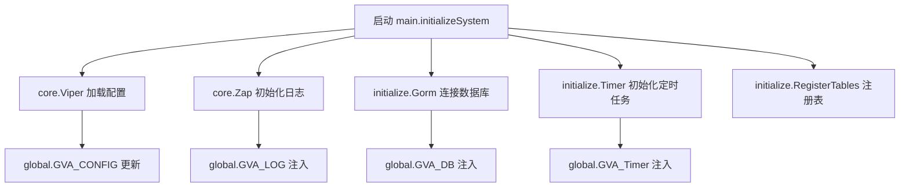
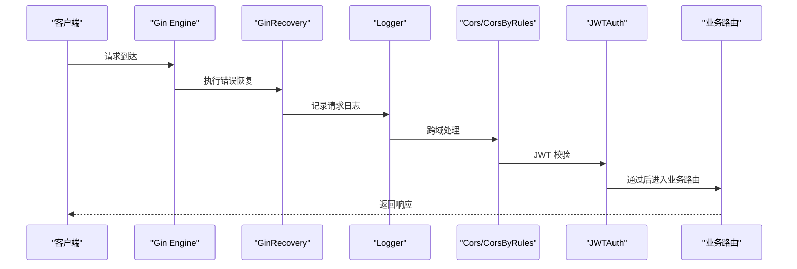
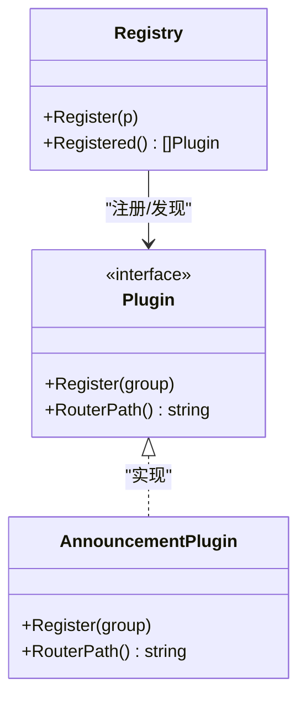
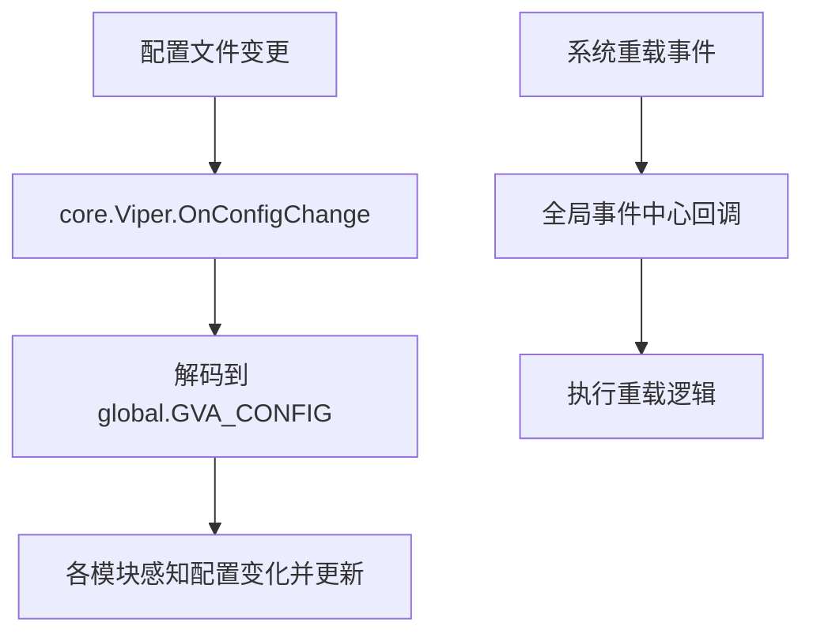
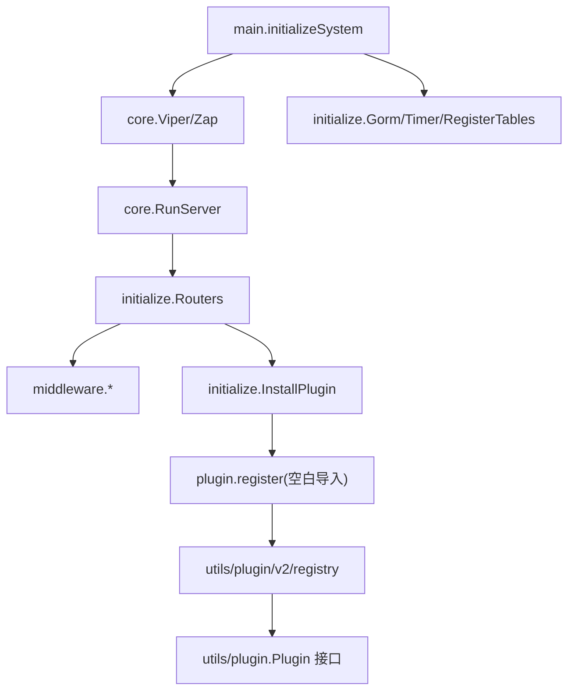

# 设计模式应用

<cite>
**本文引用的文件**
- [server/main.go](file://server/main.go)
- [server/core/server.go](file://server/core/server.go)
- [server/core/viper.go](file://server/core/viper.go)
- [server/initialize/init.go](file://server/initialize/init.go)
- [server/initialize/router.go](file://server/initialize/router.go)
- [server/initialize/plugin.go](file://server/initialize/plugin.go)
- [server/global/global.go](file://server/global/global.go)
- [server/middleware/logger.go](file://server/middleware/logger.go)
- [server/middleware/cors.go](file://server/middleware/cors.go)
- [server/middleware/error.go](file://server/middleware/error.go)
- [server/middleware/jwt.go](file://server/middleware/jwt.go)
- [server/utils/plugin/plugin.go](file://server/utils/plugin/plugin.go)
- [server/utils/plugin/v2/registry.go](file://server/utils/plugin/v2/registry.go)
- [server/plugin/register.go](file://server/plugin/register.go)
</cite>

## 目录
1. [引言](#引言)
2. [项目结构](#项目结构)
3. [核心组件](#核心组件)
4. [架构总览](#架构总览)
5. [详细组件分析](#详细组件分析)
6. [依赖分析](#依赖分析)
7. [性能考虑](#性能考虑)
8. [故障排查指南](#故障排查指南)
9. [结论](#结论)

## 引言
本文件聚焦于测试管理平台（基于 Gin-Vue-Admin）中设计模式的实际应用与落地实践，重点覆盖以下模式与机制：
- 依赖注入模式：通过全局变量与配置中心集中注入数据库、缓存、日志、定时任务等基础设施。
- 中间件模式：围绕 Gin Engine 构建可组合的横切关注点（认证、跨域、错误恢复、日志等）。
- 工厂模式：插件注册与初始化采用“注册即工厂”的方式，按需创建与装配插件能力。
- 观察者模式：配置变更监听与系统事件订阅（如热重载），实现松耦合的响应式更新。

文档将结合初始化流程、中间件链执行顺序、插件注册机制，给出可操作的最佳实践与排障建议。

## 项目结构
项目采用典型的分层与模块化组织方式：
- 入口层：main.go 启动系统，调用初始化与运行函数。
- 核心层：core 提供配置加载、服务器启动、MCP 服务集成等。
- 初始化层：initialize 负责路由、数据库、定时任务、插件安装等初始化。
- 中间件层：middleware 提供认证、跨域、日志、错误恢复等通用能力。
- 全局状态：global 统一持有全局单例（DB、Redis、Mongo、配置、日志、定时器等）。
- 插件体系：utils/plugin 定义插件接口与注册表；plugin 目录下各插件实现插件接口并自动注册。

图表来源
- [server/main.go:30-52](file://server/main.go#L30-L52)
- [server/core/server.go:14-48](file://server/core/server.go#L14-L48)
- [server/initialize/router.go:36-117](file://server/initialize/router.go#L36-L117)
- [server/global/global.go:25-42](file://server/global/global.go#L25-L42)
- [server/utils/plugin/plugin.go:11-18](file://server/utils/plugin/plugin.go#L11-L18)
- [server/plugin/register.go:1-6](file://server/plugin/register.go#L1-L6)

章节来源
- [server/main.go:30-52](file://server/main.go#L30-L52)
- [server/core/server.go:14-48](file://server/core/server.go#L14-L48)
- [server/initialize/router.go:36-117](file://server/initialize/router.go#L36-L117)
- [server/global/global.go:25-42](file://server/global/global.go#L25-L42)
- [server/utils/plugin/plugin.go:11-18](file://server/utils/plugin/plugin.go#L11-L18)
- [server/plugin/register.go:1-6](file://server/plugin/register.go#L1-L6)

## 核心组件
- 初始化流程与依赖注入
  - main.initializeSystem 负责依次初始化配置、日志、数据库、定时任务、全局函数处理器、表结构等。
  - core.RunServer 根据配置决定启用 Redis/Mongo，并加载系统业务、构建路由、启动 HTTP 服务。
  - 全局状态由 global 统一持有，形成“依赖注入”的集中入口。
- 中间件链
  - Gin Engine 在初始化阶段按序挂载中间件，形成“从外到内”的处理链，典型顺序：错误恢复 -> 日志 -> CORS/JWT -> 业务路由。
- 插件注册与工厂
  - 插件通过 utils/plugin 定义接口，实现 Register 与 RouterPath；通过 utils/plugin/v2/registry.go 的 Register/Registered 实现注册与发现；plugin/register.go 通过空白导入触发插件包初始化与注册。

章节来源
- [server/main.go:37-52](file://server/main.go#L37-L52)
- [server/core/server.go:14-48](file://server/core/server.go#L14-L48)
- [server/initialize/router.go:36-117](file://server/initialize/router.go#L36-L117)
- [server/global/global.go:25-42](file://server/global/global.go#L25-L42)
- [server/utils/plugin/plugin.go:11-18](file://server/utils/plugin/plugin.go#L11-L18)
- [server/utils/plugin/v2/registry.go:10-27](file://server/utils/plugin/v2/registry.go#L10-L27)
- [server/plugin/register.go:1-6](file://server/plugin/register.go#L1-L6)

## 架构总览
下图展示初始化与运行阶段的关键交互，以及中间件链与插件安装的时序关系。

图表来源
- [server/main.go:30-52](file://server/main.go#L30-L52)
- [server/core/server.go:14-48](file://server/core/server.go#L14-L48)
- [server/core/viper.go:16-42](file://server/core/viper.go#L16-L42)
- [server/initialize/router.go:36-117](file://server/initialize/router.go#L36-L117)
- [server/initialize/plugin.go:8-15](file://server/initialize/plugin.go#L8-L15)

## 详细组件分析

### 依赖注入模式：初始化与全局状态
- 配置注入
  - core.Viper 读取 YAML 配置，支持命令行、环境变量与默认文件路径的优先级策略，并监听配置变更动态解码到 global.GVA_CONFIG。
- 全局状态集中注入
  - main.initializeSystem 将 Viper、Zap、GORM DB、定时任务等注入 global 包的全局变量，后续模块通过 import global 直接使用，避免层层传参。
- 运行期条件注入
  - core.RunServer 根据配置开关选择性启用 Redis/Mongo，并在存在 DB 时加载系统业务模块。

图表来源
- [server/main.go:37-52](file://server/main.go#L37-L52)
- [server/core/viper.go:16-42](file://server/core/viper.go#L16-L42)
- [server/global/global.go:25-42](file://server/global/global.go#L25-L42)

章节来源
- [server/core/viper.go:16-42](file://server/core/viper.go#L16-L42)
- [server/main.go:37-52](file://server/main.go#L37-L52)
- [server/global/global.go:25-42](file://server/global/global.go#L25-L42)

### 中间件模式：链式执行与职责划分
- 中间件链顺序
  - 错误恢复：顶层捕获 panic，记录日志并返回错误响应。
  - 日志：记录请求路径、查询参数、请求体、耗时、错误等信息。
  - CORS：根据配置放行跨域请求或严格白名单模式。
  - JWT：校验令牌有效性、黑名单检查、续签逻辑。
  - 业务路由：系统路由与插件路由。
- 关键实现要点
  - GinRecovery：recover panic，区分“断开连接”场景，必要时写入错误记录。
  - Logger：支持过滤、脱敏、鉴权信息附加，最终输出 JSON 结构化日志。
  - Cors/CorsByRules：支持宽松放行与严格白名单两种模式，兼容 OPTIONS 预检。
  - JWTAuth：令牌解析、黑名单检查、续签与多端登录控制。

图表来源
- [server/middleware/error.go:20-80](file://server/middleware/error.go#L20-L80)
- [server/middleware/logger.go:41-89](file://server/middleware/logger.go#L41-L89)
- [server/middleware/cors.go:10-73](file://server/middleware/cors.go#L10-L73)
- [server/middleware/jwt.go:16-77](file://server/middleware/jwt.go#L16-L77)
- [server/initialize/router.go:36-117](file://server/initialize/router.go#L36-L117)

章节来源
- [server/middleware/error.go:20-80](file://server/middleware/error.go#L20-L80)
- [server/middleware/logger.go:41-89](file://server/middleware/logger.go#L41-L89)
- [server/middleware/cors.go:10-73](file://server/middleware/cors.go#L10-L73)
- [server/middleware/jwt.go:16-77](file://server/middleware/jwt.go#L16-L77)
- [server/initialize/router.go:36-117](file://server/initialize/router.go#L36-L117)

### 工厂模式：插件注册机制
- 接口与职责
  - utils/plugin.Plugin 定义 Register 与 RouterPath，插件通过实现该接口声明自身路由注册能力与路径标识。
- 注册与发现
  - utils/plugin/v2/registry.go 提供 Register/Registered，采用互斥锁保护注册表，支持并发安全的插件注册与快照读取。
- 自动化装配
  - server/plugin/register.go 通过空白导入触发插件包初始化，从而在包级初始化函数中调用 Register 完成注册。
- 插件安装流程
  - initialize.InstallPlugin 在数据库可用时，分别调用业务插件与 v2 插件安装逻辑，将插件路由挂载至 Gin Engine。

图表来源
- [server/utils/plugin/plugin.go:11-18](file://server/utils/plugin/plugin.go#L11-L18)
- [server/utils/plugin/v2/registry.go:10-27](file://server/utils/plugin/v2/registry.go#L10-L27)
- [server/plugin/register.go:1-6](file://server/plugin/register.go#L1-L6)

章节来源
- [server/utils/plugin/plugin.go:11-18](file://server/utils/plugin/plugin.go#L11-L18)
- [server/utils/plugin/v2/registry.go:10-27](file://server/utils/plugin/v2/registry.go#L10-L27)
- [server/plugin/register.go:1-6](file://server/plugin/register.go#L1-L6)
- [server/initialize/plugin.go:8-15](file://server/initialize/plugin.go#L8-L15)

### 观察者模式：配置变更与系统事件
- 配置变更监听
  - core.Viper 使用 fsnotify 监听配置文件变化，OnConfigChange 回调中将新配置解码到 global.GVA_CONFIG，实现“发布-订阅”式的配置热更新。
- 系统事件订阅
  - initialize.SetupHandlers 通过全局事件中心注册重载处理器，实现系统重载的统一入口。

图表来源
- [server/core/viper.go:29-37](file://server/core/viper.go#L29-L37)
- [server/initialize/init.go:9-15](file://server/initialize/init.go#L9-L15)

章节来源
- [server/core/viper.go:29-37](file://server/core/viper.go#L29-L37)
- [server/initialize/init.go:9-15](file://server/initialize/init.go#L9-L15)

## 依赖分析
- 组件耦合与协作
  - main.initializeSystem 作为初始化入口，依赖 core 与 initialize；core.RunServer 依赖 initialize 路由与系统业务；initialize 路由依赖 middleware 与 global。
  - 插件体系通过 utils/plugin 接口与 v2 注册表解耦具体插件实现，插件通过空白导入实现自动注册。
- 外部依赖与集成点
  - Gin 作为 Web 框架；Viper 作为配置中心；Zap 作为日志库；GORM/Redis/Mongo 作为数据与缓存；MCP 服务通过独立进程集成。

图表来源
- [server/main.go:37-52](file://server/main.go#L37-L52)
- [server/core/server.go:14-48](file://server/core/server.go#L14-L48)
- [server/initialize/router.go:36-117](file://server/initialize/router.go#L36-L117)
- [server/initialize/plugin.go:8-15](file://server/initialize/plugin.go#L8-L15)
- [server/utils/plugin/plugin.go:11-18](file://server/utils/plugin/plugin.go#L11-L18)
- [server/utils/plugin/v2/registry.go:10-27](file://server/utils/plugin/v2/registry.go#L10-L27)
- [server/plugin/register.go:1-6](file://server/plugin/register.go#L1-L6)

章节来源
- [server/main.go:37-52](file://server/main.go#L37-L52)
- [server/core/server.go:14-48](file://server/core/server.go#L14-L48)
- [server/initialize/router.go:36-117](file://server/initialize/router.go#L36-L117)
- [server/initialize/plugin.go:8-15](file://server/initialize/plugin.go#L8-L15)
- [server/utils/plugin/plugin.go:11-18](file://server/utils/plugin/plugin.go#L11-L18)
- [server/utils/plugin/v2/registry.go:10-27](file://server/utils/plugin/v2/registry.go#L10-L27)
- [server/plugin/register.go:1-6](file://server/plugin/register.go#L1-L6)

## 性能考虑
- 中间件顺序与开销
  - 将轻量中间件（如日志、CORS）置于链路前部，减少对慢中间件（如 JWT、鉴权）的重复计算。
  - JWT 中的黑名单检查与续签逻辑应尽量复用缓存命中，避免频繁访问数据库。
- 配置监听与热更新
  - 配置变更回调中仅做必要字段解码与最小范围更新，避免全量重建。
- 插件注册与初始化
  - 插件注册采用并发安全的注册表，避免在高并发场景下的竞态；插件安装应在数据库可用后再执行，减少失败重试成本。

## 故障排查指南
- 服务器启动失败
  - 检查配置文件路径与权限，确认 core.Viper 能成功读取并解码到 global.GVA_CONFIG。
  - 若数据库不可用，RegisterTables 与 RunServer 中相关逻辑可能跳过，需先修复数据库连接。
- 中间件异常
  - GinRecovery：若出现“断开连接”类错误，属于正常网络行为，无需 Panic；若为业务 Panic，检查堆栈与错误记录。
  - Logger：确认过滤与脱敏逻辑未误伤关键字段；确保 Print 输出通道可用。
  - CORS：严格白名单模式下，未通过的请求会被拒绝；确认白名单配置与 Origin 是否一致。
  - JWT：检查令牌格式、过期时间、黑名单缓存与续签逻辑；多端登录场景需同步 Redis 中的活跃令牌。
- 插件未生效
  - 确认插件包通过空白导入被编译进二进制；检查 utils/plugin/v2/registry 是否包含该插件实例；确认 initialize.InstallPlugin 在数据库可用后被调用。

章节来源
- [server/core/viper.go:16-42](file://server/core/viper.go#L16-L42)
- [server/middleware/error.go:20-80](file://server/middleware/error.go#L20-L80)
- [server/middleware/logger.go:41-89](file://server/middleware/logger.go#L41-L89)
- [server/middleware/cors.go:30-73](file://server/middleware/cors.go#L30-L73)
- [server/middleware/jwt.go:16-77](file://server/middleware/jwt.go#L16-L77)
- [server/initialize/plugin.go:8-15](file://server/initialize/plugin.go#L8-L15)
- [server/utils/plugin/v2/registry.go:10-27](file://server/utils/plugin/v2/registry.go#L10-L27)

## 结论
本项目通过清晰的初始化流程实现了依赖注入，借助 Gin 中间件链构建了可组合的横切能力；插件体系采用接口与注册表实现“注册即工厂”的扩展机制；配置与事件监听体现了观察者模式的响应式更新。遵循本文的最佳实践与排障建议，可帮助开发者在保持低耦合的同时高效扩展系统能力。