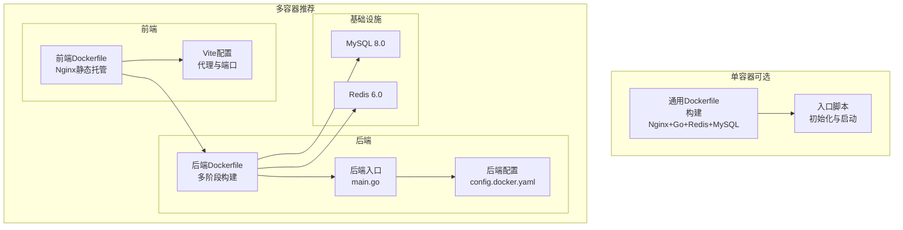
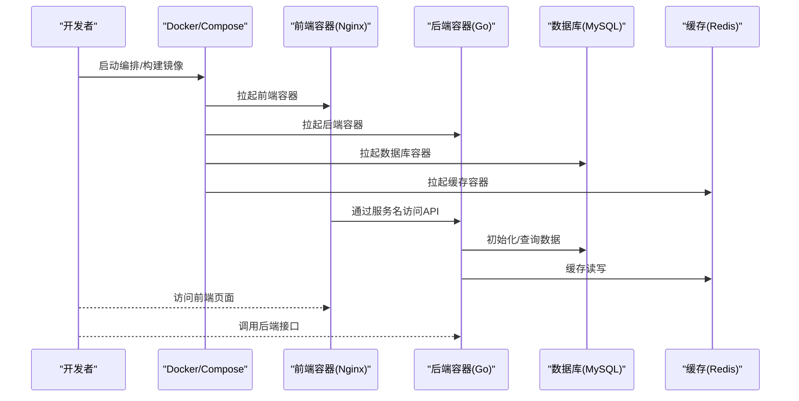
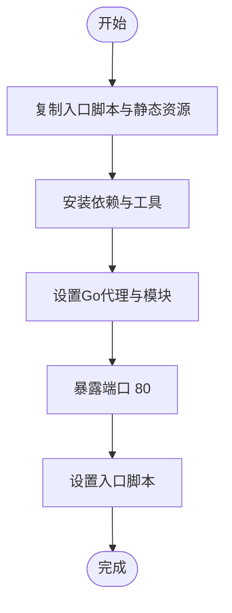
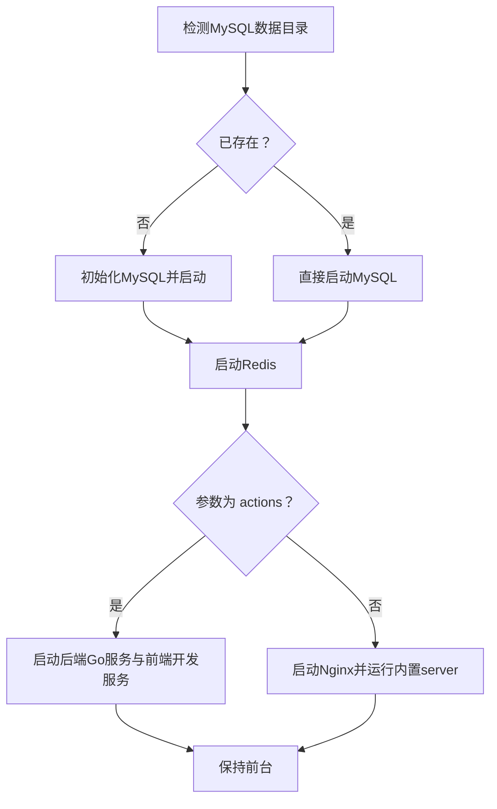
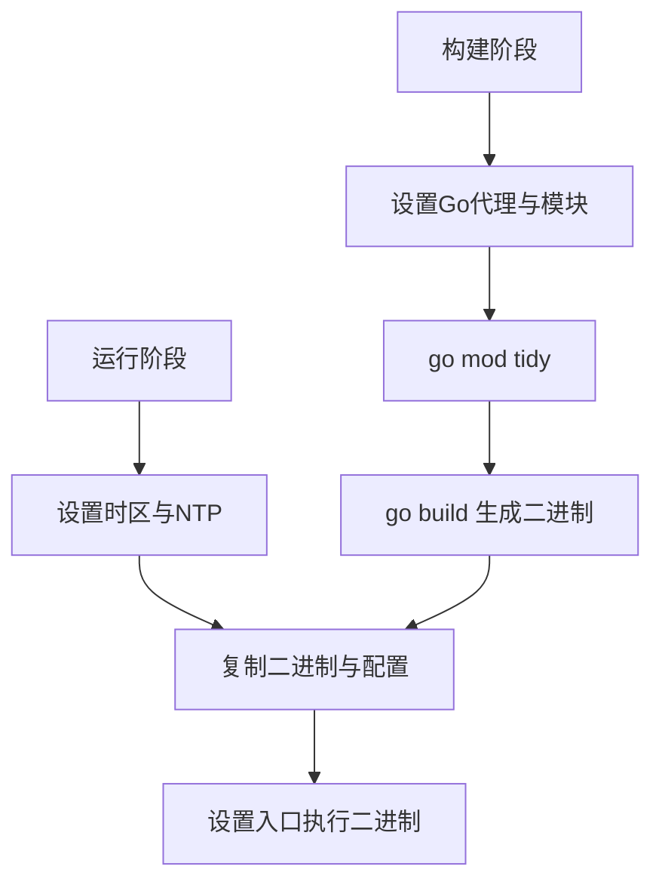
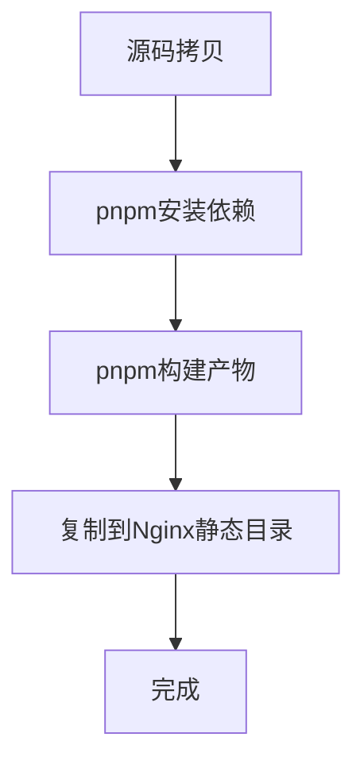
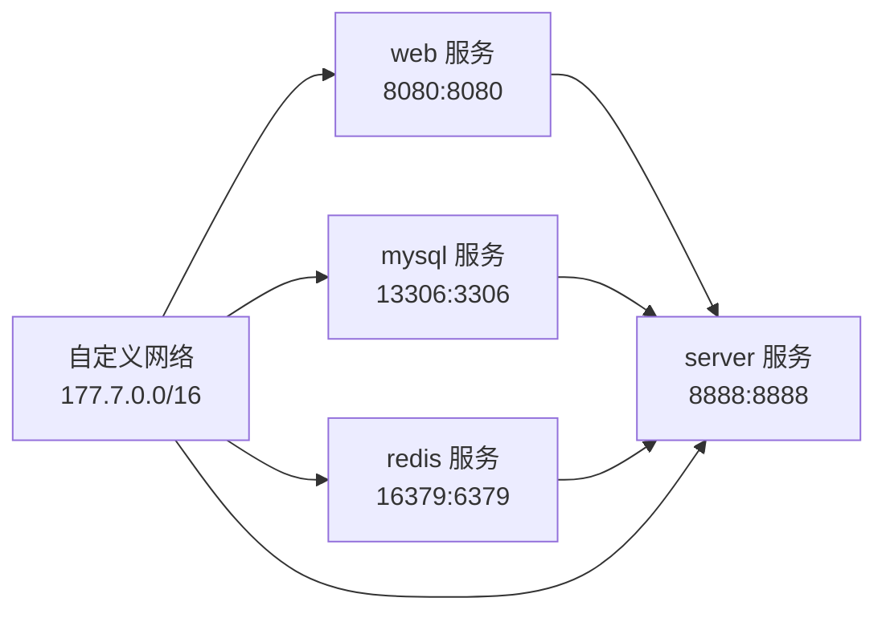
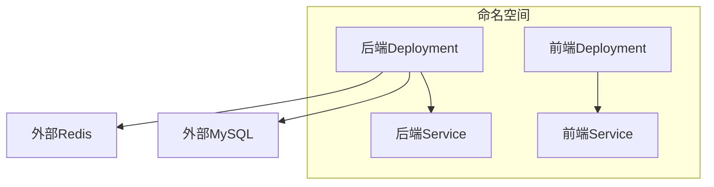
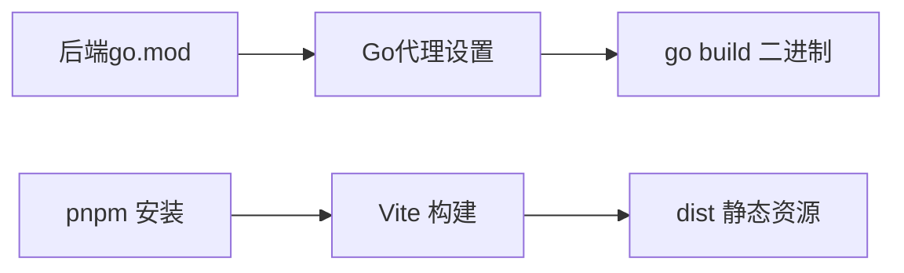

# Docker容器化部署

<cite>
**本文引用的文件**
- [Dockerfile（通用）](file://deploy/docker/Dockerfile)
- [入口脚本（通用）](file://deploy/docker/entrypoint.sh)
- [Docker Compose（编排）](file://deploy/docker-compose/docker-compose.yaml)
- [后端Dockerfile](file://server/Dockerfile)
- [前端Dockerfile](file://web/Dockerfile)
- [后端配置（Docker）](file://server/config.docker.yaml)
- [后端配置（开发）](file://server/config.yaml)
- [后端入口](file://server/main.go)
- [后端模块清单](file://server/go.mod)
- [前端包清单](file://web/package.json)
- [前端Vite配置](file://web/vite.config.js)
- [前端忽略规则](file://web/.dockerignore)
- [K8s服务端Deployment](file://deploy/kubernetes/server/gva-server-deployment.yaml)
- [K8s服务端Service](file://deploy/kubernetes/server/gva-server-service.yaml)
- [K8s前端Deployment](file://deploy/kubernetes/web/gva-web-deploymemt.yaml)
- [K8s前端Service](file://deploy/kubernetes/web/gva-web-service.yaml)
</cite>

## 目录
1. [简介](#简介)
2. [项目结构](#项目结构)
3. [核心组件](#核心组件)
4. [架构总览](#架构总览)
5. [详细组件分析](#详细组件分析)
6. [依赖分析](#依赖分析)
7. [性能考虑](#性能考虑)
8. [故障排查指南](#故障排查指南)
9. [结论](#结论)
10. [附录](#附录)

## 简介
本文件面向测试管理平台的Docker容器化部署，覆盖以下主题：
- Dockerfile构建流程与优化策略
- 环境配置、依赖安装与启动脚本
- 容器启动流程、端口映射与网络配置
- 单容器与多容器编排示例
- 镜像构建优化、资源限制与健康检查
- Docker Compose使用与环境变量配置
- 日志管理与调试技巧

## 项目结构
测试管理平台采用前后端分离的多容器架构，包含：
- 后端服务容器：基于Go语言，提供REST API与业务逻辑
- 前端容器：基于Nginx静态托管Vue应用
- 数据库与缓存：MySQL与Redis，通过Compose或Kubernetes编排
- 可选：单容器通用方案（包含Nginx、Go、Redis、MySQL）

图表来源
- [Dockerfile（通用）:1-18](file://deploy/docker/Dockerfile#L1-L18)
- [入口脚本（通用）:1-19](file://deploy/docker/entrypoint.sh#L1-L19)
- [前端Dockerfile:1-26](file://web/Dockerfile#L1-L26)
- [前端Vite配置:57-78](file://web/vite.config.js#L57-L78)
- [后端Dockerfile:1-32](file://server/Dockerfile#L1-L32)
- [后端入口:30-35](file://server/main.go#L30-L35)
- [后端配置（Docker）:74-81](file://server/config.docker.yaml#L74-L81)

章节来源
- [Dockerfile（通用）:1-18](file://deploy/docker/Dockerfile#L1-L18)
- [Docker Compose（编排）:1-91](file://deploy/docker-compose/docker-compose.yaml#L1-L91)
- [后端Dockerfile:1-32](file://server/Dockerfile#L1-L32)
- [前端Dockerfile:1-26](file://web/Dockerfile#L1-L26)
- [后端配置（Docker）:74-81](file://server/config.docker.yaml#L74-L81)

## 核心组件
- 通用Dockerfile（单容器）
  - 基础镜像：CentOS 7
  - 依赖：Git、Redis、Nginx、Go、Yarn、MySQL客户端
  - 环境：Locale、内核参数、代理与模块开关
  - 入口：入口脚本负责初始化MySQL、启动Redis与Nginx/服务进程
- 后端Dockerfile（多容器）
  - 多阶段构建：Alpine + Go构建器
  - 运行时：Alpine + 时区与NTP
  - 入口：执行server二进制并加载Docker专用配置
- 前端Dockerfile（多容器）
  - 基于Nginx：静态资源分发
  - 构建链路：pnpm安装 → 生产依赖 → 构建 → Nginx复制产物
- Compose编排
  - 网络：自定义子网，静态IP分配
  - 服务：web、server、mysql、redis
  - 健康检查：MySQL与Redis健康探针
  - 端口映射：Web前端8080、后端8888、MySQL3306、Redis6379
- K8s部署（可选）
  - 服务端Deployment：CPU/Memory资源限制、存活/就绪/启动探针
  - 服务端Service：ClusterIP暴露8888
  - 前端Deployment：Nginx容器，就绪探针8080

章节来源
- [Dockerfile（通用）:1-18](file://deploy/docker/Dockerfile#L1-L18)
- [入口脚本（通用）:1-19](file://deploy/docker/entrypoint.sh#L1-L19)
- [后端Dockerfile:1-32](file://server/Dockerfile#L1-L32)
- [前端Dockerfile:1-26](file://web/Dockerfile#L1-L26)
- [Docker Compose（编排）:1-91](file://deploy/docker-compose/docker-compose.yaml#L1-L91)
- [K8s服务端Deployment:1-74](file://deploy/kubernetes/server/gva-server-deployment.yaml#L1-L74)
- [K8s服务端Service:1-22](file://deploy/kubernetes/server/gva-server-service.yaml#L1-L22)
- [K8s前端Deployment:1-52](file://deploy/kubernetes/web/gva-web-deploymemt.yaml#L1-L52)
- [K8s前端Service:1-22](file://deploy/kubernetes/web/gva-web-service.yaml#L1-L22)

## 架构总览
下图展示容器启动与交互流程，涵盖单容器与多容器两种模式。

图表来源
- [Docker Compose（编排）:16-91](file://deploy/docker-compose/docker-compose.yaml#L16-L91)
- [后端配置（Docker）:74-81](file://server/config.docker.yaml#L74-L81)
- [K8s服务端Service:16-19](file://deploy/kubernetes/server/gva-server-service.yaml#L16-L19)
- [K8s前端Service:15-18](file://deploy/kubernetes/web/gva-web-service.yaml#L15-L18)

## 详细组件分析

### 通用Dockerfile（单容器）
- 基础镜像与工作目录：CentOS 7，工作目录/opt
- 环境变量：设置locale与系统参数
- 依赖安装：epel、MySQL仓库、git、redis、nginx、go、yarn
- 代理与模块：启用Go模块代理，加速依赖下载
- 暴露端口：80
- 入口：执行入口脚本

图表来源
- [Dockerfile（通用）:1-18](file://deploy/docker/Dockerfile#L1-L18)

章节来源
- [Dockerfile（通用）:1-18](file://deploy/docker/Dockerfile#L1-L18)

### 入口脚本（通用）
- MySQL初始化：首次运行初始化数据目录并创建数据库与用户
- Redis：后台启动
- 启动模式：根据参数决定启动Nginx+后端或直接启动Nginx与内置server
- 常驻进程：输出启动信息并保持前台

图表来源
- [入口脚本（通用）:1-19](file://deploy/docker/entrypoint.sh#L1-L19)

章节来源
- [入口脚本（通用）:1-19](file://deploy/docker/entrypoint.sh#L1-L19)

### 后端Dockerfile（多容器）
- 多阶段构建：builder阶段拉取依赖、设置Go代理、构建二进制；运行时阶段仅含二进制与资源
- 运行时环境：Alpine + 时区与NTP
- 入口：执行server二进制并加载Docker专用配置文件

图表来源
- [后端Dockerfile:1-32](file://server/Dockerfile#L1-L32)

章节来源
- [后端Dockerfile:1-32](file://server/Dockerfile#L1-L32)

### 前端Dockerfile（多容器）
- 基于Nginx：静态资源分发
- 构建链路：pnpm安装生产依赖与构建 → Nginx复制dist产物
- 优化点：利用缓存层减少重复安装

图表来源
- [前端Dockerfile:1-26](file://web/Dockerfile#L1-L26)

章节来源
- [前端Dockerfile:1-26](file://web/Dockerfile#L1-L26)

### Docker Compose编排（多容器）
- 网络：自定义子网，静态IP分配，便于服务间通信
- 服务：
  - web：前端容器，端口映射8080，依赖后端，使用Nginx
  - server：后端容器，端口映射8888，依赖MySQL与Redis健康
  - mysql：MySQL 8.0，环境变量初始化数据库与用户，健康检查
  - redis：Redis 6.0，健康检查
- 健康检查：MySQL与Redis分别配置探针
- 端口映射：前端8080→8080，后端8888→8888，MySQL13306→3306，Redis16379→6379

图表来源
- [Docker Compose（编排）:16-91](file://deploy/docker-compose/docker-compose.yaml#L16-L91)

章节来源
- [Docker Compose（编排）:1-91](file://deploy/docker-compose/docker-compose.yaml#L1-L91)

### Kubernetes部署（可选）
- 服务端Deployment：
  - CPU/Memory资源限制与请求
  - 存活/就绪/启动探针（TCP Socket）
  - 挂载配置与本地时间
- 服务端Service：ClusterIP暴露8888
- 前端Deployment：Nginx容器，就绪探针8080

图表来源
- [K8s服务端Deployment:24-65](file://deploy/kubernetes/server/gva-server-deployment.yaml#L24-L65)
- [K8s服务端Service:13-20](file://deploy/kubernetes/server/gva-server-service.yaml#L13-L20)
- [K8s前端Deployment:24-44](file://deploy/kubernetes/web/gva-web-deploymemt.yaml#L24-L44)
- [K8s前端Service:13-18](file://deploy/kubernetes/web/gva-web-service.yaml#L13-L18)

章节来源
- [K8s服务端Deployment:1-74](file://deploy/kubernetes/server/gva-server-deployment.yaml#L1-L74)
- [K8s服务端Service:1-22](file://deploy/kubernetes/server/gva-server-service.yaml#L1-L22)
- [K8s前端Deployment:1-52](file://deploy/kubernetes/web/gva-web-deploymemt.yaml#L1-L52)
- [K8s前端Service:1-22](file://deploy/kubernetes/web/gva-web-service.yaml#L1-L22)

## 依赖分析
- 后端依赖管理
  - Go版本与模块代理：在构建阶段设置GO111MODULE与GOPROXY
  - 依赖清单：包含Gin、GORM、Casbin、Redis、AWS SDK等
- 前端依赖管理
  - 包管理器：pnpm（启用缓存）
  - 构建工具：Vite、Vue3、Element Plus等
  - 开发代理：基于Vite配置的代理规则，指向后端服务

图表来源
- [后端模块清单:1-208](file://server/go.mod#L1-L208)
- [后端Dockerfile:6-11](file://server/Dockerfile#L6-L11)
- [前端Dockerfile:13-18](file://web/Dockerfile#L13-L18)
- [前端包清单:1-88](file://web/package.json#L1-L88)

章节来源
- [后端模块清单:1-208](file://server/go.mod#L1-L208)
- [后端Dockerfile:6-11](file://server/Dockerfile#L6-L11)
- [前端Dockerfile:13-18](file://web/Dockerfile#L13-L18)
- [前端包清单:1-88](file://web/package.json#L1-L88)

## 性能考虑
- 镜像构建优化
  - 后端：多阶段构建，仅在运行时包含二进制与必要资源，减小镜像体积
  - 前端：利用pnpm缓存与分层构建，避免重复安装依赖
  - 通用：在通用Dockerfile中统一设置Go代理，提升依赖下载速度
- 资源限制
  - K8s中为后端设置CPU/Memory上限与请求，避免资源争抢
  - 前端Nginx资源限制适中，满足静态资源分发需求
- 健康检查
  - MySQL与Redis分别配置健康探针，确保后端启动前依赖可用
- 端口与网络
  - 明确端口映射与服务间通信，避免冲突
  - 自定义网络便于服务发现与隔离

章节来源
- [后端Dockerfile:1-32](file://server/Dockerfile#L1-L32)
- [前端Dockerfile:1-26](file://web/Dockerfile#L1-L26)
- [Docker Compose（编排）:64-85](file://deploy/docker-compose/docker-compose.yaml#L64-L85)
- [K8s服务端Deployment:37-43](file://deploy/kubernetes/server/gva-server-deployment.yaml#L37-L43)

## 故障排查指南
- 启动失败
  - 检查入口脚本是否正确初始化MySQL与启动Redis/Nginx
  - 查看后端日志与K8s事件，确认依赖健康状态
- 端口冲突
  - 确认宿主机端口映射未被占用（如8080、8888、13306、16379）
- 依赖不可达
  - 校验Compose/K8s中的服务名与端口是否匹配
  - 检查健康检查结果与网络连通性
- 日志定位
  - 后端：查看config.docker.yaml中日志目录与级别
  - 前端：查看Nginx访问/错误日志
  - 通用：容器日志可通过docker logs或kubectl logs查看

章节来源
- [入口脚本（通用）:1-19](file://deploy/docker/entrypoint.sh#L1-L19)
- [后端配置（Docker）:10-19](file://server/config.docker.yaml#L10-L19)
- [Docker Compose（编排）:64-85](file://deploy/docker-compose/docker-compose.yaml#L64-L85)
- [K8s服务端Deployment:44-58](file://deploy/kubernetes/server/gva-server-deployment.yaml#L44-L58)

## 结论
本项目提供了两种容器化部署路径：
- 单容器：适合快速体验，一键启动Nginx+Go+Redis+MySQL
- 多容器：适合生产与开发协作，清晰分离前后端与基础设施
结合Compose/K8s的健康检查、资源限制与网络配置，可实现稳定可靠的容器化交付。

## 附录

### 单容器部署步骤（通用Dockerfile）
- 构建镜像
  - 使用通用Dockerfile构建镜像
- 启动容器
  - 挂载数据卷（如需要持久化）
  - 暴露端口80
  - 运行入口脚本，按需选择启动模式

章节来源
- [Dockerfile（通用）:1-18](file://deploy/docker/Dockerfile#L1-L18)
- [入口脚本（通用）:1-19](file://deploy/docker/entrypoint.sh#L1-L19)

### 多容器编排步骤（Compose）
- 准备
  - 确保Docker Compose可用
- 启动
  - 在compose目录执行启动命令
  - 观察各服务健康状态
- 访问
  - 前端：浏览器访问宿主机8080端口
  - 后端：通过服务名或宿主机8888端口访问

章节来源
- [Docker Compose（编排）:1-91](file://deploy/docker-compose/docker-compose.yaml#L1-L91)

### 环境变量与配置
- 前端Vite
  - 通过Vite配置中的代理规则指向后端服务
  - 端口与路径通过环境变量控制
- 后端配置
  - Docker专用配置文件用于容器内运行参数
  - 系统端口、数据库类型、Redis地址等均在配置中定义

章节来源
- [前端Vite配置:57-78](file://web/vite.config.js#L57-L78)
- [后端配置（Docker）:74-81](file://server/config.docker.yaml#L74-L81)

### 日志与调试
- 后端日志
  - 配置文件中指定日志目录与级别
  - K8s中可通过describe events查看异常
- 前端日志
  - Nginx访问/错误日志位于标准位置
- 通用
  - 使用容器日志查看器或K8s日志命令定位问题

章节来源
- [后端配置（Docker）:10-19](file://server/config.docker.yaml#L10-L19)
- [K8s服务端Deployment:44-58](file://deploy/kubernetes/server/gva-server-deployment.yaml#L44-L58)