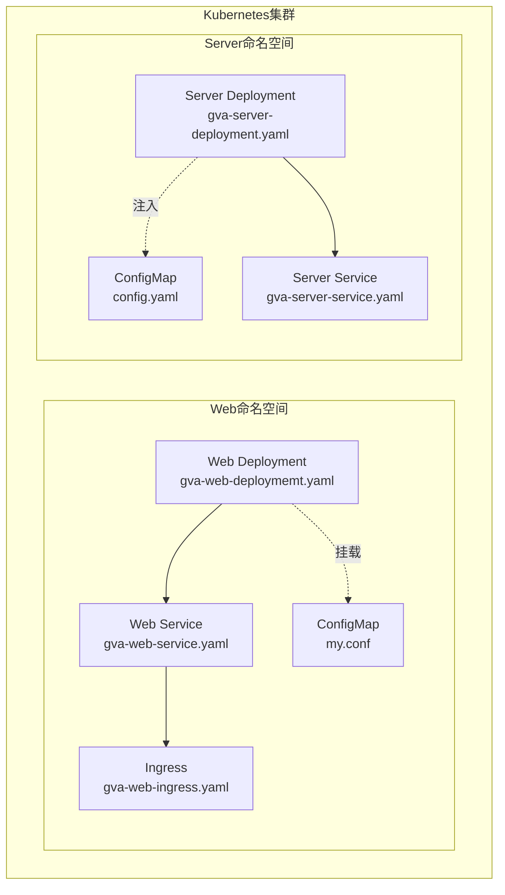
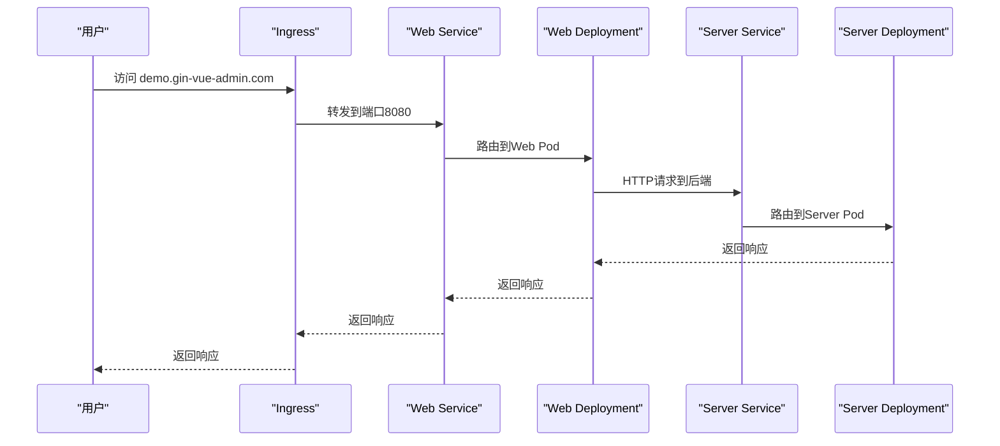
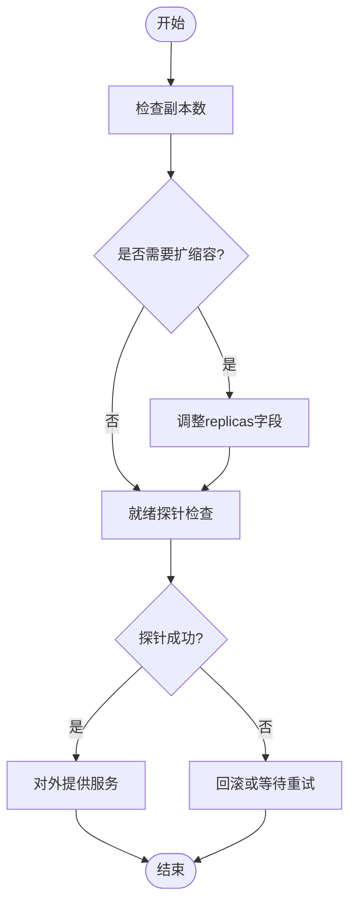
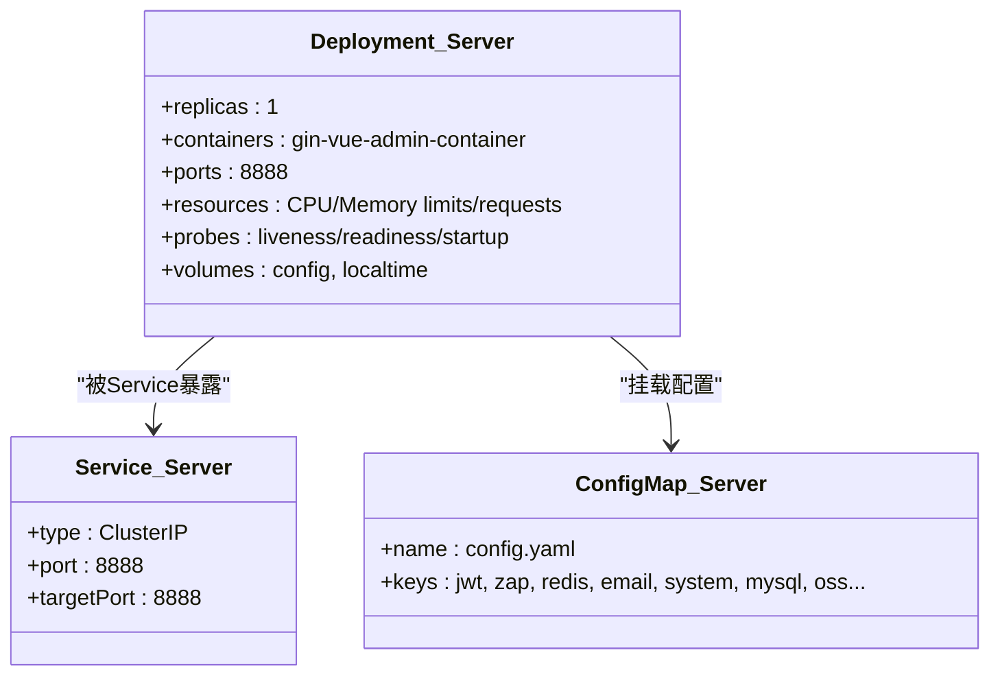
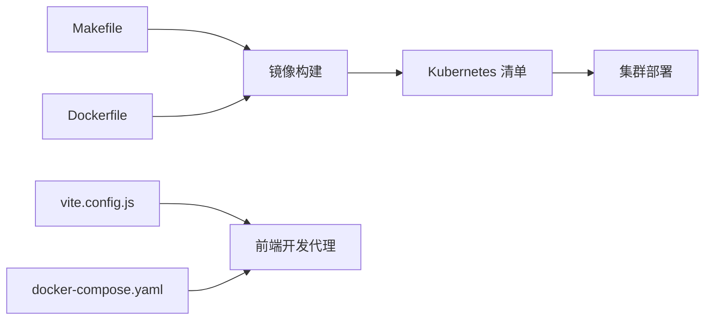

# Kubernetes集群部署

<cite>
**本文引用的文件**
- [gva-server-deployment.yaml](file://deploy/kubernetes/server/gva-server-deployment.yaml)
- [gva-server-service.yaml](file://deploy/kubernetes/server/gva-server-service.yaml)
- [gva-server-configmap.yaml](file://deploy/kubernetes/server/gva-server-configmap.yaml)
- [gva-web-deploymemt.yaml](file://deploy/kubernetes/web/gva-web-deploymemt.yaml)
- [gva-web-service.yaml](file://deploy/kubernetes/web/gva-web-service.yaml)
- [gva-web-ingress.yaml](file://deploy/kubernetes/web/gva-web-ingress.yaml)
- [Dockerfile](file://deploy/docker/Dockerfile)
- [entrypoint.sh](file://deploy/docker/entrypoint.sh)
- [docker-compose.yaml](file://deploy/docker-compose/docker-compose.yaml)
- [config.yaml](file://server/config.yaml)
- [vite.config.js](file://web/vite.config.js)
- [Makefile](file://Makefile)
- [README.md](file://README.md)
</cite>

## 目录
1. [简介](#简介)
2. [项目结构](#项目结构)
3. [核心组件](#核心组件)
4. [架构总览](#架构总览)
5. [详细组件分析](#详细组件分析)
6. [依赖关系分析](#依赖关系分析)
7. [性能与资源规划](#性能与资源规划)
8. [故障排查指南](#故障排查指南)
9. [结论](#结论)
10. [附录](#附录)

## 简介
本文件面向在Kubernetes集群中部署“测试管理平台”的工程团队，系统性阐述如何基于现有仓库中的Kubernetes清单与Docker配置，完成Deployment、Service、Ingress等核心资源的配置；说明Pod的部署策略、副本数与滚动更新机制；介绍ConfigMap的使用、Secret的安全配置与持久化存储挂载；提供负载均衡、服务发现与网络策略的配置指南；并结合Makefile与Dockerfile给出Helm Chart的使用思路与自动化部署流程建议，最后总结集群扩缩容、资源监控与故障恢复的最佳实践。

## 项目结构
本项目采用“前后端分离 + Docker多阶段构建 + Kubernetes原生清单”的部署架构：
- 前端：基于Vite构建，产物静态托管于Nginx容器，通过Ingress对外暴露。
- 后端：Go服务，通过Deployment运行，Service提供稳定访问入口。
- 配置：后端配置通过ConfigMap注入，前端通过ConfigMap挂载Nginx配置。
- 存储：数据库与缓存使用外部服务或集群内StatefulSet/Service，本仓库未提供持久卷清单。
- 镜像：通过Makefile统一构建，镜像仓库位于阿里云容器镜像服务。

图表来源
- [gva-web-deploymemt.yaml:1-52](file://deploy/kubernetes/web/gva-web-deploymemt.yaml#L1-L52)
- [gva-web-service.yaml:1-22](file://deploy/kubernetes/web/gva-web-service.yaml#L1-L22)
- [gva-web-ingress.yaml:1-18](file://deploy/kubernetes/web/gva-web-ingress.yaml#L1-L18)
- [gva-server-deployment.yaml:1-74](file://deploy/kubernetes/server/gva-server-deployment.yaml#L1-L74)
- [gva-server-service.yaml:1-22](file://deploy/kubernetes/server/gva-server-service.yaml#L1-L22)
- [gva-server-configmap.yaml:1-149](file://deploy/kubernetes/server/gva-server-configmap.yaml#L1-L149)

章节来源
- [gva-web-deploymemt.yaml:1-52](file://deploy/kubernetes/web/gva-web-deploymemt.yaml#L1-L52)
- [gva-web-service.yaml:1-22](file://deploy/kubernetes/web/gva-web-service.yaml#L1-L22)
- [gva-web-ingress.yaml:1-18](file://deploy/kubernetes/web/gva-web-ingress.yaml#L1-L18)
- [gva-server-deployment.yaml:1-74](file://deploy/kubernetes/server/gva-server-deployment.yaml#L1-L74)
- [gva-server-service.yaml:1-22](file://deploy/kubernetes/server/gva-server-service.yaml#L1-L22)
- [gva-server-configmap.yaml:1-149](file://deploy/kubernetes/server/gva-server-configmap.yaml#L1-L149)

## 核心组件
- Web前端（Nginx）：通过Deployment运行，暴露8080端口；Service为ClusterIP；Ingress将域名demo.gin-vue-admin.com指向Web Service。
- Server后端（Go）：通过Deployment运行，暴露8888端口；Service为ClusterIP；通过ConfigMap注入配置文件。
- 配置管理：Web侧通过ConfigMap挂载Nginx配置；Server侧通过ConfigMap注入config.yaml。
- 镜像与构建：Makefile统一构建镜像，Dockerfile定义容器环境与启动脚本。

章节来源
- [gva-web-deploymemt.yaml:1-52](file://deploy/kubernetes/web/gva-web-deploymemt.yaml#L1-L52)
- [gva-web-service.yaml:1-22](file://deploy/kubernetes/web/gva-web-service.yaml#L1-L22)
- [gva-web-ingress.yaml:1-18](file://deploy/kubernetes/web/gva-web-ingress.yaml#L1-L18)
- [gva-server-deployment.yaml:1-74](file://deploy/kubernetes/server/gva-server-deployment.yaml#L1-L74)
- [gva-server-service.yaml:1-22](file://deploy/kubernetes/server/gva-server-service.yaml#L1-L22)
- [gva-server-configmap.yaml:1-149](file://deploy/kubernetes/server/gva-server-configmap.yaml#L1-L149)
- [Makefile:1-76](file://Makefile#L1-L76)
- [Dockerfile:1-18](file://deploy/docker/Dockerfile#L1-L18)
- [entrypoint.sh:1-19](file://deploy/docker/entrypoint.sh#L1-L19)

## 架构总览
下图展示Kubernetes中的流量走向与组件交互：客户端经Ingress进入Web Service，再转发至Web Pod；Web Pod通过HTTP请求访问Server Service，最终到达Server Pod。

图表来源
- [gva-web-ingress.yaml:1-18](file://deploy/kubernetes/web/gva-web-ingress.yaml#L1-L18)
- [gva-web-service.yaml:1-22](file://deploy/kubernetes/web/gva-web-service.yaml#L1-L22)
- [gva-web-deploymemt.yaml:1-52](file://deploy/kubernetes/web/gva-web-deploymemt.yaml#L1-L52)
- [gva-server-service.yaml:1-22](file://deploy/kubernetes/server/gva-server-service.yaml#L1-L22)
- [gva-server-deployment.yaml:1-74](file://deploy/kubernetes/server/gva-server-deployment.yaml#L1-L74)

## 详细组件分析

### Web前端组件（Nginx）
- Deployment
  - 副本数：1（可按需扩缩容）
  - 容器端口：8080
  - 资源限制与请求：CPU/Memory限制与请求已配置
  - 就绪探针：TCP探测8080端口
  - 卷挂载：挂载ConfigMap my.conf 到 /etc/nginx/conf.d/
- Service
  - 类型：ClusterIP
  - 端口：8080，目标端口：8080
- Ingress
  - 类型：nginx
  - 主机：demo.gin-vue-admin.com
  - 路径：/，转发到gva-web Service的8080端口

图表来源
- [gva-web-deploymemt.yaml:1-52](file://deploy/kubernetes/web/gva-web-deploymemt.yaml#L1-L52)
- [gva-web-service.yaml:1-22](file://deploy/kubernetes/web/gva-web-service.yaml#L1-L22)
- [gva-web-ingress.yaml:1-18](file://deploy/kubernetes/web/gva-web-ingress.yaml#L1-L18)

章节来源
- [gva-web-deploymemt.yaml:1-52](file://deploy/kubernetes/web/gva-web-deploymemt.yaml#L1-L52)
- [gva-web-service.yaml:1-22](file://deploy/kubernetes/web/gva-web-service.yaml#L1-L22)
- [gva-web-ingress.yaml:1-18](file://deploy/kubernetes/web/gva-web-ingress.yaml#L1-L18)

### Server后端组件（Go）
- Deployment
  - 副本数：1（可按需扩缩容）
  - 容器端口：8888
  - 资源限制与请求：CPU/Memory限制与请求已配置
  - 探针：存活/就绪/启动探针均针对8888端口
  - 卷挂载：挂载hostPath /etc/localtime；挂载ConfigMap config.yaml
- Service
  - 类型：ClusterIP
  - 端口：8888，目标端口：8888
- ConfigMap
  - 名称：config.yaml
  - 内容：包含jwt、zap、redis、email、system、mysql、oss等配置项

图表来源
- [gva-server-deployment.yaml:1-74](file://deploy/kubernetes/server/gva-server-deployment.yaml#L1-L74)
- [gva-server-service.yaml:1-22](file://deploy/kubernetes/server/gva-server-service.yaml#L1-L22)
- [gva-server-configmap.yaml:1-149](file://deploy/kubernetes/server/gva-server-configmap.yaml#L1-L149)

章节来源
- [gva-server-deployment.yaml:1-74](file://deploy/kubernetes/server/gva-server-deployment.yaml#L1-L74)
- [gva-server-service.yaml:1-22](file://deploy/kubernetes/server/gva-server-service.yaml#L1-L22)
- [gva-server-configmap.yaml:1-149](file://deploy/kubernetes/server/gva-server-configmap.yaml#L1-L149)

### 配置管理（ConfigMap与Secret）
- ConfigMap
  - Web侧：my.conf（Nginx配置），通过卷挂载到 /etc/nginx/conf.d/
  - Server侧：config.yaml（应用配置），通过subPath挂载到 /go/.../config.docker.yaml
- Secret（建议）
  - 对于敏感配置（如数据库密码、Redis密码、邮件密钥、OSS密钥等），应迁移到Secret，并通过环境变量或Secret卷挂载注入，避免硬编码在ConfigMap中。

章节来源
- [gva-web-deploymemt.yaml:45-51](file://deploy/kubernetes/web/gva-web-deploymemt.yaml#L45-L51)
- [gva-server-deployment.yaml:31-36](file://deploy/kubernetes/server/gva-server-deployment.yaml#L31-L36)
- [gva-server-configmap.yaml:13-149](file://deploy/kubernetes/server/gva-server-configmap.yaml#L13-L149)

### 滚动更新与发布策略
- Deployment默认策略为滚动更新（RollingUpdate），可通过maxUnavailable与maxSurge参数精细化控制更新节奏。
- 建议：
  - 设置合理的探针（存活/就绪/启动）以确保平滑切换。
  - 在高可用场景下，将replicas提升至2或以上，并结合PodDisruptionBudget保障更新期间的服务连续性。

章节来源
- [gva-web-deploymemt.yaml:13-13](file://deploy/kubernetes/web/gva-web-deploymemt.yaml#L13-L13)
- [gva-server-deployment.yaml:13-13](file://deploy/kubernetes/server/gva-server-deployment.yaml#L13-L13)

### 持久化存储与卷
- 当前清单未提供PersistentVolume/PersistentVolumeClaim，数据库与缓存依赖外部服务或集群内StatefulSet。
- 如需本地持久化，可在Server Deployment中新增PVC并挂载到容器路径，同时为ConfigMap与数据卷分别管理。

章节来源
- [gva-server-deployment.yaml:68-74](file://deploy/kubernetes/server/gva-server-deployment.yaml#L68-L74)

### 负载均衡与服务发现
- Service为ClusterIP，内部服务发现通过Service DNS名称（如gva-web、gva-server）实现。
- 若需对外暴露，可将Web Service改为NodePort或在Ingress中统一入口。

章节来源
- [gva-web-service.yaml:13-14](file://deploy/kubernetes/web/gva-web-service.yaml#L13-L14)
- [gva-server-service.yaml:13-13](file://deploy/kubernetes/server/gva-server-service.yaml#L13-L13)

### 网络策略（NetworkPolicy）
- 可通过NetworkPolicy限制入站/出站流量，例如仅允许Ingress访问Web Service，或仅允许Server访问特定后端服务。
- 建议为不同命名空间划分NetworkPolicy，确保最小权限原则。

[本节为通用指导，无需具体文件引用]

## 依赖关系分析
- 构建与镜像
  - Makefile负责前后端构建与镜像推送，镜像仓库位于阿里云容器镜像服务。
  - Dockerfile定义容器基础环境、安装依赖与启动脚本。
- 前端开发与代理
  - vite.config.js提供开发代理规则，将/api前缀代理到后端服务，便于本地联调。
- Compose对比
  - docker-compose.yaml展示了本地多服务编排（Web、Server、MySQL、Redis），可作为Kubernetes部署前的对照与验证。

图表来源
- [Makefile:32-64](file://Makefile#L32-L64)
- [Dockerfile:1-18](file://deploy/docker/Dockerfile#L1-L18)
- [vite.config.js:61-77](file://web/vite.config.js#L61-L77)
- [docker-compose.yaml:16-50](file://deploy/docker-compose/docker-compose.yaml#L16-L50)

章节来源
- [Makefile:1-76](file://Makefile#L1-L76)
- [Dockerfile:1-18](file://deploy/docker/Dockerfile#L1-L18)
- [entrypoint.sh:1-19](file://deploy/docker/entrypoint.sh#L1-L19)
- [vite.config.js:1-119](file://web/vite.config.js#L1-L119)
- [docker-compose.yaml:1-91](file://deploy/docker-compose/docker-compose.yaml#L1-L91)

## 性能与资源规划
- 资源请求与限制
  - Web：CPU/Memory请求与限制已配置，建议根据实际流量与并发调优。
  - Server：CPU/Memory请求与限制已配置，建议结合探针与HPA进行弹性伸缩。
- 探针
  - Web：就绪探针检查8080端口。
  - Server：存活/就绪/启动探针检查8888端口，初始延迟与周期合理。
- 滚动更新
  - 建议设置maxUnavailable与maxSurge，确保更新过程中的稳定性。
- HPA（水平自动伸缩）
  - 可基于CPU/内存或自定义指标对Deployment进行HPA配置，实现弹性扩容。

[本节为通用指导，无需具体文件引用]

## 故障排查指南
- Pod无法就绪
  - 检查就绪探针配置与端口是否正确。
  - 查看Pod事件与日志，确认容器内进程是否正常启动。
- 服务不可达
  - 检查Service选择器与标签是否匹配Deployment。
  - 确认Ingress主机与路径配置正确，且Ingress控制器已部署。
- 配置不生效
  - 确认ConfigMap键名与挂载路径一致，subPath是否正确。
  - 对于敏感配置，优先使用Secret并校验权限。
- 启动失败
  - 检查启动探针与初始延迟，确认应用监听端口与探针端口一致。
  - 查看容器日志定位错误原因。

章节来源
- [gva-web-deploymemt.yaml:31-37](file://deploy/kubernetes/web/gva-web-deploymemt.yaml#L31-L37)
- [gva-server-deployment.yaml:44-65](file://deploy/kubernetes/server/gva-server-deployment.yaml#L44-L65)
- [gva-web-ingress.yaml:9-18](file://deploy/kubernetes/web/gva-web-ingress.yaml#L9-L18)

## 结论
本仓库提供了完整的Kubernetes部署清单与Docker构建链路，能够支撑测试管理平台在集群中的稳定运行。建议在生产环境中进一步完善：
- 将敏感配置迁移至Secret；
- 引入HPA与资源优化；
- 增加NetworkPolicy与安全组策略；
- 使用Helm Chart标准化部署与版本管理；
- 结合Prometheus/Grafana进行监控与告警。

[本节为总结性内容，无需具体文件引用]

## 附录

### 部署步骤（基于现有清单）
- 准备镜像
  - 使用Makefile构建镜像并推送到镜像仓库。
- 应用清单
  - 先创建ConfigMap，再应用Deployment与Service，最后应用Ingress。
- 验证
  - 检查Pod状态、Service端点与Ingress路由。

章节来源
- [Makefile:32-64](file://Makefile#L32-L64)
- [gva-server-configmap.yaml:1-149](file://deploy/kubernetes/server/gva-server-configmap.yaml#L1-L149)
- [gva-web-deploymemt.yaml:1-52](file://deploy/kubernetes/web/gva-web-deploymemt.yaml#L1-L52)
- [gva-web-service.yaml:1-22](file://deploy/kubernetes/web/gva-web-service.yaml#L1-L22)
- [gva-web-ingress.yaml:1-18](file://deploy/kubernetes/web/gva-web-ingress.yaml#L1-L18)

### Helm Chart使用建议
- Chart结构
  - 将现有清单拆分为templates目录下的Deployment、Service、Ingress、ConfigMap、Secret等模板。
  - 使用values.yaml集中管理镜像、副本数、资源、探针等参数。
- 自动化
  - 在CI/CD中集成helm upgrade --install，实现一键部署与回滚。
- 安全
  - 将敏感配置放入Secret，并通过helm secrets或外部密管集成。

[本节为通用指导，无需具体文件引用]

### 扩缩容与监控最佳实践
- 扩缩容
  - 通过kubectl scale或Helm升级调整replicas；结合HPA实现自动扩缩。
- 监控
  - 部署Prometheus Operator与Grafana，采集Pod指标与Ingress访问日志。
- 故障恢复
  - 使用Deployment的滚动更新与PodDisruptionBudget保障高可用；定期备份ConfigMap与Secret。

[本节为通用指导，无需具体文件引用]