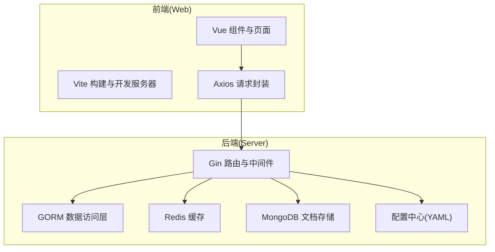
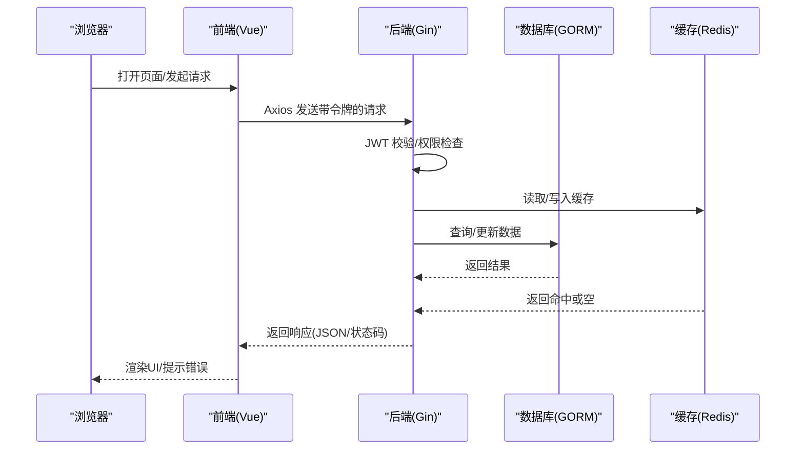
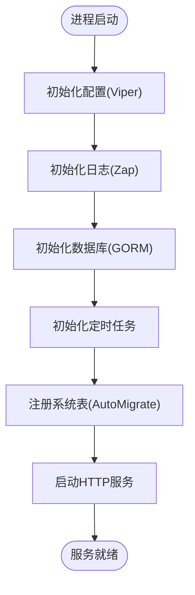
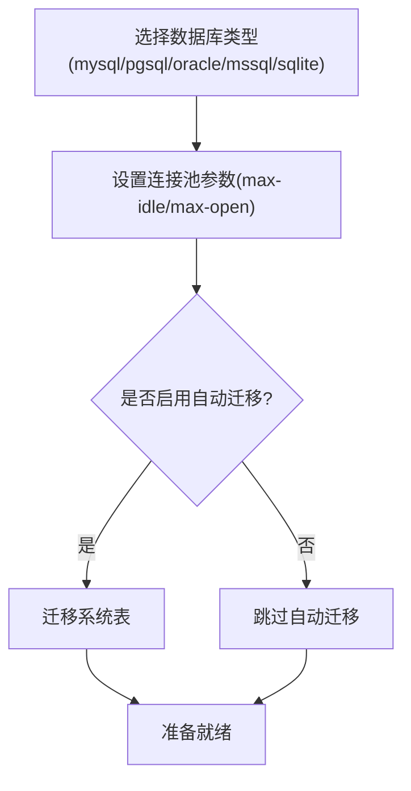
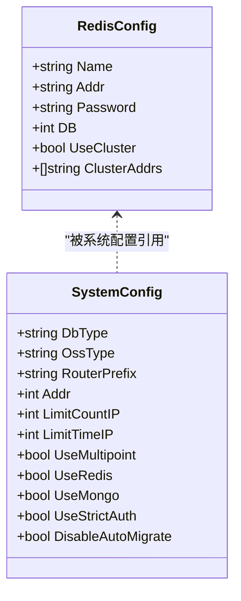
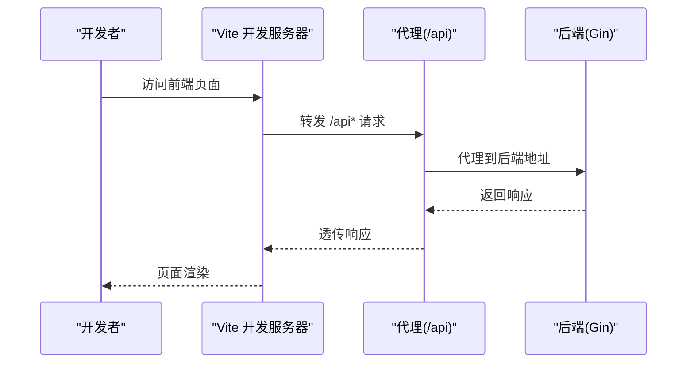
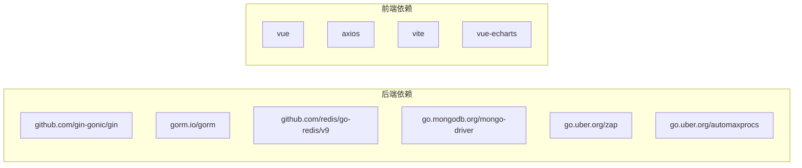

# 性能优化与调优

<cite>
**本文引用的文件**
- [server/go.mod](file://server/go.mod)
- [server/main.go](file://server/main.go)
- [server/core/server.go](file://server/core/server.go)
- [server/config.yaml](file://server/config.yaml)
- [server/config/config.go](file://server/config/config.go)
- [server/config/system.go](file://server/config/system.go)
- [server/config/redis.go](file://server/config/redis.go)
- [server/config/db_list.go](file://server/config/db_list.go)
- [server/config/gorm_mysql.go](file://server/config/gorm_mysql.go)
- [server/config/cors.go](file://server/config/cors.go)
- [server/initialize/gorm.go](file://server/initialize/gorm.go)
- [web/package.json](file://web/package.json)
- [web/vite.config.js](file://web/vite.config.js)
- [web/src/utils/request.js](file://web/src/utils/request.js)
- [web/src/core/config.js](file://web/src/core/config.js)
- [web/src/core/gin-vue-admin.js](file://web/src/core/gin-vue-admin.js)
</cite>

## 目录
1. [简介](#简介)
2. [项目结构](#项目结构)
3. [核心组件](#核心组件)
4. [架构总览](#架构总览)
5. [详细组件分析](#详细组件分析)
6. [依赖分析](#依赖分析)
7. [性能考虑](#性能考虑)
8. [故障排查指南](#故障排查指南)
9. [结论](#结论)
10. [附录](#附录)

## 简介
本文件面向测试管理平台的性能优化与调优，覆盖后端 Go 应用的内存管理、并发与 GC 调优、数据库查询与连接池优化、缓存策略、负载均衡与水平扩展；以及前端 Vite 构建的打包优化、懒加载、缓存与 CDN 配置；并提供系统资源监控、性能基准测试与容量规划方法论及常见问题诊断思路。

## 项目结构
该仓库采用前后端分离架构：
- 后端基于 Gin + GORM 的 Go 服务，负责业务逻辑、数据持久化、认证鉴权与定时任务等。
- 前端基于 Vue 3 + Vite，提供管理界面与交互层，通过 Axios 发起 API 请求。
- 配置集中于 YAML，支持多数据库、多 OSS、Redis/Mongo 开关与跨域策略。

图表来源
- [server/core/server.go:14-48](file://server/core/server.go#L14-L48)
- [server/config.yaml:74-92](file://server/config.yaml#L74-L92)
- [web/vite.config.js:15-118](file://web/vite.config.js#L15-L118)
- [web/src/utils/request.js:10-232](file://web/src/utils/request.js#L10-L232)

章节来源
- [server/main.go:30-52](file://server/main.go#L30-L52)
- [server/core/server.go:14-48](file://server/core/server.go#L14-L48)
- [server/config.yaml:74-92](file://server/config.yaml#L74-L92)
- [web/vite.config.js:15-118](file://web/vite.config.js#L15-L118)

## 核心组件
- 后端启动与初始化：主程序负责初始化配置、日志、数据库、定时器、注册表等，随后启动 HTTP 服务。
- 配置体系：统一的配置模型支持 JWT、Zap 日志、Redis/Mongo、系统参数、数据库连接池、跨域等。
- 数据库接入：按系统配置动态选择数据库类型，初始化连接池参数，支持自动迁移与业务表注册。
- 前端构建与请求：Vite 提供开发与生产构建，Axios 封装统一请求拦截、超时控制与加载提示。

章节来源
- [server/main.go:30-52](file://server/main.go#L30-L52)
- [server/core/server.go:14-48](file://server/core/server.go#L14-L48)
- [server/config/config.go:3-40](file://server/config/config.go#L3-L40)
- [server/config/system.go:3-16](file://server/config/system.go#L3-L16)
- [server/config/db_list.go:17-53](file://server/config/db_list.go#L17-L53)
- [server/initialize/gorm.go:14-87](file://server/initialize/gorm.go#L14-L87)
- [web/vite.config.js:15-118](file://web/vite.config.js#L15-L118)
- [web/src/utils/request.js:10-232](file://web/src/utils/request.js#L10-L232)

## 架构总览
后端以 Gin 为核心，结合 GORM 实现 ORM 访问，Redis 作为缓存与会话存储，Mongo 用于文档型数据，配置中心集中管理运行参数。前端通过 Vite 构建，Axios 统一处理请求头、超时与错误反馈。

图表来源
- [server/core/server.go:14-48](file://server/core/server.go#L14-L48)
- [server/config/config.go:3-40](file://server/config/config.go#L3-L40)
- [web/src/utils/request.js:119-223](file://web/src/utils/request.js#L119-L223)

## 详细组件分析

### 后端启动与运行流程
- 主程序初始化配置、日志、数据库、定时任务与表注册，然后启动 HTTP 服务。
- 运行时根据系统配置决定是否启用 Redis/Mongo，以及加载系统常量。

图表来源
- [server/main.go:39-52](file://server/main.go#L39-L52)
- [server/core/server.go:14-48](file://server/core/server.go#L14-L48)
- [server/initialize/gorm.go:37-87](file://server/initialize/gorm.go#L37-L87)

章节来源
- [server/main.go:30-52](file://server/main.go#L30-L52)
- [server/core/server.go:14-48](file://server/core/server.go#L14-L48)

### 数据库连接池与迁移
- 动态选择数据库类型，按配置设置最大空闲/打开连接数、日志级别与高级参数。
- 支持自动迁移系统表与业务表，可通过配置关闭自动迁移以在生产环境改为手动迁移。

图表来源
- [server/initialize/gorm.go:14-87](file://server/initialize/gorm.go#L14-L87)
- [server/config/db_list.go:17-53](file://server/config/db_list.go#L17-L53)
- [server/config/gorm_mysql.go:3-10](file://server/config/gorm_mysql.go#L3-L10)

章节来源
- [server/initialize/gorm.go:14-87](file://server/initialize/gorm.go#L14-L87)
- [server/config/db_list.go:17-53](file://server/config/db_list.go#L17-L53)
- [server/config/gorm_mysql.go:3-10](file://server/config/gorm_mysql.go#L3-L10)

### 缓存与会话
- 支持 Redis 单实例与集群模式，可按需启用多实例列表。
- 通过系统配置开关控制是否使用 Redis 与多点登录拦截。

图表来源
- [server/config/redis.go:3-10](file://server/config/redis.go#L3-L10)
- [server/config/system.go:3-16](file://server/config/system.go#L3-L16)

章节来源
- [server/config/redis.go:3-10](file://server/config/redis.go#L3-L10)
- [server/config/system.go:3-16](file://server/config/system.go#L3-L16)
- [server/config.yaml:21-45](file://server/config.yaml#L21-L45)

### 前端构建与请求封装
- Vite 生产构建启用 Terser 压缩、移除 console 与 debugger、Rollup 输出命名策略。
- Axios 默认超时较长，统一注入令牌与用户 ID，内置加载提示与错误处理。
- 开发服务器支持代理，便于联调后端。

图表来源
- [web/vite.config.js:57-79](file://web/vite.config.js#L57-L79)
- [web/src/utils/request.js:119-153](file://web/src/utils/request.js#L119-L153)

章节来源
- [web/vite.config.js:15-118](file://web/vite.config.js#L15-L118)
- [web/src/utils/request.js:10-232](file://web/src/utils/request.js#L10-L232)
- [web/package.json:1-88](file://web/package.json#L1-L88)

## 依赖分析
- 后端依赖包含 Gin、GORM、Redis 客户端、Mongo Driver、Zap 日志、automaxprocs 等，体现了高性能与可观测性导向。
- 前端依赖包含 Vue 3、Element Plus、Axios、Vite、UnoCSS 等，强调现代化构建与组件生态。

图表来源
- [server/go.mod:7-61](file://server/go.mod#L7-L61)
- [web/package.json:14-57](file://web/package.json#L14-L57)

章节来源
- [server/go.mod:1-208](file://server/go.mod#L1-L208)
- [web/package.json:1-88](file://web/package.json#L1-L88)

## 性能考虑

### 后端 Go 应用性能优化
- 内存管理与 GC 调优
  - 使用 automaxprocs 自动设置 GOMAXPROCS，避免容器环境下 CPU 资源受限导致吞吐下降。
  - 建议在生产环境设置 GOGC、GOMAXPROCS 与 GC 堆大小阈值，结合 pprof/trace 分析热点路径。
  - 避免频繁小对象分配，优先复用缓冲区与对象池（如上传分片、批量查询）。
- 并发优化
  - Gin 路由与中间件应尽量无阻塞，IO 密集场景使用 goroutine + channel 或限流器。
  - Redis/Mongo 访问建议使用连接池与超时控制，避免阻塞请求线程。
- 数据库优化
  - 合理设置连接池：max-idle-conns 与 max-open-conns，结合慢查询日志定位瓶颈。
  - 使用 EXPLAIN/ANALYZE 分析慢 SQL，建立必要索引，避免 N+1 查询。
  - 读写分离与只读副本，热点表分区或分表。
- 缓存策略
  - 使用 Redis 缓存热点数据与会话，设置合理过期时间与淘汰策略。
  - 对于强一致需求的数据，采用“先更新数据库再失效缓存”的双写策略。
- 负载均衡与水平扩展
  - 使用反向代理（Nginx/Traefik）做健康检查与流量分发。
  - 无状态服务可横向扩展，状态类数据集中化（Redis/Mongo）。
- 监控与基准测试
  - 引入 Prometheus + Grafana 指标采集，记录 QPS、P95/P99 延迟、连接池使用率、GC 次数与暂停时间。
  - 使用 wrk/hey/JMeter 进行压力测试，逐步提升并发与数据规模，观察指标拐点。

章节来源
- [server/go.mod:49-50](file://server/go.mod#L49-L50)
- [server/config/db_list.go:27-28](file://server/config/db_list.go#L27-L28)
- [server/config.yaml:101-160](file://server/config.yaml#L101-L160)

### 前端性能优化
- 打包优化
  - 生产构建启用 Terser 压缩与移除调试语句，合理拆分代码块，减少首屏体积。
  - 使用 Rollup 输出命名策略，结合 CDN 与浏览器缓存实现长效缓存。
- 懒加载与路由
  - 路由级懒加载与组件级异步导入，降低初始包体。
  - 图片与富文本内容按需加载，使用骨架屏与占位符提升感知速度。
- 缓存策略
  - 利用浏览器缓存与 ETag/Last-Modified，静态资源配置长缓存与版本号。
  - 服务端返回 Cache-Control 与 Vary 头，避免错误缓存。
- CDN 配置
  - 将静态资源托管至 CDN，缩短边缘节点延迟。
  - 配置回源策略与压缩（gzip/br），确保图片与字体资源优化。
- 请求与渲染
  - Axios 统一超时与错误处理，避免长时间加载导致 UI 卡顿。
  - 合理使用虚拟滚动与分页，避免一次性渲染大量 DOM。

章节来源
- [web/vite.config.js:80-95](file://web/vite.config.js#L80-L95)
- [web/src/utils/request.js:7-14](file://web/src/utils/request.js#L7-L14)
- [web/src/utils/request.js:119-223](file://web/src/utils/request.js#L119-L223)

### 数据库查询与索引优化
- 连接池配置
  - 根据并发与数据库承载能力调整 max-idle-conns 与 max-open-conns，避免连接饥饿或过多连接导致资源争用。
- 索引设计
  - 为高频过滤、排序与关联字段建立复合索引，定期评估索引使用率。
  - 避免冗余索引，清理不使用的索引以减少写入开销。
- 查询优化
  - 使用 EXPLAIN 分析执行计划，避免全表扫描与隐式转换。
  - 分页查询使用覆盖索引与游标分页，避免 deep pagination。
- 定时任务与批处理
  - 将大批量操作拆分为小批次，设置合理的休眠与重试机制。

章节来源
- [server/config/db_list.go:27-28](file://server/config/db_list.go#L27-L28)
- [server/config/gorm_mysql.go:7-9](file://server/config/gorm_mysql.go#L7-L9)
- [server/initialize/gorm.go:37-87](file://server/initialize/gorm.go#L37-L87)

### 跨域与安全边界
- CORS 模式支持严格白名单与宽松放行，建议生产环境使用严格白名单，最小暴露头部与方法。
- 通过中间件统一校验 Origin、Headers 与 Credentials，防止 CSRF 与越权访问。

章节来源
- [server/config/cors.go:3-15](file://server/config/cors.go#L3-L15)
- [server/config.yaml:264-279](file://server/config.yaml#L264-L279)

## 故障排查指南
- 前端请求异常
  - 检查 Axios 默认超时与 donNotShowLoading 标记，确认 baseURL 与代理配置正确。
  - 关注 401 重定向与错误消息弹窗，定位鉴权问题。
- 后端连接问题
  - 核对数据库 DSN 与连接池参数，确认网络连通与凭据正确。
  - 查看 GORM 日志级别与 Zap 输出，定位慢查询与错误堆栈。
- 缓存异常
  - 校验 Redis 地址、密码与集群配置，确认键空间与过期策略。
- 构建与部署
  - 生产构建内存限制可通过脚本提升，确保打包过程稳定。
  - CDN 缓存与版本号策略影响资源更新，需同步更新哈希与缓存头。

章节来源
- [web/src/utils/request.js:119-223](file://web/src/utils/request.js#L119-L223)
- [server/config/gorm_mysql.go:7-9](file://server/config/gorm_mysql.go#L7-L9)
- [server/config/redis.go:3-10](file://server/config/redis.go#L3-L10)
- [web/package.json:9-11](file://web/package.json#L9-L11)
- [web/vite.config.js:80-95](file://web/vite.config.js#L80-L95)

## 结论
通过规范的配置管理、合理的连接池与缓存策略、严格的查询与索引设计，以及前端的打包与懒加载优化，可显著提升系统的整体性能与稳定性。结合监控与基准测试，持续迭代容量规划与扩缩容策略，是保障高并发场景下用户体验的关键。

## 附录
- 配置项速览（节选）
  - 系统参数：端口、数据库类型、是否启用 Redis/Mongo、跨域模式与白名单、自动迁移开关等。
  - 数据库连接池：max-idle-conns、max-open-conns、日志级别、高级参数等。
  - Redis：单实例/集群、地址与密码、DB 索引与集群节点列表。
  - 前端构建：Terser 压缩、移除调试语句、输出命名策略、代理规则等。

章节来源
- [server/config/system.go:3-16](file://server/config/system.go#L3-L16)
- [server/config/db_list.go:17-53](file://server/config/db_list.go#L17-L53)
- [server/config/redis.go:3-10](file://server/config/redis.go#L3-L10)
- [server/config.yaml:74-92](file://server/config.yaml#L74-L92)
- [server/config.yaml:101-160](file://server/config.yaml#L101-L160)
- [web/vite.config.js:80-95](file://web/vite.config.js#L80-L95)