# 数据库与存储部署

<cite>
**本文引用的文件**
- [config.go](file://server/config/config.go)
- [db_list.go](file://server/config/db_list.go)
- [gorm_mysql.go](file://server/config/gorm_mysql.go)
- [gorm_pgsql.go](file://server/config/gorm_pgsql.go)
- [gorm_oracle.go](file://server/config/gorm_oracle.go)
- [gorm_mssql.go](file://server/config/gorm_mssql.go)
- [gorm_sqlite.go](file://server/config/gorm_sqlite.go)
- [redis.go](file://server/config/redis.go)
- [oss_local.go](file://server/config/oss_local.go)
- [oss_aliyun.go](file://server/config/oss_aliyun.go)
- [oss_tencent.go](file://server/config/oss_tencent.go)
- [oss_aws.go](file://server/config/oss_aws.go)
- [oss_minio.go](file://server/config/oss_minio.go)
- [mongo.go](file://server/config/mongo.go)
- [disk.go](file://server/config/disk.go)
- [config.yaml](file://server/config.yaml)
- [config.docker.yaml](file://server/config.docker.yaml)
- [docker-compose.yaml](file://deploy/docker-compose/docker-compose.yaml)
- [gva-server-deployment.yaml](file://deploy/kubernetes/server/gva-server-deployment.yaml)
- [gva-server-configmap.yaml](file://deploy/kubernetes/server/gva-server-configmap.yaml)
- [gva-web-deploymemt.yaml](file://deploy/kubernetes/web/gva-web-deploymemt.yaml)
- [gva-web-configmap.yaml](file://deploy/kubernetes/web/gva-web-configmap.yaml)
- [gva-web-ingress.yaml](file://deploy/kubernetes/web/gva-web-ingress.yaml)
- [gva-web-service.yaml](file://deploy/kubernetes/web/gva-web-service.yaml)
- [gva-server-service.yaml](file://deploy/kubernetes/server/gva-server-service.yaml)
</cite>

## 目录
1. [简介](#简介)
2. [项目结构](#项目结构)
3. [核心组件](#核心组件)
4. [架构总览](#架构总览)
5. [详细组件分析](#详细组件分析)
6. [依赖关系分析](#依赖关系分析)
7. [性能考量](#性能考量)
8. [故障排查指南](#故障排查指南)
9. [结论](#结论)
10. [附录](#附录)

## 简介
本文件面向运维与开发团队，系统化梳理测试管理平台在数据库与存储领域的部署与配置要点，覆盖 MySQL、PostgreSQL、Oracle、SQL Server 的连接配置；Redis 缓存的单实例与集群部署、性能调优；本地存储与多云对象存储（阿里云 OSS、腾讯 COS、AWS S3、MinIO）的接入方式；以及数据库备份恢复策略、存储扩容方案与数据迁移实践。文档同时给出部署与运行环境的容器化与 Kubernetes 部署参考，并提供性能优化与数据一致性保障建议。

## 项目结构
后端服务采用模块化的配置与初始化机制，数据库与存储配置均以结构体形式集中定义，便于在不同运行环境中灵活切换。部署层提供 Docker 与 Kubernetes 两种编排方式，便于本地开发与生产环境部署。

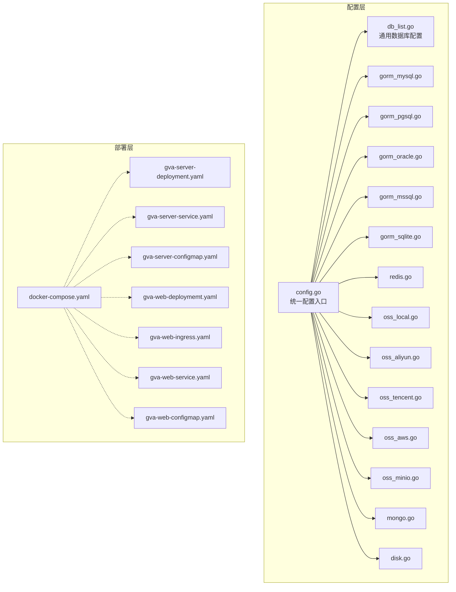

图表来源
- [config.go:1-41](file://server/config/config.go#L1-L41)
- [db_list.go:1-54](file://server/config/db_list.go#L1-L54)
- [gorm_mysql.go:1-10](file://server/config/gorm_mysql.go#L1-L10)
- [gorm_pgsql.go:1-18](file://server/config/gorm_pgsql.go#L1-L18)
- [gorm_oracle.go:1-19](file://server/config/gorm_oracle.go#L1-L19)
- [gorm_mssql.go:1-11](file://server/config/gorm_mssql.go#L1-L11)
- [gorm_sqlite.go:1-14](file://server/config/gorm_sqlite.go#L1-L14)
- [redis.go:1-11](file://server/config/redis.go#L1-L11)
- [oss_local.go:1-7](file://server/config/oss_local.go#L1-L7)
- [oss_aliyun.go:1-11](file://server/config/oss_aliyun.go#L1-L11)
- [oss_tencent.go:1-11](file://server/config/oss_tencent.go#L1-L11)
- [oss_aws.go:1-14](file://server/config/oss_aws.go#L1-L14)
- [oss_minio.go:1-12](file://server/config/oss_minio.go#L1-L12)
- [mongo.go:1-42](file://server/config/mongo.go#L1-L42)
- [disk.go:1-10](file://server/config/disk.go#L1-L10)
- [docker-compose.yaml](file://deploy/docker-compose/docker-compose.yaml)
- [gva-server-deployment.yaml](file://deploy/kubernetes/server/gva-server-deployment.yaml)
- [gva-server-configmap.yaml](file://deploy/kubernetes/server/gva-server-configmap.yaml)
- [gva-web-deploymemt.yaml](file://deploy/kubernetes/web/gva-web-deploymemt.yaml)
- [gva-web-ingress.yaml](file://deploy/kubernetes/web/gva-web-ingress.yaml)
- [gva-web-service.yaml](file://deploy/kubernetes/web/gva-web-service.yaml)
- [gva-server-service.yaml](file://deploy/kubernetes/server/gva-server-service.yaml)

章节来源
- [config.go:1-41](file://server/config/config.go#L1-L41)
- [docker-compose.yaml](file://deploy/docker-compose/docker-compose.yaml)
- [gva-server-deployment.yaml](file://deploy/kubernetes/server/gva-server-deployment.yaml)
- [gva-web-deploymemt.yaml](file://deploy/kubernetes/web/gva-web-deploymemt.yaml)

## 核心组件
- 统一配置入口：集中定义数据库、缓存、对象存储、系统参数等配置项，支持 YAML/JSON 映射与热加载。
- 通用数据库配置：提供通用字段（主机、端口、用户名、密码、库名、高级配置、连接池、日志级别等），并为各数据库类型提供 DSN 生成器。
- 多数据库适配：MySQL、PostgreSQL、Oracle、SQL Server、SQLite 的 DSN 构造与初始化。
- 缓存与存储：Redis 支持单实例与集群模式；对象存储支持本地、阿里云 OSS、腾讯 COS、AWS S3、MinIO 等。
- 容器与编排：提供 Docker Compose 与 Kubernetes 部署清单，便于快速落地。

章节来源
- [config.go:1-41](file://server/config/config.go#L1-L41)
- [db_list.go:1-54](file://server/config/db_list.go#L1-L54)
- [redis.go:1-11](file://server/config/redis.go#L1-L11)
- [oss_local.go:1-7](file://server/config/oss_local.go#L1-L7)
- [oss_aliyun.go:1-11](file://server/config/oss_aliyun.go#L1-L11)
- [oss_tencent.go:1-11](file://server/config/oss_tencent.go#L1-L11)
- [oss_aws.go:1-14](file://server/config/oss_aws.go#L1-L14)
- [oss_minio.go:1-12](file://server/config/oss_minio.go#L1-L12)
- [mongo.go:1-42](file://server/config/mongo.go#L1-L42)
- [disk.go:1-10](file://server/config/disk.go#L1-L10)

## 架构总览
系统采用“配置驱动 + 多后端适配”的架构，数据库与存储通过统一配置入口进行声明式管理；运行时根据配置选择对应驱动与连接参数，实现跨环境一致的部署体验。

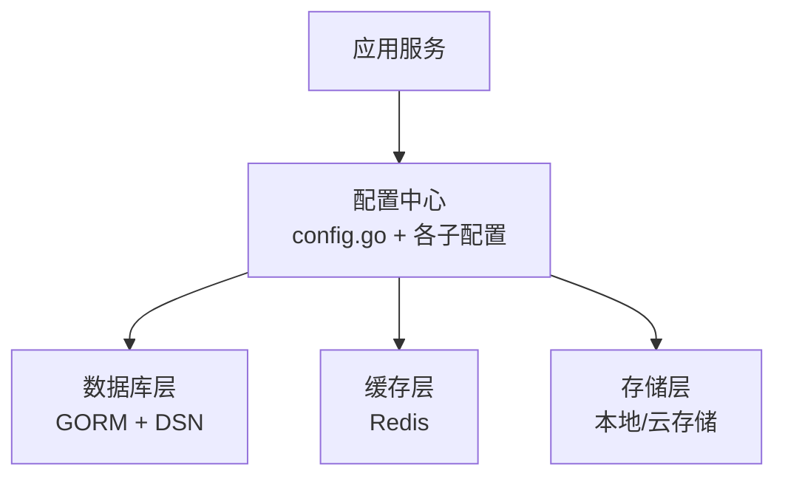

图表来源
- [config.go:1-41](file://server/config/config.go#L1-L41)
- [db_list.go:1-54](file://server/config/db_list.go#L1-L54)
- [redis.go:1-11](file://server/config/redis.go#L1-L11)
- [oss_local.go:1-7](file://server/config/oss_local.go#L1-L7)
- [oss_aliyun.go:1-11](file://server/config/oss_aliyun.go#L1-L11)
- [oss_tencent.go:1-11](file://server/config/oss_tencent.go#L1-L11)
- [oss_aws.go:1-14](file://server/config/oss_aws.go#L1-L14)
- [oss_minio.go:1-12](file://server/config/oss_minio.go#L1-L12)

## 详细组件分析

### 数据库部署与连接配置

#### MySQL
- 关键配置项：主机、端口、用户名、密码、数据库名、高级连接参数、连接池上限/空闲数、日志模式、是否全局禁用复数等。
- DSN 生成规则：基于用户名、密码、主机、端口、数据库名与高级参数拼装。
- 初始化流程：通过 GORM 初始化连接，按配置设置日志级别与连接池参数。

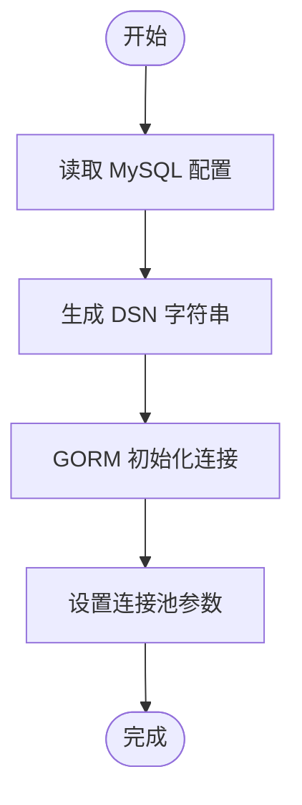

图表来源
- [gorm_mysql.go:1-10](file://server/config/gorm_mysql.go#L1-L10)
- [db_list.go:17-31](file://server/config/db_list.go#L17-L31)

章节来源
- [gorm_mysql.go:1-10](file://server/config/gorm_mysql.go#L1-L10)
- [db_list.go:17-31](file://server/config/db_list.go#L17-L31)

#### PostgreSQL
- 关键配置项：主机、端口、用户名、密码、数据库名、高级参数、日志模式、连接池、全局禁用复数。
- DSN 生成规则：基于 host、user、password、dbname、port 与高级参数拼装；提供按库名动态生成 DSN 的能力。
- 初始化流程：GORM 初始化，设置日志级别与连接池。

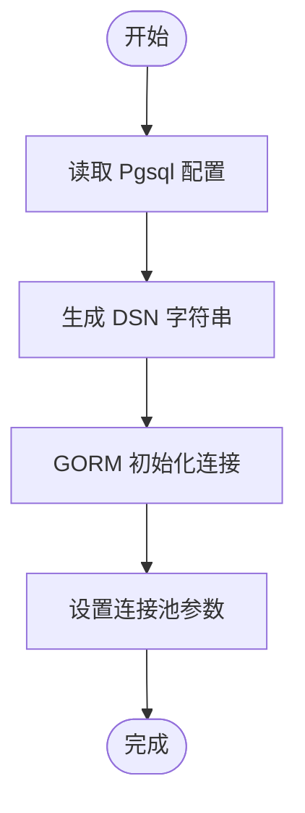

图表来源
- [gorm_pgsql.go:1-18](file://server/config/gorm_pgsql.go#L1-L18)
- [db_list.go:17-31](file://server/config/db_list.go#L17-L31)

章节来源
- [gorm_pgsql.go:1-18](file://server/config/gorm_pgsql.go#L1-L18)
- [db_list.go:17-31](file://server/config/db_list.go#L17-L31)

#### Oracle
- 关键配置项：主机、端口、用户名、密码、数据库名、高级参数、日志模式、连接池、全局禁用复数。
- DSN 生成规则：使用标准 oracle DSN 模板，对用户名、密码、主机、端口、数据库名与参数进行转义与拼装。
- 初始化流程：GORM 初始化，设置日志级别与连接池。

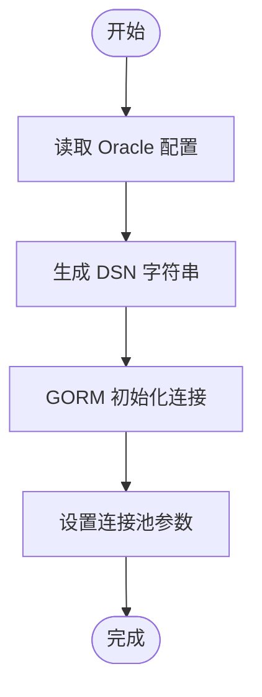

图表来源
- [gorm_oracle.go:1-19](file://server/config/gorm_oracle.go#L1-L19)
- [db_list.go:17-31](file://server/config/db_list.go#L17-L31)

章节来源
- [gorm_oracle.go:1-19](file://server/config/gorm_oracle.go#L1-L19)
- [db_list.go:17-31](file://server/config/db_list.go#L17-L31)

#### SQL Server
- 关键配置项：主机、端口、用户名、密码、数据库名、高级参数、日志模式、连接池、全局禁用复数。
- DSN 生成规则：基于 sqlserver://schema 生成，包含主机、端口、数据库名与加密参数。
- 初始化流程：GORM 初始化，设置日志级别与连接池。

图表来源
- [gorm_mssql.go:1-11](file://server/config/gorm_mssql.go#L1-L11)
- [db_list.go:17-31](file://server/config/db_list.go#L17-L31)

章节来源
- [gorm_mssql.go:1-11](file://server/config/gorm_mssql.go#L1-L11)
- [db_list.go:17-31](file://server/config/db_list.go#L17-L31)

#### SQLite
- 关键配置项：路径、数据库名、高级参数、日志模式、连接池、全局禁用复数。
- DSN 生成规则：基于 Path 与 Dbname 拼接为绝对路径。
- 初始化流程：GORM 初始化，设置日志级别与连接池。

图表来源
- [gorm_sqlite.go:1-14](file://server/config/gorm_sqlite.go#L1-L14)
- [db_list.go:17-31](file://server/config/db_list.go#L17-L31)

章节来源
- [gorm_sqlite.go:1-14](file://server/config/gorm_sqlite.go#L1-L14)
- [db_list.go:17-31](file://server/config/db_list.go#L17-L31)

### Redis 缓存部署与集群配置
- 单实例模式：指定 Addr 与 Password、DB 库索引。
- 集群模式：启用 useCluster 并提供 clusterAddrs 列表，用于多节点拓扑。
- 运行建议：生产环境建议启用持久化、合理设置淘汰策略与内存上限；监控慢查询与命中率。

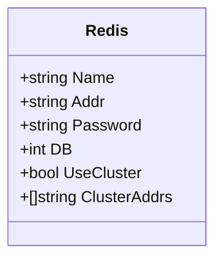

图表来源
- [redis.go:1-11](file://server/config/redis.go#L1-L11)

章节来源
- [redis.go:1-11](file://server/config/redis.go#L1-L11)

### 对象存储配置与使用

#### 本地存储
- 关键配置项：Path（访问路径）、StorePath（存储路径）。
- 使用场景：开发与测试环境，无需外部依赖。

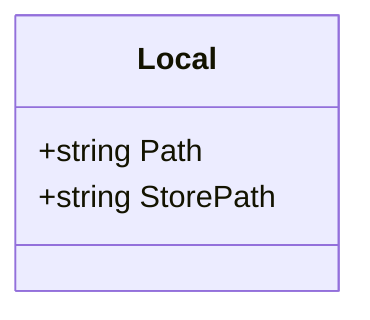

图表来源
- [oss_local.go:1-7](file://server/config/oss_local.go#L1-L7)

章节来源
- [oss_local.go:1-7](file://server/config/oss_local.go#L1-L7)

#### 阿里云 OSS
- 关键配置项：Endpoint、AccessKeyId、AccessKeySecret、BucketName、BucketUrl、BasePath。
- 使用场景：国内与全球 CDN 加速、高可用对象存储。

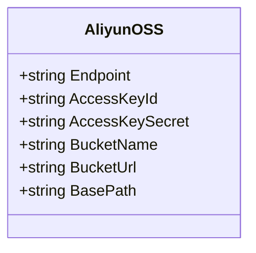

图表来源
- [oss_aliyun.go:1-11](file://server/config/oss_aliyun.go#L1-L11)

章节来源
- [oss_aliyun.go:1-11](file://server/config/oss_aliyun.go#L1-L11)

#### 腾讯 COS
- 关键配置项：Bucket、Region、SecretID、SecretKey、BaseURL、PathPrefix。
- 使用场景：国内与东南亚区域，支持自定义域名与路径前缀。

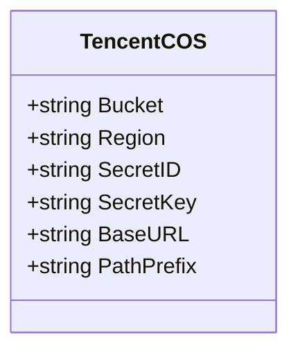

图表来源
- [oss_tencent.go:1-11](file://server/config/oss_tencent.go#L1-L11)

章节来源
- [oss_tencent.go:1-11](file://server/config/oss_tencent.go#L1-L11)

#### AWS S3
- 关键配置项：Bucket、Region、Endpoint、SecretID、SecretKey、BaseURL、PathPrefix、S3ForcePathStyle、DisableSSL。
- 使用场景：全球对象存储，支持兼容 S3 的第三方服务（如 MinIO）。

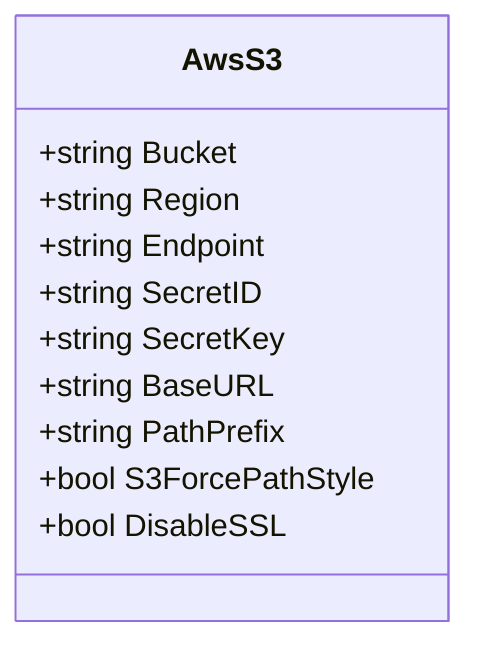

图表来源
- [oss_aws.go:1-14](file://server/config/oss_aws.go#L1-L14)

章节来源
- [oss_aws.go:1-14](file://server/config/oss_aws.go#L1-L14)

#### MinIO
- 关键配置项：Endpoint、AccessKeyId、AccessKeySecret、BucketName、UseSSL、BasePath、BucketUrl。
- 使用场景：自建 S3 兼容对象存储，适合私有化部署。

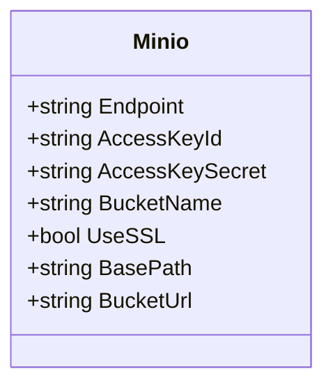

图表来源
- [oss_minio.go:1-12](file://server/config/oss_minio.go#L1-L12)

章节来源
- [oss_minio.go:1-12](file://server/config/oss_minio.go#L1-L12)

### MongoDB 配置
- 关键配置项：Database、Username、Password、AuthSource、MinPoolSize、MaxPoolSize、SocketTimeoutMs、ConnectTimeoutMs、IsZap、Hosts。
- 使用场景：文档型数据与高并发读写场景。
- DSN 生成：基于 Hosts 列表与 Options 拼装完整连接字符串。

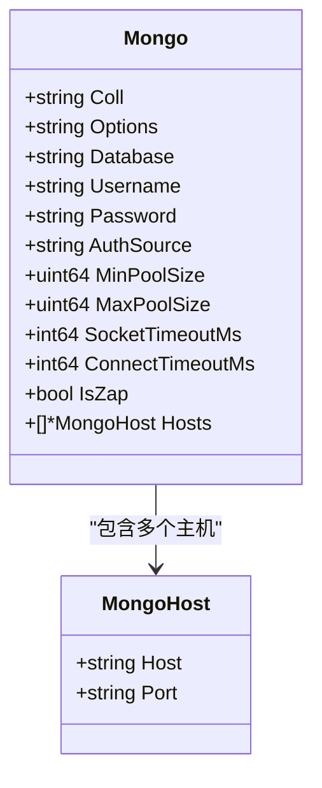

图表来源
- [mongo.go:1-42](file://server/config/mongo.go#L1-L42)

章节来源
- [mongo.go:1-42](file://server/config/mongo.go#L1-L42)

### 存储卷与磁盘挂载
- 关键配置项：MountPoint（挂载点）。
- 使用场景：将宿主机或网络存储挂载到容器内，作为静态资源或日志目录。

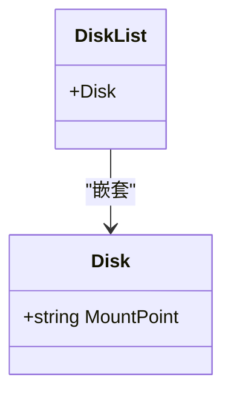

图表来源
- [disk.go:1-10](file://server/config/disk.go#L1-L10)

章节来源
- [disk.go:1-10](file://server/config/disk.go#L1-L10)

## 依赖关系分析
- 配置聚合：config.go 将数据库、缓存、对象存储等配置聚合为统一入口，便于集中管理与热更新。
- 通用配置复用：db_list.go 提供 GeneralDB 与 SpecializedDB，统一了连接参数与日志级别映射。
- DSN 工厂：各数据库类型独立实现 DSN 生成，确保连接参数正确性与可移植性。
- 部署编排：docker-compose.yaml 与 Kubernetes 清单分别提供容器与 Pod 级别的部署参考。

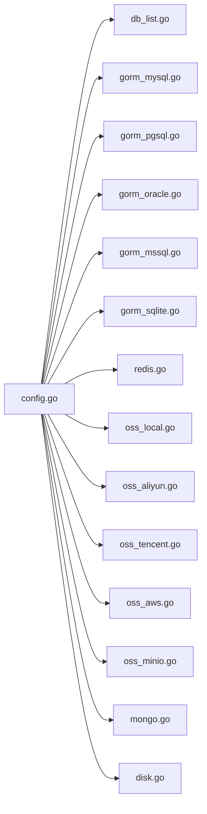

图表来源
- [config.go:1-41](file://server/config/config.go#L1-L41)
- [db_list.go:1-54](file://server/config/db_list.go#L1-L54)
- [gorm_mysql.go:1-10](file://server/config/gorm_mysql.go#L1-L10)
- [gorm_pgsql.go:1-18](file://server/config/gorm_pgsql.go#L1-L18)
- [gorm_oracle.go:1-19](file://server/config/gorm_oracle.go#L1-L19)
- [gorm_mssql.go:1-11](file://server/config/gorm_mssql.go#L1-L11)
- [gorm_sqlite.go:1-14](file://server/config/gorm_sqlite.go#L1-L14)
- [redis.go:1-11](file://server/config/redis.go#L1-L11)
- [oss_local.go:1-7](file://server/config/oss_local.go#L1-L7)
- [oss_aliyun.go:1-11](file://server/config/oss_aliyun.go#L1-L11)
- [oss_tencent.go:1-11](file://server/config/oss_tencent.go#L1-L11)
- [oss_aws.go:1-14](file://server/config/oss_aws.go#L1-L14)
- [oss_minio.go:1-12](file://server/config/oss_minio.go#L1-L12)
- [mongo.go:1-42](file://server/config/mongo.go#L1-L42)
- [disk.go:1-10](file://server/config/disk.go#L1-L10)

章节来源
- [config.go:1-41](file://server/config/config.go#L1-L41)
- [db_list.go:1-54](file://server/config/db_list.go#L1-L54)

## 性能考量
- 数据库连接池
  - 控制 max-open-conns 与 max-idle-conns，避免连接过多导致资源争用或过少导致排队。
  - 根据业务峰值与慢查询分析调整，结合数据库侧参数（如 MySQL 的 innodb_thread_concurrency、PostgreSQL 的 max_connections）协同优化。
- 日志级别
  - 生产环境建议使用 warn 或 error，避免大量日志 IO 影响吞吐。
- 缓存策略
  - Redis 集群模式提升可用性与扩展性；合理设置过期策略与内存淘汰算法。
  - 结合热点数据预热与多级缓存（本地缓存+Redis）降低后端压力。
- 对象存储
  - 上传/下载使用分片与断点续传；CDN 加速与路径前缀优化访问延迟。
  - S3 兼容服务（如 MinIO）建议开启 SSL 与强认证。
- 磁盘与卷
  - 使用高性能存储介质与合适的挂载选项；定期清理日志与临时文件。

## 故障排查指南
- 数据库连接失败
  - 检查主机、端口、用户名、密码与库名是否正确；确认网络连通与防火墙策略。
  - 查看日志级别与 GORM 报错信息，定位慢查询与死锁问题。
- Redis 连接异常
  - 单实例模式检查 Addr 与密码；集群模式核对 clusterAddrs 列表与节点可达性。
  - 关注慢查询与内存使用率，必要时调整淘汰策略与持久化策略。
- 对象存储访问错误
  - 校验密钥、桶名、区域与 Endpoint；S3 兼容服务注意 S3ForcePathStyle 与 SSL 设置。
  - 检查权限策略与路径前缀，确保访问 URL 正确。
- 容器与编排问题
  - Docker Compose 与 Kubernetes 清单中核对环境变量与 ConfigMap/Secret 注入情况。
  - 关注 Pod 重启原因与日志输出，定位配置解析与依赖服务启动顺序。

章节来源
- [docker-compose.yaml](file://deploy/docker-compose/docker-compose.yaml)
- [gva-server-deployment.yaml](file://deploy/kubernetes/server/gva-server-deployment.yaml)
- [gva-web-deploymemt.yaml](file://deploy/kubernetes/web/gva-web-deploymemt.yaml)

## 结论
通过统一配置入口与多数据库/存储适配，平台实现了跨环境一致的部署体验。结合合理的连接池、缓存策略与对象存储优化，可在保证数据一致性的同时显著提升系统性能与稳定性。建议在生产环境实施严格的备份恢复与容量规划策略，并持续监控关键指标以指导容量与性能优化。

## 附录

### 部署与运行参考
- 本地开发与测试
  - 使用 Docker Compose 快速拉起应用、数据库与缓存服务，便于联调与验证。
- 生产部署
  - 使用 Kubernetes 清单进行编排，结合 ConfigMap/Secret 管理敏感配置；通过 Service/Ingress 提供稳定访问入口。
- 配置文件位置
  - 应用配置文件位于 server/config.yaml 与 server/config.docker.yaml，按运行环境选择加载。

章节来源
- [config.yaml](file://server/config.yaml)
- [config.docker.yaml](file://server/config.docker.yaml)
- [docker-compose.yaml](file://deploy/docker-compose/docker-compose.yaml)
- [gva-server-deployment.yaml](file://deploy/kubernetes/server/gva-server-deployment.yaml)
- [gva-server-configmap.yaml](file://deploy/kubernetes/server/gva-server-configmap.yaml)
- [gva-web-deploymemt.yaml](file://deploy/kubernetes/web/gva-web-deploymemt.yaml)
- [gva-web-configmap.yaml](file://deploy/kubernetes/web/gva-web-configmap.yaml)
- [gva-web-ingress.yaml](file://deploy/kubernetes/web/gva-web-ingress.yaml)
- [gva-web-service.yaml](file://deploy/kubernetes/web/gva-web-service.yaml)
- [gva-server-service.yaml](file://deploy/kubernetes/server/gva-server-service.yaml)