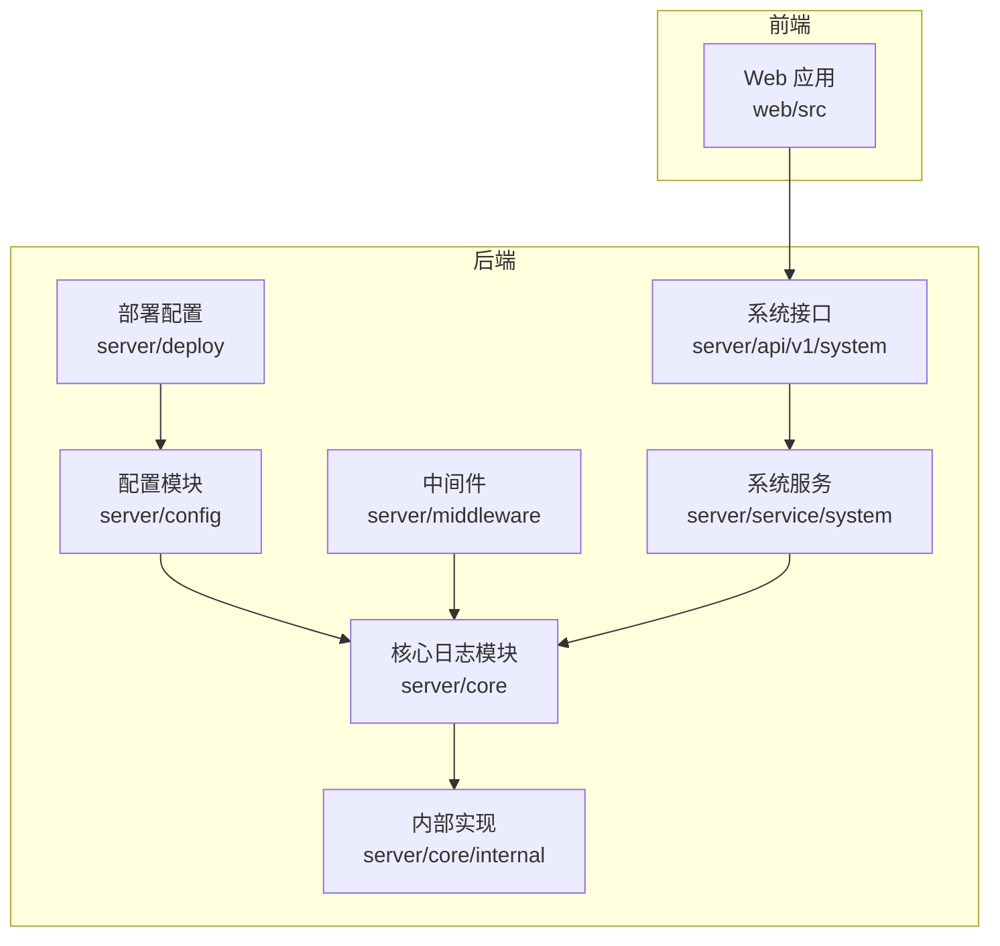
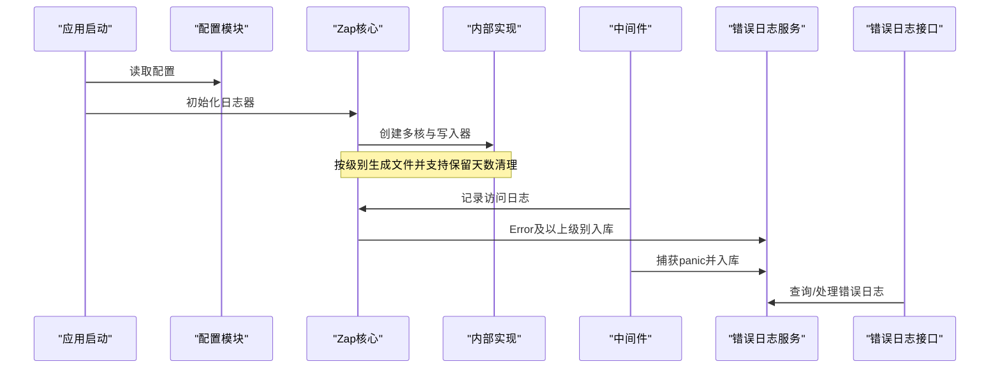
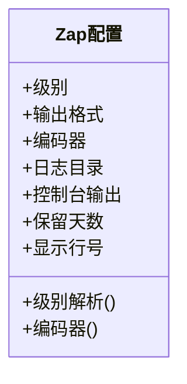
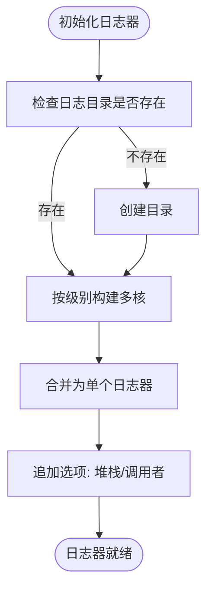
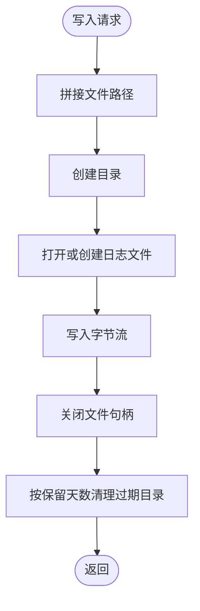
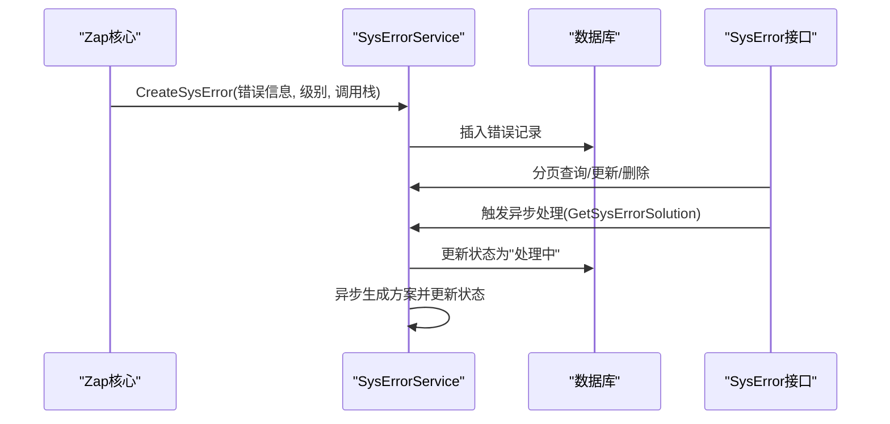
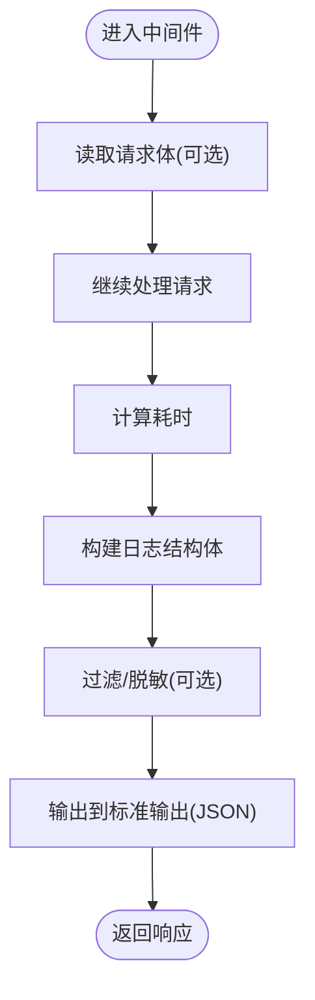
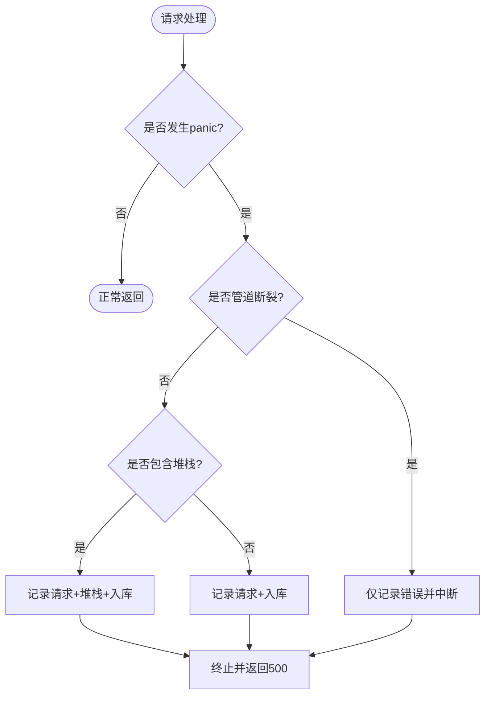
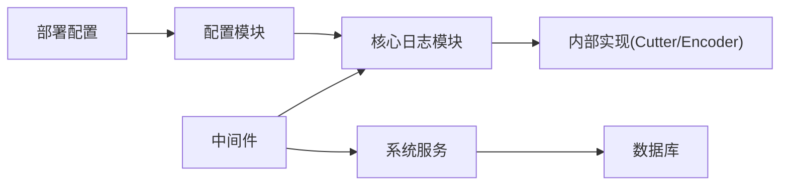

# 监控与日志管理

<cite>
**本文引用的文件**
- [server/config/zap.go](file://server/config/zap.go)
- [server/config/config.go](file://server/config/config.go)
- [server/config.yaml](file://server/config.yaml)
- [server/core/zap.go](file://server/core/zap.go)
- [server/core/internal/zap_core.go](file://server/core/internal/zap_core.go)
- [server/core/internal/cutter.go](file://server/core/internal/cutter.go)
- [server/cmd/mcp/logger.go](file://server/cmd/mcp/logger.go)
- [server/middleware/logger.go](file://server/middleware/logger.go)
- [server/middleware/error.go](file://server/middleware/error.go)
- [server/service/system/sys_error.go](file://server/service/system/sys_error.go)
- [server/router/system/sys_error.go](file://server/router/system/sys_error.go)
- [server/api/v1/system/sys_error.go](file://server/api/v1/system/sys_error.go)
- [server/deploy/kubernates/server/gva-server-deployment.yaml](file://server/deploy/kubernetes/server/gva-server-deployment.yaml)
</cite>

## 目录
1. [简介](#简介)
2. [项目结构](#项目结构)
3. [核心组件](#核心组件)
4. [架构总览](#架构总览)
5. [详细组件分析](#详细组件分析)
6. [依赖关系分析](#依赖关系分析)
7. [性能考量](#性能考量)
8. [故障排查指南](#故障排查指南)
9. [结论](#结论)
10. [附录](#附录)

## 简介
本运维文档聚焦于测试管理平台的系统监控与日志管理能力，围绕以下目标展开：
- 详述基于 Zap 的日志框架配置与使用，包括日志级别、输出格式、编码器与轮转策略。
- 说明系统指标监控、性能监控与业务监控的实现方法与落地点。
- 提供 Prometheus、Grafana 等监控工具的集成思路与配置要点。
- 介绍告警规则设置、通知渠道配置与故障自动恢复机制。
- 覆盖日志分析、错误追踪与性能瓶颈定位的实用技巧。
- 提供监控仪表板的定制化配置与可视化展示方案。

## 项目结构
本项目采用前后端分离架构，后端以 Gin 为核心，结合多数据库与对象存储，日志子系统通过 Zap 实现统一采集与落盘，同时具备错误日志入库与可视化查询能力。

**图表来源**
- [server/config/config.go:1-41](file://server/config/config.go#L1-L41)
- [server/core/zap.go:1-37](file://server/core/zap.go#L1-L37)
- [server/core/internal/zap_core.go:1-134](file://server/core/internal/zap_core.go#L1-L134)
- [server/middleware/logger.go:1-90](file://server/middleware/logger.go#L1-L90)
- [server/service/system/sys_error.go:1-127](file://server/service/system/sys_error.go#L1-L127)
- [server/api/v1/system/sys_error.go:78-199](file://server/api/v1/system/sys_error.go#L78-L199)
- [server/deploy/kubernetes/server/gva-server-deployment.yaml:47-74](file://server/deploy/kubernetes/server/gva-server-deployment.yaml#L47-L74)

**章节来源**
- [server/config/config.go:1-41](file://server/config/config.go#L1-L41)
- [server/config.yaml:1-284](file://server/config.yaml#L1-L284)

## 核心组件
- 配置模型：集中定义日志、数据库、缓存、对象存储等配置项，便于统一管理与热加载。
- Zap 日志核心：负责构建多核日志器、级别过滤、编码器选择与写入器组合。
- 自定义切片器：按级别与日期生成文件路径，支持控制保留天数与目录清理。
- 错误日志入库：将 Error 及以上级别的日志内容入库，便于检索与 AI 方案生成。
- Web 访问日志中间件：对请求路径、参数、耗时、错误等进行结构化输出。
- 崩溃恢复中间件：捕获 panic 并记录请求上下文与堆栈，同时入库。
- 错误日志服务与接口：提供增删改查、分页检索与异步处理入口。

**章节来源**
- [server/config/zap.go:1-72](file://server/config/zap.go#L1-L72)
- [server/core/zap.go:1-37](file://server/core/zap.go#L1-L37)
- [server/core/internal/zap_core.go:1-134](file://server/core/internal/zap_core.go#L1-L134)
- [server/core/internal/cutter.go:1-126](file://server/core/internal/cutter.go#L1-L126)
- [server/middleware/logger.go:1-90](file://server/middleware/logger.go#L1-L90)
- [server/middleware/error.go:1-81](file://server/middleware/error.go#L1-L81)
- [server/service/system/sys_error.go:1-127](file://server/service/system/sys_error.go#L1-L127)
- [server/api/v1/system/sys_error.go:78-199](file://server/api/v1/system/sys_error.go#L78-L199)

## 架构总览
下图展示了日志与错误处理的整体流程：应用启动时初始化 Zap；请求经中间件记录访问日志；错误与异常通过中间件与自定义核心入库；错误日志可通过接口与前端进行检索与处理。

**图表来源**
- [server/core/zap.go:1-37](file://server/core/zap.go#L1-L37)
- [server/core/internal/zap_core.go:1-134](file://server/core/internal/zap_core.go#L1-L134)
- [server/middleware/logger.go:1-90](file://server/middleware/logger.go#L1-L90)
- [server/middleware/error.go:1-81](file://server/middleware/error.go#L1-L81)
- [server/service/system/sys_error.go:1-127](file://server/service/system/sys_error.go#L1-L127)
- [server/api/v1/system/sys_error.go:78-199](file://server/api/v1/system/sys_error.go#L78-L199)

## 详细组件分析

### 日志配置与级别
- 配置项来源：配置模型包含日志级别、输出格式、编码器、目录、是否控制台输出、是否显示行号、保留天数等。
- 级别解析：将字符串级别解析为 Zap Level，并生成从该级别到致命级别的全集，用于构建多核日志器。
- 编码器：支持 JSON 与控制台两种格式，时间前缀可自定义，级别编码器支持大小写与彩色选项。
- 控制台输出：可选将日志同时输出到控制台与文件。

**图表来源**
- [server/config/zap.go:1-72](file://server/config/zap.go#L1-L72)

**章节来源**
- [server/config/zap.go:1-72](file://server/config/zap.go#L1-L72)
- [server/config/config.go:1-41](file://server/config/config.go#L1-L41)
- [server/config.yaml:10-19](file://server/config.yaml#L10-L19)

### Zap 日志器构建与多核
- 目录创建：若日志目录不存在则自动创建。
- 多核构建：遍历有效级别集合，为每个级别创建一个核心，使用“分流”写入器将不同级别写入对应文件。
- 堆栈与调用者：启用 Error 级别及以上堆栈捕捉，可选启用调用者信息。
- 入库逻辑：在写入完成后，对 Error 及以上级别进行入库处理，避免与 GORM 日志写入递归。

**图表来源**
- [server/core/zap.go:1-37](file://server/core/zap.go#L1-L37)

**章节来源**
- [server/core/zap.go:1-37](file://server/core/zap.go#L1-L37)

### 自定义切片器与轮转策略
- 文件命名：按“目录/日期/自定义参数/级别.log”的路径组织，日期布局可配置。
- 写入与同步：写入时确保目录存在，写入完成后关闭文件句柄；提供同步接口。
- 保留清理：按保留天数清理过期目录，默认保留天数小于等于零时忽略清理。

**图表来源**
- [server/core/internal/cutter.go:1-126](file://server/core/internal/cutter.go#L1-L126)

**章节来源**
- [server/core/internal/cutter.go:1-126](file://server/core/internal/cutter.go#L1-L126)

### 错误日志入库与检索
- 入库触发：当日志级别达到 Error 及以上时，提取错误信息、调用栈与最终业务调用方法源码片段，封装为结构化内容入库。
- 服务接口：提供创建、删除、批量删除、更新、查询、分页查询与异步处理接口。
- 异步处理：触发后立即标记为“处理中”，随后通过 LLM 生成解决方案并回填状态。

**图表来源**
- [server/core/internal/zap_core.go:74-127](file://server/core/internal/zap_core.go#L74-L127)
- [server/service/system/sys_error.go:14-127](file://server/service/system/sys_error.go#L14-L127)
- [server/api/v1/system/sys_error.go:171-199](file://server/api/v1/system/sys_error.go#L171-L199)

**章节来源**
- [server/core/internal/zap_core.go:74-127](file://server/core/internal/zap_core.go#L74-L127)
- [server/service/system/sys_error.go:1-127](file://server/service/system/sys_error.go#L1-L127)
- [server/api/v1/system/sys_error.go:78-199](file://server/api/v1/system/sys_error.go#L78-L199)

### Web 访问日志中间件
- 结构化输出：记录时间、路径、查询参数、请求体、客户端 IP、UA、错误、耗时与来源。
- 过滤与脱敏：支持自定义过滤器与关键字过滤，便于敏感信息脱敏。
- 默认输出：将结构化日志以 JSON 形式输出到标准输出，便于容器编排系统收集。

**图表来源**
- [server/middleware/logger.go:41-89](file://server/middleware/logger.go#L41-L89)

**章节来源**
- [server/middleware/logger.go:1-90](file://server/middleware/logger.go#L1-L90)

### 崩溃恢复中间件
- 捕获 panic：区分“管道断裂”等可忽略场景，其余 panic 记录请求与堆栈。
- 入库与响应：将 panic 信息入库并返回统一错误状态码。

**图表来源**
- [server/middleware/error.go:21-80](file://server/middleware/error.go#L21-L80)

**章节来源**
- [server/middleware/error.go:1-81](file://server/middleware/error.go#L1-L81)

### MCP 独立进程日志初始化
- 在独立运行模式下，使用开发模式日志器初始化全局日志实例，便于调试与排障。

**章节来源**
- [server/cmd/mcp/logger.go:1-18](file://server/cmd/mcp/logger.go#L1-L18)

## 依赖关系分析
- 配置模块为日志与数据库等子系统提供统一配置入口。
- 核心日志模块依赖内部实现（切片器、编码器）与配置模块。
- 中间件依赖核心日志模块与系统服务模块。
- 服务模块依赖数据库连接与模型定义。
- 部署配置提供健康检查探针，保障服务可用性。

**图表来源**
- [server/config/config.go:1-41](file://server/config/config.go#L1-L41)
- [server/core/zap.go:1-37](file://server/core/zap.go#L1-L37)
- [server/core/internal/cutter.go:1-126](file://server/core/internal/cutter.go#L1-L126)
- [server/middleware/logger.go:1-90](file://server/middleware/logger.go#L1-L90)
- [server/middleware/error.go:1-81](file://server/middleware/error.go#L1-L81)
- [server/service/system/sys_error.go:1-127](file://server/service/system/sys_error.go#L1-L127)
- [server/deploy/kubernetes/server/gva-server-deployment.yaml:47-74](file://server/deploy/kubernetes/server/gva-server-deployment.yaml#L47-L74)

**章节来源**
- [server/config/config.go:1-41](file://server/config/config.go#L1-L41)
- [server/core/zap.go:1-37](file://server/core/zap.go#L1-L37)
- [server/core/internal/cutter.go:1-126](file://server/core/internal/cutter.go#L1-L126)
- [server/middleware/logger.go:1-90](file://server/middleware/logger.go#L1-L90)
- [server/middleware/error.go:1-81](file://server/middleware/error.go#L1-L81)
- [server/service/system/sys_error.go:1-127](file://server/service/system/sys_error.go#L1-L127)
- [server/deploy/kubernetes/server/gva-server-deployment.yaml:47-74](file://server/deploy/kubernetes/server/gva-server-deployment.yaml#L47-L74)

## 性能考量
- 日志写入：采用多核分流与延迟关闭文件句柄，减少竞争与 IO 开销。
- 保留策略：按保留天数清理过期目录，避免磁盘膨胀；合理设置保留天数平衡存储与追溯需求。
- 结构化输出：访问日志以 JSON 输出，便于外部日志收集系统高效解析。
- 崩溃恢复：仅在非“管道断裂”场景记录堆栈，降低误报与冗余开销。
- 数据库入库：错误日志入库使用后台上下文，避免阻塞请求链路。

[本节为通用性能建议，无需特定文件引用]

## 故障排查指南
- 日志无法写入：检查日志目录权限与磁盘空间；确认配置中的目录与保留天数设置。
- 日志未入库：确认数据库连接已初始化；检查错误级别是否达到入库阈值。
- 访问日志缺失：确认中间件已正确挂载；检查输出格式与控制台开关。
- 崩溃恢复无效：检查中间件顺序与堆栈开关；确认 panic 信息是否被正确记录。
- 错误日志检索异常：确认分页参数与筛选条件；检查数据库字段映射。

**章节来源**
- [server/core/internal/cutter.go:108-126](file://server/core/internal/cutter.go#L108-L126)
- [server/core/internal/zap_core.go:74-127](file://server/core/internal/zap_core.go#L74-L127)
- [server/middleware/logger.go:80-89](file://server/middleware/logger.go#L80-L89)
- [server/middleware/error.go:21-80](file://server/middleware/error.go#L21-L80)
- [server/service/system/sys_error.go:52-82](file://server/service/system/sys_error.go#L52-L82)

## 结论
本项目通过集中配置、多核日志器、结构化访问日志与错误入库，构建了完善的日志与监控基础。结合外部监控工具，可进一步实现系统指标、性能与业务监控的可视化与自动化告警，提升运维效率与问题定位速度。

[本节为总结性内容，无需特定文件引用]

## 附录

### Prometheus 与 Grafana 集成建议
- 指标暴露：在应用中引入指标导出库，暴露关键指标（如请求耗时、错误率、队列长度等），并通过 HTTP 端点暴露给 Prometheus 抓取。
- 抓取配置：在 Prometheus 中配置抓取目标，设置合适的抓取间隔与超时。
- 图表与仪表板：在 Grafana 中创建面板，使用 PromQL 查询指标，设置告警规则并绑定通知通道。

[本节为通用集成建议，无需特定文件引用]

### 告警规则与通知渠道
- 告警规则：基于错误率、P95/P99 延迟、资源使用率等设置阈值与持续时间。
- 通知渠道：对接邮件、IM、短信等通知方式，确保关键告警及时触达。

[本节为通用运维建议，无需特定文件引用]

### 故障自动恢复机制
- 健康检查：利用部署配置中的存活/就绪探针，确保服务可用性。
- 自动重启：容器编排系统在探针失败时自动重启 Pod。
- 降级策略：在高负载或依赖异常时，启用降级开关与熔断策略。

**章节来源**
- [server/deploy/kubernetes/server/gva-server-deployment.yaml:47-74](file://server/deploy/kubernetes/server/gva-server-deployment.yaml#L47-L74)