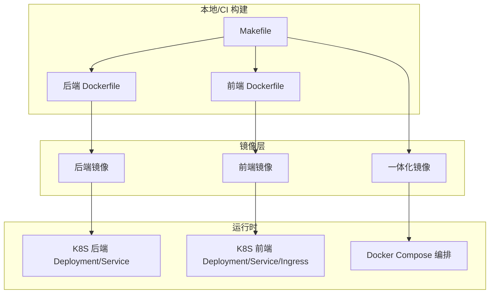
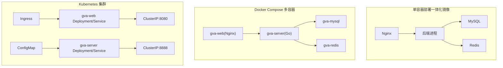
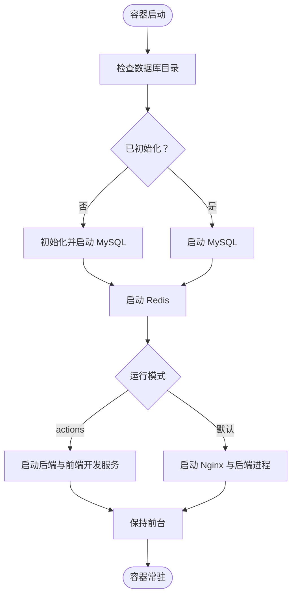
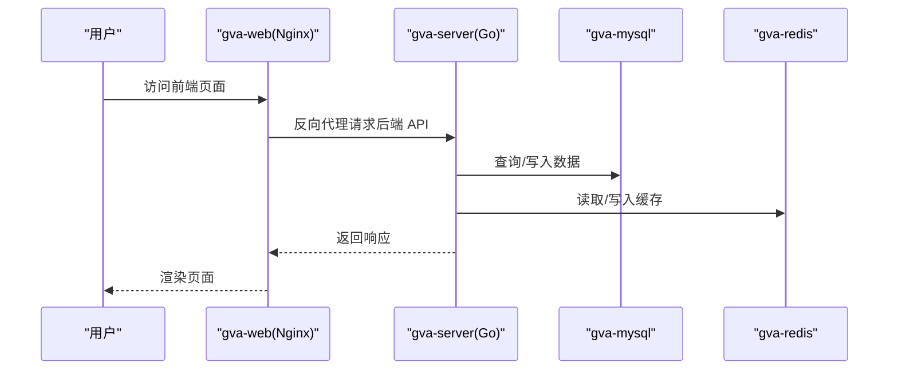
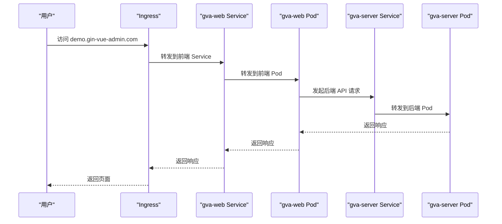
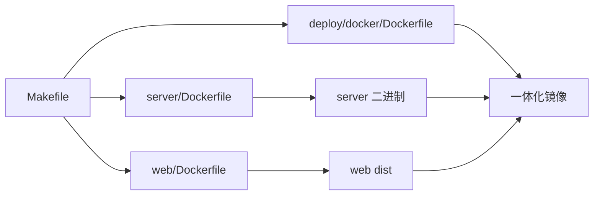

# 部署运维

<cite>
**本文引用的文件**
- [Dockerfile（后端）](file://server/Dockerfile)
- [Dockerfile（前端）](file://web/Dockerfile)
- [Dockerfile（一体化镜像）](file://deploy/docker/Dockerfile)
- [入口脚本（一体化镜像）](file://deploy/docker/entrypoint.sh)
- [Docker Compose 编排](file://deploy/docker-compose/docker-compose.yaml)
- [Kubernetes 后端 Deployment](file://deploy/kubernetes/server/gva-server-deployment.yaml)
- [Kubernetes 后端 Service](file://deploy/kubernetes/server/gva-server-service.yaml)
- [Kubernetes 后端 ConfigMap](file://deploy/kubernetes/server/gva-server-configmap.yaml)
- [Kubernetes 前端 Deployment](file://deploy/kubernetes/web/gva-web-deploymemt.yaml)
- [Kubernetes 前端 Service](file://deploy/kubernetes/web/gva-web-service.yaml)
- [Kubernetes Ingress](file://deploy/kubernetes/web/gva-web-ingress.yaml)
- [后端配置（通用）](file://server/config.yaml)
- [后端配置（容器专用）](file://server/config.docker.yaml)
- [Makefile（构建与打包）](file://Makefile)
- [项目总览（README）](file://README.md)
</cite>

## 目录
1. [简介](#简介)
2. [项目结构](#项目结构)
3. [核心组件](#核心组件)
4. [架构总览](#架构总览)
5. [详细组件分析](#详细组件分析)
6. [依赖分析](#依赖分析)
7. [性能考虑](#性能考虑)
8. [故障排查指南](#故障排查指南)
9. [结论](#结论)
10. [附录](#附录)

## 简介
本文件面向测试管理平台的部署与运维团队，提供从单容器到多容器编排，再到 Kubernetes 集群部署的完整方案；涵盖数据库、缓存、对象存储的部署与集成要点；给出生产环境性能优化、监控与日志、备份恢复及故障处理的实践建议，并说明部署脚本与自动化工具的使用。

## 项目结构
项目采用前后端分离与容器化部署策略：
- 后端服务基于 Go 语言，提供 REST API 与 Swagger 文档。
- 前端基于 Vue3 + Vite，构建产物由 Nginx 提供静态服务。
- 提供 Docker 与 Docker Compose 单机部署方案，以及 Kubernetes 多组件编排方案。
- 通过 Makefile 提供统一的构建与打包流程。

图表来源
- [Makefile（构建与打包）:1-76](file://Makefile#L1-L76)
- [Dockerfile（后端）:1-32](file://server/Dockerfile#L1-L32)
- [Dockerfile（前端）:1-26](file://web/Dockerfile#L1-L26)
- [Dockerfile（一体化镜像）:1-18](file://deploy/docker/Dockerfile#L1-L18)
- [Kubernetes 后端 Deployment:1-74](file://deploy/kubernetes/server/gva-server-deployment.yaml#L1-L74)
- [Kubernetes 前端 Deployment:1-52](file://deploy/kubernetes/web/gva-web-deploymemt.yaml#L1-L52)
- [Docker Compose 编排:1-91](file://deploy/docker-compose/docker-compose.yaml#L1-L91)

章节来源
- [Makefile（构建与打包）:1-76](file://Makefile#L1-L76)
- [项目总览（README）:1-390](file://README.md#L1-L390)

## 核心组件
- 后端服务（Go + Gin）
  - 镜像构建：多阶段构建，精简运行时。
  - 启动参数：通过配置文件启动。
- 前端服务（Vue3 + Nginx）
  - 镜像构建：Node 构建产物，Nginx 提供静态服务。
- 一体化镜像
  - 将前端构建产物与后端二进制打包至同一镜像，内置 Nginx 与后端进程。
- 数据库与缓存
  - 默认使用 MySQL 与 Redis；可通过配置切换。
- 对象存储
  - 支持本地、七牛、阿里云、腾讯云、AWS S3、Cloudflare R2、华为 OBS 等。
- 配置管理
  - 通过 ConfigMap/ConfigMap 文件挂载注入，支持热更新与多环境切换。

章节来源
- [Dockerfile（后端）:1-32](file://server/Dockerfile#L1-L32)
- [Dockerfile（前端）:1-26](file://web/Dockerfile#L1-L26)
- [Dockerfile（一体化镜像）:1-18](file://deploy/docker/Dockerfile#L1-L18)
- [后端配置（通用）:1-284](file://server/config.yaml#L1-L284)
- [后端配置（容器专用）:1-283](file://server/config.docker.yaml#L1-L283)

## 架构总览
下图展示三种部署形态的组件交互与数据流：

图表来源
- [Dockerfile（一体化镜像）:1-18](file://deploy/docker/Dockerfile#L1-L18)
- [入口脚本（一体化镜像）:1-19](file://deploy/docker/entrypoint.sh#L1-L19)
- [Docker Compose 编排:1-91](file://deploy/docker-compose/docker-compose.yaml#L1-L91)
- [Kubernetes 后端 Deployment:1-74](file://deploy/kubernetes/server/gva-server-deployment.yaml#L1-L74)
- [Kubernetes 后端 Service:1-22](file://deploy/kubernetes/server/gva-server-service.yaml#L1-L22)
- [Kubernetes 前端 Service:1-22](file://deploy/kubernetes/web/gva-web-service.yaml#L1-L22)
- [Kubernetes Ingress:1-18](file://deploy/kubernetes/web/gva-web-ingress.yaml#L1-L18)
- [后端配置（容器专用）:1-283](file://server/config.docker.yaml#L1-L283)

## 详细组件分析

### 单容器部署（一体化镜像）
- 镜像构建
  - 基于 CentOS，安装 Nginx、Go、Node、Git、Redis、MySQL 社区版。
  - 将前端构建产物与后端二进制复制至镜像，内置 Nginx 配置。
- 启动流程
  - 首次启动初始化 MySQL 数据库与用户；随后启动 Redis、Nginx 与后端进程。
  - 提供“actions”模式用于开发调试。
- 端口暴露
  - Web 80；后端 8888；MySQL 3306；Redis 6379。

图表来源
- [Dockerfile（一体化镜像）:1-18](file://deploy/docker/Dockerfile#L1-L18)
- [入口脚本（一体化镜像）:1-19](file://deploy/docker/entrypoint.sh#L1-L19)

章节来源
- [Dockerfile（一体化镜像）:1-18](file://deploy/docker/Dockerfile#L1-L18)
- [入口脚本（一体化镜像）:1-19](file://deploy/docker/entrypoint.sh#L1-L19)

### Docker Compose 多容器编排
- 网络与卷
  - 自定义子网；MySQL、Redis 使用命名卷持久化。
- 服务关系
  - gva-web 依赖 gva-server；gva-server 依赖 gva-mysql 与 gva-redis。
- 健康检查
  - MySQL 与 Redis 提供健康检查，确保后端服务延迟启动。
- 端口映射
  - gva-web: 8080 → 8080；gva-server: 8888 → 8888；gva-mysql: 13306 → 3306；gva-redis: 16379 → 6379。

图表来源
- [Docker Compose 编排:1-91](file://deploy/docker-compose/docker-compose.yaml#L1-L91)

章节来源
- [Docker Compose 编排:1-91](file://deploy/docker-compose/docker-compose.yaml#L1-L91)

### Kubernetes 集群部署
- 后端
  - Deployment：拉取镜像、挂载 ConfigMap、设置资源请求/限制、健康探针。
  - Service：ClusterIP 暴露 8888。
- 前端
  - Deployment：拉取镜像、挂载 Nginx 配置 ConfigMap、就绪探针。
  - Service：ClusterIP 暴露 8080。
  - Ingress：将域名解析到前端 Service。
- 配置管理
  - 通过 ConfigMap 注入后端配置，避免硬编码敏感信息。

图表来源
- [Kubernetes 后端 Deployment:1-74](file://deploy/kubernetes/server/gva-server-deployment.yaml#L1-L74)
- [Kubernetes 后端 Service:1-22](file://deploy/kubernetes/server/gva-server-service.yaml#L1-L22)
- [Kubernetes 前端 Deployment:1-52](file://deploy/kubernetes/web/gva-web-deploymemt.yaml#L1-L52)
- [Kubernetes 前端 Service:1-22](file://deploy/kubernetes/web/gva-web-service.yaml#L1-L22)
- [Kubernetes Ingress:1-18](file://deploy/kubernetes/web/gva-web-ingress.yaml#L1-L18)

章节来源
- [Kubernetes 后端 Deployment:1-74](file://deploy/kubernetes/server/gva-server-deployment.yaml#L1-L74)
- [Kubernetes 后端 Service:1-22](file://deploy/kubernetes/server/gva-server-service.yaml#L1-L22)
- [Kubernetes 前端 Deployment:1-52](file://deploy/kubernetes/web/gva-web-deploymemt.yaml#L1-L52)
- [Kubernetes 前端 Service:1-22](file://deploy/kubernetes/web/gva-web-service.yaml#L1-L22)
- [Kubernetes Ingress:1-18](file://deploy/kubernetes/web/gva-web-ingress.yaml#L1-L18)

### 数据库与缓存部署
- MySQL
  - Docker Compose 默认使用官方镜像，提供健康检查与持久化卷。
  - 容器内字符集与排序规则配置。
- Redis
  - Docker Compose 默认使用官方镜像，提供健康检查与持久化卷。
- 容器内连接
  - 后端容器配置中 Redis 地址指向 Docker 内部网络地址，便于一体化镜像或 Compose 场景使用。

章节来源
- [Docker Compose 编排:52-91](file://deploy/docker-compose/docker-compose.yaml#L52-L91)
- [后端配置（容器专用）:21-44](file://server/config.docker.yaml#L21-L44)

### 对象存储集成
- 支持类型
  - 本地存储、七牛、阿里云 OSS、腾讯云 COS、AWS S3（兼容）、Cloudflare R2、华为 OBS。
- 配置位置
  - 在后端配置文件中按需启用与填入密钥、桶名、URL 等。
- 使用建议
  - 生产环境建议使用独立的存储服务，结合 CDN 与跨域配置提升访问性能与安全性。

章节来源
- [后端配置（通用）:189-255](file://server/config.yaml#L189-L255)
- [后端配置（容器专用）:187-253](file://server/config.docker.yaml#L187-L253)

### 配置管理与安全
- ConfigMap 注入
  - 后端通过挂载 ConfigMap 注入配置，避免镜像内硬编码。
- 环境隔离
  - 通过不同 ConfigMap 或环境变量区分开发/测试/生产环境。
- 敏感信息
  - 建议结合 Secret 管理数据库密码、存储密钥等敏感信息。

章节来源
- [Kubernetes 后端 ConfigMap:1-149](file://deploy/kubernetes/server/gva-server-configmap.yaml#L1-L149)
- [后端配置（通用）:1-284](file://server/config.yaml#L1-L284)

## 依赖分析
- 构建链路
  - Makefile 负责统一构建前端、后端与一体化镜像。
  - 前端镜像基于 Node 构建，后端镜像基于多阶段构建。
- 运行时依赖
  - 后端依赖 MySQL/Redis；前端依赖 Nginx 提供静态资源。
- 配置依赖
  - 后端配置文件决定数据库类型、缓存开关、对象存储类型等。

图表来源
- [Makefile（构建与打包）:1-76](file://Makefile#L1-L76)
- [Dockerfile（后端）:1-32](file://server/Dockerfile#L1-L32)
- [Dockerfile（前端）:1-26](file://web/Dockerfile#L1-L26)
- [Dockerfile（一体化镜像）:1-18](file://deploy/docker/Dockerfile#L1-L18)

章节来源
- [Makefile（构建与打包）:1-76](file://Makefile#L1-L76)

## 性能考虑
- 资源配额
  - 建议为后端与前端分别设置合理的 CPU/Memory requests/limits，避免资源争抢。
- 探针与启动策略
  - 后端设置 liveness/readiness/startup 探针，确保平滑重启与流量接入。
- 数据库连接池
  - 根据并发量调整最大连接数与空闲连接数，避免连接耗尽。
- 缓存命中
  - 合理设置 Redis 过期策略与键空间淘汰策略，降低后端压力。
- 存储与网络
  - 对象存储建议使用就近地域与 CDN，减少跨域与带宽成本。
- 日志与监控
  - 启用结构化日志，结合集中式日志收集与指标采集，建立告警阈值。

## 故障排查指南
- 启动失败
  - 查看容器日志与健康检查状态；确认数据库与缓存服务可达。
- 端口冲突
  - 检查宿主机端口占用与容器端口映射。
- 配置错误
  - 核对 ConfigMap/Config 文件中的数据库、Redis、存储配置项。
- 数据库初始化
  - 一体化镜像首次启动会初始化数据库，若失败需检查权限与字符集配置。
- Ingress 不可达
  - 检查域名解析、Ingress 控制器状态与 Service 端口匹配。

章节来源
- [Docker Compose 编排:1-91](file://deploy/docker-compose/docker-compose.yaml#L1-L91)
- [Kubernetes 后端 Deployment:1-74](file://deploy/kubernetes/server/gva-server-deployment.yaml#L1-L74)
- [Kubernetes 前端 Service:1-22](file://deploy/kubernetes/web/gva-web-service.yaml#L1-L22)
- [入口脚本（一体化镜像）:1-19](file://deploy/docker/entrypoint.sh#L1-L19)

## 结论
本部署运维文档提供了从单容器到多容器编排与 Kubernetes 集群的完整方案，明确了数据库、缓存与对象存储的集成方式，并给出了性能优化、监控与故障处理的实践建议。建议在生产环境中结合 Secret、HPA/LimitRange、Ingress 控制器与集中式日志/监控体系，持续迭代与加固。

## 附录
- 构建与打包
  - 使用 Makefile 统一构建前端、后端与一体化镜像，支持 CI/CD 流水线。
- 配置文件
  - 后端提供通用与容器专用配置文件，按部署形态选择挂载路径。
- 文档与示例
  - Swagger 文档生成与访问路径见项目说明。

章节来源
- [Makefile（构建与打包）:1-76](file://Makefile#L1-L76)
- [后端配置（通用）:1-284](file://server/config.yaml#L1-L284)
- [后端配置（容器专用）:1-283](file://server/config.docker.yaml#L1-L283)
- [项目总览（README）:147-162](file://README.md#L147-L162)