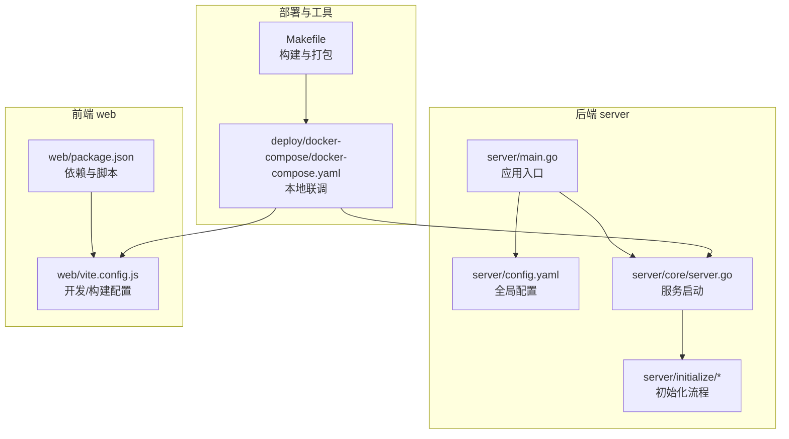
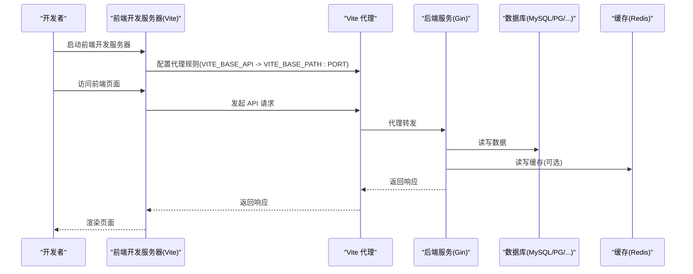
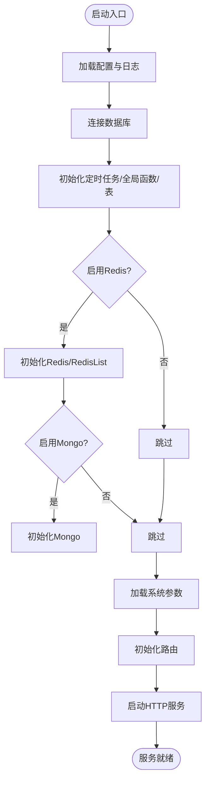

# 开发指南

<cite>
**本文引用的文件**
- [README.md](file://README.md)
- [server/main.go](file://server/main.go)
- [server/core/server.go](file://server/core/server.go)
- [server/config.yaml](file://server/config.yaml)
- [server/config/config.go](file://server/config/config.go)
- [server/go.mod](file://server/go.mod)
- [web/package.json](file://web/package.json)
- [web/vite.config.js](file://web/vite.config.js)
- [Makefile](file://Makefile)
- [deploy/docker-compose/docker-compose.yaml](file://deploy/docker-compose/docker-compose.yaml)
- [server/initialize/init.go](file://server/initialize/init.go)
- [CONTRIBUTING.md](file://CONTRIBUTING.md)
- [CODE_OF_CONDUCT.md](file://CODE_OF_CONDUCT.md)
</cite>

## 目录
1. [简介](#简介)
2. [项目结构](#项目结构)
3. [核心组件](#核心组件)
4. [架构总览](#架构总览)
5. [详细组件分析](#详细组件分析)
6. [依赖分析](#依赖分析)
7. [性能考虑](#性能考虑)
8. [故障排查指南](#故障排查指南)
9. [结论](#结论)
10. [附录](#附录)

## 简介
本开发指南面向测试管理平台的新开发者与贡献者，目标是帮助你在最短时间内完成开发环境搭建、理解项目结构、掌握启动流程、遵循开发规范，并具备本地调试、新增功能模块、编写单元测试与集成测试的能力。平台采用前后端分离架构，后端基于 Go 语言与 Gin 框架，前端基于 Vue 3 与 Vite，数据库支持 MySQL、PostgreSQL、SQL Server、Oracle、SQLite，缓存使用 Redis，日志使用 Zap，配置使用 Viper，API 文档使用 Swagger。

## 项目结构
项目采用“后端 server + 前端 web”的双仓库式组织，配合 Docker Compose 提供一键本地联调环境；同时提供 Makefile 与脚本用于本地打包与文档生成。

图表来源
- [server/main.go:30-35](file://server/main.go#L30-L35)
- [server/core/server.go:14-48](file://server/core/server.go#L14-L48)
- [server/config.yaml:74-92](file://server/config.yaml#L74-L92)
- [web/package.json:5-12](file://web/package.json#L5-L12)
- [web/vite.config.js:57-79](file://web/vite.config.js#L57-L79)
- [deploy/docker-compose/docker-compose.yaml:16-51](file://deploy/docker-compose/docker-compose.yaml#L16-L51)
- [Makefile:41-56](file://Makefile#L41-L56)

章节来源
- [README.md:203-302](file://README.md#L203-L302)

## 核心组件
- 应用入口与初始化
  - 后端入口负责初始化配置、日志、数据库、定时任务、全局函数注册与表初始化，随后启动 HTTP 服务。
  - 前端通过 Vite 启动开发服务器，支持代理后端 API、热更新与构建产物输出。
- 配置体系
  - 后端使用 YAML 配置文件，通过 Viper 加载；前端通过 .env.* 与 Vite 环境变量注入。
- 服务启动
  - 后端根据配置决定是否启用 Redis/Mongo、加载系统参数、初始化路由并启动 HTTP 服务。
  - 前端开发服务器默认端口由环境变量控制，支持代理到后端服务。

章节来源
- [server/main.go:30-52](file://server/main.go#L30-L52)
- [server/core/server.go:14-48](file://server/core/server.go#L14-L48)
- [server/config.yaml:1-284](file://server/config.yaml#L1-L284)
- [web/vite.config.js:57-79](file://web/vite.config.js#L57-L79)

## 架构总览
下图展示本地开发与联调的整体流程：前端通过 Vite 代理访问后端 API，后端按配置连接数据库与缓存，启动后可通过 Swagger 查看接口文档。

图表来源
- [web/vite.config.js:61-77](file://web/vite.config.js#L61-L77)
- [server/core/server.go:14-48](file://server/core/server.go#L14-L48)
- [server/config.yaml:74-92](file://server/config.yaml#L74-L92)

## 详细组件分析

### 后端启动流程
- 初始化顺序
  - 加载配置与日志
  - 连接数据库
  - 初始化定时任务、全局函数、表结构
  - 根据配置决定是否启用 Redis/Mongo
  - 初始化路由并启动 HTTP 服务
- 关键点
  - Swagger 文档生成与访问
  - MCP 独立服务地址提示
  - 默认前端运行地址提示

图表来源
- [server/main.go:39-52](file://server/main.go#L39-L52)
- [server/core/server.go:14-48](file://server/core/server.go#L14-L48)
- [server/config.yaml:21-92](file://server/config.yaml#L21-L92)

章节来源
- [server/main.go:30-52](file://server/main.go#L30-L52)
- [server/core/server.go:14-48](file://server/core/server.go#L14-L48)

### 前端启动与代理
- 启动脚本
  - 开发模式：通过 Vite 启动，自动打开浏览器
  - 构建模式：生成 dist 目录产物
- 代理配置
  - 将 VITE_BASE_API 前缀代理到后端地址
  - 支持插件市场 API 的额外代理
- 环境变量
  - VITE_CLI_PORT、VITE_BASE_API、VITE_BASE_PATH、VITE_SERVER_PORT 等

章节来源
- [web/package.json:5-12](file://web/package.json#L5-L12)
- [web/vite.config.js:57-79](file://web/vite.config.js#L57-L79)

### 配置体系
- 后端配置
  - JWT、Zap、Redis、Mongo、Email、System、Captcha、数据库连接、跨域、MCP 等
  - 支持多数据库列表与 OSS 类型切换
- 前端配置
  - 通过 Vite 环境变量注入，结合 .env.* 文件
  - 代理、端口、构建产物输出目录等

章节来源
- [server/config.yaml:1-284](file://server/config.yaml#L1-L284)
- [server/config/config.go:1-41](file://server/config/config.go#L1-L41)
- [web/vite.config.js:15-18](file://web/vite.config.js#L15-L18)

### 本地联调与一键启动
- Docker Compose
  - 同时启动 web、server、mysql、redis
  - 默认端口：web 8080、server 8888、mysql 13306、redis 16379
- Makefile
  - 提供本地打包、容器打包、Swagger 文档生成、插件打包等常用任务

章节来源
- [deploy/docker-compose/docker-compose.yaml:16-91](file://deploy/docker-compose/docker-compose.yaml#L16-L91)
- [Makefile:21-76](file://Makefile#L21-L76)

### Swagger 文档
- 安装与生成
  - 安装 swag 工具
  - 在 server 目录执行生成命令
- 访问
  - 启动后端服务，在浏览器访问默认文档地址

章节来源
- [README.md:147-162](file://README.md#L147-L162)

## 依赖分析
- 后端依赖
  - Web 框架：Gin
  - ORM：GORM（支持 MySQL、PostgreSQL、SQL Server、Oracle、SQLite）
  - 缓存：Redis
  - 权限：Casbin
  - 日志：Zap
  - 配置：Viper
  - 文档：Swag
  - 其他：邮箱、AWS/阿里云/七牛/华为等 OSS SDK
- 前端依赖
  - 框架：Vue 3
  - UI：Element Plus
  - 构建：Vite
  - 工具：Axios、Pinia、ECharts、富文本编辑器等

章节来源
- [server/go.mod:7-61](file://server/go.mod#L7-L61)
- [web/package.json:14-57](file://web/package.json#L14-L57)

## 性能考虑
- 后端
  - 合理设置数据库连接池大小与日志级别
  - Redis/Mongo 按需启用，避免不必要的连接
  - 使用 Swagger 与中间件进行限流与安全控制
- 前端
  - 生产构建开启压缩与去调试符号
  - 合理拆分代码块，减少首屏体积
  - 使用代理避免跨域带来的额外开销

## 故障排查指南
- 启动失败
  - 检查数据库连接参数与网络连通性
  - 确认 Redis/Mongo 配置正确且服务可用
  - 查看后端日志输出定位错误
- 前端无法访问后端接口
  - 检查 Vite 代理配置与环境变量
  - 确认后端 CORS 配置与放行策略
- Swagger 文档不显示
  - 确认已安装 swag 并在 server 目录执行生成
  - 重启后端服务后刷新页面
- Docker Compose 启动异常
  - 查看容器健康检查状态与日志
  - 确认端口未被占用

章节来源
- [server/config.yaml:264-279](file://server/config.yaml#L264-L279)
- [web/vite.config.js:61-77](file://web/vite.config.js#L61-L77)
- [README.md:147-162](file://README.md#L147-L162)
- [deploy/docker-compose/docker-compose.yaml:64-85](file://deploy/docker-compose/docker-compose.yaml#L64-L85)

## 结论
本指南提供了从环境搭建到本地联调、从配置管理到文档生成的完整路径。建议在开始开发前先完成 Docker Compose 一键启动，确保数据库与缓存可用，再分别启动前后端服务进行联调。后续新增功能模块时，遵循现有目录结构与命名规范，优先编写单元测试与集成测试，保证代码质量与可维护性。

## 附录

### 开发环境搭建步骤
- 后端
  - 安装 Go（版本要求见 README）
  - 在 Goland 中打开 server 目录
  - 在 server 目录执行依赖安装与运行
- 前端
  - 安装 Node.js（版本要求见 README）
  - 在 web 目录执行依赖安装与启动
- Swagger 文档
  - 安装 swag 工具并在 server 目录生成文档
- Docker Compose
  - 使用提供的 compose 文件一键启动本地联调环境

章节来源
- [README.md:109-145](file://README.md#L109-L145)
- [README.md:147-162](file://README.md#L147-L162)
- [deploy/docker-compose/docker-compose.yaml:16-91](file://deploy/docker-compose/docker-compose.yaml#L16-L91)

### 项目启动流程
- 后端
  - 初始化配置与日志
  - 连接数据库并注册表
  - 初始化定时任务与全局函数
  - 根据配置启用 Redis/Mongo
  - 初始化路由并启动 HTTP 服务
- 前端
  - 启动开发服务器并配置代理
  - 访问页面并与后端交互
- Swagger
  - 生成文档并访问默认地址

章节来源
- [server/main.go:39-52](file://server/main.go#L39-L52)
- [server/core/server.go:14-48](file://server/core/server.go#L14-L48)
- [web/package.json:5-12](file://web/package.json#L5-L12)
- [README.md:147-162](file://README.md#L147-L162)

### 目录结构与文件组织
- server
  - api、config、core、docs、global、initialize、middleware、model、router、service、utils 等
- web
  - src、public、vite.config.js、package.json 等
- deploy
  - docker、docker-compose、kubernetes 等
- docs、.github、.trae、.aone_copilot 等

章节来源
- [README.md:203-302](file://README.md#L203-L302)

### 开发规范与最佳实践
- 代码风格
  - 后端：遵循 Go 社区通用风格，保持包与文件职责单一
  - 前端：使用 Prettier 与 ESLint，统一缩进、引号与逗号风格
- 命名约定
  - Go：采用清晰的包名与结构体/函数命名；接口与错误类型语义明确
  - Vue：组件与页面命名采用 PascalCase，文件命名采用 kebab-case
- 注释规范
  - 关键函数与复杂逻辑添加注释，保持简洁易懂
- 提交规范
  - 遵循贡献指南中的提交信息格式与分支策略

章节来源
- [CONTRIBUTING.md:9-19](file://CONTRIBUTING.md#L9-L19)
- [CODE_OF_CONDUCT.md:12-33](file://CODE_OF_CONDUCT.md#L12-L33)
- [web/.prettierrc:1-13](file://web/.prettierrc#L1-L13)

### 本地开发调试
- 后端
  - 在 Goland 中设置断点并运行 main.go
  - 通过 Swagger 测试接口
- 前端
  - 在浏览器中打开开发服务器地址
  - 使用 Vue DevTools 进行调试
- 全局重载
  - 通过全局事件触发系统重载，便于热更新配置

章节来源
- [server/main.go:30-35](file://server/main.go#L30-L35)
- [server/initialize/init.go:9-15](file://server/initialize/init.go#L9-L15)
- [web/vite.config.js:96-115](file://web/vite.config.js#L96-L115)

### 添加新的功能模块
- 后端
  - 在 router、service、model、api 层按模块划分文件
  - 在 initialize 中注册路由与初始化逻辑
  - 如需数据库表，编写初始化与迁移逻辑
- 前端
  - 在 src/view 与 src/api 中新增页面与接口
  - 在路由中注册新页面
  - 如需组件，放入 src/components

章节来源
- [README.md:304-322](file://README.md#L304-L322)

### 单元测试与集成测试
- 后端
  - 使用标准库 testing，按模块编写单元测试
  - 集成测试可基于 Docker Compose 启动环境
- 前端
  - 使用 Vitest/Jest（如已配置）编写组件与接口测试
  - 集成测试通过真实后端接口验证页面行为

章节来源
- [server/go.mod:41](file://server/go.mod#L41)
- [Makefile:67-68](file://Makefile#L67-L68)

### 常见问题与调试技巧
- 数据库连接失败
  - 检查 config.yaml 中数据库连接参数与网络可达性
- Redis/Mongo 不生效
  - 确认 system.use-redis/use-mongo 与对应配置项
- CORS 导致跨域
  - 检查 cors 配置与白名单策略
- 前端代理不生效
  - 确认 VITE_BASE_API 与代理 target 地址一致

章节来源
- [server/config.yaml:264-279](file://server/config.yaml#L264-L279)
- [web/vite.config.js:61-77](file://web/vite.config.js#L61-L77)