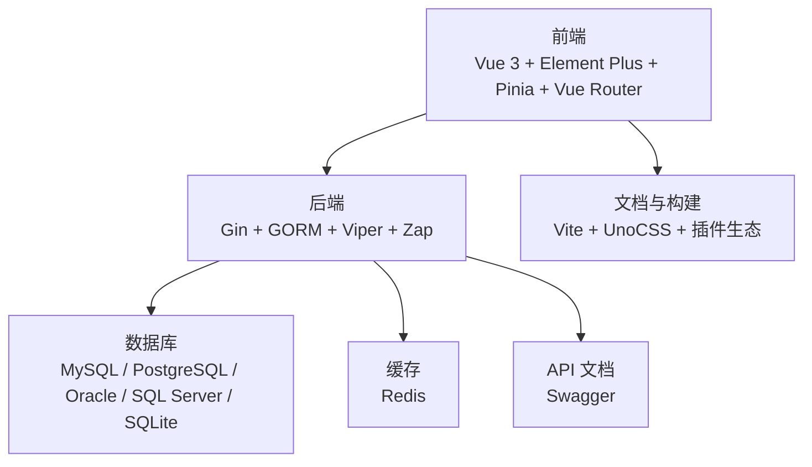
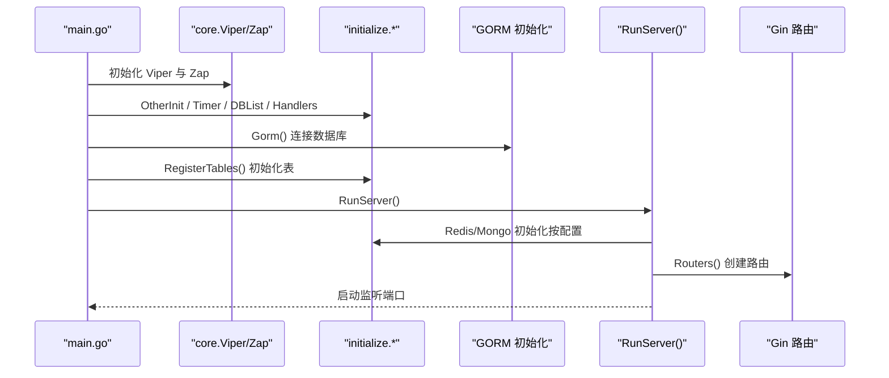
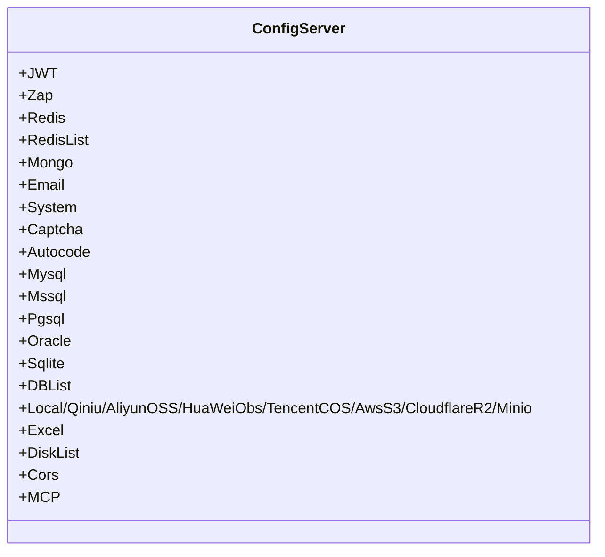

# 技术栈

<cite>
**本文引用的文件**
- [server/go.mod](file://server/go.mod)
- [web/package.json](file://web/package.json)
- [server/config.yaml](file://server/config.yaml)
- [server/main.go](file://server/main.go)
- [server/core/server.go](file://server/core/server.go)
- [server/config/config.go](file://server/config/config.go)
- [server/config/system.go](file://server/config/system.go)
- [server/config/gorm_mysql.go](file://server/config/gorm_mysql.go)
- [server/config/gorm_pgsql.go](file://server/config/gorm_pgsql.go)
- [server/config/gorm_mssql.go](file://server/config/gorm_mssql.go)
- [server/config/gorm_oracle.go](file://server/config/gorm_oracle.go)
- [server/config/gorm_sqlite.go](file://server/config/gorm_sqlite.go)
- [server/config/redis.go](file://server/config/redis.go)
- [web/vite.config.js](file://web/vite.config.js)
- [web/src/main.js](file://web/src/main.js)
- [web/src/router/index.js](file://web/src/router/index.js)
- [web/src/pinia/index.js](file://web/src/pinia/index.js)
- [web/src/core/gin-vue-admin.js](file://web/src/core/gin-vue-admin.js)
</cite>

## 目录
1. [简介](#简介)
2. [项目结构](#项目结构)
3. [核心组件](#核心组件)
4. [架构总览](#架构总览)
5. [详细组件分析](#详细组件分析)
6. [依赖分析](#依赖分析)
7. [性能考量](#性能考量)
8. [故障排查指南](#故障排查指南)
9. [结论](#结论)
10. [附录](#附录)

## 简介
本文件面向“测试管理平台”的技术栈说明，围绕前后端技术选型、数据库与缓存、API 文档与配置管理展开，结合仓库中的实际配置与模块，系统阐述各技术组件的作用、版本要求、兼容性与扩展性，并解释其如何支撑测试管理平台的功能需求与企业级应用要求。

## 项目结构
该工程采用前后端分离架构：
- 前端基于 Vue 3 生态（Vue Router、Pinia），使用 Vite 构建与开发，UI 组件库为 Element Plus。
- 后端基于 Go 语言，使用 Gin 框架作为 Web 层，GORM 作为 ORM，Viper 管理配置，Zap 记录日志；支持多数据库驱动与 Redis 缓存；通过 Swagger 自动生成 API 文档。
- 配置采用 YAML 文件集中管理，覆盖系统、数据库、缓存、跨域、对象存储等。

图表来源
- [web/src/main.js:1-38](file://web/src/main.js#L1-L38)
- [web/src/router/index.js:1-42](file://web/src/router/index.js#L1-L42)
- [web/src/pinia/index.js:1-9](file://web/src/pinia/index.js#L1-L9)
- [server/main.go:1-52](file://server/main.go#L1-L52)
- [server/core/server.go:1-49](file://server/core/server.go#L1-L49)
- [server/config.yaml:1-284](file://server/config.yaml#L1-L284)

章节来源
- [server/main.go:30-52](file://server/main.go#L30-L52)
- [server/core/server.go:14-49](file://server/core/server.go#L14-L49)
- [web/src/main.js:1-38](file://web/src/main.js#L1-L38)
- [web/src/router/index.js:1-42](file://web/src/router/index.js#L1-L42)
- [web/src/pinia/index.js:1-9](file://web/src/pinia/index.js#L1-L9)

## 核心组件
- 前端技术栈
  - Vue 3：响应式与组合式 API，提供高效组件化开发体验。
  - Element Plus：丰富的桌面端 UI 组件库，满足测试管理界面的高复用性与一致性。
  - Pinia：轻量状态管理，替代 Vuex，适合复杂业务的状态组织。
  - Vue Router：单页应用路由，支持懒加载与权限控制。
  - Vite：快速构建与热更新，提升开发效率。
- 后端技术栈
  - Go 1.24.x：稳定、高性能、并发友好，适合企业级服务。
  - Gin：轻量 Web 框架，路由清晰、中间件丰富，便于扩展。
  - GORM：链式 API、多数据库支持、插件生态完善，适配多种数据库。
  - Viper：YAML/JSON/TOML 等多格式配置读取，支持环境变量覆盖。
  - Zap：高性能日志库，支持结构化日志与多级别输出。
  - Swagger：自动生成 API 文档，便于联调与运维。
- 数据库与缓存
  - 数据库：MySQL、PostgreSQL、Oracle、SQL Server、SQLite，均通过 GORM 驱动实现统一访问。
  - 缓存：Redis，支持单实例与集群模式，用于会话、限流、分布式锁等场景。
- 配置管理
  - YAML 格式集中配置，涵盖系统参数、数据库连接、Redis、跨域、对象存储等。

章节来源
- [server/go.mod:3-61](file://server/go.mod#L3-L61)
- [web/package.json:14-57](file://web/package.json#L14-L57)
- [server/config.yaml:1-284](file://server/config.yaml#L1-L284)

## 架构总览
后端启动流程概览如下：

图表来源
- [server/main.go:30-52](file://server/main.go#L30-L52)
- [server/core/server.go:14-49](file://server/core/server.go#L14-L49)

章节来源
- [server/main.go:30-52](file://server/main.go#L30-L52)
- [server/core/server.go:14-49](file://server/core/server.go#L14-L49)

## 详细组件分析

### 前端技术栈
- Vue 3
  - 作用：提供响应式数据与组合式 API，支撑复杂交互与组件化开发。
  - 版本：见依赖声明。
- Element Plus
  - 作用：提供表格、表单、弹窗、图标等常用组件，统一 UI 风格。
- Pinia
  - 作用：集中管理用户、字典、应用等状态，替代 Vuex，减少样板代码。
- Vue Router
  - 作用：路由定义与懒加载，支持登录页、仪表盘、系统管理等功能页面。
- Vite
  - 作用：开发时热更新与构建优化，支持代理、插件与构建产物命名策略。

章节来源
- [web/package.json:14-57](file://web/package.json#L14-L57)
- [web/src/main.js:1-38](file://web/src/main.js#L1-L38)
- [web/src/router/index.js:1-42](file://web/src/router/index.js#L1-L42)
- [web/src/pinia/index.js:1-9](file://web/src/pinia/index.js#L1-L9)
- [web/vite.config.js:1-119](file://web/vite.config.js#L1-L119)

### 后端技术栈
- Go 1.24.x
  - 作用：服务端主语言，具备高并发与低延迟特性。
  - 版本：go 1.24.0，工具链 go1.24.2。
- Gin
  - 作用：HTTP 路由与中间件处理，支持 CORS、JWT、限流、操作日志等。
- GORM
  - 作用：ORM 映射与查询，支持 MySQL、PostgreSQL、SQL Server、Oracle、SQLite。
- Viper
  - 作用：读取 YAML 配置，支持环境变量覆盖，集中管理系统参数。
- Zap
  - 作用：高性能日志记录，支持控制台输出、文件轮转、结构化字段。
- Swagger
  - 作用：自动生成 API 文档，便于前后端联调与运维。

章节来源
- [server/go.mod:3-61](file://server/go.mod#L3-L61)
- [server/main.go:30-52](file://server/main.go#L30-L52)
- [server/core/server.go:14-49](file://server/core/server.go#L14-L49)

### 数据库与缓存
- 数据库
  - MySQL：通过 gorm.io/driver/mysql 驱动连接。
  - PostgreSQL：通过 gorm.io/driver/postgres 驱动连接。
  - SQL Server：通过 gorm.io/driver/sqlserver 驱动连接。
  - Oracle：通过第三方驱动（dzwvip/gorm-oracle）连接。
  - SQLite：通过 gorm.io/driver/sqlite 驱动连接。
  - 配置：通过 config.yaml 的 mysql/pgsql/mssql/oracle/sqlite 字段与 db-list 列表配置连接参数。
- 缓存
  - Redis：支持单实例与集群模式，通过 redis.go 配置项启用与连接。

章节来源
- [server/go.mod:56-58](file://server/go.mod#L56-L58)
- [server/go.mod:16](file://server/go.mod#L16)
- [server/config/gorm_mysql.go:1-10](file://server/config/gorm_mysql.go#L1-L10)
- [server/config/gorm_pgsql.go:1-18](file://server/config/gorm_pgsql.go#L1-L18)
- [server/config/gorm_mssql.go:1-11](file://server/config/gorm_mssql.go#L1-L11)
- [server/config/gorm_oracle.go:1-19](file://server/config/gorm_oracle.go#L1-L19)
- [server/config/gorm_sqlite.go:1-14](file://server/config/gorm_sqlite.go#L1-L14)
- [server/config.yaml:101-160](file://server/config.yaml#L101-L160)
- [server/config/redis.go:1-11](file://server/config/redis.go#L1-L11)

### API 文档与配置管理
- Swagger
  - 作用：自动生成 API 文档，入口注释位于 main.go，便于前后端协作。
- 配置管理（YAML）
  - 作用：集中管理系统、数据库、Redis、跨域、对象存储等配置，支持多数据库与多 Redis 实例。
  - 关键字段：system、mysql、pgsql、mssql、oracle、sqlite、redis、redis-list、cors、mcp 等。

章节来源
- [server/main.go:23-29](file://server/main.go#L23-L29)
- [server/config.yaml:1-284](file://server/config.yaml#L1-L284)
- [server/config/config.go:1-41](file://server/config/config.go#L1-L41)
- [server/config/system.go:1-16](file://server/config/system.go#L1-L16)

## 依赖分析
- 前端依赖
  - Vue 3、Element Plus、Pinia、Vue Router、axios、echarts 等，构成完整的前端开发与运行环境。
- 后端依赖
  - Gin、GORM、Viper、Zap、Redis 客户端、Swagger 工具链、AWS/阿里云/腾讯云等对象存储 SDK，覆盖 Web、持久化、配置、日志、缓存与云存储等能力。
- 配置模型
  - 通过 config.Server 结构体映射 YAML，包含系统、数据库、Redis、跨域、对象存储等子配置，便于统一注入与使用。

图表来源
- [server/config/config.go:1-41](file://server/config/config.go#L1-L41)

章节来源
- [web/package.json:14-57](file://web/package.json#L14-L57)
- [server/go.mod:7-61](file://server/go.mod#L7-L61)
- [server/config/config.go:1-41](file://server/config/config.go#L1-L41)

## 性能考量
- 前端
  - Vite 构建与按需加载，减少首屏体积；UnoCSS 与按需 SVG 构建，降低运行时开销。
- 后端
  - Gin 路由与中间件组合，结合 Zap 日志与 GORM 连接池配置，满足高并发场景。
  - 多数据库驱动统一抽象，便于根据业务选择最优数据库。
  - Redis 支持集群，可横向扩展以承载高并发缓存与会话需求。
- 配置与部署
  - YAML 配置集中管理，便于容器化与 CI/CD 部署；跨域与限流策略可按需调整。

[本节为通用性能建议，不直接分析具体文件]

## 故障排查指南
- 启动与路由
  - 若启动后无法访问 Swagger 或路由异常，检查 system.addr 与 router-prefix 配置，确认 RunServer 输出的监听地址与默认文档地址。
- 数据库连接
  - 检查对应数据库配置（mysql/pgsql/mssql/oracle/sqlite）的连接参数，确认 DSN 生成逻辑与目标数据库可达。
- 缓存与会话
  - 若使用 Redis，确认 use-redis/useCluster/clusterAddrs 等配置正确，确保连接可用。
- 日志与错误
  - 查看 Zap 输出级别与目录配置，定位运行期错误与堆栈信息。

章节来源
- [server/core/server.go:32-48](file://server/core/server.go#L32-L48)
- [server/config/system.go:1-16](file://server/config/system.go#L1-L16)
- [server/config/gorm_mysql.go:7-9](file://server/config/gorm_mysql.go#L7-L9)
- [server/config/gorm_pgsql.go:9-17](file://server/config/gorm_pgsql.go#L9-L17)
- [server/config/gorm_mssql.go:7-10](file://server/config/gorm_mssql.go#L7-L10)
- [server/config/gorm_oracle.go:13-18](file://server/config/gorm_oracle.go#L13-L18)
- [server/config/gorm_sqlite.go:11-13](file://server/config/gorm_sqlite.go#L11-L13)
- [server/config/redis.go:3-10](file://server/config/redis.go#L3-L10)

## 结论
该技术栈在测试管理平台中实现了清晰的前后端分离、统一的配置中心与多数据库/缓存支持。前端以 Vue 3 为核心，搭配 Element Plus 与 Pinia，具备良好的开发体验与可维护性；后端以 Gin + GORM 为基础，结合 Viper 与 Zap，具备高扩展性与企业级稳定性。Swagger 与 YAML 配置进一步提升了协作效率与部署灵活性。整体架构既满足测试管理平台的功能需求，也兼顾了企业级应用对性能、可扩展与可观测性的要求。

[本节为总结性内容，不直接分析具体文件]

## 附录
- 版本与兼容性要点
  - Go：1.24.0（工具链 1.24.2），与 Gin、GORM、Viper、Zap 等生态版本兼容。
  - Vue：3.x，Element Plus 2.x，Pinia 2.x，Vue Router 4.x，与现代浏览器良好兼容。
  - 数据库：MySQL、PostgreSQL、SQL Server、Oracle、SQLite 均有官方或成熟驱动支持。
  - 缓存：Redis 官方客户端，支持单实例与集群模式。
- 配置清单参考
  - 系统参数：system.db-type、system.addr、system.use-redis、system.use-mongo、system.disable-auto-migrate 等。
  - 数据库参数：mysql/pgsql/mssql/oracle/sqlite 下的连接参数与连接池配置。
  - 缓存参数：redis/redis-list 下的地址、密码、数据库与集群配置。
  - 跨域参数：cors.mode 与 whitelist 规则。
  - 文档与入口：main.go 中的 Swagger 注释与默认文档地址。

章节来源
- [server/go.mod:3-61](file://server/go.mod#L3-L61)
- [web/package.json:14-57](file://web/package.json#L14-L57)
- [server/config.yaml:74-92](file://server/config.yaml#L74-L92)
- [server/config.yaml:101-160](file://server/config.yaml#L101-L160)
- [server/config.yaml:21-45](file://server/config.yaml#L21-L45)
- [server/config.yaml:266-279](file://server/config.yaml#L266-L279)
- [server/main.go:23-29](file://server/main.go#L23-L29)