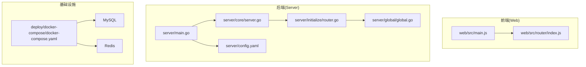
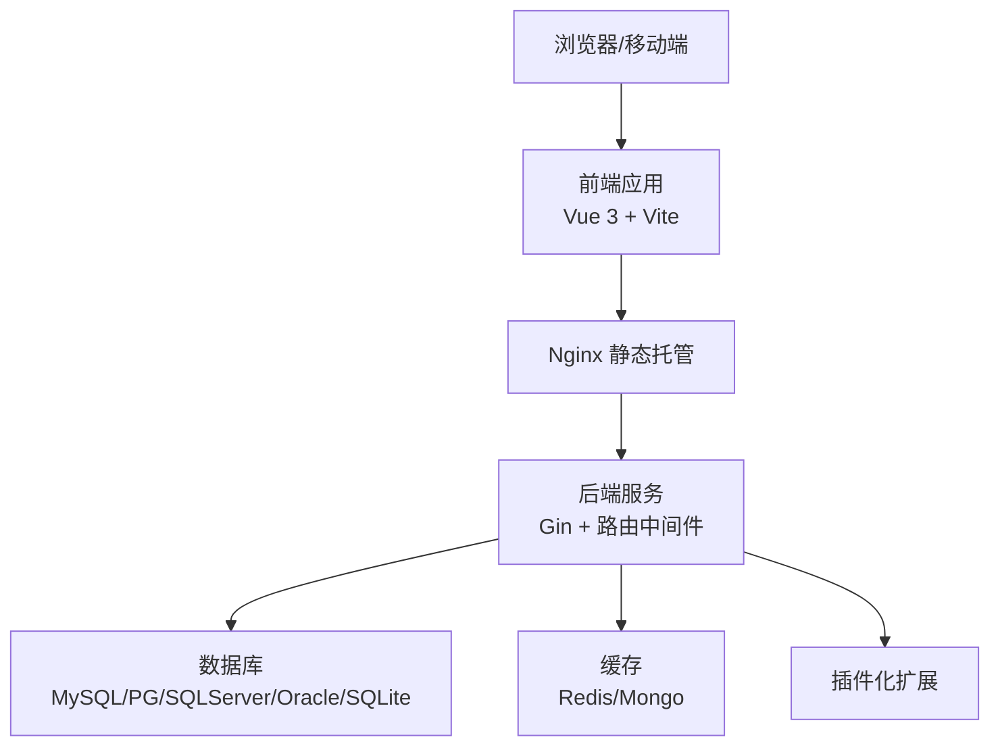
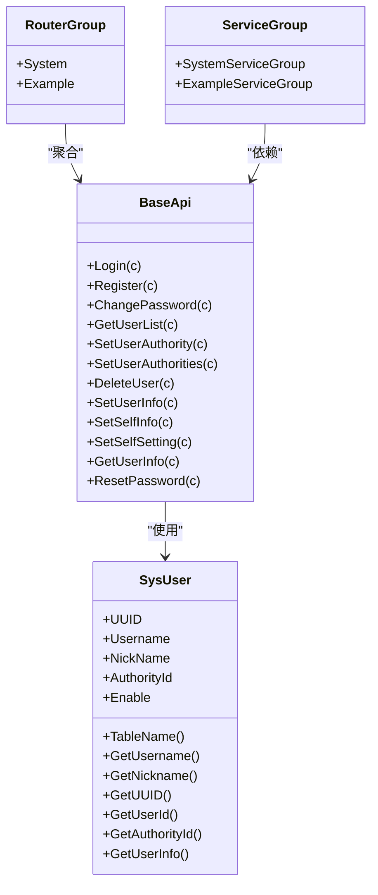
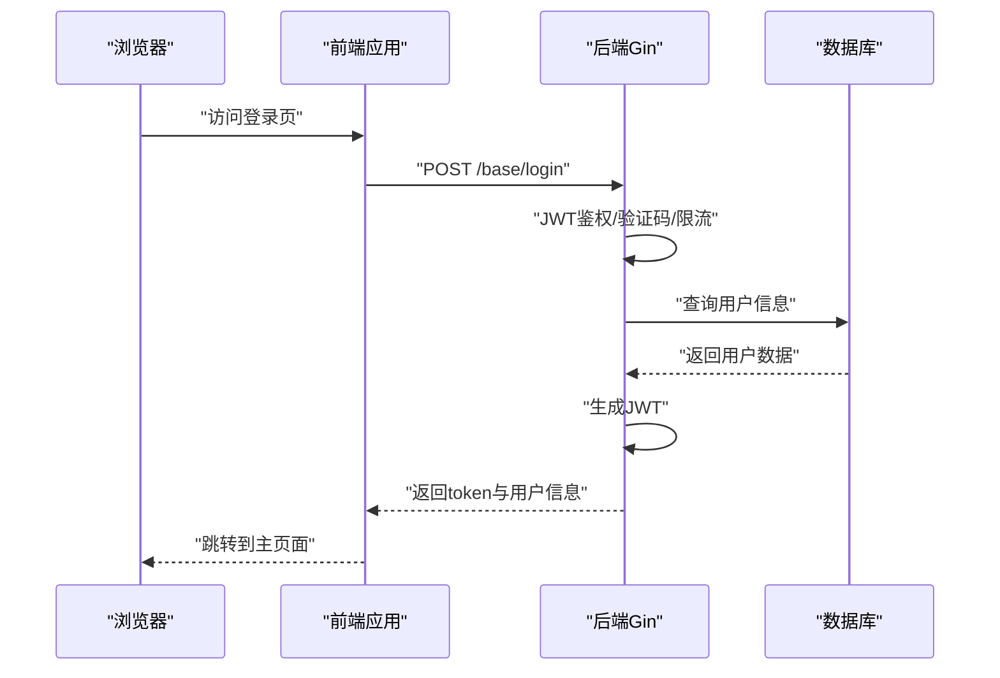
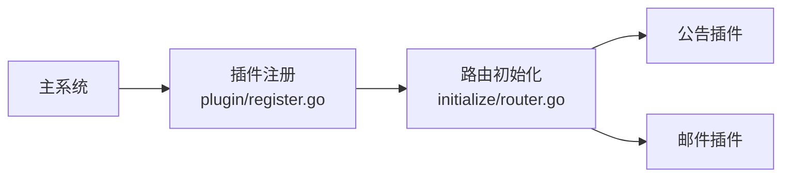
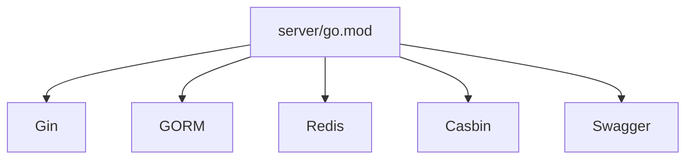

# 架构概览

<cite>
**本文引用的文件**
- [server/main.go](file://server/main.go)
- [server/core/server.go](file://server/core/server.go)
- [server/initialize/router.go](file://server/initialize/router.go)
- [server/global/global.go](file://server/global/global.go)
- [server/config.yaml](file://server/config.yaml)
- [server/go.mod](file://server/go.mod)
- [web/src/main.js](file://web/src/main.js)
- [web/src/router/index.js](file://web/src/router/index.js)
- [web/package.json](file://web/package.json)
- [deploy/docker-compose/docker-compose.yaml](file://deploy/docker-compose/docker-compose.yaml)
- [server/router/enter.go](file://server/router/enter.go)
- [server/service/enter.go](file://server/service/enter.go)
- [server/api/v1/system/sys_user.go](file://server/api/v1/system/sys_user.go)
- [server/plugin/register.go](file://server/plugin/register.go)
</cite>

## 目录
1. [引言](#引言)
2. [项目结构](#项目结构)
3. [核心组件](#核心组件)
4. [架构总览](#架构总览)
5. [详细组件分析](#详细组件分析)
6. [依赖分析](#依赖分析)
7. [性能考量](#性能考量)
8. [故障排查指南](#故障排查指南)
9. [结论](#结论)
10. [附录](#附录)

## 引言
本文件面向测试管理平台的整体架构，系统采用前后端分离设计，后端基于 Go 语言 Gin 框架，前端基于 Vue 3 + Vite，结合 Swagger 文档、多数据库与缓存支持、插件化扩展能力，以及容器化部署方案。本文将从架构设计、MVC 分层、边界划分、关键决策与权衡、组件关系与数据流等方面进行深入阐述，并提供架构图与组件关系图，帮助开发者快速理解系统整体结构。

## 项目结构
项目采用典型的前后端分离布局：
- 后端 server：以 Gin 为核心，按模块化组织 API、Service、Model、Router、Initialize、Middleware 等层次，支持多数据库与缓存、插件化扩展、定时任务与健康检查等。
- 前端 web：基于 Vue 3 + Vite，使用 Element Plus 组件库与 Pinia 状态管理，路由采用 Vue Router，构建产物由 Nginx 提供静态托管。
- 部署 deploy：包含 Docker 与 docker-compose 示例，涵盖 Web、Server、MySQL、Redis 四个服务的编排与网络配置。

**图表来源**
- [server/main.go:30-35](file://server/main.go#L30-L35)
- [server/core/server.go:14-48](file://server/core/server.go#L14-L48)
- [server/initialize/router.go:36-117](file://server/initialize/router.go#L36-L117)
- [server/global/global.go:25-42](file://server/global/global.go#L25-L42)
- [server/config.yaml:74-92](file://server/config.yaml#L74-L92)
- [web/src/main.js:21-36](file://web/src/main.js#L21-L36)
- [web/src/router/index.js:36-39](file://web/src/router/index.js#L36-L39)
- [deploy/docker-compose/docker-compose.yaml:16-51](file://deploy/docker-compose/docker-compose.yaml#L16-L51)

**章节来源**
- [server/main.go:30-52](file://server/main.go#L30-L52)
- [server/core/server.go:14-48](file://server/core/server.go#L14-L48)
- [server/initialize/router.go:36-117](file://server/initialize/router.go#L36-L117)
- [server/global/global.go:25-42](file://server/global/global.go#L25-L42)
- [server/config.yaml:74-92](file://server/config.yaml#L74-L92)
- [web/src/main.js:21-36](file://web/src/main.js#L21-L36)
- [web/src/router/index.js:36-39](file://web/src/router/index.js#L36-L39)
- [deploy/docker-compose/docker-compose.yaml:16-51](file://deploy/docker-compose/docker-compose.yaml#L16-L51)

## 核心组件
- 后端入口与初始化
  - server/main.go：程序入口，负责初始化系统并启动服务。
  - server/core/server.go：运行时装配 Redis/Mongo、加载系统数据、初始化路由并启动 HTTP 服务。
  - server/initialize/router.go：注册全局中间件、Swagger、公共/私有路由组、业务路由与插件路由。
  - server/global/global.go：全局变量与并发控制、定时任务、MCPServer 等共享资源。
  - server/config.yaml：系统配置（JWT、日志、Redis、Mongo、数据库、CORS、跨域等）。
- 前端入口与路由
  - web/src/main.js：应用初始化、插件挂载、路由与状态管理注入。
  - web/src/router/index.js：前端路由定义与导航守卫占位。
- 部署与运行
  - deploy/docker-compose/docker-compose.yaml：Web、Server、MySQL、Redis 的容器编排与网络配置。

**章节来源**
- [server/main.go:30-52](file://server/main.go#L30-L52)
- [server/core/server.go:14-48](file://server/core/server.go#L14-L48)
- [server/initialize/router.go:36-117](file://server/initialize/router.go#L36-L117)
- [server/global/global.go:25-42](file://server/global/global.go#L25-L42)
- [server/config.yaml:74-92](file://server/config.yaml#L74-L92)
- [web/src/main.js:21-36](file://web/src/main.js#L21-L36)
- [web/src/router/index.js:36-39](file://web/src/router/index.js#L36-L39)
- [deploy/docker-compose/docker-compose.yaml:16-51](file://deploy/docker-compose/docker-compose.yaml#L16-L51)

## 架构总览
系统采用“客户端-服务器”架构，前端通过 HTTP 接口与后端交互；后端遵循 MVC 分层与领域模型划分，结合中间件实现鉴权、日志、限流、跨域等功能；数据库层支持 MySQL、PostgreSQL、SQL Server、Oracle、SQLite 等，缓存层支持 Redis 与 Mongo；插件化机制允许动态扩展业务能力；容器化部署便于横向扩展与运维。

**图表来源**
- [server/initialize/router.go:36-117](file://server/initialize/router.go#L36-L117)
- [server/config.yaml:101-160](file://server/config.yaml#L101-L160)
- [server/config.yaml:21-44](file://server/config.yaml#L21-L44)
- [server/plugin/register.go:1-6](file://server/plugin/register.go#L1-L6)
- [web/src/main.js:21-36](file://web/src/main.js#L21-L36)

**章节来源**
- [server/initialize/router.go:36-117](file://server/initialize/router.go#L36-L117)
- [server/config.yaml:101-160](file://server/config.yaml#L101-L160)
- [server/config.yaml:21-44](file://server/config.yaml#L21-L44)
- [server/plugin/register.go:1-6](file://server/plugin/register.go#L1-L6)
- [web/src/main.js:21-36](file://web/src/main.js#L21-L36)

## 详细组件分析

### MVC 与分层架构
- Model 层
  - server/model/system/sys_user.go：用户实体定义，包含字段、关联关系与接口约束，体现数据模型与业务契约。
- View 层
  - web/src/view/*：页面组件与视图，由 Vue Router 管理，通过 API 层获取数据。
- Controller 层
  - server/api/v1/system/sys_user.go：控制器处理 HTTP 请求，完成参数校验、调用 Service、返回响应，承担鉴权与安全控制。
- Service 层
  - server/service/*：封装业务逻辑，提供事务、权限与复杂流程编排。
- Router/Initialize
  - server/router/enter.go：路由聚合入口，按模块组织路由组。
  - server/service/enter.go：服务聚合入口，按模块组织服务组。

**图表来源**
- [server/model/system/sys_user.go:20-63](file://server/model/system/sys_user.go#L20-L63)
- [server/api/v1/system/sys_user.go:20-517](file://server/api/v1/system/sys_user.go#L20-L517)
- [server/router/enter.go:10-13](file://server/router/enter.go#L10-L13)
- [server/service/enter.go:10-13](file://server/service/enter.go#L10-L13)

**章节来源**
- [server/model/system/sys_user.go:20-63](file://server/model/system/sys_user.go#L20-L63)
- [server/api/v1/system/sys_user.go:20-517](file://server/api/v1/system/sys_user.go#L20-L517)
- [server/router/enter.go:10-13](file://server/router/enter.go#L10-L13)
- [server/service/enter.go:10-13](file://server/service/enter.go#L10-L13)

### 前后端解耦与交互流程
- 前端通过 axios 与后端 API 通信，路由采用前端路由，页面按需加载。
- 后端通过 Gin 路由注册公共/私有接口，私有接口启用 JWT 与 RBAC 中间件。
- Swagger 文档自动生成，便于联调与测试。

**图表来源**
- [server/api/v1/system/sys_user.go:20-99](file://server/api/v1/system/sys_user.go#L20-L99)
- [server/initialize/router.go:68-75](file://server/initialize/router.go#L68-L75)

**章节来源**
- [server/api/v1/system/sys_user.go:20-99](file://server/api/v1/system/sys_user.go#L20-L99)
- [server/initialize/router.go:68-75](file://server/initialize/router.go#L68-L75)

### 插件化架构与边界
- 插件注册：通过 server/plugin/register.go 引入插件包，实现按需启用。
- 插件路由：在 server/initialize/router.go 中统一安装插件路由，保持主系统与插件的边界清晰。
- 插件能力：示例包含公告与邮件插件，展示业务扩展点。

**图表来源**
- [server/plugin/register.go:1-6](file://server/plugin/register.go#L1-L6)
- [server/initialize/router.go:107-108](file://server/initialize/router.go#L107-L108)

**章节来源**
- [server/plugin/register.go:1-6](file://server/plugin/register.go#L1-L6)
- [server/initialize/router.go:107-108](file://server/initialize/router.go#L107-L108)

### 关键技术决策与权衡
- Vue 3 + Gin 组合
  - 前端：Vue 3 提供响应式与 Composition API，生态丰富，利于组件化与状态管理；Vite 提供快速热更新与构建优化。
  - 后端：Gin 轻量高效，中间件体系完善，适合高并发 API 场景；结合 Swagger 提升联调效率。
- 前后端解耦
  - 通过明确的 API 协议与鉴权策略，前端仅关注视图与交互，后端专注业务与数据。
- 可扩展性
  - 插件化机制与多数据库/缓存支持，使系统可在不改动核心的情况下扩展新能力或切换存储。
- 容器化与部署
  - docker-compose 将 Web、Server、MySQL、Redis 解耦为独立容器，便于横向扩展与弹性伸缩。

**章节来源**
- [web/package.json:14-57](file://web/package.json#L14-L57)
- [server/go.mod:7-61](file://server/go.mod#L7-L61)
- [deploy/docker-compose/docker-compose.yaml:16-51](file://deploy/docker-compose/docker-compose.yaml#L16-L51)

## 依赖分析
- 后端依赖
  - Gin：Web 框架与路由中间件。
  - GORM：多数据库 ORM 支持。
  - Redis/Mongo：缓存与文档型存储。
  - Casbin：RBAC 权限控制。
  - Swagger：API 文档。
- 前端依赖
  - Vue 3、Element Plus、Pinia、Vue Router、Axios 等。

**图表来源**
- [server/go.mod:7-61](file://server/go.mod#L7-L61)

**章节来源**
- [server/go.mod:7-61](file://server/go.mod#L7-L61)

## 性能考量
- 路由与中间件
  - Gin 的中间件链路应尽量精简，避免在 Debug 模式下保留过多日志中间件到生产环境。
- 数据库与缓存
  - 合理配置连接池与只读副本，对热点数据使用 Redis 缓存，降低数据库压力。
- 前端构建
  - 生产环境启用压缩与懒加载，减少首屏体积；CDN 加速静态资源。
- 容器与网络
  - 合理设置健康检查与重启策略，确保服务可用性；网络隔离与端口暴露最小化。

## 故障排查指南
- 健康检查
  - 后端提供 /health 接口，用于容器编排健康探测。
- 日志与追踪
  - 后端使用 Zap 输出日志，可通过配置调整级别与输出位置；前端错误处理与全局异常捕获有助于定位问题。
- 配置校验
  - 数据库、Redis、CORS 等配置需与实际环境一致，避免因配置错误导致连接失败或跨域问题。
- 插件启用
  - 插件需在注册处引入并在路由初始化阶段安装，未正确注册会导致接口缺失。

**章节来源**
- [server/initialize/router.go:71-75](file://server/initialize/router.go#L71-L75)
- [server/config.yaml:9-20](file://server/config.yaml#L9-L20)
- [server/plugin/register.go:1-6](file://server/plugin/register.go#L1-L6)

## 结论
该测试管理平台通过“Vue 3 + Gin”的前后端分离架构，结合 MVC 分层、插件化扩展与多数据库/缓存支持，实现了高内聚、低耦合且易于扩展的系统设计。容器化部署进一步提升了可运维性与可扩展性。建议在生产环境中强化安全配置、监控告警与灰度发布流程，持续优化性能与用户体验。

## 附录
- 配置参考
  - 系统配置项覆盖 JWT、日志、Redis、Mongo、数据库、CORS、跨域等，详见 server/config.yaml。
- 运行与构建
  - 前端使用 Vite，脚本包含 dev、build、preview 等；后端使用 Go Modules 管理依赖。

**章节来源**
- [server/config.yaml:3-284](file://server/config.yaml#L3-L284)
- [web/package.json:5-12](file://web/package.json#L5-L12)