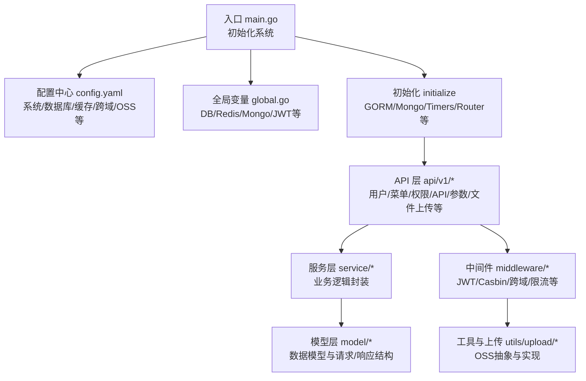
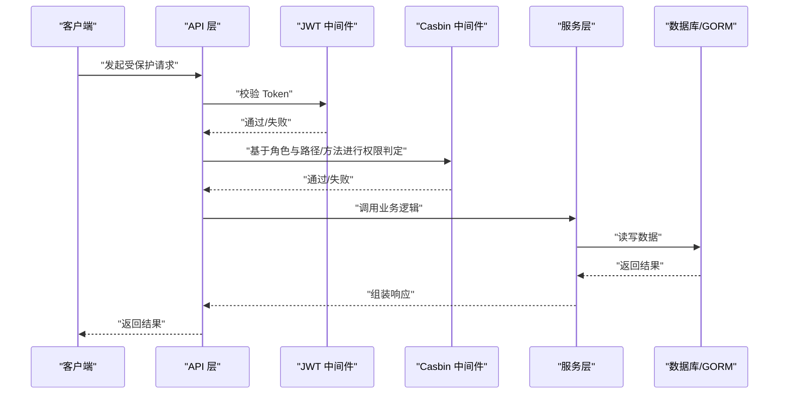
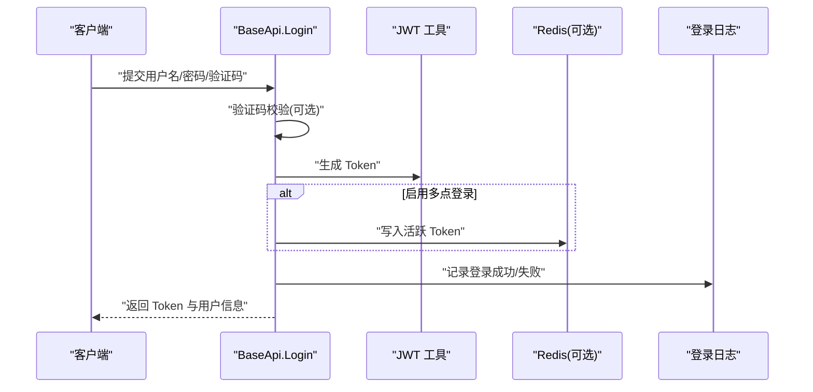
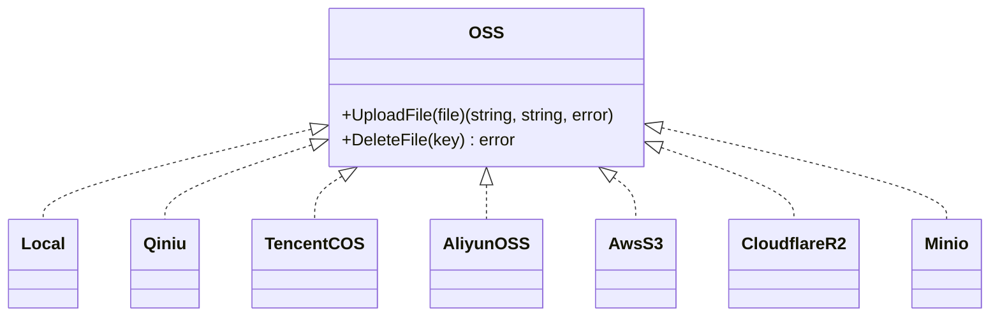
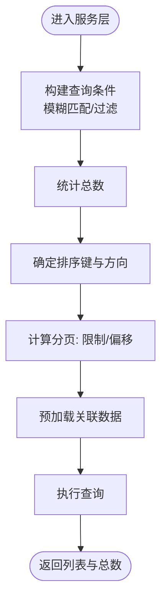
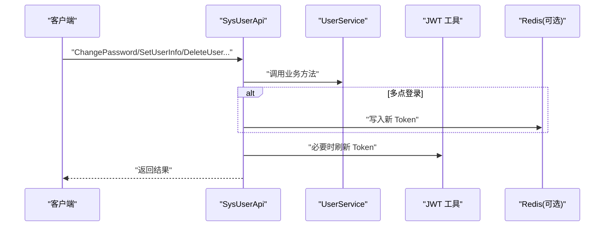
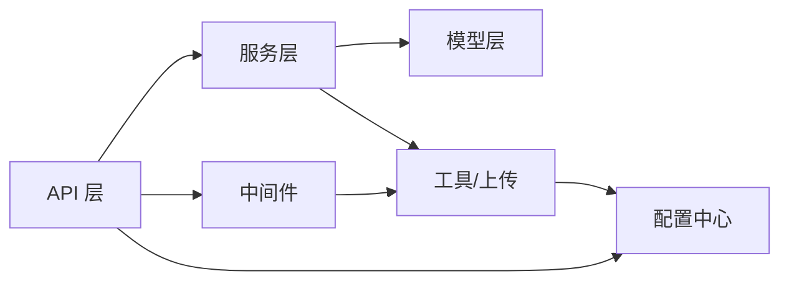

# 核心特性

<cite>
**本文引用的文件**
- [server/main.go](file://server/main.go)
- [server/config.yaml](file://server/config.yaml)
- [server/global/global.go](file://server/global/global.go)
- [server/middleware/jwt.go](file://server/middleware/jwt.go)
- [server/middleware/casbin_rbac.go](file://server/middleware/casbin_rbac.go)
- [server/api/v1/system/sys_user.go](file://server/api/v1/system/sys_user.go)
- [server/service/system/sys_user.go](file://server/service/system/sys_user.go)
- [server/model/system/sys_user.go](file://server/model/system/sys_user.go)
- [server/api/v1/system/sys_menu.go](file://server/api/v1/system/sys_menu.go)
- [server/api/v1/system/sys_authority.go](file://server/api/v1/system/sys_authority.go)
- [server/api/v1/system/sys_api.go](file://server/api/v1/system/sys_api.go)
- [server/api/v1/system/sys_params.go](file://server/api/v1/system/sys_params.go)
- [server/api/v1/example/exa_file_upload_download.go](file://server/api/v1/example/exa_file_upload_download.go)
- [server/utils/upload/upload.go](file://server/utils/upload/upload.go)
</cite>

## 目录
1. [简介](#简介)
2. [项目结构](#项目结构)
3. [核心组件](#核心组件)
4. [架构总览](#架构总览)
5. [详细组件分析](#详细组件分析)
6. [依赖分析](#依赖分析)
7. [性能考虑](#性能考虑)
8. [故障排查指南](#故障排查指南)
9. [结论](#结论)
10. [附录](#附录)

## 简介
本项目是一个基于 Gin + Vue 的全栈开发基础平台，面向企业级应用场景，提供完善的权限体系（JWT + Casbin RBAC）、多云存储（七牛云、阿里云、腾讯云等）、分页封装、用户/角色/菜单/API/参数管理、条件搜索、RESTful 示例、多点登录限制、分片上传、表单生成器、代码生成器等通用能力；同时具备测试管理平台所需的测试用例管理、测试执行跟踪、缺陷跟踪系统、报告生成功能的扩展基础。本文档聚焦核心特性说明、技术实现原理、使用场景与最佳实践，并强调易用性、可扩展性与企业级应用价值。

## 项目结构
后端采用 Go 语言，遵循“api/service/model/initialize”分层设计，结合中间件、配置中心、全局变量与插件机制，形成高内聚低耦合的模块化架构。前端基于 Vue3 + Vite，通过统一的 API 约定与后端交互。

图表来源
- [server/main.go:30-52](file://server/main.go#L30-L52)
- [server/config.yaml:74-92](file://server/config.yaml#L74-L92)
- [server/global/global.go:25-42](file://server/global/global.go#L25-L42)

章节来源
- [server/main.go:30-52](file://server/main.go#L30-L52)
- [server/config.yaml:74-92](file://server/config.yaml#L74-L92)
- [server/global/global.go:25-42](file://server/global/global.go#L25-L42)

## 核心组件
- 权限管理：基于 JWT 的登录认证与 Token 刷新，结合 Casbin 实现细粒度的 RBAC 权限控制。
- 文件上传下载：统一的 OSS 抽象接口，支持本地、七牛、阿里云、腾讯云、AWS S3、Cloudflare R2、MinIO 等多种存储后端。
- 分页封装：统一的分页请求/响应结构，支持排序与多字段模糊检索。
- 用户/角色/菜单/API/参数管理：提供完整的 CRUD 与授权关联操作，支持严格角色模式与默认路由校验。
- 条件搜索：在用户列表等场景中支持按昵称、手机、邮箱、用户名等字段的模糊匹配与排序。
- RESTful 示例：以 Swagger 注解驱动的 API 设计，便于前后端协作与文档生成。
- 多点登录限制：可配置是否启用 Redis 维护在线 Token 黑名单，实现互斥登录。
- 分片上传：示例模块提供断点续传能力，便于大文件传输。
- 表单生成器与代码生成器：通过模板与自动化脚本生成前后端代码，提升开发效率。

章节来源
- [server/api/v1/system/sys_user.go:20-517](file://server/api/v1/system/sys_user.go#L20-L517)
- [server/api/v1/system/sys_menu.go:18-336](file://server/api/v1/system/sys_menu.go#L18-L336)
- [server/api/v1/system/sys_authority.go:17-258](file://server/api/v1/system/sys_authority.go#L17-L258)
- [server/api/v1/system/sys_api.go:18-382](file://server/api/v1/system/sys_api.go#L18-L382)
- [server/api/v1/system/sys_params.go:14-172](file://server/api/v1/system/sys_params.go#L14-L172)
- [server/api/v1/example/exa_file_upload_download.go:16-136](file://server/api/v1/example/exa_file_upload_download.go#L16-L136)
- [server/utils/upload/upload.go:17-47](file://server/utils/upload/upload.go#L17-L47)

## 架构总览
下图展示从客户端到服务端的关键交互链路，包括认证、授权、业务处理与持久化。

图表来源
- [server/middleware/jwt.go:16-78](file://server/middleware/jwt.go#L16-L78)
- [server/middleware/casbin_rbac.go:12-32](file://server/middleware/casbin_rbac.go#L12-L32)
- [server/api/v1/system/sys_user.go:27-161](file://server/api/v1/system/sys_user.go#L27-L161)

章节来源
- [server/middleware/jwt.go:16-78](file://server/middleware/jwt.go#L16-L78)
- [server/middleware/casbin_rbac.go:12-32](file://server/middleware/casbin_rbac.go#L12-L32)
- [server/api/v1/system/sys_user.go:27-161](file://server/api/v1/system/sys_user.go#L27-L161)

## 详细组件分析

### 权限管理（JWT + Casbin）
- JWT 登录与 Token 刷新
  - 登录流程：校验验证码（可选）、验证用户凭据、生成 JWT 并写入 Cookie 或本地存储；若启用多点登录，则写入 Redis 并记录黑名单。
  - Token 刷新：当即将过期时自动延长有效期并下发新 Token。
- Casbin RBAC 授权
  - 在中间件中根据“角色ID + 请求路径 + 方法”进行强制授权判定，未授权直接拦截。
- 配置要点
  - JWT 签名密钥、过期时间、缓冲时间、签发方等。
  - 多点登录开关、路由前缀、严格角色模式等。

图表来源
- [server/api/v1/system/sys_user.go:20-99](file://server/api/v1/system/sys_user.go#L20-L99)
- [server/middleware/jwt.go:16-78](file://server/middleware/jwt.go#L16-L78)

章节来源
- [server/api/v1/system/sys_user.go:20-161](file://server/api/v1/system/sys_user.go#L20-L161)
- [server/middleware/jwt.go:16-78](file://server/middleware/jwt.go#L16-L78)
- [server/middleware/casbin_rbac.go:12-32](file://server/middleware/casbin_rbac.go#L12-L32)
- [server/config.yaml:4-9](file://server/config.yaml#L4-L9)
- [server/config.yaml:74-92](file://server/config.yaml#L74-L92)

### 文件上传下载（多云存储）
- 统一抽象
  - 定义 OSS 接口与工厂方法，依据配置选择具体实现（本地/七牛/阿里云/腾讯云/AWS S3/Cloudflare R2/MinIO）。
- 示例接口
  - 支持上传、编辑文件名、删除、分页列表、导入 URL 等。
- 配置要点
  - OSS 类型、各云厂商的 Endpoint、Bucket、密钥、URL 前缀等。

图表来源
- [server/utils/upload/upload.go:12-47](file://server/utils/upload/upload.go#L12-L47)

章节来源
- [server/api/v1/example/exa_file_upload_download.go:16-136](file://server/api/v1/example/exa_file_upload_download.go#L16-L136)
- [server/utils/upload/upload.go:12-47](file://server/utils/upload/upload.go#L12-L47)
- [server/config.yaml:189-255](file://server/config.yaml#L189-L255)

### 分页封装与条件搜索
- 分页结构
  - 统一的分页请求结构与分页结果结构，支持页码、每页大小、排序键与升降序。
- 条件搜索
  - 用户列表支持按昵称、手机号、邮箱、用户名进行模糊匹配，并支持排序键校验与默认降序排列。
- 服务层实现
  - 计算总数、构造查询条件、限制与偏移、排序与预加载。

图表来源
- [server/service/system/sys_user.go:89-132](file://server/service/system/sys_user.go#L89-L132)

章节来源
- [server/service/system/sys_user.go:89-132](file://server/service/system/sys_user.go#L89-L132)
- [server/api/v1/system/sys_user.go:229-262](file://server/api/v1/system/sys_user.go#L229-L262)

### 用户管理
- 主要能力
  - 登录、注册、修改密码、重置密码、获取用户信息、设置用户信息/自身信息/配置、删除用户、设置角色等。
- 关键点
  - 登录时进行验证码校验（可配置）、密码哈希比对、启用/冻结状态校验。
  - 多点登录时写入 Redis 并维护黑名单，避免并发登录冲突。
  - 设置角色后即时刷新 Token 的角色信息。

图表来源
- [server/api/v1/system/sys_user.go:198-447](file://server/api/v1/system/sys_user.go#L198-L447)
- [server/service/system/sys_user.go:69-337](file://server/service/system/sys_user.go#L69-L337)
- [server/model/system/sys_user.go:20-63](file://server/model/system/sys_user.go#L20-L63)

章节来源
- [server/api/v1/system/sys_user.go:198-447](file://server/api/v1/system/sys_user.go#L198-L447)
- [server/service/system/sys_user.go:69-337](file://server/service/system/sys_user.go#L69-L337)
- [server/model/system/sys_user.go:20-63](file://server/model/system/sys_user.go#L20-L63)

### 角色管理
- 主要能力
  - 创建/复制/删除/更新角色、获取角色列表、设置数据权限、获取拥有某角色的用户列表、覆盖某角色的用户列表。
- 关键点
  - 严格角色模式下父角色继承；创建/更新后刷新 Casbin 策略，确保权限立即生效。

章节来源
- [server/api/v1/system/sys_authority.go:17-258](file://server/api/v1/system/sys_authority.go#L17-L258)

### 菜单管理
- 主要能力
  - 获取用户动态路由树、获取基础菜单树、新增/删除/更新菜单、按 ID 查询、设置/获取菜单关联角色、分页获取菜单列表。
- 关键点
  - 动态路由与默认路由一致性校验，避免角色切换后无法访问默认页面。

章节来源
- [server/api/v1/system/sys_menu.go:18-336](file://server/api/v1/system/sys_menu.go#L18-L336)

### API 管理
- 主要能力
  - 创建/删除/更新/获取 API、获取所有 API、按 ID 批量删除、同步 API、获取 API 分组、忽略/确认同步、刷新 Casbin 缓存、获取/设置 API 关联角色。
- 关键点
  - 通过同步机制自动发现/清理 API，结合 Casbin 策略快速授权。

章节来源
- [server/api/v1/system/sys_api.go:18-382](file://server/api/v1/system/sys_api.go#L18-L382)

### 配置管理
- 主要能力
  - 参数的增删改查、分页列表、按 key 获取 value。
- 关键点
  - 将系统运行参数集中管理，支持热更新与统一读取。

章节来源
- [server/api/v1/system/sys_params.go:14-172](file://server/api/v1/system/sys_params.go#L14-L172)

### 条件搜索与 RESTful 示例
- 条件搜索
  - 用户列表支持多字段模糊匹配与排序键校验，避免 SQL 注入与无效排序。
- RESTful 示例
  - 以 Swagger 注解定义接口规范，统一返回体，便于前端对接与文档生成。

章节来源
- [server/service/system/sys_user.go:89-132](file://server/service/system/sys_user.go#L89-L132)
- [server/api/v1/system/sys_user.go:229-262](file://server/api/v1/system/sys_user.go#L229-L262)

### 多点登录限制
- 机制
  - 启用后，同一账号的新登录会将旧 Token 加入黑名单并作废，实现互斥登录。
- 配置
  - 在系统配置中开启多点登录开关与相关阈值。

章节来源
- [server/api/v1/system/sys_user.go:118-161](file://server/api/v1/system/sys_user.go#L118-L161)
- [server/config.yaml:81](file://server/config.yaml#L81)

### 分片上传
- 能力
  - 示例模块提供断点续传能力，适合大文件场景。
- 集成建议
  - 前端分块上传，后端合并与去重，结合 OSS 与本地存储策略。

章节来源
- [server/api/v1/example/exa_file_upload_download.go:16-136](file://server/api/v1/example/exa_file_upload_download.go#L16-L136)

### 表单生成器与代码生成器
- 能力
  - 通过模板与自动化脚本生成前后端代码，降低重复劳动，提升开发效率。
- 应用建议
  - 在新模块开发时优先使用，保持风格一致与规范统一。

章节来源
- [server/config.yaml:181-188](file://server/config.yaml#L181-L188)

## 依赖分析
- 组件耦合
  - API 层仅依赖服务层接口，服务层依赖模型与工具，降低耦合度。
- 外部依赖
  - JWT、Casbin、GORM、Redis、Zap 日志、Viper 配置等。
- 循环依赖
  - 通过接口与分层设计避免循环依赖风险。

图表来源
- [server/api/v1/system/sys_user.go:20-517](file://server/api/v1/system/sys_user.go#L20-L517)
- [server/service/system/sys_user.go:24-337](file://server/service/system/sys_user.go#L24-L337)
- [server/utils/upload/upload.go:17-47](file://server/utils/upload/upload.go#L17-L47)

章节来源
- [server/api/v1/system/sys_user.go:20-517](file://server/api/v1/system/sys_user.go#L20-L517)
- [server/service/system/sys_user.go:24-337](file://server/service/system/sys_user.go#L24-L337)
- [server/utils/upload/upload.go:17-47](file://server/utils/upload/upload.go#L17-L47)

## 性能考虑
- JWT 缓存与刷新
  - 在即将过期时自动刷新 Token，减少频繁登录带来的压力。
- Redis 缓存
  - 多点登录与验证码等场景使用 Redis，提高并发下的响应速度。
- 数据库优化
  - 分页查询使用 LIMIT/OFFSET，排序键白名单校验，避免无效索引。
- 存储优化
  - OSS 抽象屏蔽厂商差异，结合 CDN 与直传策略提升上传体验。

## 故障排查指南
- 登录失败
  - 检查用户名/密码、验证码、冻结状态；查看登录日志与失败原因。
- 权限不足
  - 确认角色与路径/方法的授权关系，必要时刷新 Casbin 策略。
- 多点登录冲突
  - 检查 Redis 中是否已有活跃 Token，确认是否启用了多点登录限制。
- 文件上传异常
  - 核对 OSS 配置、桶权限与签名策略，确认网络连通性与 CDN 配置。

章节来源
- [server/api/v1/system/sys_user.go:65-97](file://server/api/v1/system/sys_user.go#L65-L97)
- [server/middleware/casbin_rbac.go:24](file://server/middleware/casbin_rbac.go#L24)
- [server/config.yaml:81](file://server/config.yaml#L81)

## 结论
本项目以模块化与中间件为核心，提供了企业级应用所需的权限、存储、分页、管理与自动化能力。其清晰的分层设计、可插拔的存储后端、严格的权限控制与完善的配置中心，使其既易于上手又具备强大的扩展性。结合测试管理平台的实际需求，可在现有基础上快速扩展测试用例、执行跟踪、缺陷与报告模块，满足从开发到运维的一体化平台建设目标。

## 附录
- 配置项速览
  - JWT：签名密钥、过期时间、缓冲时间、签发方。
  - 系统：端口、数据库类型、OSS 类型、是否使用 Redis/Mongo、多点登录、路由前缀、严格角色模式、自动迁移开关。
  - OSS：本地与多家云厂商的 Endpoint/Bucket/Key/URL 等。
- 最佳实践
  - 开启多点登录限制以保障安全；
  - 使用 Casbin 策略最小授权原则；
  - 分页查询务必校验排序键与过滤条件；
  - OSS 选择就近节点与 CDN，提升上传/下载性能。

章节来源
- [server/config.yaml:4-9](file://server/config.yaml#L4-L9)
- [server/config.yaml:74-92](file://server/config.yaml#L74-L92)
- [server/config.yaml:189-255](file://server/config.yaml#L189-L255)