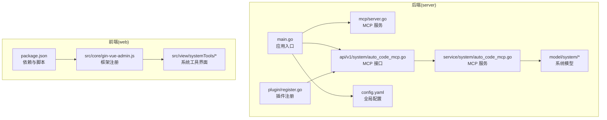
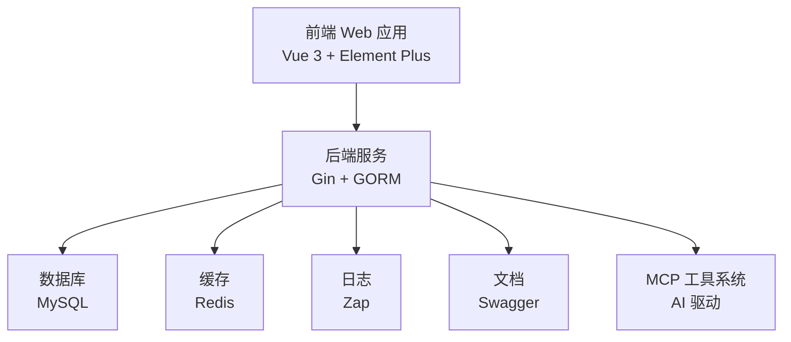
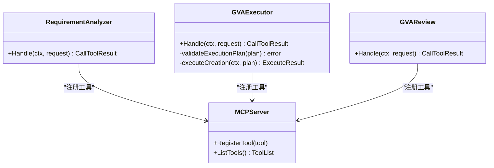
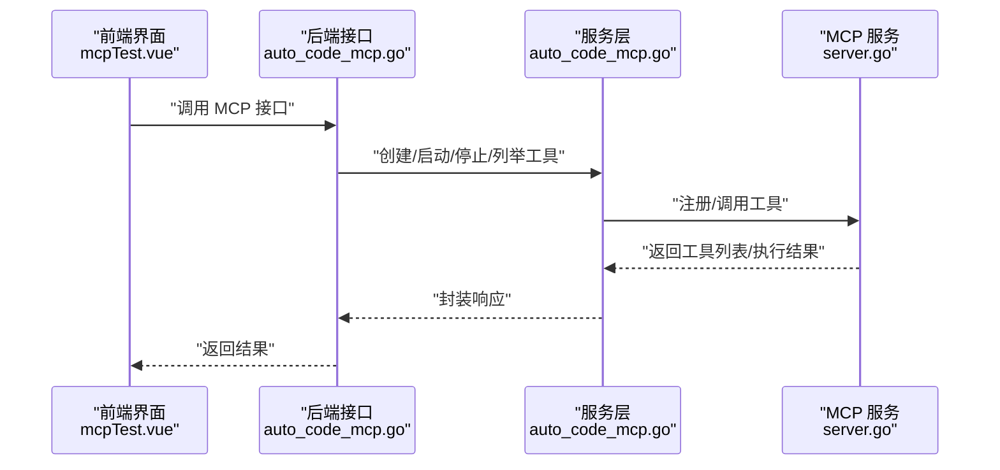
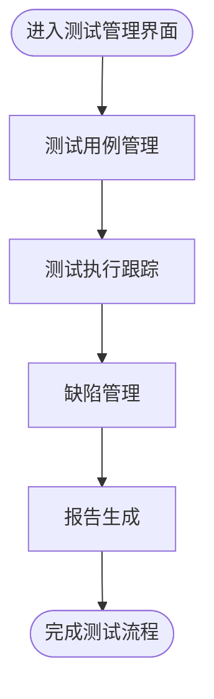
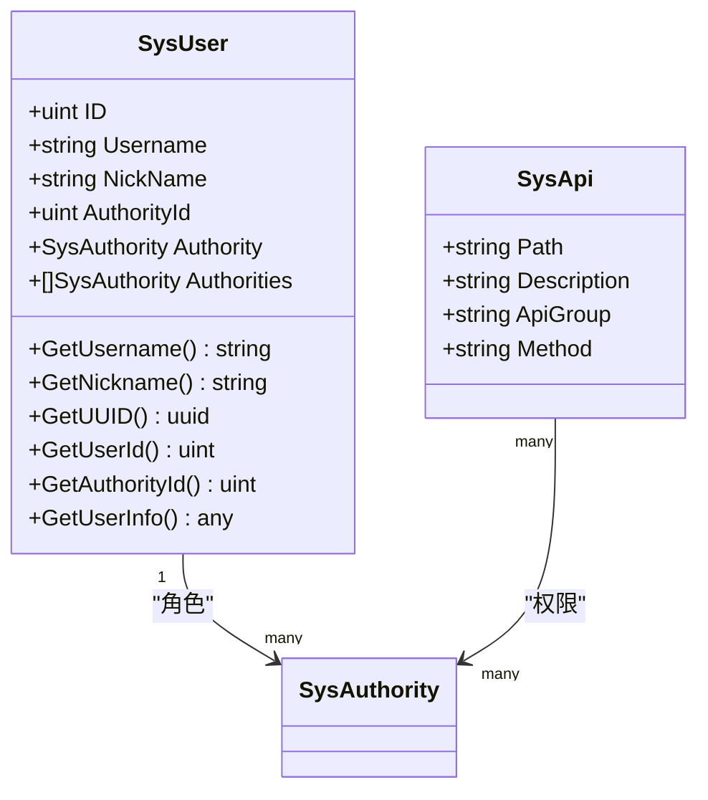
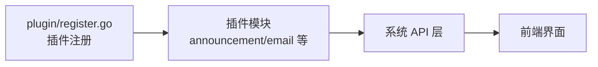
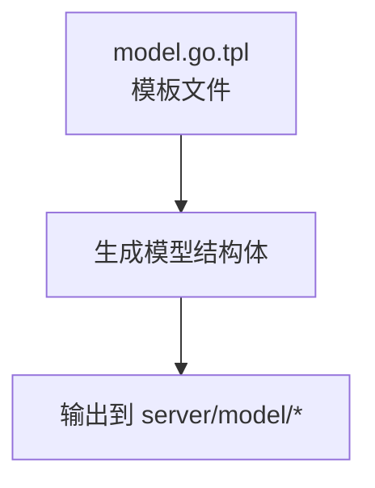
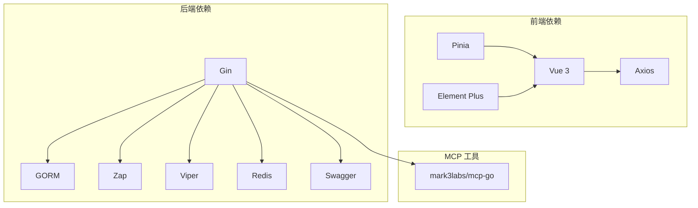

# 项目介绍

<cite>
**本文引用的文件**
- [README.md](file://README.md)
- [main.go](file://server/main.go)
- [config.yaml](file://server/config.yaml)
- [package.json](file://web/package.json)
- [gin-vue-admin.js](file://web/src/core/gin-vue-admin.js)
- [server.go](file://server/mcp/server.go)
- [auto_code_mcp.go](file://server/api/v1/system/auto_code_mcp.go)
- [auto_code_mcp.go](file://server/service/system/auto_code_mcp.go)
- [requirement_analyzer.go](file://server/mcp/requirement_analyzer.go)
- [gva_execute.go](file://server/mcp/gva_execute.go)
- [gva_review.go](file://server/mcp/gva_review.go)
- [register.go](file://server/plugin/register.go)
- [sys_user.go](file://server/model/system/sys_user.go)
- [sys_api.go](file://server/model/system/sys_api.go)
- [index.vue](file://web/src/view/systemTools/autoCode/index.vue)
- [mcpTest.vue](file://web/src/view/systemTools/autoCode/mcpTest.vue)
- [index.vue](file://web/src/view/systemTools/aiWrokflow/index.vue)
- [model.go.tpl](file://server/resource/plugin/server/model/model.go.tpl)
</cite>

## 目录
1. [简介](#简介)
2. [项目结构](#项目结构)
3. [核心组件](#核心组件)
4. [架构总览](#架构总览)
5. [详细组件分析](#详细组件分析)
6. [依赖分析](#依赖分析)
7. [性能考虑](#性能考虑)
8. [故障排查指南](#故障排查指南)
9. [结论](#结论)
10. [附录](#附录)

## 简介
本项目是一个基于 Gin-Vue-Admin 框架构建的企业级测试管理解决方案。它围绕“测试用例管理、测试执行跟踪、缺陷管理、报告生成”等核心业务场景，提供前后端分离的现代化平台能力。项目采用 Vue 3 + Element Plus 前端与 Gin + GORM 后端技术栈，结合插件化扩展机制与 MCP 工具系统，实现测试流程的自动化与智能化，显著提升测试效率、降低测试成本。

- 项目定位：企业级测试管理平台，聚焦测试生命周期管理与自动化。
- 技术选型：前端 Vue 3 + Element Plus；后端 Gin + GORM；数据库 MySQL；缓存 Redis；日志 Zap；配置 Viper；文档 Swagger。
- 扩展机制：插件化架构与 MCP 工具系统，支持 AI 驱动的代码生成与测试工具编排。

**章节来源**
- [README.md: 74-85:74-85](file://README.md#L74-L85)
- [README.md: 183-192:183-192](file://README.md#L183-L192)

## 项目结构
项目采用典型的前后端分离架构，后端 server 目录包含 API、服务层、模型层、中间件、初始化、配置等模块；前端 web 目录包含 Vue 3 应用、组件、路由、状态管理、工具库等。MCP 工具系统位于 server/mcp，提供 AI 驱动的测试工具链与自动化能力。

**图表来源**
- [main.go: 30-35:30-35](file://server/main.go#L30-L35)
- [config.yaml: 74-92:74-92](file://server/config.yaml#L74-L92)
- [server.go: 11-23:11-23](file://server/mcp/server.go#L11-L23)
- [auto_code_mcp.go: 15-68:15-68](file://server/api/v1/system/auto_code_mcp.go#L15-L68)
- [auto_code_mcp.go: 14-45:14-45](file://server/service/system/auto_code_mcp.go#L14-L45)
- [register.go: 1-6:1-6](file://server/plugin/register.go#L1-L6)
- [package.json: 14-57:14-57](file://web/package.json#L14-L57)
- [gin-vue-admin.js: 9-29:9-29](file://web/src/core/gin-vue-admin.js#L9-L29)

**章节来源**
- [README.md: 203-302:203-302](file://README.md#L203-L302)

## 核心组件
- 应用入口与初始化：后端通过 main.go 初始化配置、日志、数据库、定时任务、插件与表结构，随后启动 HTTP 服务。
- 配置系统：config.yaml 提供 JWT、日志、Redis、Mongo、邮件、系统参数、数据库连接、跨域等配置项。
- 前端框架：package.json 与 gin-vue-admin.js 提供依赖、构建脚本与框架注册，支撑系统工具与页面。
- 测试管理功能：通过系统工具界面实现测试用例、测试执行、缺陷与报告的管理入口。
- MCP 工具系统：提供需求分析、代码生成、审查等工具，支持 AI 驱动的自动化测试流程。

**章节来源**
- [main.go: 39-51:39-51](file://server/main.go#L39-L51)
- [config.yaml: 3-92:3-92](file://server/config.yaml#L3-L92)
- [package.json: 5-12:5-12](file://web/package.json#L5-L12)
- [gin-vue-admin.js: 9-29:9-29](file://web/src/core/gin-vue-admin.js#L9-L29)

## 架构总览
系统采用前后端分离架构，后端提供 RESTful API 与 MCP 工具服务，前端通过 Vue 3 提供交互界面。MCP 工具系统贯穿需求分析、代码生成与审查环节，形成闭环的测试自动化流水线。

**图表来源**
- [README.md: 183-192:183-192](file://README.md#L183-L192)
- [config.yaml: 10-19:10-19](file://server/config.yaml#L10-L19)
- [config.yaml: 21-28:21-28](file://server/config.yaml#L21-L28)
- [server.go: 11-23:11-23](file://server/mcp/server.go#L11-L23)

## 详细组件分析

### 组件 A：MCP 工具系统（需求分析-代码生成-审查）
该组件提供测试自动化与智能化的核心能力，包含需求分析、代码生成与审查三个关键工具，支持通过前端界面进行参数测试与工具调用。

**图表来源**
- [requirement_analyzer.go: 69-75:69-75](file://server/mcp/requirement_analyzer.go#L69-L75)
- [gva_execute.go: 217-272:217-272](file://server/mcp/gva_execute.go#L217-L272)
- [gva_review.go: 69-80:69-80](file://server/mcp/gva_review.go#L69-L80)
- [server.go: 11-23:11-23](file://server/mcp/server.go#L11-L23)

**图表来源**
- [mcpTest.vue: 572-583:572-583](file://web/src/view/systemTools/autoCode/mcpTest.vue#L572-L583)
- [auto_code_mcp.go: 15-68:15-68](file://server/api/v1/system/auto_code_mcp.go#L15-L68)
- [auto_code_mcp.go: 14-45:14-45](file://server/service/system/auto_code_mcp.go#L14-L45)
- [server.go: 11-23:11-23](file://server/mcp/server.go#L11-L23)

**章节来源**
- [requirement_analyzer.go: 41-75:41-75](file://server/mcp/requirement_analyzer.go#L41-L75)
- [gva_execute.go: 199-272:199-272](file://server/mcp/gva_execute.go#L199-L272)
- [gva_review.go: 43-80:43-80](file://server/mcp/gva_review.go#L43-L80)
- [auto_code_mcp.go: 70-137:70-137](file://server/api/v1/system/auto_code_mcp.go#L70-L137)

### 组件 B：测试管理功能模块（用例、执行、缺陷、报告）
前端通过系统工具界面提供测试管理入口，后端通过 API 与服务层对接数据库与工具链，形成完整的测试生命周期管理。

**图表来源**
- [index.vue: 1-800:1-800](file://web/src/view/systemTools/autoCode/index.vue#L1-L800)

**章节来源**
- [index.vue: 1-800:1-800](file://web/src/view/systemTools/autoCode/index.vue#L1-L800)

### 组件 C：权限与安全（JWT、Casbin、API 管理）
系统通过 JWT 与 Casbin 实现权限控制，SysUser 与 SysApi 模型支撑用户、角色与 API 权限管理。

**图表来源**
- [sys_user.go: 20-63:20-63](file://server/model/system/sys_user.go#L20-L63)
- [sys_api.go: 7-29:7-29](file://server/model/system/sys_api.go#L7-L29)

**章节来源**
- [sys_user.go: 9-63:9-63](file://server/model/system/sys_user.go#L9-L63)
- [sys_api.go: 1-29:1-29](file://server/model/system/sys_api.go#L1-L29)

### 组件 D：插件化扩展机制
通过插件注册文件实现插件的自动加载，支持扩展公告、邮件等插件能力，便于在测试管理平台中集成第三方能力。

**图表来源**
- [register.go: 1-6:1-6](file://server/plugin/register.go#L1-L6)

**章节来源**
- [register.go: 1-6:1-6](file://server/plugin/register.go#L1-L6)

### 组件 E：模板与代码生成（插件模板）
插件模板通过 Go Template 生成模型结构体与相关文件，支持树形结构、索引类型、字段类型等配置，便于快速生成测试相关的数据模型。

**图表来源**
- [model.go.tpl: 24-77:24-77](file://server/resource/plugin/server/model/model.go.tpl#L24-L77)

**章节来源**
- [model.go.tpl: 1-77:1-77](file://server/resource/plugin/server/model/model.go.tpl#L1-L77)

## 依赖分析
- 前端依赖：Vue 3、Element Plus、Axios、Pinia、Vue Router 等，提供页面渲染、状态管理与网络请求能力。
- 后端依赖：Gin、GORM、Zap、Viper、Redis、Swagger 等，提供高性能 API、ORM、日志、配置与文档能力。
- MCP 工具：基于 mark3labs/mcp-go，提供工具注册、列表与调用能力，支撑 AI 驱动的测试工具链。

**图表来源**
- [package.json: 14-57:14-57](file://web/package.json#L14-L57)
- [README.md: 183-192:183-192](file://README.md#L183-L192)
- [server.go: 11-23:11-23](file://server/mcp/server.go#L11-L23)

**章节来源**
- [package.json: 14-88:14-88](file://web/package.json#L14-L88)
- [README.md: 183-192:183-192](file://README.md#L183-L192)

## 性能考虑
- 数据库连接池：通过最大空闲连接与最大打开连接数配置，平衡并发与资源占用。
- 缓存策略：Redis 用于 JWT 令牌与会话管理，减少数据库压力。
- 日志与监控：Zap 提供高性能日志记录，便于问题定位与性能分析。
- 前端构建：Vite 提供快速开发与生产构建，优化页面加载与交互体验。

**章节来源**
- [config.yaml: 101-161:101-161](file://server/config.yaml#L101-L161)
- [config.yaml: 21-28:21-28](file://server/config.yaml#L21-L28)
- [config.yaml: 10-19:10-19](file://server/config.yaml#L10-L19)

## 故障排查指南
- 启动失败：检查 config.yaml 中数据库、Redis、JWT 等配置是否正确，确认端口未被占用。
- API 文档：通过 Swagger 生成与访问，确保 swag 初始化与路由配置正确。
- MCP 工具：确认 MCP 服务已启动，工具列表可正常列出，调用参数符合工具 Schema。
- 权限问题：核对 JWT 与 Casbin 配置，确保用户角色与 API 权限匹配。

**章节来源**
- [config.yaml: 74-92:74-92](file://server/config.yaml#L74-L92)
- [README.md: 147-162:147-162](file://README.md#L147-L162)
- [auto_code_mcp.go: 70-137:70-137](file://server/api/v1/system/auto_code_mcp.go#L70-L137)

## 结论
本测试管理平台以 Gin-Vue-Admin 为基础，结合 MCP 工具系统与插件化扩展机制，实现了测试用例管理、测试执行跟踪、缺陷管理与报告生成的全流程自动化与智能化。通过前后端分离架构与完善的权限体系，平台能够有效提升测试效率、降低测试成本，适用于企业级测试团队的日常协作与持续交付。

## 附录
- 在线文档与演示地址：README 中提供在线文档与演示链接。
- 开发与部署：README 提供开发环境、部署与视频教程指引。
- 社区与插件市场：提供社区支持与插件市场入口，便于扩展与集成。

**章节来源**
- [README.md: 45-58:45-58](file://README.md#L45-L58)
- [README.md: 107-146:107-146](file://README.md#L107-L146)
- [README.md: 52-56:52-56](file://README.md#L52-L56)