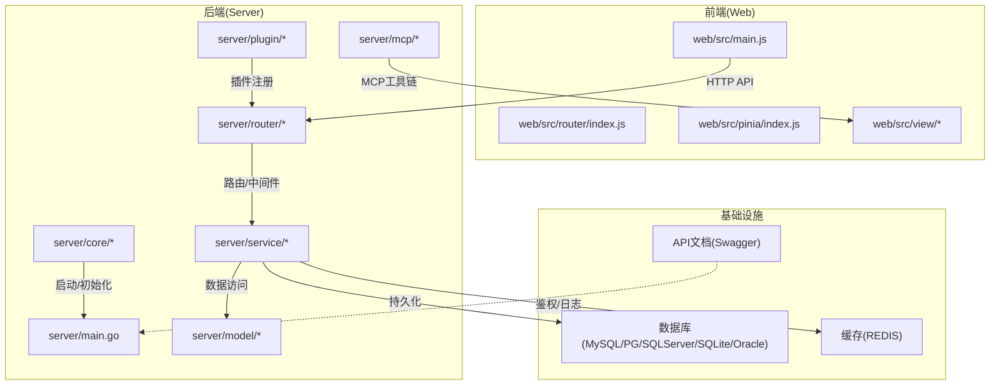
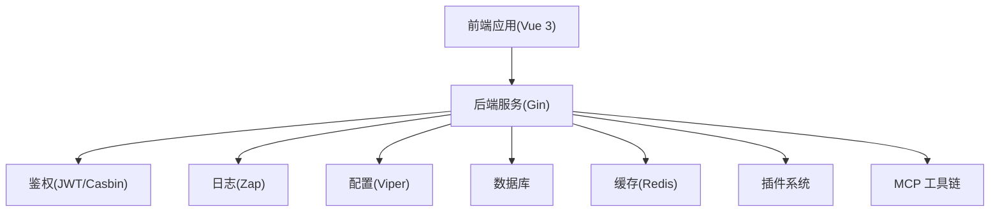
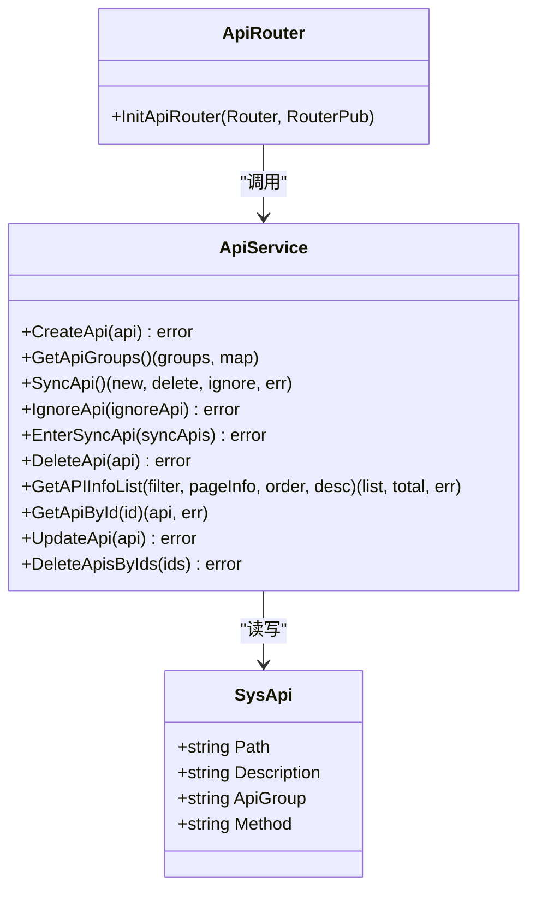
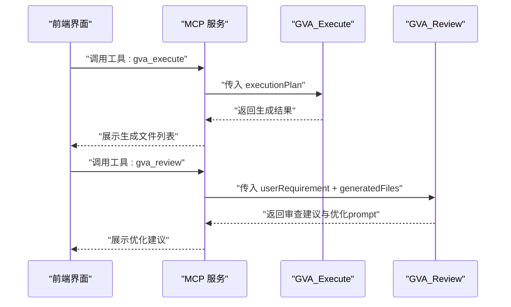
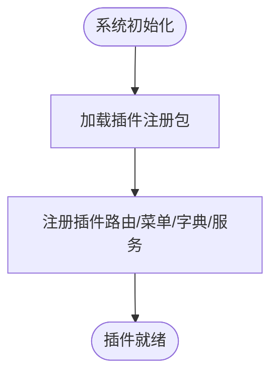
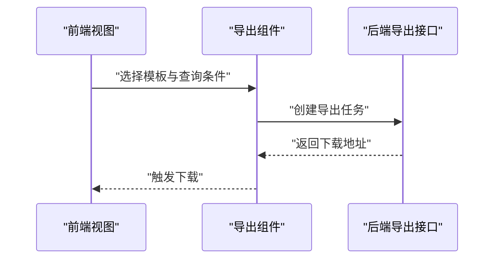
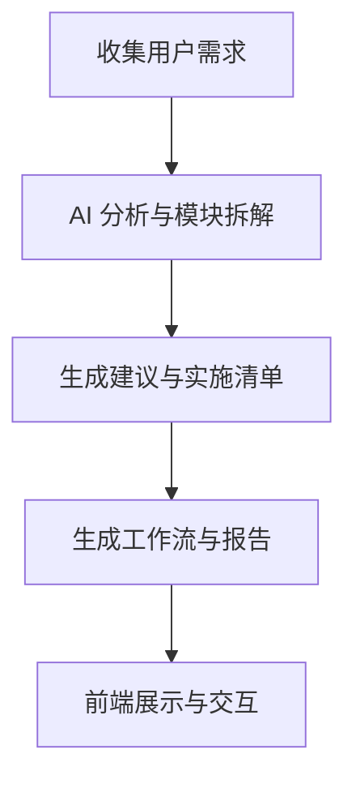
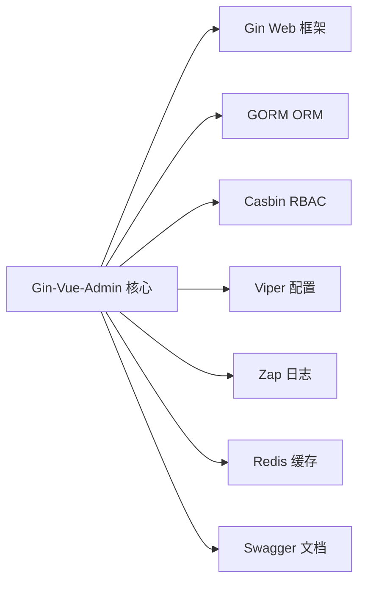

# 项目概述

<cite>
**本文引用的文件**
- [README.md](file://README.md)
- [main.go](file://server/main.go)
- [config.go](file://server/config/config.go)
- [mcp.go](file://server/config/mcp.go)
- [server.go](file://server/mcp/server.go)
- [gva_execute.go](file://server/mcp/gva_execute.go)
- [gva_review.go](file://server/mcp/gva_review.go)
- [register.go](file://server/plugin/register.go)
- [sys_api.go](file://server/router/system/sys_api.go)
- [sys_api.go](file://server/model/system/sys_api.go)
- [sys_api.go](file://server/service/system/sys_api.go)
- [package.json](file://web/package.json)
- [go.mod](file://server/go.mod)
- [exportExcel.vue](file://web/src/components/exportExcel/exportExcel.vue)
- [mcpTest.vue](file://web/src/view/systemTools/autoCode/mcpTest.vue)
- [index.vue](file://web/src/view/systemTools/aiWrokflow/index.vue)
- [CONTRIBUTING.md](file://CONTRIBUTING.md)
- [SECURITY.md](file://SECURITY.md)
- [CODE_OF_CONDUCT.md](file://CODE_OF_CONDUCT.md)
</cite>

## 目录
1. [引言](#引言)
2. [项目结构](#项目结构)
3. [核心组件](#核心组件)
4. [架构总览](#架构总览)
5. [详细组件分析](#详细组件分析)
6. [依赖分析](#依赖分析)
7. [性能考虑](#性能考虑)
8. [故障排查指南](#故障排查指南)
9. [结论](#结论)
10. [附录](#附录)

## 引言
本项目是基于 Gin-Vue-Admin 框架的企业级测试管理平台，定位为“前后端分离的测试管理解决方案”。其核心目标是通过统一的权限体系、可扩展的插件机制与现代化的 MCP 工具系统，支撑测试用例管理、测试执行跟踪、缺陷管理、报告生成等关键能力，帮助团队提升测试效率与质量。

项目强调：
- 企业级可用性：完善的权限、日志、配置与部署能力
- 可扩展性：插件化架构与 MCP 工具链
- 易用性：开箱即用的代码生成器、表单生成器与文档体系
- 商业合规：明确的开源协议与商用授权指引

## 项目结构
项目采用典型的前后端分离架构：
- 后端（Go/Gin）：提供 RESTful API、权限校验、定时任务、插件与 MCP 工具服务
- 前端（Vue 3 + Element Plus）：提供测试管理相关的界面与交互，包括测试用例、执行跟踪、缺陷管理、报告导出等视图
- 配置与部署：通过 YAML 配置文件与容器化部署方案支持多环境

图表来源
- [main.go:30-52](file://server/main.go#L30-L52)
- [package.json:1-88](file://web/package.json#L1-L88)
- [go.mod:1-61](file://server/go.mod#L1-L61)

章节来源
- [README.md:193-302](file://README.md#L193-L302)
- [main.go:30-52](file://server/main.go#L30-L52)
- [package.json:1-88](file://web/package.json#L1-L88)
- [go.mod:1-61](file://server/go.mod#L1-L61)

## 核心组件
- 权限与安全：JWT + Casbin 实现 RBAC 权限控制，支持多点登录限制与操作审计
- API 管理：动态 API 同步、忽略策略、角色绑定与权限刷新
- 测试管理能力：通过插件与 MCP 工具系统扩展测试用例、执行、缺陷与报告能力
- 导出与报表：内置表格导出模板与异步导出任务
- 配置与日志：Viper + Zap 提供集中化配置与结构化日志
- 插件与 MCP：插件化扩展与 MCP 工具链，支持 AI 辅助的代码生成与审查

章节来源
- [README.md:304-322](file://README.md#L304-L322)
- [sys_api.go:10-35](file://server/router/system/sys_api.go#L10-L35)
- [sys_api.go:7-28](file://server/model/system/sys_api.go#L7-L28)
- [sys_api.go:25-327](file://server/service/system/sys_api.go#L25-L327)
- [exportExcel.vue:1-84](file://web/src/components/exportExcel/exportExcel.vue#L1-L84)

## 架构总览
系统采用“前后端分离 + 插件化 + MCP 工具链”的企业级架构：
- 前端 Vue 应用负责视图与交互，通过 HTTP 与后端通信
- 后端 Gin 提供 API 层，配合中间件实现鉴权、日志、限流等横切能力
- 插件机制允许按需扩展功能模块
- MCP 工具链提供 AI 驱动的代码生成与审查能力，贯穿需求到实现的闭环

图表来源
- [server.go:11-52](file://server/mcp/server.go#L11-L52)
- [config.go:3-40](file://server/config/config.go#L3-L40)
- [mcp.go:3-18](file://server/config/mcp.go#L3-L18)

章节来源
- [README.md:183-192](file://README.md#L183-L192)
- [server.go:11-52](file://server/mcp/server.go#L11-L52)
- [config.go:3-40](file://server/config/config.go#L3-L40)
- [mcp.go:3-18](file://server/config/mcp.go#L3-L18)

## 详细组件分析

### 组件A：API 管理模块
该模块负责 API 的生命周期管理，包括创建、同步、忽略、删除与权限绑定，确保系统 API 与业务路由保持一致。

图表来源
- [sys_api.go:7-28](file://server/model/system/sys_api.go#L7-L28)
- [sys_api.go:21-327](file://server/service/system/sys_api.go#L21-L327)
- [sys_api.go:8-35](file://server/router/system/sys_api.go#L8-L35)

章节来源
- [sys_api.go:10-35](file://server/router/system/sys_api.go#L10-L35)
- [sys_api.go:7-28](file://server/model/system/sys_api.go#L7-L28)
- [sys_api.go:25-327](file://server/service/system/sys_api.go#L25-L327)

### 组件B：MCP 工具系统（GVA_Execute 与 GVA_Review）
MCP 工具系统提供 AI 驱动的代码生成与审查能力，支持将用户需求转化为可执行的“执行计划”，并在生成后进行质量审查与优化建议。

图表来源
- [gva_execute.go:217-237](file://server/mcp/gva_execute.go#L217-L237)
- [gva_review.go:43-80](file://server/mcp/gva_review.go#L43-L80)
- [gva_review.go:149-170](file://server/mcp/gva_review.go#L149-L170)
- [server.go:11-23](file://server/mcp/server.go#L11-L23)

章节来源
- [server.go:11-52](file://server/mcp/server.go#L11-L52)
- [gva_execute.go:199-237](file://server/mcp/gva_execute.go#L199-L237)
- [gva_review.go:43-80](file://server/mcp/gva_review.go#L43-L80)
- [gva_review.go:149-170](file://server/mcp/gva_review.go#L149-L170)

### 组件C：插件化扩展机制
插件注册通过导入插件包实现自动注册，系统在初始化阶段加载插件模块，扩展 API、菜单、字典与服务层。

图表来源
- [register.go:1-6](file://server/plugin/register.go#L1-L6)

章节来源
- [register.go:1-6](file://server/plugin/register.go#L1-L6)

### 组件D：报告导出与报表
前端提供导出组件，支持模板化导出与异步任务触发，后端根据模板与查询条件生成下载链接。

图表来源
- [exportExcel.vue:40-83](file://web/src/components/exportExcel/exportExcel.vue#L40-L83)

章节来源
- [exportExcel.vue:1-84](file://web/src/components/exportExcel/exportExcel.vue#L1-L84)

### 组件E：AI 工作流与需求分析
前端 AI 工作流页面支持需求收集、模块拆解、建议生成与工作流推进，后端提供 Markdown 汇总与模板化输出能力。

图表来源
- [index.vue:195-227](file://web/src/view/systemTools/aiWrokflow/index.vue#L195-L227)
- [index.vue:1774-1815](file://web/src/view/systemTools/aiWrokflow/index.vue#L1774-L1815)

章节来源
- [index.vue:195-227](file://web/src/view/systemTools/aiWrokflow/index.vue#L195-L227)
- [index.vue:1774-1815](file://web/src/view/systemTools/aiWrokflow/index.vue#L1774-L1815)

## 依赖分析
- 后端依赖：Gin、GORM、Casbin、Viper、Zap、Redis、Swag 等，覆盖 Web 框架、ORM、鉴权、配置、日志、缓存与文档
- 前端依赖：Vue 3、Element Plus、Axios、Pinia、路由等，提供现代化 UI 与状态管理
- MCP 工具链：通过外部 MCP Go SDK 集成，支持工具注册与流式 HTTP 服务

图表来源
- [go.mod:7-61](file://server/go.mod#L7-L61)
- [README.md:183-192](file://README.md#L183-L192)

章节来源
- [go.mod:1-61](file://server/go.mod#L1-L61)
- [README.md:183-192](file://README.md#L183-L192)

## 性能考虑
- 数据库连接与事务：合理使用 GORM 的事务与连接池，避免长事务与热点表锁
- 缓存策略：利用 Redis 缓存活跃用户与热点数据，降低数据库压力
- API 限流与熔断：通过中间件实现 IP 限流与超时保护
- 前端渲染：组件按需加载与分页查询，减少首屏压力
- 导出任务：大体量导出采用异步任务与分批处理，避免阻塞请求线程

## 故障排查指南
- 权限问题：检查 JWT 与 Casbin 策略是否匹配，必要时刷新策略或重新绑定角色
- API 不一致：使用 API 同步功能比对路由与数据库差异，确认忽略规则
- MCP 工具不可用：确认 MCP 服务已启动、健康检查接口正常、路径与认证头配置正确
- 导出异常：核对模板 ID、查询条件与后端导出接口返回状态
- 安全事件：遵循安全政策，及时上报漏洞并配合修复

章节来源
- [SECURITY.md:1-6](file://SECURITY.md#L1-L6)
- [server.go:46-49](file://server/mcp/server.go#L46-L49)
- [mcpTest.vue:572-583](file://web/src/view/systemTools/autoCode/mcpTest.vue#L572-L583)

## 结论
本项目以 Gin-Vue-Admin 为基础，结合插件化与 MCP 工具链，为企业级测试管理提供了高扩展、易维护、可商用的解决方案。通过完善的权限体系、API 管理、导出与报表能力，以及 AI 驱动的代码生成与审查流程，能够有效提升测试团队的研发效率与交付质量。

## 附录
- 社区与支持：提供在线文档、视频教程、QQ/微信交流群与插件市场
- 贡献指南：Issue 与 PR 规范、分支策略与评审流程
- 商业授权：商用需遵守 Apache 2.0 协议并保留版权声明

章节来源
- [README.md:54-58](file://README.md#L54-L58)
- [CONTRIBUTING.md:1-20](file://CONTRIBUTING.md#L1-L20)
- [CODE_OF_CONDUCT.md:40-74](file://CODE_OF_CONDUCT.md#L40-L74)